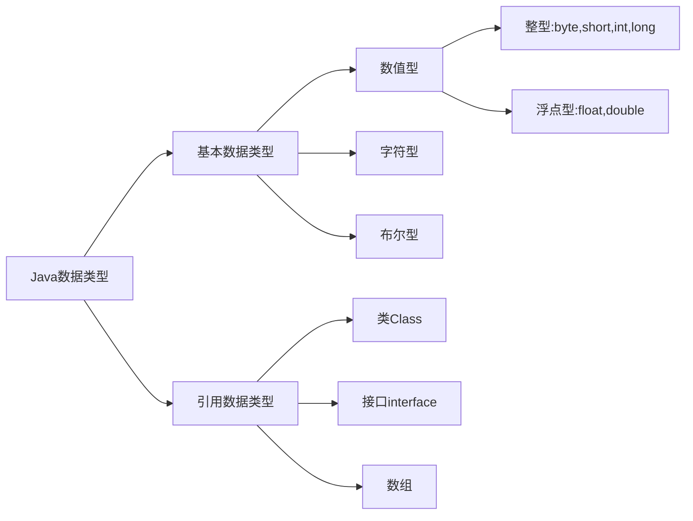
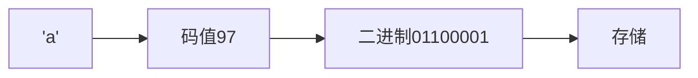
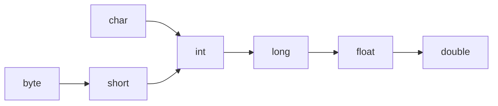

## 代码规范

1. 类和方法的注释要使用文档注释
2. 非文档注释是给代码维护者看的，着重告诉读者为什么这样写、如何修改、注意什么问题
3. 选中的多行代码`TAB`整体右移，`TAB+SHIFT`整体左移
4. 运算符和=习惯两边各加一个空格
5. 源文件使用UTF-8编码
6. 行宽度小于等于80字符
7. 代码编写次行规则和**行尾规则**

### 标识符的命名规则和规范

#### 标识符概念

Java对各种变量、方法和类等命名时使用的字符序列称为标识符

#### 命名规则

> 规则必须遵守

1. 由26个英文字母大小写、0-9、下划线或$组成
2. 数字不可以开头
3. 不可以使用关键字和保留字，但能包含关键字和保留字
4. 严格区分大小写，长度无限制
5. 不能包含空格

#### 命名规范

> 更加专业

1. 包名：多单词组成时，所有字母都小写
2. 类名、接口名：多单词组成时，所有单词的首字母大写
3. 变量名、方法名：多单词组成时，第2个单词开始每个单词首字母大写
4. 常量名：所有字母都大写，多单词连接用下划线

#### 关键字

被Java语言赋予了特殊含义，用作专门用途的字符串，关键字中所有字母都为小写

| 数据类型  | 数据类型值 | 流程控制 | 访问权限修饰符 | 类函数变量修饰符 | 类类之间关系 | 实例建立、引用、判断 | 异常处理 | 包      | 其他      |
| --------- | ---------- | -------- | -------------- | ---------------- | ------------ | -------------------- | -------- | ------- | --------- |
| class     | true       | if       | private        | abstract         | extends      | new                  | try      | package | native    |
| interface | false      | else     | protected      | final            | implements   | this                 | catch    | import  | strictfp  |
| enum      | null       | switch   | public         | static           |              | super                | finally  |         | transient |
| byte      |            | case     |                | synchronized     |              | instanceof           | throw    |         | volatile  |
| short     |            | default  |                |                  |              |                      | throws   |         | assert    |
| int       |            | while    |                |                  |              |                      |          |         |           |
| long      |            | do       |                |                  |              |                      |          |         |           |
| float     |            | for      |                |                  |              |                      |          |         |           |
| double    |            | break    |                |                  |              |                      |          |         |           |
| char      |            | continue |                |                  |              |                      |          |         |           |
| boolean   |            | return   |                |                  |              |                      |          |         |           |
| void      |            |          |                |                  |              |                      |          |         |           |

#### 保留字

现有版本尚未使用，以后版本可能会作为关键字使用

| 保留字   |
| -------- |
| byValue  |
| cast     |
| future   |
| generic  |
| inner    |
| operator |
| outer    |
| rest     |
| var      |
| goto     |
| const    |

## 注释

```java
/**
	*
	*
*/
public class Comment {
    // 	单行注释 
    //  批量单行注释快捷键 CTRL+/
    
    /* 	多行注释
    	1
    	2
    	3
    	禁止嵌套
    */
}
```

#### 生成文档注释

文档注释内容可以被JDK带的工具javadoc解析，生成以网页文件体现该程序的说明

```shell
javadoc -d 生成网页文件的目标文件夹名 -标签 -标签 被解析的源代码文件
```

#### 文档注释标签

| 标签 | 含义 |
| ---- | ---- |
|      |      |
|      |      |
|      |      |

## 变量

变量 = 数据类型 + 数据大小

```java
public class BL {
	public static void main(String[] args) {
        int a,b=2;
        double c=3.0;
        float d=4.0;
        System.out.println("a b c d");
    }
}
```

### 数据类型

| 基本数据类型 | 占用内存大小 |
| ------------ | ------------ |
| byte         | 1Byte        |
| short        | 2Byte        |
| int          | 4Byte        |
| long         | 8Byte        |
| float        | 4Byte        |
| double       | 8Byte        |
| char         | 2Byte        |
| boolean      | 1Byte        |



1. Java的整型、浮点型都有固定的范围和字段长度，不受操作系统影响，具有可移植性。
2. 整型默认为int，声明long型常量需后加"l"或"L"，以保证在我们声明的数据大小超过int范围时自动转换为long型数据，然后再赋值给long型变量，数据不溢出。
3. 浮点型默认为double，声明float型常量需后加"f"或'F'
4. 浮点数 = 符号位 + 指数位 + 尾数位，尾数部分可能丢失造成精度损失（小数都是近似值）
5. 浮点数.125等价于0.125，512.0f，5.12e2等价于512.0，512E-2等价于5.12
6. float仅保留6位小数
7. 由于浮点数可能是近似值，所以在进行浮点数判断相等时，要两浮点数相减取绝对值，然后判断之差的绝对值是否在精度之内。
8. 有浮点数参与的运算，运算结果是近似于这个小数结果的数

#### 字符



```java
public class Char {
	public static void main(String[] args) {
        //字符和码值对应关系遵循编码规则
		char c1 = 97;
        char c2 = 'a';
        System.out.println(c1);
		System.out.println((int)c2);  //强制转换
        
        //char运算
        System.out.println('a' + 10);  //107
        char c3 = 'b' + 1;
        System.out.println(c3);  //'c'
        
	}
}
```

| 字符编码表 | 大小                                            |
| ---------- | ----------------------------------------------- |
| ASCII      | 1Byte 可存储256个字符，有128个字符              |
| Unicode    | 统一使用2Byte存储字符 浪费空间                  |
| UTF-8      | 字母1字节，汉字3字节，可以使用1-6个字节表示字符 |
| GBK        | 可表示汉字，范围广，字母1字节，汉字2字节        |
| GB2312     | 可表示汉字，GB2312 < GBK                        |
| BIG5       | 繁体中文 台湾香港                               |

#### 布尔

```java
public class Bool {
    public static void main(String[] args) {
        boolean state = true;  //不能用0或1赋值表示真假
        if(state){
            System.out,println("True");
        }else{
            System.out.println("false");
        }
    }
}
```

### 数据类型的转换

#### 自动类型转换

Java程序在进行赋值或运算时，精度小的类型自动转换为精度大的类型。



1. 当多种类型数据混合运算时，自动将所有数据类型转为容量最大的类型，再进行计算。
2. 当我们把精度大的数据类型赋值给精度小的数据类型时，非法。反之，合法。
3. （byte、short）和char之间不会互相自动转换，但三者任意其一参与运算，就自动转换为int。

```java
public class var_change {
	public static void main(String[] args) {
   		int a = 'A';
		double b =80;
        System.out.println(a);  //65
        System.out.println(b);  //80.0
        
        double c = 1 + 2.3;  //合法
        float d = 1 +2.3;  //非法 右边是double无法降级赋值给float
    }
}
```

#### 强制类型转换

使用强制转换符`()`，将容量大的数据类型转换为容量小的数据类型。可能造成精度降低或溢出。

1. 强制转换符只对最近的一个数有效，多个需要使用小括号括起来
2. char类型可以被赋值为int常量，不能直接被赋值int变量需强制转换为char再赋值。

```java
public class var_change {
	public static void main(String[] args) {
   		double a = 1.9;
        int b = (int)a;  //1精度降低
        int c = 1000;
        byte d = (byte)c;  //溢出
        
        char ch1 = 97;
        int num1 = 97;
        char ch2 = (char)(num1 + 1);  //b
    }
}
```

#### String与Basic互转

```java
public class String_to_Basic {
	public static void main(String[] args) {
        //Basic_to_String
   		int n1 = 1111;
        double d1 = 11.11;
        boolean b1 = true;
        String str1 = n1 + "";
        String str2 = d1 + "";
        String str3 = b1 + "";
        System.out.println(str1 + " " + str2 + " " + str3);
        //String_to_Basic
        int n2 = Integer.parseInt("1919");
        double d2 = Double.parseDouble("19.19");
        boolean b2 = Boolean.parseBoolean("true");
        System.out.println(n2 + " " + d2 + " " + b2);
        //String_to_char 按下标取字符串的字符
        char ch1 = "123".charAt(1);  //'2'
        System.out.println(ch1);
    }
}
```

## 输出

```java
println();
```

#### 转义字符

| 转义字符 | 含义                 |
| -------- | -------------------- |
| \t       | 一个制表位，实现对齐 |
| \n       | 换行符               |
| \\\      | 一个\                |
| \\\\\\   | 两个\                |
| \\"      | 一个"                |
| \\'      | 一个'                |
| \\r      | 一个回车             |

```java
public class ChangeChar {
    public static void main(String[] args) {
    	System.out.println("Beijing\tTianjin\tShanghai");
        System.out.println("\\\t\"\t\'");
        System.out.println("中国首都\r北京");
        System.out.println("中国首都\r\n北京");
	}
}

java ChangeChar
Beijing Tianjin Shanghai
\       "       '
北京首都
中国首都
北京
```

#### 字符串相加

当加号左右两边都是数值型时，做加法运算。当有一方是字符串型，做拼接。

```java
System.out.println(11 + 89); //100
System.out.println("777" + "七七七");  //"777七七七"
System.out.println("zxb" + 20);  //"zxb20"
System.out.println('男' + '女');  //输出一个数，值为男与女的字符码之和 
```

## 输入

```java
//1.把java.util下的Scanner类导入
import java.util.Scanner;
public class Inputt {
	public static void main (String[] args) {
		//2.创建Scanner对象
		Scanner myScanner = new Scanner(System.in);
		//3.使用相关的方法接收用户的输入
		String name = myScanner.next();
		int age = myScanner.nextInt();
		double sal = myScanner.nextDouble();
		
		System.out.println(name + " " + age + " " + sal);
	}
}
```


## 运算符

运算符是一种特殊的符号，用以表示数据的运算、赋值和比较。

### 算数运算符

| 运算符 | 运算       | 备注                                                  |
| ------ | ---------- | ----------------------------------------------------- |
| +      | 正         |                                                       |
| -      | 负         |                                                       |
| +      | 加         |                                                       |
| -      | 减         |                                                       |
| *      | 乘         |                                                       |
| /      | 除         |                                                       |
| %      | 取模       | -10 % 3 = -1，10 % -3 = 1，a % b = a - (int)a / b * b |
| ++     | 自增       |                                                       |
| --     | 自减       |                                                       |
| +      | 字符串相加 |                                                       |

### 关系运算符

1. 关系运算符的结果都是Boolean型
2. 关系运算符组成的表达式叫关系表达式

| 运算符     | 运算               |                         |
| ---------- | ------------------ | ----------------------- |
| ==         |                    |                         |
| !=         |                    |                         |
| <          |                    |                         |
| >          |                    |                         |
| <=         |                    |                         |
| >=         |                    |                         |
| instanceof | 检查是否是类的对象 | "zxb" instanceof String |

### 逻辑运算符

用于连接多个关系表达式

1. a&b：逻辑与，两边同时为T即为T
2. a&&b：短路与，两边同时为T即为T
3. a|b：逻辑或，一个为T即为T
4. a||b：短路或，一个为T，即为T
5. !a：非，取反
6. a^b：，逻辑异或，两边不同即为T

#### &&与&区别

1. 短路与，如果第一个条件结果为F，则停止判断之后的条件表达式，结果直接为F
2. 逻辑与，所有条件表达式都要判断一遍
3. 开发常用短路与，效率高

#### ||与|区别

1. 短路或，如果第一个条件结果为T，则停止判断之后的条件表达式，结果直接为T
2. 逻辑或。所有表达式都要判断一遍
3. 开发常用短路或


| a    | b    | a&b  | a&&b | a\|b | a\|\|b | !a   | a^b  |
| ---- | ---- | ---- | ---- | ---- | ------ | ---- | ---- |
| T    | T    | T    | T    | T    | T      | F    | F    |
| T    | F    | F    | F    | T    | T      | F    | T    |
| F    | T    | F    | F    | T    | T      | T    | T    |
| F    | F    | F    | F    | F    | F      | T    | F    |

### 赋值运算符

1. 赋值运算符的右边可以是:变量、常量、表达式

2. 复合赋值运算符会进行强制类型转换

   ```java
   byte b = 2;
   b += 2;  //等价于b = (byte)(b+2);
   b++;  //b = (byte)(b+1);
   ```

| 运算符 |
| ------ |
| =      |
| +=     |
| -=     |
| *=     |
| \=     |
| %=     |

### 三元运算符

```
条件表达式?表达式1:表达式2
```

如果条件表达式为真，则结果返回表达式1，否则返回表达式2

```java
public class TernaryPoerator {
    public static void main(String[] args) {
        int a = 10, b = 99;
        int result = a < b ? a++ : b--;
        System.out.println("result = " + result);
        System.out.println("a = " + a);
        System.out.println("b = " + b);
        
        //  用一条三元运算符语句求三个数的最大值
        int n1, n2, n3;
        int max = (n1 > n2 ? n1 : n2) > n3 ? (n1 > n2 ? n1 : n2) : n3;
    }
}
```

### 运算符优先级

1. (),{}
2. 单目运算符
3. 算符运算符
4. 位移运算符
5. 比较运算符
6. 逻辑运算符
7. 三元运算符

| 优先级 | 运算符                                           | 结合性   |
| ------ | ------------------------------------------------ | -------- |
| 1      | ()、[]、{}                                       | 从左向右 |
| 2      | !、+、-、~、++、--                               | 从右向左 |
| 3      | *、/、%                                          | 从左向右 |
| 4      | +、-                                             | 从左向右 |
| 5      | <<、>>、>>>                                      | 从左向右 |
| 6      | <、<=、>、>=、instanceof                         | 从左向右 |
| 7      | ==、!=                                           | 从左向右 |
| 8      | &                                                | 从左向右 |
| 9      | ^                                                | 从左向右 |
| 10     | \|                                               | 从左向右 |
| 11     | &&                                               | 从左向右 |
| 12     | \|\|                                             | 从左向右 |
| 13     | ?:                                               | 从右向左 |
| 14     | =、+=、-=、*=、/=、&=、\|=、^=、~=、«=、»=、>>>= | 从右向左 |


## 进制

| 进制     | Java表示                        |
| -------- | ------------------------------- |
| 二进制   | 0b或0B开头                      |
| 十进制   | 0~9                             |
| 八进制   | 以0开头                         |
| 十六进制 | 以0x或0X开头，不区分A-F的大小写 |

#### 二进制转十进制

从$0$位（右边）开始，依次将每一位乘以$2^{位数}$ 的和。

```java
```


## 位运算

| 符号 | 作用                                         |
| ---- | -------------------------------------------- |
| <<   | 算数左移：符号位不变，抹除高位，低位补0      |
| >>   | 算数右移：低位抹掉，符号位不变，高位补符号值 |
| >>>  | 逻辑右移/无符号右移：低位溢出，高位补0       |
| ~    | 按位取反                                     |
| &    | 按位与                                       |
| \|   | 按位或                                       |
| ^    | 按位异或                                     |

### 原码反码补码

1. 二进制的最高位是符号位，最高位为0表示正数，1表示负数
2. 正数的三码一样
3. 负数的反码 = 符号位不变，剩余的取反
4. 负数的补码 = 反码 + 1
5. 0的反码、补码 = 0
6. Java中所有的数都是有符号的
7. 计算机运算时数据是以补码的方式运算的
8. 看运算结果要看原码

#### 补码转原码

1. 先利用 补码 - 1 得到反码
2. 反码再取反，得到原码


## 控制结构

### 顺序

程序从上到下逐行执行，中间没有任何判断和跳转。

### 分支

#### 单分支

```java
if(条件表达式) {
    执行代码块;
}
```

#### 双分支

```java
if(条件表达式) {
    执行代码块1;
}
else {
    执行代码块2;
}
```

#### 多分支

```java
if(条件表达式1) {
    执行代码块1;
}
else if(条件表达式2) {
    执行代码块2;
}
...
else {
    执行代码块n;
}
```

#### switch

```java
switch(条件表达式) {
    case 常量1:
        语句块1;
        break;
    case 常量2:
        语句块2;
        break;
        ···
    case 常量n:
        语句块n;
        break;
    default:
        default语句块;
        break;     
}
```

### 循环

#### for

```java
for(循环变量初始化;循环条件;循环变量迭代) {
    循环语句;
}
```

1. 每次循环执行完循环语句之后才进行循环变量迭代
2. 循环语句只有一句时，可省略{}

#### while

```java
while(循环条件) {
    循环语句;
    循环变量迭代;
}
```

#### do while

```java
do {
    循环语句;
    循环变量迭代;
}while(循环条件)
```

至少能执行一次，先执行后判断。

### 跳转

#### break

跳出此循环

#### continue

结束本轮循环，执行下一轮循环

#### return

跳出方法


## 数组 

| 语句             | 作用                       |
| ---------------- | -------------------------- |
| 数组名.length    | 数组的长度，二维数组的行数 |
| 数组名[i].length | 二维数组的列数             |
|                  |                            |

### 一维数组

#### 初始化

```java
//动态初始化1
//声明加分配空间
数据类型[] 数组名 = new 数据类型[大小];

//动态初始化2
/*
先声明后分配空间
光声明不能分配内存空间
*/
数据类型[] 数组名;
数组名 = new 数据类型[大小];

//静态初始化
数据类型[] 数组名 = {数据};

```

#### 引用

```
数组名[下标/索引];
```


###  二维数组

二维数组实际上是有多个一维数组组成的，各个一维数组长度可以相同也可以不同。

#### 声明

```java
//动态初始化1
//声明加分配空间
数据类型[][] 数组名 = new 数据类型[行数][列数];

//动态初始化2
数据类型[][] 数组名;
数据类型 数组名[][];
数据类型[] 数组名[];
//静态初始化
数据类型[][] 数组名 = {{}, {}, {}};
```


####  内存结构


### 注意事项

1. 数组元素默认值为$0/NULL$
2. 数组属于引用类型，数组型数据是对象(object)

### 数组赋值机制

基本数据类型赋值，采用值传递，赋值的是数值，跟数据地址没关系。而数组在默认情况下是引用传递，赋值的是地址。

```java
int arr1[] = {1,2,3};
int arr2[] = arr1;

arr2[0] = 0;

for(int i = 0;i < 3;i ++)
	System.out.println(arr1[i]);
------
0
2
3
```

### 数组扩容

```java
import java.util.Scanner;
public class ArrayAdd {
	public static void main(String[] args) {
		/*
		数组扩容
		*/
		int[] arr = {1, 2, 3};
		
		int[] newarr = new int[arr.length + 1];
		for(int i = 0; i < arr.length; i ++)
			newarr[i] = arr[i];

		Scanner scanf = new Scanner(System.in);
		int res = scanf.nextInt();
		newarr[newarr.length - 1] = res;

		arr = newarr;
		
		for(int i = 0; i < arr.length; i ++)
			System.out.println(arr[i]);
	}
}
```

###  
