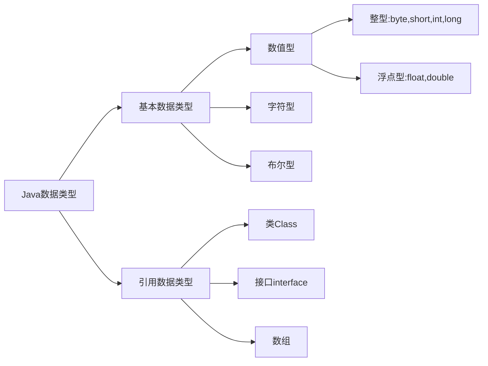
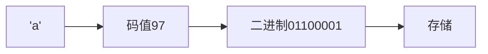
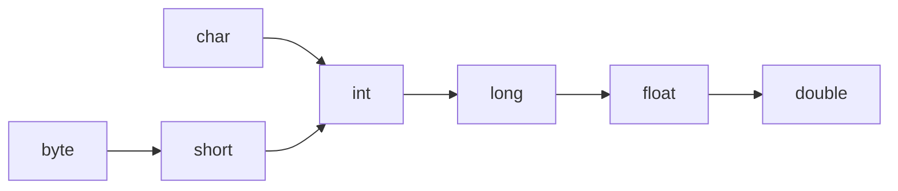

## 代码规范

1. 类和方法的注释要使用文档注释
2. 非文档注释是给代码维护者看的，着重告诉读者为什么这样写、如何修改、注意什么问题
3. 选中的多行代码`TAB`整体右移，`TAB+SHIFT`整体左移
4. 运算符和=习惯两边各加一个空格
5. 源文件使用UTF-8编码
6. 行宽度小于等于80字符
7. 代码编写次行规则和**行尾规则**

## 转义字符

| 转义字符 | 含义                 |
| -------- | -------------------- |
| \t       | 一个制表位，实现对齐 |
| \n       | 换行符               |
| \\\      | 一个\                |
| \\\\\\   | 两个\                |
| \\"      | 一个"                |
| \\'      | 一个'                |
| \\r      | 一个回车             |

```java
public class ChangeChar {
    public static void main(String[] args) {
    	System.out.println("Beijing\tTianjin\tShanghai");
        System.out.println("\\\t\"\t\'");
        System.out.println("中国首都\r北京");
        System.out.println("中国首都\r\n北京");
	}
}

java ChangeChar
Beijing Tianjin Shanghai
\       "       '
北京首都
中国首都
北京
```

## 注释

```java
/**
	*
	*
*/
public class Comment {
    // 	单行注释 
    //  批量单行注释快捷键 CTRL+/
    
    /* 	多行注释
    	1
    	2
    	3
    	禁止嵌套
    */
}
```

#### 生成文档注释

文档注释内容可以被JDK带的工具javadoc解析，生成以网页文件体现该程序的说明

```shell
javadoc -d 生成网页文件的目标文件夹名 -标签 -标签 被解析的源代码文件
```

#### 文档注释标签

| 标签 | 含义 |
| ---- | ---- |
|      |      |
|      |      |
|      |      |

## 变量

变量 = 数据类型 + 数据大小

```java
public class BL {
	public static void main(String[] args) {
        int a,b=2;
        double c=3.0;
        float d=4.0;
        System.out.println("a b c d");
    }
}
```

### 数据类型

| 基本数据类型 | 占用内存大小 |
| ------------ | ------------ |
| byte         | 1Byte        |
| short        | 2Byte        |
| int          | 4Byte        |
| long         | 8Byte        |
| float        | 4Byte        |
| double       | 8Byte        |
| char         | 2Byte        |
| boolean      | 1Byte        |



1. Java的整型、浮点型都有固定的范围和字段长度，不受操作系统影响，具有可移植性。
2. 整型默认为int，声明long型常量需后加"l"或"L"，以保证在我们声明的数据大小超过int范围时自动转换为long型数据，然后再赋值给long型变量，数据不溢出。
3. 浮点型默认为double，声明float型常量需后加"f"或'F'
4. 浮点数 = 符号位 + 指数位 + 尾数位，尾数部分可能丢失造成精度损失（小数都是近似值）
5. 浮点数.125等价于0.125，512.0f，5.12e2等价于512.0，512E-2等价于5.12
6. float仅保留6位小数
7. 由于浮点数可能是近似值，所以在进行浮点数判断相等时，要两浮点数相减取绝对值，然后判断之差的绝对值是否在精度之内。

#### 字符



```java
public class Char {
	public static void main(String[] args) {
        //字符和码值对应关系遵循编码规则
		char c1 = 97;
        char c2 = 'a';
        System.out.println(c1);
		System.out.println((int)c2);  //强制转换
        
        //char运算
        System.out.println('a' + 10);  //107
        char c3 = 'b' + 1;
        System.out.println(c3);  //'c'
        
	}
}
```

| 字符编码表 | 大小                                            |
| ---------- | ----------------------------------------------- |
| ASCII      | 1Byte 可存储256个字符，有128个字符              |
| Unicode    | 统一使用2Byte存储字符 浪费空间                  |
| UTF-8      | 字母1字节，汉字3字节，可以使用1-6个字节表示字符 |
| GBK        | 可表示汉字，范围广，字母1字节，汉字2字节        |
| GB2312     | 可表示汉字，GB2312 < GBK                        |
| BIG5       | 繁体中文 台湾香港                               |

#### 布尔

```java
public class Bool {
    public static void main(String[] args) {
        boolean state = true;  //不能用0或1赋值表示真假
        if(state){
            System.out,println("True");
        }else{
            System.out.println("false");
        }
    }
}
```

### 数据类型的转换

#### 自动类型转换

Java程序在进行赋值或运算时，精度小的类型自动转换为精度大的类型。



1. 当多种类型数据混合运算时，自动将所有数据类型转为容量最大的类型，再进行计算。
2. 当我们把精度大的数据类型赋值给精度小的数据类型时，非法。反之，合法。
3. （byte、short）和char之间不会互相自动转换，但三者任意其一参与运算，就自动转换为int。

```java
public class var_change {
	public static void main(String[] args) {
   		int a = 'A';
		double b =80;
        System.out.println(a);  //65
        System.out.println(b);  //80.0
        
        double c = 1 + 2.3;  //合法
        float d = 1 +2.3;  //非法 右边是double无法降级赋值给float
    }
}
```

#### 强制类型转换

使用强制转换符`()`，将容量大的数据类型转换为容量小的数据类型。可能造成精度降低或溢出。

1. 强制转换符只对最近的一个数有效，多个需要使用小括号括起来
2. char类型可以被赋值为int常量，不能直接被赋值int变量需强制转换为char再赋值。

```java
public class var_change {
	public static void main(String[] args) {
   		double a = 1.9;
        int b = (int)a;  //1精度降低
        int c = 1000;
        byte d = (byte)c;  //溢出
        
        char ch1 = 97;
        int num1 = 97;
        char ch2 = (char)(num1 + 1);  //b
    }
}
```

#### String与Basic

```java
public class String_to_Basic {
	public static void main(String[] args) {
        //Basic_to_String
   		int n1 = 1111;
        double d1 = 11.11;
        boolean b1 = true;
        String str1 = n1 + "";
        String str2 = d1 + "";
        String str3 = b1 + "";
        System.out.println(str1 + " " + str2 + " " + str3);
        //String_to_Basic
        int n2 = Integer.parseInt("1919");
        double d2 = Double.parseDouble("19.19");
        boolean b2 = Boolean.parseBoolean("true");
        System.out.println(n2 + " " + d2 + " " + b2);
        //String_to_char 按下标取字符串的字符
        char ch1 = "123".charAt(1);  //'2'
        System.out.println(ch1);
    }
}
```

## 运算符


## 输出

#### 加号+

当加号左右两边都是数值型时，做加法运算。当有一方是字符型，做拼接。

```java
System.out.println(11 + 89);
System.out.println("777" + "七七七");
```


#### 


#### 
