# 基础语法

## 代码规范

1. 类和方法的注释要使用文档注释
2. 非文档注释是给代码维护者看的，着重告诉读者为什么这样写、如何修改、注意什么问题
3. 选中的多行代码`TAB`整体右移，`TAB+SHIFT`整体左移
4. 运算符和=习惯两边各加一个空格
5. 源文件使用UTF-8编码
6. 行宽度小于等于80字符
7. 代码编写次行规则和**行尾规则**

### 标识符的命名规则和规范

#### 标识符概念

Java对各种变量、方法和类等命名时使用的字符序列称为标识符

#### 命名规则

> 规则必须遵守

1. 由26个英文字母大小写、0-9、下划线或$组成
2. 数字不可以开头
3. 不可以使用关键字和保留字，但能包含关键字和保留字
4. 严格区分大小写，长度无限制
5. 不能包含空格

#### 命名规范

> 更加专业

1. 包名：多单词组成时，所有字母都小写
2. 类名、接口名：多单词组成时，所有单词的首字母大写
3. 变量名、方法名：多单词组成时，第2个单词开始每个单词首字母大写
4. 常量名：所有字母都大写，多单词连接用下划线

#### 关键字

被Java语言赋予了特殊含义，用作专门用途的字符串，关键字中所有字母都为小写

| 数据类型  | 数据类型值 | 流程控制 | 访问权限修饰符 | 类函数变量修饰符 | 类类之间关系 | 实例建立、引用、判断 | 异常处理 | 包      | 其他      |
| --------- | ---------- | -------- | -------------- | ---------------- | ------------ | -------------------- | -------- | ------- | --------- |
| class     | true       | if       | private        | abstract         | extends      | new                  | try      | package | native    |
| interface | false      | else     | protected      | final            | implements   | this                 | catch    | import  | strictfp  |
| enum      | null       | switch   | public         | static           |              | super                | finally  |         | transient |
| byte      |            | case     |                | synchronized     |              | instanceof           | throw    |         | volatile  |
| short     |            | default  |                |                  |              |                      | throws   |         | assert    |
| int       |            | while    |                |                  |              |                      |          |         |           |
| long      |            | do       |                |                  |              |                      |          |         |           |
| float     |            | for      |                |                  |              |                      |          |         |           |
| double    |            | break    |                |                  |              |                      |          |         |           |
| char      |            | continue |                |                  |              |                      |          |         |           |
| boolean   |            | return   |                |                  |              |                      |          |         |           |
| void      |            |          |                |                  |              |                      |          |         |           |

#### 保留字

现有版本尚未使用，以后版本可能会作为关键字使用

| 保留字   |
| -------- |
| byValue  |
| cast     |
| future   |
| generic  |
| inner    |
| operator |
| outer    |
| rest     |
| var      |
| goto     |
| const    |

## 注释

```java
/**
	*
	*
*/
public class Comment {
    // 	单行注释 
    //  批量单行注释快捷键 CTRL+/
    
    /* 	多行注释
    	1
    	2
    	3
    	禁止嵌套
    */
}
```

#### 生成文档注释

文档注释内容可以被JDK带的工具javadoc解析，生成以网页文件体现该程序的说明

```shell
javadoc -d 生成网页文件的目标文件夹名 -标签 -标签 被解析的源代码文件
```

#### 文档注释标签

| 标签 | 含义 |
| ---- | ---- |
|      |      |
|      |      |
|      |      |

## 变量

变量 = 数据类型 + 数据大小

```java
public class BL {
	public static void main(String[] args) {
        int a,b=2;
        double c=3.0;
        float d=4.0;
        System.out.println("a b c d");
    }
}
```

### 数据类型

#### 分类

按照数据类型:

1. 基本数据类型
2. 引用数据类型

按照类中声明的位置:

1. 成员变量:

   按照是否使用static关键字

   1. 使用:静态变量, 类变量
   2. 不使用:非静态变量, 实例变量

2. 局部变量:方法内, 方法形参, 构造器内, 构造器形参, 代码块


| 基本数据类型 | 占用内存大小 |
| ------------ | ------------ |
| byte         | 1Byte        |
| short        | 2Byte        |
| int          | 4Byte        |
| long         | 8Byte        |
| float        | 4Byte        |
| double       | 8Byte        |
| char         | 2Byte        |
| boolean      | 1Byte        |

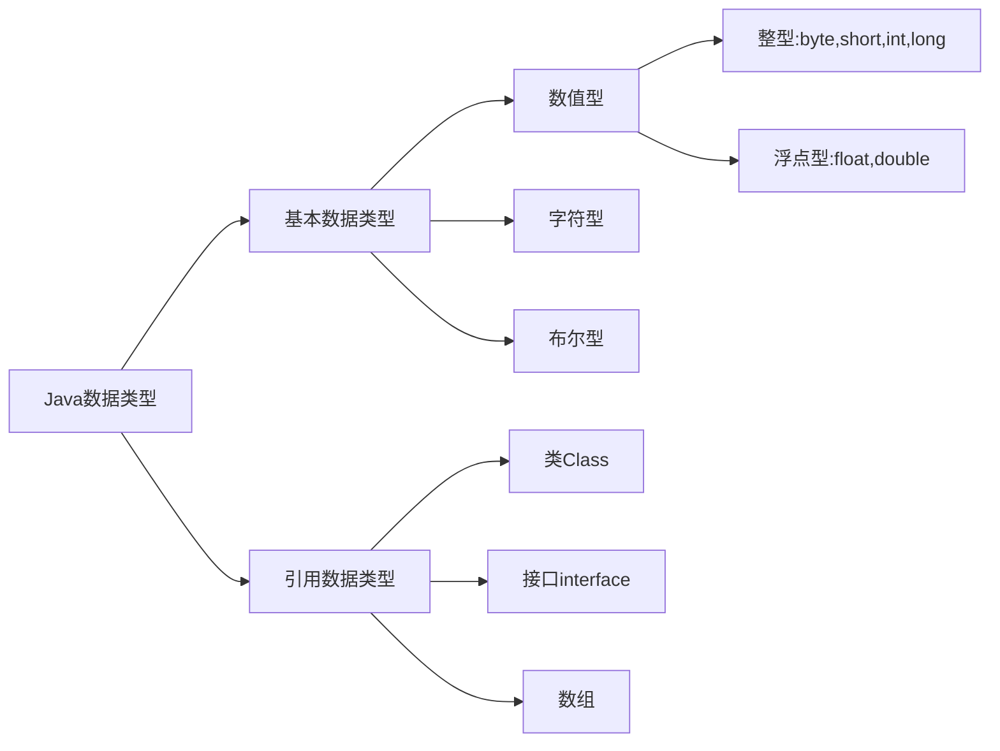

1. Java的整型、浮点型都有固定的范围和字段长度，不受操作系统影响，具有可移植性。
2. 整型默认为int，声明long型常量需后加"l"或"L"，以保证在我们声明的数据大小超过int范围时自动转换为long型数据，然后再赋值给long型变量，数据不溢出。
3. 浮点型默认为double，声明float型常量需后加"f"或'F'
4. 浮点数 = 符号位 + 指数位 + 尾数位，尾数部分可能丢失造成精度损失（小数都是近似值）
5. 浮点数.125等价于0.125，512.0f，5.12e2等价于512.0，512E-2等价于5.12
6. float仅保留6位小数
7. 由于浮点数可能是近似值，所以在进行浮点数判断相等时，要两浮点数相减取绝对值，然后判断之差的绝对值是否在精度之内。
8. 有浮点数参与的运算，运算结果是近似于这个小数结果的数

#### 字符

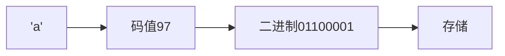

```java
public class Char {
	public static void main(String[] args) {
        //字符和码值对应关系遵循编码规则
		char c1 = 97;
        char c2 = 'a';
        System.out.println(c1);
		System.out.println((int)c2);  //强制转换
        
        //char运算
        System.out.println('a' + 10);  //107
        char c3 = 'b' + 1;
        System.out.println(c3);  //'c'
        
	}
}
```

| 字符编码表 | 大小                                            |
| ---------- | ----------------------------------------------- |
| ASCII      | 1Byte 可存储256个字符，有128个字符              |
| Unicode    | 统一使用2Byte存储字符 浪费空间                  |
| UTF-8      | 字母1字节，汉字3字节，可以使用1-6个字节表示字符 |
| GBK        | 可表示汉字，范围广，字母1字节，汉字2字节        |
| GB2312     | 可表示汉字，GB2312 < GBK                        |
| BIG5       | 繁体中文 台湾香港                               |

#### 布尔

```java
public class Bool {
    public static void main(String[] args) {
        boolean state = true;  //不能用0或1赋值表示真假
        if(state){
            System.out,println("True");
        }else{
            System.out.println("false");
        }
    }
}
```

### 数据类型的转换

#### 自动类型转换

Java程序在进行赋值或运算时，精度小的类型自动转换为精度大的类型。

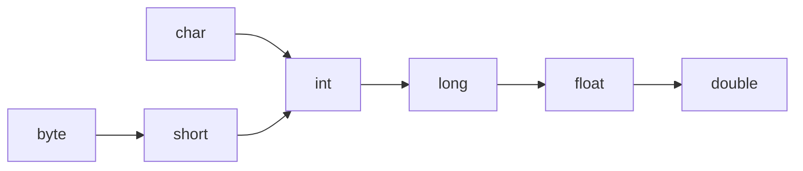

1. 当多种类型数据混合运算时，自动将所有数据类型转为容量最大的类型，再进行计算。
2. 当我们把精度大的数据类型赋值给精度小的数据类型时，非法。反之，合法。
3. （byte、short）和char之间不会互相自动转换，但三者任意其一参与运算，就自动转换为int。

```java
public class var_change {
	public static void main(String[] args) {
   		int a = 'A';
		double b =80;
        System.out.println(a);  //65
        System.out.println(b);  //80.0
        
        double c = 1 + 2.3;  //合法
        float d = 1 +2.3;  //非法 右边是double无法降级赋值给float
    }
}
```

#### 强制类型转换

使用强制转换符`()`，将容量大的数据类型转换为容量小的数据类型。可能造成精度降低或溢出。

1. 强制转换符只对最近的一个数有效，多个需要使用小括号括起来
2. char类型可以被赋值为int常量，不能直接被赋值int变量需强制转换为char再赋值。

```java
public class var_change {
	public static void main(String[] args) {
   		double a = 1.9;
        int b = (int)a;  //1精度降低
        int c = 1000;
        byte d = (byte)c;  //溢出
        
        char ch1 = 97;
        int num1 = 97;
        char ch2 = (char)(num1 + 1);  //b
    }
}
```

#### String与Basic互转

```java
public class String_to_Basic {
	public static void main(String[] args) {
        //Basic_to_String
   		int n1 = 1111;
        double d1 = 11.11;
        boolean b1 = true;
        String str1 = n1 + "";
        String str2 = d1 + "";
        String str3 = b1 + "";
        System.out.println(str1 + " " + str2 + " " + str3);
        //String_to_Basic
        int n2 = Integer.parseInt("1919");
        double d2 = Double.parseDouble("19.19");
        boolean b2 = Boolean.parseBoolean("true");
        System.out.println(n2 + " " + d2 + " " + b2);
        //String_to_char 按下标取字符串的字符
        char ch1 = "123".charAt(1);  //'2'
        System.out.println(ch1);
    }
}
```

## 输出

```java
println();
```

#### 转义字符

| 转义字符 | 含义                 |
| -------- | -------------------- |
| \t       | 一个制表位，实现对齐 |
| \n       | 换行符               |
| \\\      | 一个\                |
| \\\\\\   | 两个\                |
| \\"      | 一个"                |
| \\'      | 一个'                |
| \\r      | 一个回车             |

```java
public class ChangeChar {
    public static void main(String[] args) {
    	System.out.println("Beijing\tTianjin\tShanghai");
        System.out.println("\\\t\"\t\'");
        System.out.println("中国首都\r北京");
        System.out.println("中国首都\r\n北京");
	}
}

java ChangeChar
Beijing Tianjin Shanghai
\       "       '
北京首都
中国首都
北京
```

#### 字符串相加

当加号左右两边都是数值型时，做加法运算。当有一方是字符串型，做拼接。

```java
System.out.println(11 + 89); //100
System.out.println("777" + "七七七");  //"777七七七"
System.out.println("zxb" + 20);  //"zxb20"
System.out.println('男' + '女');  //输出一个数，值为男与女的字符码之和 
```

## 输入

```java
//1.把java.util下的Scanner类导入
import java.util.Scanner;
public class Inputt {
	public static void main (String[] args) {
		//2.创建Scanner对象
		Scanner myScanner = new Scanner(System.in);
		//3.使用相关的方法接收用户的输入
		String name = myScanner.next();
		int age = myScanner.nextInt();
		double sal = myScanner.nextDouble();
		
		System.out.println(name + " " + age + " " + sal);
	}
}
```


## 运算符

运算符是一种特殊的符号，用以表示数据的运算、赋值和比较。

### 算数运算符

| 运算符 | 运算       | 备注                                                  |
| ------ | ---------- | ----------------------------------------------------- |
| +      | 正         |                                                       |
| -      | 负         |                                                       |
| +      | 加         |                                                       |
| -      | 减         |                                                       |
| *      | 乘         |                                                       |
| /      | 除         |                                                       |
| %      | 取模       | -10 % 3 = -1，10 % -3 = 1，a % b = a - (int)a / b * b |
| ++     | 自增       |                                                       |
| --     | 自减       |                                                       |
| +      | 字符串相加 |                                                       |

### 关系运算符

1. 关系运算符的结果都是Boolean型
2. 关系运算符组成的表达式叫关系表达式

| 运算符     | 运算               |                         |
| ---------- | ------------------ | ----------------------- |
| ==         |                    |                         |
| !=         |                    |                         |
| <          |                    |                         |
| >          |                    |                         |
| <=         |                    |                         |
| >=         |                    |                         |
| instanceof | 检查是否是类的对象 | "zxb" instanceof String |

### 逻辑运算符

用于连接多个关系表达式

1. a&b：逻辑与，两边同时为T即为T
2. a&&b：短路与，两边同时为T即为T
3. a|b：逻辑或，一个为T即为T
4. a||b：短路或，一个为T，即为T
5. !a：非，取反
6. a^b：，逻辑异或，两边不同即为T

#### &&与&区别

1. 短路与，如果第一个条件结果为F，则停止判断之后的条件表达式，结果直接为F
2. 逻辑与，所有条件表达式都要判断一遍
3. 开发常用短路与，效率高

#### ||与|区别

1. 短路或，如果第一个条件结果为T，则停止判断之后的条件表达式，结果直接为T
2. 逻辑或。所有表达式都要判断一遍
3. 开发常用短路或


| a    | b    | a&b  | a&&b | a\|b | a\|\|b | !a   | a^b  |
| ---- | ---- | ---- | ---- | ---- | ------ | ---- | ---- |
| T    | T    | T    | T    | T    | T      | F    | F    |
| T    | F    | F    | F    | T    | T      | F    | T    |
| F    | T    | F    | F    | T    | T      | T    | T    |
| F    | F    | F    | F    | F    | F      | T    | F    |

### 赋值运算符

1. 赋值运算符的右边可以是:变量、常量、表达式

2. 复合赋值运算符会进行强制类型转换

   ```java
   byte b = 2;
   b += 2;  //等价于b = (byte)(b+2);
   b++;  //b = (byte)(b+1);
   ```

| 运算符 |
| ------ |
| =      |
| +=     |
| -=     |
| *=     |
| \=     |
| %=     |

### 三元运算符

``` 
条件表达式 ? 表达式1 : 表达式2
```

如果条件表达式为真，则结果返回表达式1，否则返回表达式2

```java
public class TernaryPoerator {
    public static void main(String[] args) {
        int a = 10, b = 99;
        int result = a < b ? a++ : b--;
        System.out.println("result = " + result);
        System.out.println("a = " + a);
        System.out.println("b = " + b);
        
        //  用一条三元运算符语句求三个数的最大值
        int n1, n2, n3;
        int max = (n1 > n2 ? n1 : n2) > n3 ? (n1 > n2 ? n1 : n2) : n3;
    }
}
```

注意：三元运算符要看成一个整体

```java
Object obj1 = true ? new Integer(1) : new Double(2.0); // obj1 == 1.0
```

```java
Object obj2;

if(true) obj2 = new Integer(1);
else obj2 = new Double(2.0);

// obj1 = 1
```

### 运算符优先级

1. (),{}
2. 单目运算符
3. 算符运算符
4. 位移运算符
5. 比较运算符
6. 逻辑运算符
7. 三元运算符

| 优先级 | 运算符                                           | 结合性   |
| ------ | ------------------------------------------------ | -------- |
| 1      | ()、[]、{}                                       | 从左向右 |
| 2      | !、+、-、~、++、--                               | 从右向左 |
| 3      | *、/、%                                          | 从左向右 |
| 4      | +、-                                             | 从左向右 |
| 5      | <<、>>、>>>                                      | 从左向右 |
| 6      | <、<=、>、>=、instanceof                         | 从左向右 |
| 7      | ==、!=                                           | 从左向右 |
| 8      | &                                                | 从左向右 |
| 9      | ^                                                | 从左向右 |
| 10     | \|                                               | 从左向右 |
| 11     | &&                                               | 从左向右 |
| 12     | \|\|                                             | 从左向右 |
| 13     | ?:                                               | 从右向左 |
| 14     | =、+=、-=、*=、/=、&=、\|=、^=、~=、«=、»=、>>>= | 从右向左 |


## 进制

| 进制     | Java表示                        |
| -------- | ------------------------------- |
| 二进制   | 0b或0B开头                      |
| 十进制   | 0~9                             |
| 八进制   | 以0开头                         |
| 十六进制 | 以0x或0X开头，不区分A-F的大小写 |

#### 二进制转十进制

从$0$位（右边）开始，依次将每一位乘以$2^{位数}$ 的和。

```java

```


## 位运算

| 符号 | 作用                                         |
| ---- | -------------------------------------------- |
| <<   | 算数左移：符号位不变，抹除高位，低位补0      |
| >>   | 算数右移：低位抹掉，符号位不变，高位补符号值 |
| >>>  | 逻辑右移/无符号右移：低位溢出，高位补0       |
| ~    | 按位取反                                     |
| &    | 按位与                                       |
| \|   | 按位或                                       |
| ^    | 按位异或                                     |

### 原码反码补码

1. 二进制的最高位是符号位，最高位为0表示正数，1表示负数
2. 正数的三码一样
3. 负数的反码 = 符号位不变，剩余的取反
4. 负数的补码 = 反码 + 1
5. 0的反码、补码 = 0
6. Java中所有的数都是有符号的
7. 计算机运算时数据是以补码的方式运算的
8. 看运算结果要看原码

#### 补码转原码

1. 先利用 补码 - 1 得到反码
2. 反码再取反，得到原码


## 控制结构

### 顺序

程序从上到下逐行执行，中间没有任何判断和跳转。

### 分支

#### 单分支

```java
if(条件表达式) {
    执行代码块;
}
```

#### 双分支

```java
if(条件表达式) {
    执行代码块1;
}
else {
    执行代码块2;
}
```

#### 多分支

```java
if(条件表达式1) {
    执行代码块1;
}
else if(条件表达式2) {
    执行代码块2;
}
...
else {
    执行代码块n;
}
```

#### switch

```java
switch(条件表达式) {
    case 常量1:
        语句块1;
        break;
    case 常量2:
        语句块2;
        break;
        ···
    case 常量n:
        语句块n;
        break;
    default:
        default语句块;
        break;     
}
```

### 循环

#### for

```java
for(循环变量初始化;循环条件;循环变量迭代) {
    循环语句;
}
//增强for循环
for(声明循环变量 : 循环数组名) {
    循环语句;
}
```

1. 每次循环执行完循环语句之后才进行循环变量迭代
2. 循环语句只有一句时，可省略{}

#### while

```java
while(循环条件) {
    循环语句;
    循环变量迭代;
}
```

#### do while

```java
do {
    循环语句;
    循环变量迭代;
}while(循环条件)
```

至少能执行一次，先执行后判断。

### 跳转

#### break

跳出此循环

#### continue

结束本轮循环，执行下一轮循环

#### return

跳出方法


## 数组 

| 语句             | 作用                       |
| ---------------- | -------------------------- |
| 数组名.length    | 数组的长度，二维数组的行数 |
| 数组名[i].length | 二维数组的列数             |
|                  |                            |

### 一维数组

#### 初始化

```java
//动态初始化1
//声明加分配空间
数据类型[] 数组名 = new 数据类型[大小];

//动态初始化2
/*
先声明后分配空间
光声明不能分配内存空间
*/
数据类型[] 数组名;
数组名 = new 数据类型[大小];

//静态初始化
数据类型[] 数组名 = {数据};

```

#### 引用

```
数组名[下标/索引];
```

###  二维数组

二维数组实际上是有多个一维数组组成的，各个一维数组长度可以相同也可以不同。

#### 声明

```java
//动态初始化1
//声明加分配空间
数据类型[][] 数组名 = new 数据类型[行数][列数];

//动态初始化2
数据类型[][] 数组名;
数据类型 数组名[][];
数据类型[] 数组名[];
//静态初始化
数据类型[][] 数组名 = {{}, {}, {}};
```

####  内存结构


### 注意事项

1. 数组元素默认值为$0/NULL$
2. 数组属于引用类型，数组型数据是对象(object)

### 数组赋值机制

基本数据类型赋值，采用值传递，赋值的是数值，跟数据地址没关系。而数组在默认情况下是引用传递，赋值的是地址。

```java
int arr1[] = {1,2,3};
int arr2[] = arr1;

arr2[0] = 0;

for(int i = 0;i < 3;i ++)
	System.out.println(arr1[i]);
------
0
2
3
```

### 数组扩容

```java
import java.util.Scanner;
public class ArrayAdd {
	public static void main(String[] args) {
		/*
		数组扩容
		*/
		int[] arr = {1, 2, 3};
		
		int[] newarr = new int[arr.length + 1];
		for(int i = 0; i < arr.length; i ++)
			newarr[i] = arr[i];

		Scanner scanf = new Scanner(System.in);
		int res = scanf.nextInt();
		newarr[newarr.length - 1] = res;

		arr = newarr;
		
		for(int i = 0; i < arr.length; i ++)
			System.out.println(arr[i]);
	}
}
```


# 面向对象

## 类与对象

类是一个引用数据类型，对象是类中一个具体的实例。

从类到对象的说法有：创建一个对象、实例化一个对象、把类实例化...。

### 类的加载时机

1. 创建对象实例时
2. 创建子类对象实例时, 父类也会被加载, 而且父类优先加载
3. 使用类的静态成员时
4. 使用子类的静态成员时, 父类也会被加载, 而且父类优先加载

### 创建对象

```java
//直接创建
类名 对象名 = new 类名();
//先声明后创建
类名 对象名;  //声明是在内存的栈中给一个名字，没有分配
对象名 = new 类名();  //创建的过程就是在内存的堆中给对象分配一个地址
```

### 引用对象

```
对象名.成员变量;
```

### 对象创建流程

1. 先加载类信息（属性和方法信息，只会加载一次）
2. 在堆中分配对象空间, 得到对象地址
3. 成员变量进行默认初始化
4. 成员变量进行显示初始化，比如类代码中的`p.name = "Jing";`
5. 如果定义了构造方法, 成员变量根据构造方法赋值.
6. 把对象再堆中的地址返回给栈中的对象名

### 内存存在形式


### 样例代码

```java
public class object01 {
	public static void main (String[] args) {
		//1. new Peo(); 创建一个Peo类的对象
		//2. Peo cat1 = new Peo(); 把创建的对象赋给cat1
		Peo peo1 = new Peo();  //实例化一个Peo类的对象cat1
		
        peo1.name = "Jing";
		peo1.age = 18;
		peo1.weight = "55";

		System.out.println(peo1.name + " " + peo1.age + " " + peo1.weight);
        
        Peo peo2 = peo1;  //引用传递
        System.out.println("peo2.age=" + peo2.age);
	}
}

class Peo {
    //属性，成员变量，filed
	String name;
	int age;
	String weight;
    //构造方法
    
    //成员方法
}
```

### 匿名对象

```java
public class anonymousObject {
    public static void main(String[] args) {
        /*
         * new A08() 是匿名对象 匿名对象使用后自动释放
         * 匿名对象创建好后就可以调用其成员方法 .count1()
         */
        new A08().count1();  //10

        A08 a08 = new A08();
        a08.count2();  //9
        a08.count2();  //10
    }
}

class A08 {
    int count = 9;

    public void count1() {
        count = 10;
        System.out.println(count);
    }

    public void count2() {
        System.out.println(count++);
    }
}
```

## 成员变量

属性也叫成员变量、字段(field)。

属性不赋值的话有默认值，规则跟数组一样; 属性赋值的话, 必须且只能在声明的时候赋值, 不能先声明后赋值.

属性的定义类型为任意类型，包含基本类型和引用类型。

访问修饰符：public、protected、默认、private

```java
class 类名 {
	访问修饰符 属性类型 属性名;
	访问修饰符 属性类型 属性名 = 数据;
}
```

## 成员方法

与C/C++的函数概念类似，可以传参。方法不能嵌套定义！

### 定义

```java
访问修饰符 返回数据类型 方法名(参数列表) {
    语句;
    return 返回值;
}
```

#### 访问修饰符

控制方法的适用范围

#### 方法名

驼峰形式，能见名知义

#### 返回数据类型

任意类型。如果方法有返回数据类型，则方法末尾必须有`return 返回值;`。

#### 返回值

返回值类型必须和返回数据类型一致或兼容(int -> double)。

#### 形参列表

1. 一个方法即可以无参数也可以有多个参数，多个参数用逗号隔开。
2. 参数类型可以为任意类型，包含基本类型和引用类型
3. 调用带参数的方法时，一定对应着参数列表传入相同类型或兼容(数据类型由低向高兼容)类型的参数
4. 形式参数：方法定义时的参数；
5. 实际参数：方法调用时的参数。

### 优点

1. 提高代码的复用性
2. 可以将实现的细节封装起来，然后供其他用户调用

### 样例代码

```java
/*
创建对象调用方法,类似C++中的函数
但在Java中调用函数需先创建对象
*/
public class Method02 {
	public static void main(String[] args) {
		int[][] arr = {{1, 2, 3}, {4, 5, 6}, {7, 8, 9}};
		Tools myTools = new Tools();
		
		myTools.bianli(arr);
	}
}

class Tools {

	public void bianli(int[][] ans) {
		for(int i = 0; i < ans.length; i++)
		{
			for(int j = 0; j<ans[i].length; j++)
				System.out.print(ans[i][j] + " ");
			System.out.println();
		}
	}
}
```


## 方法调用

### 调用机制


从方法返回数据之后，方法在栈中就被释放了。

### 调用流程

1. 当程序执行到方法时，就会开辟一个独立的栈空间
2. 当方法执行完毕，或者执行到return语句，就会返回
3. 返回到调用方法的地方
4. 返回后继续执行方法调用后面的代码
5. 当main方法执行完毕后，整个程序退出

### 样例代码

```java
import java.util.Scanner;

public class Method01 {
	public static void main (String[] args) {
		Person Jing = new Person();
		Jing.speak();  //调用方法
		
		Jing.cal01();
		
		Jing.cal02(99);
		
		int res03 = Jing.cal03(1, 100);
		System.out.println(res03);
	}
}

class Person {
	String name;
	int age;

	//声明方法
	public void speak() {
		System.out.println("我是好人");
	}

    public void cal01() {
        int res = 0;
        for(int i = 1; i <= 100; i++)
            res += i;
        System.out.println(res);
    }

    public void cal02(int n) {
    	int res = 0;
    	for(int i = 0; i <= n; i++)
    		res += i;
    	System.out.println(res);
    }

    public int cal03(int num1, int num2) {
    	int res = 0;
    	for(int i = num1; i <= num2; i++)
    		res += i;
    	return res;
    }
}
```

### 调用规则

在同一个类中调用方法直接调用即可，不需创建一个对象。

跨类中的方法调用,需要通过对象名调用。

跨类的方法能否成功调用和方法的访问修饰符有关。

```java
public class MethodDetail {
    public static void main (String[] args) {
        B ans = new B();
        ans.print2();
    }
}

class A {  //同类调用方法
    
    public void print(int n) {
        System.out.println("n=" + n);
    }
    public void sayOk() {
        print(10);
    }
}

class B {  //跨类调用方法
    public void print2() {
        A a = new A();
        a.print(20);
    }
}
```


## 传参机制

### 基本数据类型

传递的是值(值拷贝),形参的任何改变不影响实参.

### 引用类型

传递的是地址, 可以通过形参影响实参.

### 样例代码

```java
//基本数组和数组
public class MethodParameter01 {
    public static void main(String[] args) {
        //基本数据类型
        int a = 10;
        int b = 20;
        A myA = new A();
        myA.swap(a, b);
        System.out.println("after after sawp a=" + a +  "b=" + b);  //10 20
		
        //引用数据类型
        int[] arr2 = new int[2];
        arr2[0] = 1;
        arr2[1] = 2;

        A myb = new A();
        myb.swapArr(arr2);

        for(int i = 0; i < arr2.length; i++)
            System.out.print(arr2[i] + " ");  //2 1

    }
}

class A {
    public void swap(int a, int b) {  
        int temp;
        temp = a;
        a = b;
        b = temp;
        System.out.println("after swap a=" + a +"b=" + b);  //20 10
    }

    public void swapArr(int[] arr) {  
        int temp;
        temp = arr[0];
        arr[0] = arr[1];
        arr[1] = temp;
        
        for(int i = 0; i < arr.length; i++) {
            System.out.print(arr[i] + " ");  //2 1
        }
        System.out.println();
    }
}

```

```java
//对象传参机制
public class MethodParameter02 {
    public static void main(String[] args) {
        Person1 pp = new Person1();
        pp.age = 10;
        pp.name = "Jing";
        
        A1 mya = new A1();
        mya.test01(pp);
        System.out.println(pp.age);  //20
        mya.test02(pp);
        System.out.println(pp.age);  //20
    }
}

class Person1 {
    int age;
    String name;
}

class A1 {
    public void test01(Person1 p) {
        p.age = 20;
        /*
        对象是引用类型 实参受形参影响 
        因为两个方法里虽然对象名不同
        但是对象名都指向堆中同一个对象的地址
        */
        p = null;
        /*
        这里p只是在test01方法里的对象名 
        p指向了null 
        在main方法中的对象名指向的对象没变
        */
    }
    public void test02(Person1 p) {
        p = new Person1();
        p.age = 99;
        p.name = "Bin";
        /*
        这里p只是在test02方法里的对象名 
        p指向新的对象的地址
        那两句操作也是针对新对象的
        在main方法中的对象属性没变, 其中的对象名指向的地址也没变
        */
    }
}
```

## 方法递归

递归就是自己调用自己, 每次调用时传入不同的变量. 递归有利于编程者解决复杂问题.

### 内存结构


```java
public class Recursion01 {
    public static void main(String[] args) {
        Tools t1 = new Tools();

        int res = t1.factorial(5);
        System.out.println(res);
        
        int ans = t1.shulie(5);
        System.out.println(ans);
    }
    
}

class Tools {
    //递归阶乘
    public int factorial(int n) {
        if(n == 1) return 1;
        else return factorial(n - 1) * n;
    }
    //递归斐波那契数列
    public int shulie(int n) {
        if(n == 1 || n == 2) return 1;
        else return (shulie(n - 1) + shulie(n - 2));
    }
}
```

### 细节规则

1. 执行一个方法时, 就创建一个新的受保护的独立空间(栈空间)
2. 方法的局部变量时独立的, 不会相互影响
3. 如果方法使用的是引用类型的变量, 就会共享该引用类型的数据
4. 递归必须有结束条件, 否则死循环
5. 当一个方法执行完毕或遇到return,就会返回. 遵守谁调用谁就将结果返回给谁, 同时当方法执行完毕或者返回时,该方法也执行完毕.

## 方法重载

java允许同一个类中存在多个同名方法, 但要求**形参列表**不一致. 

### 细节规则

1. 方法名:必须相同
2. 参数列表:参数类型或参数个数,至少有一样不同, 参数名无要求
3. 返回类型:无要求

```java
public class Overload01 {
    public static void main(String[] args) {
        MyCalculator Calculator = new MyCalculator();
        
        System.out.println(Calculator.calculate(1, 2));
        System.out.println(Calculator.calculate(1, 2.5));
        System.out.println(Calculator.calculate(1.8, 2));
        System.out.println(Calculator.calculate(1, 2, 3));
    }
}

class MyCalculator {
    //两整数之和
    public int calculate(int n1, int n2) {
        return (n1 + n2);
    }
    //整数和浮点数之和
    public double calculate(int n1, double n2) {
        return (n1 + n2);
    }
    //浮点数和整数之和
    public double calculate(double n1, int n2) {
        return (n1 + n2);
    }
    //三整数之和
    public int calculate(int n1, int n2, int n3) {
        return (n1 + n2 + n3);
    }
}
```


## 可变参数

Java中允许将同一个类中多个**同名同功能**但**参数个数不同**的方法, 封装成一个方法. 

### 细节规则

1. 可变参数的实参可以为0~$n$个
2. 参编参数的实参可以为数组
3. 可变参数的本质是数组
4. 可变参数可以和普通参数一起放在形参列表, 但可变参数必须在最后
5. 一个形参列表最多只能有一个可变参数

### 语法

 ```java
public 返回参数类型 方法名(参数类型... 参数名) {
	
}
 ```

```java
public class VarParameter {
    public static void main(String[] args) {
        VP myVP = new VP();
        System.out.println(myVP.sum());
        System.out.println(myVP.sum(1, 2, 3,4));

        int[] arr1 = {4, 5, 6};
        System.out.println(myVP.sum(arr1));

        System.out.println(myVP.showScore("Sun", 90 , 80));
    }
}

class VP {
    /*
     * 返回可变参数之和
     */
    public int sum(int... n) {
        int res = 0;
        for(int i = 0; i < n.length; i++) {
            res += n[i];
        }
        return res;
    }
    /*
     * 返回学生姓名和任意门数总成绩的可变参数方法
     */
    public String showScore(String name, int... scores) {
        double res = 0;
        for(int i = 0; i < scores.length; i++) {
            res += scores[i];
        }
        return name + " " + res;
    }
    
}
```


## 作用域

全局变量:也就是属性, 作用域为整个类, 有默认值可以不赋值

局部变量:也就是方法中定义的变量, 作用域为整个方法, 无默认值必须赋值才能使用

```java
public class Scope {
    public static void main(String[] args) {
        S s1 = new S();
        s1.say();
    }
}

class S {
    String name = "Jing";  //全局变量:作用域为整个类S中
    public void say() {
        int score = 10;  //局部变量:作用域为整个方法say中
        String name = "Bin";
        System.out.println("sayName = " + name);
    }
}
```

### 命名细节

1. 成员变量与局部变量可以重名, 访问时遵循就近原则
2. 同一个方法里, 局部变量不能重名

### 作用范围

全局变量/属性:可以在本类中使用, 也可以通过对象调用的方式从其他类中使用

局部变量:只能在本类中对应的方法中使用

### 修饰符相关

全局变量/属性:可以加修饰符

局部变量:不可以加修饰符


## 构造方法

构造方法/构造器可以在创建对象的时候完成对新对象属性的初始化

### 细节规则

1. 构造器的修饰符可以默认
2. 构造器没有返回值
3. **方法名**与**类**名必须一致
4. 参数和成员方法规则一样
5. 创建对象的同时, 系统自动调用该类的构造方法
6. 构造器是完成对象的初始化, 不是创建对象
7. 构造方法可以重载, 利用不同的构造方法
8. 如果程序员没有定义构造器, 系统会自动给类生成一个默认无参构造器(默认构造器)
9. 一旦定义了自己的构造器, 默认的构造器失效, 就不能在使用无参构造器, 除非再显示定义一下

```java
public class constructor {
    /*
     * 要求
     * 利用构造方法
     * 实现
     * 创建人类对象的同时
     * 指定对象年龄和姓名
     */
    public static void main(String[] args) {
        Person p1 = new Person("Jing", 18);
        System.out.println(p1.name + " " + p1.age);

        Person p2 = new Person("Bin");
        System.out.println(p2.name + " " + p2.age);

        /*
         * 定义构造方法之后创建对象必须传参
         * 因为定义构造方法之后默认无参构造方法失效
         * 想要不传参就必须在类中显示声明默认无参构造方法
         */
        Person p3 = new Person(); 
        System.out.println(p3.name + " " + p3.age);
    }
}

class Person {
    //属性
    String name;
    int age;

    //构造方法1
    public Person(String pName, int pAge) {
        name = pName;
        age = pAge;
    }
    
    //构造方法2
    public Person(String pName) {
        name = pName;
    }

    //默认无参构造方法0
    Person(){}
}
```


## this

> 如果构造方法参数列表里面的参数名和对象的成员变量名相同, 会看起来美观方便. 但是根据作用域原则, 会导致成员变量无法被成功赋值. 关键字`this`能解决这个问题. 

Java虚拟机会为每个对象分配`this`, 用于代表当前对象, this关键字可以用来访问本类的属性(用于区分当前类的属性和局部变量)、方法、构造器.this不能在类定义的外部使用, 只能在类定义的方法中使用

### 访问成员方法

`this.方法名(参数列表);`

### 访问构造方法

`this(参数列表);`

只能在构造方法内使用, 并且必须是构造方法中的第一个语句, 一个构造方法里最多使用一次this访问构造方法

### 样例代码

```java
public class This {
    public static void main(String[] args) {
        People p1 = new People("Jing", 18);
        System.out.println(p1.name + " " + p1.age);

        People p2 = new People();
        System.out.println(p2.name + " " + p2.age);
    }
}

class People {
    String name;
    int age;

    public People() {
        this("THIS", 99);//只能在构造方法内使用
    }
    
    public People(String name, int age) {
        this.name = name;
        this.age = age;
    }
}
```

### 内存结构


## 包

### 包的作用

1. 区分相同名字的类

   

2. 当类很多时, 可以很好地管理类

3. 控制访问范围

在文档和JDK源码中都可以看到Java内置的类很多, 为了方便管理, 用包来分类区分管理. 

### 包的声明

#### 语法

```java
package 主包名.子包名;
```

#### 作用

package的作用是声明当前类所在的包, 需要放在类的最上面, 一个类中最多只有一句package

#### 结构


### 包的本质

创建不同的文件夹来保存类文件

### 包的命名

#### 命名规则

只能包含数字,字母,下划线,小圆点, 但不能用数字开头, 不能是关键字或保留字

#### 命名规范

小写字母加小圆点

`com.公司名.项目名.业务模块名`

### 常用的包

```java
java.lang.*  //基本包, 默认引用, 不需要再引用
java.util.*  //工具包, 工具类, 使用Scanner需引用此包
java.net.*   //网络开发
java.awt.*   //GUI
```

### 包的引入

#### 作用

引入包的主要目的是使用该包下的类,

#### 语法

```java
import 包;
import java.util.Scanner;  //仅仅引入Scanner类
import java.util.*;  //引入java.util包下的所有类
```

#### 注意

1. 实际开发中仅引入需要用到的类
2. import位置放在package的下面, 在类定义前面, 可以有多句且顺序无要求
3. 同名的类最多引入一次

### 样例代码

```java
package com.usr;  //包的声明

import com.bin.Person;  //类的引入

public class test {
    public static void main(String[] args) {
        //由于com.bin.Person类被引入 所以可以省略所在包前缀
        Person person1 = new Person();
        System.out.println(person1);

        //没被引入的类 使用时必须要有所在包前缀
        com.jing.Person person2 = new com.jing.Person();
        System.out.println(person2);
    }
}
```


## 访问修饰符

java提供四种访问控制修饰符号, 控制**类**,**方法**和**属性**(成员变量)的访问权限(范围)

| 访问级别 | 访问控制修饰符 | 本类 | 同包 | 子类 | 不同包子类 | 不同包 |
| -------- | -------------- | ---- | ---- | ---- | ---------- | ------ |
| 公开     | public         | √    | √    | √    | √          | √      |
| 受保护   | protected      | √    | √    | √    | √          | ✗      |
| 默认     | 无             | √    | √    | √    | ✗          | ✗      |
| 私有     | private        | √    | ✗    | ✗    | ✗          | ✗      |

#### 注意

能修饰类的只有默认和public


## 封装

封装就是把抽象出的数据[**属性**]和对数据的操作[**方法**]封装在一起, 数据被保护在内部, 程序的其他部分只有通过被**授权的操作[方法]**, 才能对数据进行操作.

### 封装好处

1. 隐藏实现细节
2. 可以对数据进行验证, 保证安全合理

### 封装步骤

1. 将属性私有化

2. 提供一个公共的set方法, 用于对属性判断并赋值

   ```java
   public void setXxx(参数列表) {
       //加入数据验证的业务逻辑
       属性 = 参数名;
   }
   ```

3. 提供一个公共的get方法, 用于获取属性的值

   ```java
   public XX getXxx() {
   	return xx;
   }
   ```

### 封装与构造方法结合

封装与构造方法相结合后, 本质是在构造方法里用封装的set方法代替this赋值, 保证可以对封装的属性进行数据验证, 多了一种设置/修改封装的私有属性的方式, 使得代码更加灵活.

### 样例代码

```java
package com.encapsulation;

/*
    不能随便查看人的年龄和工资等隐私
    并对设置的年龄进行合理的验证
    年龄合理就设置, 否则默认
    年龄在1~120
    name长度在2~6之间
*/
public class encapsulation {
    public static void main(String[] args) {
        Person p1 = new Person();

        //靠方法修改值
        p1.setAge(20);
        p1.setName("周新斌");
        p1.setSalary(2000);

        //靠方法查看值
        System.out.println(p1.getName());
        System.out.println(p1.getAge());
        System.out.println(p1.getSalary());
        
        //构造方法与set结合
        Person p2 = new Person("新斌", 0, 1000);
        System.out.println(p2.getName());
        System.out.println(p2.getAge());
        System.out.println(p2.getSalary());
    }
}

class Person {
    public String name;
    private int age;
    private double salary;

    
    public Person() {
    }

    public Person(String name, int age, double salary) {
        //this.name = name;
        //this.age = age;
        //this.salary = salary;
        //构造器与set相结合 可以利用set验证数据
        setName(name);
        setAge(age);
        setSalary(salary);
    }
    
    
    public void setName(String name) {
        if(name.length() >=2 && name.length() <=6) {
            this.name = name;
        } else {
            System.out.println("字符串长度需要在2~6");
            this.name = "null";
        }
    }
    
    public void setAge(int age) {
        if(age < 1 || age > 120) {
            System.out.println("年龄需要在1~120");
            this.age = 0;
        } else {
            this.age = age;
        }
    }
    
    public void setSalary(double salary) {
        this.salary = salary;
    }

    
    public int getAge() {
        return age;
    }
    
    public String getName() {
        return name;
    }

    public double getSalary() {
        return salary;
    }
}
```


## 继承

> 继承解决多个类的大部分属性和方法是相同导致代码复用的问题,

### 基本介绍

继承可以解决代码复用. 当多个类存在相同的属性和方法时, 可以从这些类中抽象出父类, 在父类中定义这些相同的属性和方法, 所有的子类不需要重新定义这些属性和方法, 只需要通过extends来声明继承父类即可.


上图中D类也可以是B类的子类

### 基本语法

```java
class 子类名 extends 父类名 {
	子类特有属性;
    子类特有方法;
}
```

1. 子类会自动拥有父类定义的属性和方法
2. 父类又叫超类,基类
3. 子类又叫派生类

### 继承好处

1. 提高代码的复用性
2. 提高代码的扩展性和维护性

### 细节特点

1. 子类继承了主类所有的属性和方法, 但是私有属性不能在子类中直接访问, 要通过公共的方法间接访问

2. 创建子类对象时, 必须先调用父类的构造器, 完成父类的初始化

3. 父类构造器的调用不限于直接父类, 将一直往上追溯到Object类(祖宗)

4. 子类最多只能继承一个父亲, 即java是**单继承机制**

   

   如何让A继承B和C ? 让B继承C, A继承B

5. 不能滥用继承, 子类和父类之间必须满足 is-a 的逻辑关系


### 继承本质

访问是从子类向上依次查找访问数据, 创建对象时是从祖宗类依次向下加载类信息.

#### 样例代码

```java
package com.Extends;

/**
 * 讲解继承的本质
 */
public class ExtendsTheory {
    public static void main(String[] args) {
        Son son = new Son();  //分析执行完这条语句的内存结构布局
        //根据查找关系返回数据
        System.out.println(son.name);  //大头儿子
        System.out.println(son.getAge());  //39
        System.out.println(son.hobby);  //旅游
    }
}
class GrandPa {
    String name = "大头爷爷";
    String hobby = "旅游";
    public int age = 66;
    //虽然这里个是公有的看似可以访问得到
    //但是子类Father中的age是私有的
    //访问到Father中的age查完权限发现无权限就停止了
    //所以不能访问的到Grandpa中的age
}
class Father extends GrandPa {
    String name = "大头爸爸";
    private int age = 39;


    public int getAge() {
        return age;
    }
}
class Son extends Father {
    String name = "大头儿子";
}
```

#### 内存结构


如果某一个属性是私有的, 那么在内存中也是存在的, 虽然主类访问不到, 但是可以在子类中创建公有方法, 通过继承间接访问

#### 查找关系

1. 先看子类有没有该属性
2. 如果子类有该属性并且能访问, 就返回信息
3. 如果子类有该属性并且不能访问, 就停止查找, 并且报错
4. 如果子类没有这个属性, 就看父类有无这个属性
5. 如果父类没有这个属性, 就按(3)的规则继续向上查找, 直到Object类
6. 如果都没有, 那么就会报错


## super

super用于父类的引用, 用于访问父类的属性, 方法, 构造器, 当本类调用super时会依次向父亲类查找成员, 如果查不到报错, 如果查到并且有权限就返回数值并停止查找 ,如果无权限那么报错, 并且不继续向上查找. 

#### 访问父类属性

```java
super.属性名;
```

#### 访问父类方法

```java
super.方法名(参数列表);
```

#### 访问父类构造器

```java
super(参数列表);
```

1. 当创建子类对象时, 不管使用子类的哪个构造器, 默认情况下总会去调用父类的无参构造器, 如果父类没有提供无参构造器, 则必须在子类的构造器中用super去指定父类中的构造器完成对父类的初始化, 否则编译报错.

2. 如果希望指定去调用父类的某个构造器, 则用super()显示的调用一下

3. super()必须放在构造器的第一行(为了先初始化父类), 只能在构造器中使用, 只能有一句

4. super()和this() 都只能放在构造器的第一行, 因此这两个方法不能同时存在于一个构造器中

#### 优点

1. 分工明确, 父类属性由父类初始化, 子类属性由子类初始化

   ```java
   class PC extends Computer {
       private String brand;
       public PC(){}
       /**
        *这里IDEA根据继承的规则, 自动把构造器的调用写好
        * 这里也体现继承设计的基本思想:父类的构造器完成父类属性初始化
        * 子类构造器完成子类属性的初始化
        */
       public PC(String CPU, String memory, String disk, String brand) {
           super(CPU, memory, disk);
           this.brand = brand;
       }
   
       public String getBrand() {
           return brand;
       }
   
       public void setBrand(String brand) {
           this.brand = brand;
       }
   
       public void printInfo() {
           System.out.println("PC信息");
           System.out.println(getDetails()+ " " + getBrand() + " ");
       }
   }
   ```

2. 当子类和父类中的属性或方法重名时, 为了访问父类的成员, 必须通过super. 如果没有重名使用super,this,直接访问的效果是一样的

3. super访问不限于直接父类, 如果爷爷类和本类中有同名的成员, 也可以使用super去访问爷爷类的成员; 如果多个父类中都有同名的成员, 使用super访问遵循就近原则, 同时遵循权限规则

#### 与this区别

| 区别点     | this                                                   | super                                  |
| ---------- | ------------------------------------------------------ | -------------------------------------- |
| 访问属性   | 访问本类中的属性, 如果本类没有, 则向从父类依次查找属性 | 直接从父类开始依次查找属性             |
| 访问方法   | 访问本类中的方法, 如果本类没有, 则向从父类依次查找方法 | 直接从父类开始依次查找方法             |
| 调用构造器 | 调用本类构造器, 必须放在构造器首行                     | 调用父类构造器, 必须放在子类构造器首行 |
| 特殊       | 表示当前对象                                           | 子类中访问父类对象                     |


## 方法重写

方法重写也叫方法覆盖(Override), 就是子类一个方法和父类一个方法的名称, 返回类型, 参数一样, 那么我们就说子类的方法覆盖了父类的方法.(子类父类是相对而言, 不一定是直接关系)

#### 条件

1. 子类方法的参数, 方法名称, 要和父类方法的参数, 方法名称完全一样
2. 子类方法的返回类型和父类方法返回类型一样, 或者是父类返回类型的子类
3. 子类方法不能小于父类方法的访问权限

#### 与重载区别

| 名称 | 发生范围 | 方法名   | 形参列表                   | 返回类型                                         | 修饰符                             |
| ---- | -------- | -------- | -------------------------- | ------------------------------------------------ | ---------------------------------- |
| 重载 | 本类     | 必须一样 | 类型,个数,顺序至少一个不同 | 无要求                                           | 无要求                             |
| 重写 | 父子类   | 必须一样 | 类型,个数,顺序必须完全相同 | 相同或者子类方法返回类型是父类方法返回类型的子类 | 子类方法不能缩小父类方法的访问范围 |


## 多态

### 优缺点

#### 优点

极大的减少了代码冗余, 不需要定义多个重载的方法, 利于在后期项目添加功能时不需要修改原有代码

#### 缺点

在多态的场景下, 我们创建了子类的对象, 也加载了子类特有的属性和方法. 但由于声明为父类的引用, 导致我们不能调用子类中特有的属性和方法

### 多态的前提

1. 存在类的继承关系
2. 存在方法重写

### 多态适用性

适用于方法, 不适用于属性. 属性没有重写之说, 属性的值要看编译类型

```java
public class Detail {
    public static void main(String[] args) {
        Base base = new Sub();  //向上转型
        System.out.println(base.count);  //10
        Sub sub = new Sub();
        System.out.println(sub.count);  //20
    }
}

class Base {
    int count = 10;
}

class Sub extends Base {
    int count = 20;
}
```

### 方法的多态

重载和重写体现多态

```java
package com.polymorphic.poly2;
/**
 * 方法的多态
 * 重写和重载
 */
public class PolyMethod {
    public static void main(String[] args) {
        A a = new A();
        B b = new B();
        //方法重写体现多态
        a.say();
        b.say();
        //方法重载体现多态
        System.out.println(b.sum(1, 2));
        System.out.println(b.sum(1, 2, 3));
    }
}

class A {
    public void say() {
        System.out.println("A say()被调用");
    }
}

class B extends A {
    public int sum(int n1, int n2) {
        return n1 + n2;
    }
    public int sum(int n1, int n2, int n3) {
        return n1 + n2 + n3;
    }

    public void say() {
        System.out.println("B say()被调用");
    }
}
```

### 对象的多态

父类的引用指向子类的对象

1. 一个对象的编译类型和运行类型可以不一致
2. 编译类型在定义对象时就确定了, 不能改变
3. 运行类型是可以变化的
4. 编译类型看定义时=号的左边, 运行类型看=号的右边

```java
Animal animal = new Dog();  //animal编译类型是Animal, 运行类型Dog
animal = new Cat();  //animal运行类型变成了Cat, 编译类型吧依然是Animal
```


```java
package com.polymorphic.poly2;

public class PolyObject {
    public static void main(String[] args) {
        //对象animal
        //编译类型是Animal
        //运行类型是Dog
        Animal animal = new Dog();
        //执行要看运行类型
        //运行时, 执行到改行, animal的运行类型是Dog
        //所以结果是Dog cry()
        animal.cry();  //"Dog cry()"

        //animal这个类对象名此时
        //指向堆中的猫对象
        //运行的时候就看Cat对象
        animal = new Cat();
        animal.cry();  //"Cat cry()"
    }
}

class Animal {
    public void cry() {
        System.out.println("Animal cry()");
    }
}
class Cat extends Animal {
    public void cry() {
        System.out.println("Cat cry()");
    }
}
class Dog extends Animal {
    public void cry() {
        System.out.println("Dog cry()");
    }
}
```

### 向上转型

#### 本质

向上转型就是多态, 父类的引用指向了子类的对象

#### 语法

```java
父类类型 引用名 = new 子类类型();
```

#### 调用规则

1. 编译类型看左边, 运行类型看右边, 
2. 可以调用父类中的所有成员方法(在访问权限允许情况下)
3. 不能调用子类中特有成员方法, 因为在编译阶段, 能调用哪些成员方法是由编译类型决定的
4. 最终的运行效果要看子类的具体实现, 即调用方法是按照从子类(运行类型)开始查找成员调用

### 向下转型

强转的是父类的引用, 不是父类的对象

#### 语法

```java
子类类型 引用名 = (子类类型) 父类引用;
```

#### 要求

父类的引用必须指向的是当前目标类型的对象

#### 作用

向下转型后可以调用子类对象中所有的成员

```java
public class test {
    public static void main(String[] args) {
        //多态的向上转型
        Animal animal = new Cat();
        animal.eat();
        animal.run();
        animal.show();
        animal.sleep();

        //多态的向下转型
        //cat的编译类型Cat, 运行类型Cat
        Cat cat = (Cat) animal;
        cat.catchMouse();  //能访问特有成员了
        cat.eat();
        cat.run();
        cat.show();
        cat.sleep();
    }
}
```

### instanceof

判断一个对象的运行类型是否属于**某类**或者**某类的子类**, 返回布尔类型; 

可以在类向下转型之前用instanceof进行判断

```java
public class Detail02 {
    public static void main(String[] args) {
        B b = new B();
        System.out.println(b instanceof B);  //true
        System.out.println(b instanceof A);  //true

        A a = new B();
        System.out.println(a instanceof B);  //true
        System.out.println(a instanceof A);  //true

        Object obj = new Object();
        System.out.println(obj instanceof A);  //false
        System.out.println(obj instanceof B);  //false
    }
}
class A {}
class B extends A{}
```


### 动态绑定机制

1. 当调用对象方法时, 该方法会和该对象的内存地址/运行类型绑定
2. 当调用对象属性时, 没有动态绑定机制, 哪里声明, 就哪里使用


### 应用1多态数组

#### 定义

数组的定义类型为父类类型, 数组里面保存的元素是父类类型或子类类型的对象; 

#### 样例代码

```java
/**
 * @ClassName: PolyArr
 * @Description: 创建一个P对象两个S对象两个T对象, 统一放在数组中, 并调用每个say方法
 * @date: 2023-02-23 11:26
 */
public class PolyArr {
    public static void main(String[] args) {
        Person[] persons = new Person[5];
        persons[0] = new Person("a1", 11);
        persons[1] = new Student("a2", 22, 100);
        persons[2] = new Student("a3" , 23, 200);
        persons[3] = new Teacher("a4", 30, 3000);
        persons[4] = new Teacher("a5", 34, 4000);

        for (int i = 0; i < persons.length; i++) {
            System.out.println(persons[i].say());
            //persons[1].study();
            //persons[3].teach();
            //这里无法访问到子类的特有属性
            //我们采用instanceof类型判断+向下转型
            if(persons[i] instanceof Student) {
                ((Student) persons[i]).study();
            } else if(persons[i] instanceof Teacher) {
                ((Teacher)persons[i]).teach();
            } else if(persons[i] instanceof Person) {
                //不做处理
            } else {
                System.out.println("对象类型有误 无法能调用独有方法");
            }
        }
        
    }
}
```


### 应用2多态参数

#### 定义

方法定义的参数类型为父类类型, 实参类型允许为子类类型; 

#### 好处

能减少方法的冗余, 实现一个方法多用; 

#### 样例代码

```java
package com.polymorphic.polyparameter;

/**
 * @ClassName: PolyParameter
 * @Description:
 * @date: 2023-02-24 17:01
 */
public class PolyParameter {
    public static void main(String[] args) {
        Test test = new Test();
        Employee employee = new Employee("null", 0);
        Handle handle = new Handle("经理李", 10000, 1000);
        Staff staff = new Staff("小工晓", 4000);

        test.showEmpAnnual(employee);
        test.showEmpAnnual(handle);
        test.showEmpAnnual(staff);

        test.testWork(employee);
        test.testWork(handle);
        test.testWork(staff);


    }
}

class Employee {
    private String name;
    private double salary;

    public Employee(String name, double salary) {
        this.name = name;
        this.salary = salary;
    }

    public String getName() {
        return name;
    }

    public void setName(String name) {
        this.name = name;
    }

    public double getSalary() {
        return salary;
    }

    public void setSalary(double salary) {
        this.salary = salary;
    }

    public double getAnnual() {
        return salary;
    }
}

class Handle extends Employee{
    private double bonus;

    public Handle(String name, double salary, double bonus) {
        super(name, salary);
        this.bonus = bonus;
    }

    public double getBonus() {
        return bonus;
    }

    public void setBonus(double bonus) {
        this.bonus = bonus;
    }

    public void manage() {
        System.out.println("经理" + getName() + "正在喝茶");
    }

    public double getAnnual() {
        return super.getAnnual() + bonus;
    }
}

class Staff extends Employee {
    public Staff(String name, double salary) {
        super(name, salary);
    }

    public void work() {
        System.out.println("员工" + getName() + "正在工作");
    }

    public double getAnnual() {
        return super.getAnnual();
    }
}

class Test {
    public void showEmpAnnual(Employee e) {
        //动态绑定机制a.getAnnual()
        System.out.println(e.getName() + "月总薪资:" + e.getAnnual());
    }

    public void testWork(Employee e) {
        if(e instanceof Staff) {
            ((Staff) e).work();
        } else if (e instanceof Handle) {
            ((Handle) e).manage();
        }
    }
}
```


## Object类

任何一个类(除Object)都直接或间接的继承与Object类

类`java.lang.Object`是类层次结构的根类, 每个类都使用 Object 作为超类, 所有对象(包括数组)都实现这个类的方法;

Object类中声明的结构(属性,方法)就具有通用性,

Object类中没有声明属性, 提供了一个空参的构造器


### ==

==既可以判断基本类型(判断的是**值**是否相等), 又可以判断引用类型(判断的是**地址**是否相等)

### equals()

equals()是Object类中的方法, 只能判断**引用类型**数据; 默认判断地址是否相等, 子类往往重写该方法, 用于判断内容是否相等.

```java
public boolean equals(Object obj) {
        return (this == obj);
    }
```

```java
package com.object_;

/**
 * @ClassName: EqualTest
 * @Description:
 * @date: 2023-03-06 16:40
 */
public class EqualTest {
    public static void main(String[] args) {
        Person p1 = new Person("bin", 20, 'a');
        Person p2 = new Person("jin", 18, 'a');
        Person p3 = new Person("bin", 20, 'a');

        System.out.println(p1.equals(p2));
        System.out.println(p1.equals(p3));
    }
}

class Person {
    private String name;
    private int age;
    private char gender;

    public Person(String name, int age, char gender) {
        this.name = name;
        this.age = age;
        this.gender = gender;
    }

    public boolean equals(Object obj) {
        //同一个对象成员属性肯定相等
        if(obj == this) {
            return true;
        }
        if(obj instanceof Person) {
            Person p = (Person)obj;
            return this.name.equals(p.name) && this.age == p.age && this.gender == p.gender;
        }
        return false;
    }
}

```

### hashcode()

返回该对象的哈希码值(整数), 此方法是为了提高哈希表的性能; 哈希值主要是根据地址来的, 但**哈希值不是地址**;


### toString()

返回该对象的字符串表示; 默认返回:`全类名`@`哈希值的十六进制`; 程序员可以自己重写自定义此方法

```java
public String toString() {
        return getClass().getName() + "@" + Integer.toHexString(hashCode());
    }
```

如果输出对象名, 会默认调用toString()方法

### finalize()

当对象不再被引用, JVM会认为这是一个垃圾对象, 根据垃圾回收机制来进行销毁对象; 

垃圾回收机制的调用由JVM决定(拥有自己的GC算法), 也可以通过System.gc()主动触发垃圾回收机制; 

在系统销毁对象之前, 系统自动调用finalize()方法, 子类可以重写该方法, 写一些其他的操作;


## static

静态的, 用static修饰的成员变量和成员方法


### 类变量

类变量(静态变量)顾名思义, 一个类中所以对象公有的成员变量, 只占用一份内存空间;

#### 调用方式

1. 类.类变量
2. 对象.类变量 

#### 与实例变量区别

|          | 静态变量                                                     | 实例变量                         |
| -------- | ------------------------------------------------------------ | -------------------------------- |
| 个数     | 在内存中只有一份                                             | 每个对象都占有独立内存空间的一个 |
| 存放位置 | JDK6及之前在方法区, JDK7开始在堆                             | 堆空间对象实体中                 |
| 加载时机 | 随着类的加载而加载, 由于类只会加载一次, 类变量也只占有一份内存 | 随着对象的创建而加载             |
| 调用者   | 可以被类直接调用, 也可以使用对象调用                         | 只能使用对象调用                 |
| 消亡时机 | 随着类的卸载而消亡                                           | 随着对象的消亡而消亡             |

#### 内存结构


#### 用处

1. 用于一个类中多个对象共享此成员变量, 且此成员变量的值是相同的
2. 开发中, 常将常量声明为静态的


### 类方法

#### 调用方式

1. 类.类方法
2. 对象.类方法

#### 调用范围

类的静态方法内:可以调用静态变量或静态方法, 不可以调用非静态的成员

类的非静态方法内:可以调用静态变量或静态方法

#### 注意

因为static修饰的静态方法是随着类的加载而加载的, 而super和this操作基于对象, 所以在静态方法内不能使用super或this

#### 用处

1. 方法内操作的变量如果都是静态变量, 通常将此方法声明为静态方法
2. 工具类中的方法通常为静态方法


## main()

#### 详解main()

```java
public static void main(String[] args)
```

1. main()方法由JVM调用

2. JVM调用main(), 所以main()访问修饰符必须为public

3. JVM执行调用main()不必创建对象, 所以要为static方法

4. main()方法接收String类型的数组参数, 其中保存**执行Java命令时传递给所运行的类**的参数

   

#### main()动态传值

> 上面讲到用命令行动态给main()传值, 接下来介绍IDEA用给main()动态传值


#### 调用

1. 在main()方法内, 可以直接调用, main()所在类中的静态方法或静态属性
2. 不能直接访问该类中的非静态成员, 必须创建类的对象后, 才能通过对象去访问非静态成员

#### 代码

```java
package com.main_;

/**
 * @ClassName: MainTest
 * @Description:
 * @date: 2023-03-07 19:59
 */
public class MainTest {
    String name;
    static String nation = "CN";

    static void f1() {
        System.out.println("f1");
    }

    public static void main(String[] args) {
        /**
         * main()内可以直接访问所在类的静态属性
         */
        System.out.println(nation);
        f1();
        /**
         * main()方法内要访问非静态属性, 要先创建对象, 在通过对象引用
         */
        //System.out.println(name);
        MainTest mainTest = new MainTest();
        System.out.println(mainTest.name);
    }
}
```


## 代码块

代码块又称初始化块, 属于类中的成员(类的一部分),相当于另一种形式的构造器(构造器的补充机制), 可以做初始化操作

### 语法

```java
[修饰符] {
	逻辑语句...;
};
```

1. 修饰符:static或无
2. 逻辑语句:可以为任意语句
3. 末尾的分号;可以不写

### 调用

不通过对象或类的显式调用, 而是随着加载类或创建对象时隐式调用

### 好处

如果多个构造器有重复内容, 即可把重复内容提取到初始化块中, 提高代码的重用性

### 分类

使用static修饰的为静态代码块, 反之叫普通代码块

#### 静态代码块

随着[类的加载](##类的加载时机)而执行, 并**只会执行一次**,

静态代码块内只能调用静态成员

如果只使用类的静态成员时, 只会执行静态代码块, 不执行普通代码块

#### 普通代码块

**每创建一个对象就执行一次**

普通代码块内可以调用任意成员


### 创建一个对象时在一个类中成员调用顺序

1. 调用静态代码块和静态属性初始化, 上述两者优先级一样, 如有多个则按照代码编写顺序

   (因为静态的代码块和静态属性的初始化在类加载时被调用, 所以比普通代码块和普通属性初始化优先级高)

2. 调用普通代码块和普通属性初始化, 上述两者优先级一样, 如有多个则按照代码编写顺序
   (因为构造方法开头里隐藏了调用普通代码块和普通属性初始化, 所以比调用构造方法内容优先级别高)

3. 调用构造方法里的显式代码.

```java
package com.codeblock_;

/**
 * @ClassName: Block1
 * @Description:演示创建一个对象时,类成员的调用顺序
 * @date: 2023-03-07 20:34
 */
public class Block1 {
    public static void main(String[] args) {
        A a = new A("a");
        System.out.println(a.name);
        /**
         * out:
         * 静态代码块被调用
         * 静态方法被调用
         * 普通代码块被调用
         * 普通方法被调用
         * 构造方法被调用
         * a
         */
        //上面输出a.name为a也证明了普通方法优先于构造器调用
    }
}

class A {
    static {
        System.out.println("静态代码块被调用");
    }

    private static int age = getAge();

    public static int getAge() {
        System.out.println("静态方法被调用");
        return 100;
    }

    {
        System.out.println("普通代码块被调用");
    }

    String name = getName();

    public String getName() {
        System.out.println("普通方法被调用");
        return "bin";
    }

    public A(String name) {
        this.name = name;
        System.out.println("构造方法被调用");
    }
}
```

### 创建一个子类对象其成员调用顺序

1. 父类的静态代码块和静态属性初始化(优先级一样, 按定义顺序执行)
2. 子类的静态代码块和静态属性初始化(优先级一样, 按定义顺序执行)
3. 父类的普通代码块和普通属性初始化(优先级一样, 按定义顺序执行)
4. 父类的构造方法
5. 子类的普通代码块和普通属性初始化(优先级一样, 按定义顺序执行)
6. 子类的构造方法

#### 为什么父类比子类优先?

因为构造方法第一行隐藏了super(), 所以父类要比子类优先加载完成初始化

#### 为什么静态比普通优先?

因为静态初始化随着类的加载而完成初始化, 普通的代码块和属性随着对象的创建而完成初始化. 并且类只加载一次, 静态代码块和成员属性也只会初始化一次;

#### 为什么同一类的普通代码块和成员属性比构造方法内的显式代码优先?

因为构造方法第二行隐藏了`调用此类普通代码块和成员属性初始化`代码;

#### 样例代码

```java
package com.codeblock_;

/**
 * @ClassName: Block2
 * @Description:
 * 演示构造器中隐藏的super和调用普通代码块
 * 演示创建子类对象时类成员调用顺序
 * @date: 2023-03-08 10:48
 */
public class Block2 {
    public static void main(String[] args) {
        new BB();//创建含有继承关系的子类对象
        new BB();
    }
}

class AA {
    private static int val = getVal();

    public static int getVal() {
        System.out.println("父类的静态变量初始化被调用");//(1)
        return 1;
    }

    static {
        System.out.println("父类的静态代码块被调用");//(2)
    }

    private int val2 = getVal2();

    public int getVal2() {
        System.out.println("父类的普通变量初始化被调用");//(5)
        return 2;
    }

    {
        System.out.println("父类的普通代码块被调用");//(6)
    }

    public AA() {
        //隐藏super()(5)
        //隐藏了调用此类普通代码块和普通属性初始化(5和6)
        System.out.println("父类构造器内容被调用");//(7)
    }
}

class BB extends AA{
    static {
        System.out.println("子类的静态代码块被调用");//(3)
    }

    private static int val3 = getVal3();

    public static int getVal3() {
        System.out.println("子类的静态变量初始化被调用");//(4)
        return 3;
    }

    private int val4 = getVal4();

    {
        System.out.println("子类的普通代码块被调用");//(8)
    }

    public int getVal4() {
        System.out.println("子类的普通变量初始化被调用");//(9)
        return 4;
    }

    public BB() {
        //隐藏super() (5)
        //隐藏了调用此类普通代码块和普通属性初始化(8和9)
        System.out.println("子类构造器内容被调用");//(10)
    }
}
```


## 单例设计模式

单例设计, 就是采取一定的方法使一个类最多只能存在一个对象实例, 并该类提供一个取得其对象的方法

### 饿汉式

#### 步骤

1. 构造器私有化
2. 类的内部创建对象
3. 向外暴露一个静态的公共方法, 返回对象

#### 样例代码

```java
package com.singledesign;

/**
 * @ClassName: Single
 * @Description:
 * @date: 2023-03-08 21:16
 */
public class Single {
    public static void main(String[] args) {
        GirlFriend myGirlFriend = GirlFriend.getGirlFriend();
        System.out.println(myGirlFriend);
    }
}

class GirlFriend {
    private String name;

    private GirlFriend(String name) {
        this.name = name;
    }

    private static GirlFriend gf = new GirlFriend("yuanJin");

    public static GirlFriend getGirlFriend() {
        return gf;
    }

    @Override
    public String toString() {
        return "GirlFriend{" +
                "name='" + name + '\'' +
                '}';
    }
}
```

由于类内对象的声明和创建都是静态的, 所以可能在没有用到创建对象时, 就随着加载类而完成了对象的初始化;

### 懒汉式

#### 步骤

1. 构造器私有化
2. 定义一个静态属性对象
3. 提供一个public的static方法, 可以返回一个对象

#### 代码

```java
package com.singledesign;

/**
 * @ClassName: Single2
 * @Description:
 * @date: 2023-03-08 21:42
 */
public class Single2 {
    public static void main(String[] args) {
        GirlFriend2 myGf = GirlFriend2.getGirlFriend();
        System.out.println(myGf);
    }
}

class GirlFriend2 {
    private String name;

    private GirlFriend2(String name) {
        this.name = name;
    }

    private static GirlFriend2 gf;

    public static GirlFriend2 getGirlFriend() {
        if(gf == null)
            gf = new GirlFriend2("yuanJin");
        return gf;
    }

    @Override
    public String toString() {
        return "GirlFriend2{" +
                "name='" + name + '\'' +
                '}';
    }
}
```

### 区别

| 区别         | 饿汉式                                               | 懒汉式                         |
| ------------ | ---------------------------------------------------- | ------------------------------ |
| 创建对象时机 | 在类加载就创建对象实例                               | 在使用对象时才创建对象实例     |
| 线程安全问题 | 不存在                                               | 存在线程安全问题               |
| 资源浪费     | 类对象没有使用, 但创建了对象, 占用内存空间, 浪费对象 | 需要使用对象时时才创建, 不浪费 |

## final

final关键词, 可以修饰：类, 属性, 方法和局部变量, 不能修饰构造方法;

### 常见final类

1. 包装类(Integer, Double, Float, Boolean)
2. String类

### 修饰类

final类不能被继承, 但可以有实例化对象

```java
[final] class 类名 {}
```

### 修饰方法

父类的final方法可以不被子类方法覆盖/重写

如果不是final父类, 但其中有final方法, 则该方法不能重写, 但可以被继承

```java
[访问修饰符] [final] 返回数据类型 方法名() {}
```

一般来说, final父类的方法不需再用final修饰了, 因为整个类都无法被继承了, 所以此类的方法也就不存在被重写的问题了

### 修饰属性

final修饰的属性叫常量,  一般以XX_XX格式命名, 可以使类的某个属性的值不被修改

```java
[访问修饰符] [final] 数据类型 属性名;
```

#### 赋值时机

1. 定义时
2. 在构造器中
3. 在代码块中

如果final修饰的属性是静态的, 那么只能在定义时或静态代码块中赋值

### 修饰局部变量

可以使某个局部变量不被修改

```java
[访问修饰符] [final] 数据类型 变量名;
```

### final与static搭配

final往往与static搭配使用, 效率更高, 底层编译器做了优化, 不会导致**类加载**（初始化）。因为 static 变量属于类本身而不是类的实例，在加载类是就为静态变量分配内存。final 意味着是常量，他的值在编译期间被确定。

## abstract

abstract只能修饰类或方法

### 抽象类

用abstract修饰的类, 叫抽象类;

```java
[访问修饰符] [abstract] 类名 {}
```

1. 抽象类不能被实例化
2. 抽象类内不一定要有抽象方法
3. 抽象类也是类, 抽象类内可以有任意成员
4. 如果普通类继承了抽象类, 则普通类内必须实现抽象类的所有抽象方法

### 抽象方法

当父类方法不能确定时, 可以用abstract关键字来修饰此方法, 并且没有方法体, 这个方法就叫抽象方法; 

```java
[访问修饰符] [abstract] 返回数据类型 方法名();
```

1. 抽象方法必须在抽象类内
2. 抽象方法不能有方法体
3. 抽象方法不能使用private, static, final来修饰, 因为这些关键词与方法重写有矛盾

### 模板设计模式

#### 基本介绍

抽象类体现的是一种模板模式的设计, 抽象类作为多个子类的通用模板, 子类在抽象类的基础上进行扩展, 改造, 但子类总体上会保留抽象类的行为方式

#### 用处

1. 当功能内部一部分实现是确定的, 另一部分的实现是不确定的; 这时可以把不确定的部分暴露出去, 让子类去实现
2. 编写一个抽象父类, 父类提供了多个子类的通用方法, 并把一个或多个方法留给子类去实现, 就是一种模板设计模式

#### 样例代码

```java
public class TemplateTest {
    public static void main(String[] args) {
        new Sub1().calculateTime();
        new Sub2().calculateTime();
    }
}

abstract class Template {
    public abstract void job();

    public void calculateTime() {
        long startTime = System.currentTimeMillis();
        job();
        long endTime = System.currentTimeMillis();
        System.out.println("耗时" + (endTime - startTime));
    }
}

class Sub1 extends Template{
    public void job() {
        for (int i = 0; i < 800000; i++) {
            int sum = 0;
            sum++;
        }
        System.out.print("类Sub1.job()");
    }
}

class Sub2 extends Template{
    public void job() {
        long sum = 0;
        for (int i = 1; i < 100000; i++) {
            sum *= i;
        }
        System.out.print("Sub2.job()");
    }
}
```


## 接口

借口就是把没有实现的方法, 封装到一起, 到某个类要使用的时候, 再根据具体情况把这些方法写出来;

### 语法

#### 创建接口语法

```java
[public/默认] interface 接口名 {
	属性;  //接口的属性实际是 public static final 修饰的, 比如 int a = 1; 实际是 public static final int a = 1
    抽象方法;  //可以不需要abstract修饰
    默认方法;  //开头要用default修饰
    静态方法;  
}
```

在JDK7.0之前, 接口里的所有方法都没有方法体; JDK8.0后接口类可以有静态方法, 默认方法, 也就是说接口中可以有具体的实现

1. 接口的属性实际是 public static final 修饰的, 通过`接口名.属性名`访问

2. 接口不能被实例化

3. 接口中所有方法均为public方法, 接口中的抽象方法可以不用abstract修饰

4. 接口不能继承其他的类, 但是可以继承多个其他的接口

   ```java
   interface A extends B, C {}
   ```

5. 接口的修饰符只能是public或默认

6. 接口的属性可以直接通过接口名访问, 也可以通过实现该接口的类的实例化对象访问, 还可以通过实现该接口的类名直接访问

   ```java
   public class InterfaceExercise1 {
       public static void main(String[] args) {
           B b = new B();
           System.out.println(A.a);  //23
           System.out.println(b.a);  //23
           System.out.println(B.a);  //23
       }
   }
   
   interface A {
       int a = 23;
   }
   
   class B implements A {}
   ```

   

#### 类实现接口语法

```java
class 类名 implements 接口 {
	自己属性;
    自己方法;
    必须实现的接口的方法;
}
```

1. 普通类实现接口, 就要把接口中的抽象方法全部实现

2. 抽象类实现接口, 可以不用实现接口找那个的抽象方法

3. 一个类可以同时实现多个接口

   ```java
   class A implements B, C {}
   ```

   

### 用处

1. 在实际开发中, 往往项目经理根据项目需求写出接口规范出方法名, 然后小组内的各个开发人员严格按照接口规范实现自己的业务逻辑代码
1. 接口在一定程度上实现代码解耦(接口的规范性+动态绑定机制)


### 继承vs实现接口

当子类继承了父类, 就自动仅仅拥有了父类的功能;
如果子类需要扩张功能, 可以通过实现接口的方式扩展功能; 实现接口是对Java单继承机制的补充;

|      | 继承                           | 接口                                                       |
| ---- | ------------------------------ | ---------------------------------------------------------- |
| 价值 | 提高代码的复用性和可维护性     | 设计好各种规范(方法), 让其他类去实现这些规范, 接口更加灵活 |
| 灵活 | 继承前提是两个类属性是一种东西 | 接口不拘泥于两个类是否是一种东西, 只要特征相似就OK         |


### 接口多态性

#### 多态参数

1. 接口类型的形参可以接收实现了该接口的类的对象实例
2. 接口类型的变量可以指向实现了该接口的类的对象实例

```java
public void 方法名(接口名 形参名) {}

接口名 引用名 = new 实现该接口的类名();
```

```java
public class poly {
    public static void main(String[] args) {
        //接口类型的变量可以指向实现了该接口的类的对象实例
        Usb myUsb = new Phone();
        myUsb = new Camera();
    }
}

interface Usb {
    void connect();
    void stop();
}

class Computer {
    //接口类型的形参可以接收实现了该接口的类的对象实例
    public void work(Usb myUsb) {
        myUsb.connect();
        myUsb.stop();
    }
}

class Phone implements Usb {
    public void connect() {

    }
    public void stop() {

    }
}

class Camera implements Usb {
    public void connect() {

    }
    public void stop() {

    }
}
```

#### 多态数组

多态数组即数组类型为一个接口, 数组元素可以为任意实现该接口的对象实例

```java
public class InterfacePolyArray {
    public static void main(String[] args) {
        UsbInterface[] myUsbDevice = new UsbInterface[2];

        myUsbDevice[0] = new Phone_();
        myUsbDevice[1] = new Camera_();

        for (int i = 0; i < myUsbDevice.length; i++) {
            myUsbDevice[i].work();
            if(myUsbDevice[i] instanceof Phone_) {  //如果接口数组的元素的运行类型是手机
                ((Phone_)myUsbDevice[i]).call();  //向下转型为手机类型 并调用该类的特有打电话方法
            }
        }
    }
}

interface UsbInterface {
    void work();
}
class Phone_ implements UsbInterface {
    public void work() {
        System.out.println("手机插入USB接口");
    }

    public void call() {
        System.out.println("手机拨打电话");
    }
}
class Camera_ implements UsbInterface {
    public void work() {
        System.out.println("相机插入USB接口");
    }
}
```

#### 多态传递

如果一个类实现的接口继承了另一个接口, 那么这个类也同时实现了本身实现的接口的父接口

```java
public class InterfacePolyPass {
    public static void main(String[] args) {
        I1 i1 = new C1();
        //如果类C1实现了接口I2
        //并且接口I2继承了接口I1
        //那么相当于类C1也实现了接口I1
    }
}

interface I1 {}
interface I2 extends I1 {}
class C1 implements I2 {}
```

### 练习

```java
public class Exercise {
    public static void main(String[] args) {
        C.use();
    }
}

interface A {
    int x = 0;
}

class B {
    int x = 1;
}

class C extends B implements A {
    int x = 2;
    public void pX() {
        //System.out.println(x); x使用错误, x不明确
        //用super.x使用B类的x
        //用A.x使用A类的x
        //用C类的使用x

        System.out.println(x + " " + super.x + " " + A.x);
    }
    public static void use() {
        new C().pX();
    }
}
```


## 内部类

### 概括

#### 定义

类的内部嵌套的类叫做内部类(Inner Class), 拥有内部类的类叫做外部类(Outer Class), 没有内部类的类叫做外部其他类;
内部类是我们类的五大成员[属性、方法、构造器、代码块、**内部类**]

#### 语法

```java
class Outer {
    class Inner {
        
    }
}

class Other {
    
}
```

#### 特点

内部类的最大特点是可以直接访问私有属性， 并且可以体现类与类之间的包含关系；

#### 分类

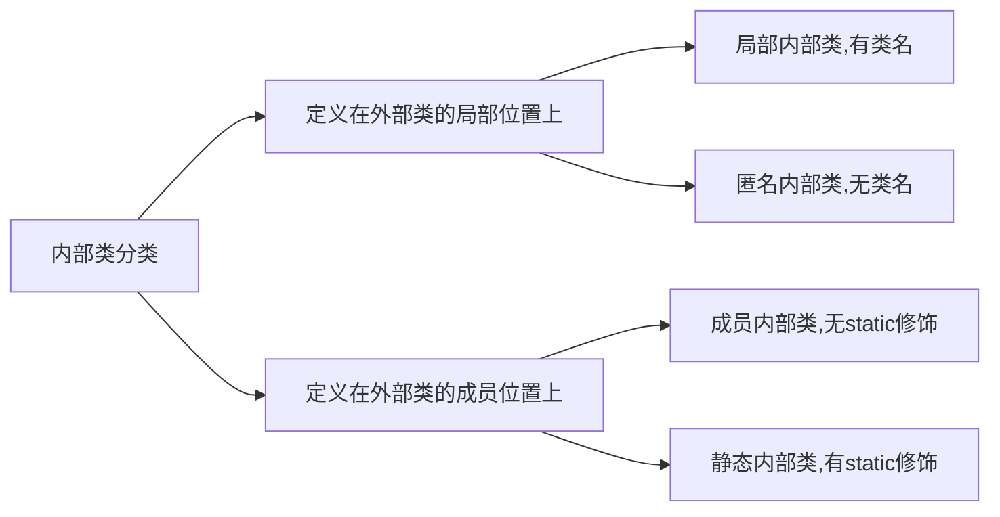

### 局部内部类

#### 定义

局部内部类是定义在外部类的局部位置, 比如方法中, 并且有类名;

#### 基本语法

```java
class Outer {
    public void function() {
        class Inner {
        
    	}
    }
}

class Other {
    
}
```

#### 访问权限

局部内部类可以直接访问外部类的所有成员, 包含私有成员;

内部类属性和外部类属性同名时, 遵循就近原则, 如果需要访问外部类的同名属性, 则通过`外部类名.this.属性名` 的方式访问

外部类方法中访问局部内部类中的成员, 只能通过实例化局部内部类对象的方式来访问;

外部其他类不能访问局部内部类, 因为局部内部类相当于一个局部变量

#### 修饰符

局部内部类相当于一个局部变量, 访问修饰符不能修饰它, 但是可以被`final`修饰

#### 作用域

局部内部类的作用域仅仅是在定义它的方法或代码块中


### 匿名内部类

#### 定义

匿名内部类是定义在外部类的局部位置, 比如方法中, 并且无类名(表面上无类名), 同时还是一个对象

#### 基本语法

```java
class Outer {
    public void method() {
    	new 接口(参数列表) {
          
        };
        /*
        基于接口的匿名内部类相当于
        class 匿名内部类的隐藏名 implements 接口 {
        
        }
        */
        
        new 类(参数列表) {
            
        };
        /*
        基于类的匿名内部类相当于
        class 匿名内部类的隐藏名 extends 类名 {
        
        }
        */
   	}
}
```

#### 本质

匿名内部类的实质就是在一个类中声明了一个继承了父类的子类或实现了某个接口的类, 其中体现继承性;

所以可以从匿名内部类的参数列表传递参数给父类的构造器;	

```java
class Outer {
    public void method() {
    	new 接口(参数列表) {
          
        };
        /*
        基于接口的匿名内部类相当于
        class 匿名内部类的隐藏名(Outer$1) implements 接口 {
        
        }
        */
        
        
        new 类(参数列表) {
            
        };
        /*
        基于类的匿名内部类相当于
        class 匿名内部类的隐藏名(Outer$2) exte 类名 {
        
        }
        */
   	}
}
```

#### 方法调用

匿名内部类在创建的时候顺便自动实例化了对象, 所以匿名内部类既是类也是对象; 所以能直接调用其方法

```java
public void method() {
        //引用调用
        Person p = new Person() {
            @Override
            public void say() {
                System.out.println("引用调用");
            }
        };
        p.say();
        
   		//直接调用内部类的方法
        new Person() {
            @Override
            public void say() {
                System.out.println("直接调用");
            }
        }.say();
}
```

#### 访问权限

匿名内部类内可以直接访问外部类的所有成员, 包含私有成员;

内部类属性和外部类属性同名时, 遵循就近原则, 如果需要访问外部类的同名属性, 则通过`外部类名.this.属性名` 的方式访问;

外部类的方法中访问匿名内部类中的成员, 通过实例化内部类对象或直接调用的方式来访问;

外部其他类不能访问匿名内部类, 因为匿名内部类相当于一个局部变量;

#### 修饰符

匿名内部类相当于一个局部变量, 访问修饰符不能修饰它, 但是可以被`final`修饰

#### 作用域

匿名内部类的作用域仅仅是在定义它的方法或代码块中


### 成员内部类

#### 定义

成员内部类定义在外部类的成员位置, 并且没有 `static` 修饰,;

#### 修饰符

成员内部类可以地位是一个成员, 所以可以被访问修饰符修饰

#### 作用域

成员内部类的作用域为所嵌套在外部类的整个类内

#### 访问方式

成员内部类内 访问 外部类的成员(包含私有成员) : 直接访问

外部类内访问 访问 内部类的成员 (包含私有成员): 先实例化对象, 在通过对象访问

内部类属性和外部类属性同名时, 遵循就近原则, 如果需要访问外部类的同名属性, 则通过`外部类名.this.属性名` 的方式访问;

外部其他类访问成员内部类:

1. 直接在外部其他类中创建两次对象调用

   ```java
   外部类名.内部类名 对象名 = 外部类对象名.new 内部类名();
   ```

2. 在外部其他类调用外部类中定义的一个返回内部类的实例化对象的方法

```java
public class Test {
    public static void main(String[] args) {
        Outer outer = new Outer();
        //外部其他类调用内部类法一
        Outer.Inner inner1 = outer.new Inner();
        inner1.method();

        //外部其他类调用内部类法二
        Outer.Inner inner2 = outer.returnObject();
        inner2.method();
    }
}
```


### 静态内部类

#### 定义

成员内部类定义在外部类的成员位置, 并且有 `static` 修饰,;

#### 修饰符

成员内部类可以地位是一个成员, 所以可以被访问修饰符修饰

#### 作用域

成员内部类的作用域为所嵌套在外部类的整个类内

#### 访问方式

静态内部类内 访问 外部类的静态成员(包含私有静态成员) : 直接访问

外部类内 访问 静态内部类的静态成员(包含私有静态成员): 先实例化对象, 再通过对象访问

内部类静态属性和外部类静态属性同名时, 遵循就近原则, 如果需要访问外部类的同名静态属性, 则通过`外部类名.属性名` 的方式访问;

外部其他类 访问 静态内部类:

```java
public class Other {
    public static void main(String[] args) {
        Outer outer = new Outer();

        //外部其他类调用静态内部类法一
        //因为静态内部类可以直接通过类名访问
        Outer.Inner inner01 = new Outer.Inner();
        inner01.method();
        //外部其他类调用静态内部类法二
        Outer.Inner inner02 = outer.getStaticInnerClassObject();
        inner02.method();
    }
}
```

# 枚举和注解

## 枚举类

### 概括

#### 定义

枚举类(enumeration, 简称 enum), 枚举是一组常量的集合; 枚举类可以理解为是一种特殊的类, 里面只包含一组有限的特定的对象。

### 自定义类实现枚举

#### 步骤

1. 将构造器私有化（防止实例化对象）；
2. 删除 `setXxx()` 方法（防止对象的属性被修改）；
3. 在枚举类内部直接创建固定的对象，对象名采用全部大写（常量命名规范）；
4. 通过 static final 修饰优化对象，调用对象时防止类加载，优化性能。

```java
package com.enum_.diy_enum;

/**
 * @ClassName: Test
 * @Description:
 * @date: 2023-03-16 20:44
 */
public class Test {
    public static void main(String[] args) {
        System.out.println(Season.SPRING);
        System.out.println(Season.SUMMER);
        System.out.println(Season.AUTUMN);
        System.out.println(Season.WINTER);
    }
}

class Season {
    private String name;
    private String desc;

    //1. 构造器私有化
    private Season(String name, String desc) {
        this.name = name;
        this.desc = desc;
    }

    //2. 删除setXxx()方法

    public String getName() {
        return name;
    }

    public String getDesc() {
        return desc;
    }

    //3. 在Season内部直接创建固定的对象
    //4. 通过final修饰优化对象, 使调用对象时类不会加载
    public static final Season SPRING = new Season("春天", "温暖");
    public static final Season SUMMER = new Season("夏天", "炎热");
    public static final Season AUTUMN = new Season("秋天", "凉爽");
    public static final Season WINTER = new Season("冬天", "寒冷");

    @Override
    public String toString() {
        return "Season{" +
                "name='" + name + '\'' +
                ", desc='" + desc + '\'' +
                '}';
    }
}
```

### enum 关键字实现枚举

#### 步骤

1. 使用关键字 `enum` 替代 `Class`；
2. **首行**（定义对象在属性声明之前）使用 `对象常量名(参数列表)` 替代自定义类实现枚举中的创建对象方式
   (如果使用无参构造器, 创建枚举对象, 则实参列表和小括号都可以省略)
3. 如有多个常量对象, 使用逗号间隔, 重复步骤 2；
4. 私有化构造器。

#### 细节

1. 当我们使用enum关键字开发一个枚举类时, 会隐式继承Enum类, 而且是一个`final`类, 通过`javap`反编译可以证明以上; 所以, **enum类不能继承其他的类**;
2. 在用enum枚举类时传统的`public static final 对象名 = new 类名(参数列表)` 会被简化成`对象名(参数列表)`

#### 反编译

```bash
E:\Github\Notes\CodeTest\javaProject\javaTest\out\production\javaTest\com\enum_\enum_enum>javap Season.class
Compiled from "Test.java"
final class com.enum_.enum_enum.Season extends java.lang.Enum<com.enum_.enum_enum.Season> {
  public static final com.enum_.enum_enum.Season SPRING;
  public static final com.enum_.enum_enum.Season SUMMER;
  public static final com.enum_.enum_enum.Season AUTUMN;
  public static final com.enum_.enum_enum.Season WINTER;
  public static com.enum_.enum_enum.Season[] values();
  public static com.enum_.enum_enum.Season valueOf(java.lang.String);
  public java.lang.String getName();
  public java.lang.String getDesc();
  public java.lang.String toString();
  static {};
}
```

#### 演示代码

```java
package com.enum_.enum_enum;

/**
 * @ClassName: Test
 * @Description:
 * @date: 2023-03-16 21:12
 */
public class Test {
    public static void main(String[] args) {
        System.out.println(Season.SPRING);
        System.out.println(Season.SUMMER);
        System.out.println(Season.AUTUMN);
        System.out.println(Season.WINTER);
        System.out.println(Season.a);
        System.out.println(Season.b);
    }
}

enum Season {
    SPRING("春天", "温暖"), SUMMER("夏天", "炎热"), AUTUMN("秋天", "凉爽"), WINTER("冬天", "寒冷"), a(), b;

    private String name;
    private String desc;

    private Season() {}  //无参构造器
    private Season(String name, String desc) {
        this.name = name;
        this.desc = desc;
    }

    public String getName() {
        return name;
    }

    public String getDesc() {
        return desc;
    }

    @Override
    public String toString() {
        return "Season{" +
                "name='" + name + '\'' +
                ", desc='" + desc + '\'' +
                '}';
    }
}

```

### Enum 成员方法

#### name()

返回当前枚举类的常量的名称(对象名)

#### toString()

已经被Enum类重写, 返回当前对象名, 子类可以重写该方法, 用于返回对象属性信息

#### ordinal()

返回当前枚举的对象的编号, 编号从0开始;

#### values()

返回包含当前枚举类的所有对象名的数组

#### valueOf()

将字符串与枚举类中的对象名进行匹配, 匹配成功返回对象, 否则报错

#### compareTo()

比较两个枚举常量的位置号, 返回前者位置号与后者位置号相减的结果

#### 演示代码

```java
package com.enum_;

/**
 * @ClassName: EnumMethod
 * @Description:演示Enum类的成员方法
 * @date: 2023-03-18 15:57
 */
public class EnumMethod {
    public static void main(String[] args) {
        Season autumn = Season.AUTUMN;
        //name()返回当前枚举常量的名称
        System.out.println(autumn.name());
        //toString(), 已经被Enum类重写, 返回当前对象名, 子类可以重写该方法, 用于返回对象属性信息
        System.out.println(Season.SPRING);
        //ordinal()返回当前枚举常量的编号(从0开始)
        System.out.println(autumn.ordinal());
        //values()返回包含当前枚举类的所有对象名的数组
        Season[] values = Season.values();
        for(Season value : values) {
            System.out.println(value);
        }
        //valueOf()将字符串与枚举类中的对象名进行匹配, 匹配成功返回对象, 否则报错
        Season spring = Season.valueOf("SPRING");
        System.out.println(spring);
        System.out.println(spring == Season.SPRING);
        //compareTo()比较两个枚举常量的位置号, 返回前者位置号与后者位置号相减的结果
        System.out.println(Season.SPRING.compareTo(Season.SUMMER));
    }
}

enum Season {
    SPRING("春天", "温暖"), SUMMER("夏天", "炎热"),
    AUTUMN("秋天", "凉爽"), WINTER("冬天", "寒冷");

    private String name;
    private String desc;

    private Season() {}  //无参构造器
    private Season(String name, String desc) {
        this.name = name;
        this.desc = desc;
    }

    @Override
    public String toString() {
        return "Season{" +
                "name='" + name + '\'' +
                ", desc='" + desc + '\'' +
                '}';
    }
}
```

### enum 实现接口

枚举类和普通类一样可以实现接口。枚举类隐式继承 `Enum` 类，所以不能继承其他类。

#### 演示代码

```java
public class enumInterface {
    public static void main(String[] args) {
        Music.CLASSIC.playing();
    }
}

interface IP {
    public void playing();
}

enum Music implements IP{
    CLASSIC;

    @Override
    public void playing() {
        System.out.println("播放音乐");
    }
}
```

## 注解

### 概括

#### 定义

注解(Annotation)也被称为元数据(Metadata), 用于修饰包, 类, 方法, 属性, 构造器, 局部变量等数据信息;和注释一样, 注解不影响程序逻辑, 但注解可以被编译运行, 相当于嵌入在代码中的补充信息; 

#### 作用

在JavaSe中, 注解的使用目的比较简单, 例如标记过时的功能, 忽略警告等. 在JavaEE中注解占据了重要角色, 例如用来配置应用程序的任何切面, 代替JavaEE旧版中所遗留的繁冗代码和XML配置等;

### @Override

@Override表示指定重写父类方法, 如果注解了@Override的方法在父类中没有, 则会报错. 如果不写@Override注解, 而父类有子类同名方法, 则依然构成方法重写.

@Override只能修饰方法, 查看@Override注解源码为@Target(ElementType.METHOD), 说明只能修饰方法

@Target是修饰注解的注解, 称为源注解

#### 源码

```java
@Target(ElementType.METHOD)
@Retention(RetentionPolicy.SOURCE)
public @interface Override {
}
```

### @Deprecated

@Deprecated注解修饰某个元素, 表明该元素已过时, 即不推荐使用, 但不是不能用;

可以修饰:方法, 类, 字段, 包, 参数等

@Deprecated可以做JDK版本升级过度使用

#### 源码

```java
@Documented
@Retention(RetentionPolicy.RUNTIME)
@Target(value={CONSTRUCTOR, FIELD, LOCAL_VARIABLE, METHOD, PACKAGE, PARAMETER, TYPE})
public @interface Deprecated {
}
```

### @SuppressWarnings

我们写的有些代码, IEDA会在界面上有警告信息, 可以用@SuppressWarnings注解那些代码, 来抑制IDEA的警告;

#### 语法

```java
@SuppressWarings({"警告类型", "警告类型"})
```

#### 作用范围

作用范围和编写的位置相关, 比如@SuprressWarnings放在一个方法的前一行, 那么作用范围为整个方法;

#### 警告类型表

|警告类型|作用|
| ---- | ---- |
|all| 抑制所有警告|
|boxing|抑制与封装/拆装作业相关的警告|
|cast| 抑制与强制转型作业相关的警告|
|dep-ann| 抑制与淘汰注释相关的警告|
|deprecation| 抑制与淘汰的相关警告|
|fallthrough| 抑制与 switch 陈述式中遗漏 break 相关的警告|
|finally| 抑制与未传回 finally 区块相关的警告|
|hiding| 抑制与隐藏变数的区域变数相关的警告|
|incomplete-switch| 抑制与 switch 陈述式(enum case)中遗漏项目相关的警告|
|javadoc| 抑制与 javadoc 相关的警告|
|nls| 抑制与非 nls 字串文字相关的警告|
|null| 抑制与空值分析相关的警告|
|rawtypes| 抑制与使用 raw 类型相关的警告|
|resource| 抑制与使用 Closeable 类型的资源相关的警告|
|restriction| 抑制与使用不建议或禁止参照相关的警告|
|serial| 抑制与可序列化的类别遗漏 serialVersionUID 栏位相关的警告|
|static-access| 抑制与静态存取不正确相关的警告|
|static-method| 抑制与可能宣告为 static 的方法相关的警告|
|super| 抑制与置换方法相关但不含 super 呼叫的警告|
|synthetic-access| 抑制与内部类别的存取未最佳化相关的警告|
|sync-override| 抑制因为置换同步方法而遗漏同步化的警告|
|unchecked| 抑制与未检查的作业相关的警告|
|unqualified-field-access| 抑制与栏位存取不合格相关的警告|
|unused| 抑制与未用的程式码及停用的程式码相关的警告|

#### 源码

```java
@Target({TYPE, FIELD, METHOD, PARAMETER, CONSTRUCTOR, LOCAL_VARIABLE})
@Retention(RetentionPolicy.SOURCE)
public @interface SuppressWarnings {
    String[] value();
}
```

### 元注解

JDK的元注解用于修饰其他的注解

#### Retention

只能用于修饰一个 Annotation 定义, 用于指定该 Annotation 可以保留多长时间, @Rentention 包含一个 RetentionPolicy
类型的成员变量, 使用 @Rentention 时必须为该 value 成员变量指定值:

1) RetentionPolicy.SOURCE: 编译器使用后， 直接丢弃这种策略的注释
2) RetentionPolicy.CLASS: 编译器将把注解记录在 class 文件中. 当运行 Java 程序时, JVM 不会保留注解. 这是默认
   值
3) RetentionPolicy.RUNTIME:编译器将把注解记录在 class 文件中. 当运行 Java 程序时, JVM 会保留注解. 程序可以
   通过反射获取该注解 

```java
@Documented
@Retention(RetentionPolicy.RUNTIME)
@Target(ElementType.ANNOTATION_TYPE)
public @interface Retention {
    /**
     * Returns the retention policy.
     * @return the retention policy
     */
    RetentionPolicy value();
}
```

#### Target

用于修饰一个 Annotation 定义, 指定被修饰的注解可以修饰哪些程序元素. @Target也包含一个名为value的成员变量

```java
@Documented
@Retention(RetentionPolicy.RUNTIME)
@Target(ElementType.ANNOTATION_TYPE)
public @interface Target {
    /**
     * Returns an array of the kinds of elements an annotation type
     * can be applied to.
     * @return an array of the kinds of elements an annotation type
     * can be applied to
     */
    ElementType[] value();
}
```

#### Documented

用于指定被该元注解修饰的注解类将被JavaDoc工具提取成文档, 即在生成文档时, 可以看到该注解;

```java
@Documented
@Retention(RetentionPolicy.RUNTIME)
@Target(ElementType.ANNOTATION_TYPE)
public @interface Documented {
}
```

#### Inherited

被@Inherited修饰的注解将具有继承性, 即如果某个类使用了被@Inherited修饰的注解, 则子类将自动被那个注解修饰;

# 异常

> 当程序逐行执行到有错误的代码行的时候, 程序会抛出相应类型的异常, 当抛出异常后, 程序结束, 不再执行后面的代码; 所以只要出现一个非致命错误, 就导致整个系统结束运行, 异常处理机制应运而生; 如果程序员觉得某些代码行的代码有可能出现异常, 可以使用异常处理机制来解决, 从而保证程序的健壮性容错性;

## 基本概念

### 异常定义

Java语言中,  将程序执行中发生的不正常情况称为异常. 语法错误和逻辑错误不称为异常. 

### 异常事件分类

1. Error(错误)：Java虚拟机无法解决的严重问题。如：JVM系统内部错误、资源耗尽等严重情况。比如：StackOverflowError[栈溢出]和OOM(out of memory),Error是严重错误，程序会崩溃。
2. Exception:其它因编程错误或偶然的外在因素导致的一般性问题，可以使用针对性的代码进行处理. 例如空指针访问，试图读取不存在的文件，网络连接中断等等，Exception分为两大类：运行时异常和编译时异常.

### 异常体系图


## 运行时异常

### 定义

运行时异常是编译器检查不出来的异常, 一般是指编译时发生的逻辑错误, 是程序员应该避免其出现的异常; 

对于运行时异常, 可以不做处理, 默认的处理方法就是隐式的throws处理异常, 最终会抛给JVM.  因为这类异常很普遍, 若全处理可能对程序的可读性和运行效率产生影响;

### NullPointerException

当应用程序试图在需要对象的地方使用null时抛出空指针异常

```java
public class NullPointer {
    public static void main(String[] args) {
        String name = null;
        System.out.println(name.length());
    }
}

Exception in thread "main" java.lang.NullPointerException
	at com.exception_.NullPointer.main(NullPointer.java:4)
```

### ArithmeticException

当出现异常的运算条件时, 抛出算数异常

```java
public class ArithmeticException {
    public static void main(String[] args) {
        int n1 = 10;
        int n2 = 0;

        int res = n1 / n2;  //抛出异常
        System.out.println("程序正在运行");  //从此不再执行
    }
}

Exception in thread "main" java.lang.ArithmeticException: / by zero
	at com.exception_.ArithmeticException.main(ArithmeticException.java:6)
```

### ArrayIndexOutOfBounds

用非法索引访问数组时抛出的数组下标越界异常

```java
public class ArrayIndexOutOfBounds {
    public static void main(String[] args) {
        int[] arr = {0, 1, 2, 3};
        for (int i = 0; i <= arr.length; i++) {
            System.out.println(arr[i]);
        }
    }
}

Exception in thread "main" java.lang.ArrayIndexOutOfBoundsException: 4
	at com.exception_.ArrayIndexOutOfBounds.main(ArrayIndexOutOfBounds.java:5)
```

### ClassCastException

当试图将对象强制转换为不是实例的子类时, 抛出类型转换异常

```java
public class ClassCast {
    public static void main(String[] args) {
        A a = new B();
        B b = (B) a;
        C c = (C) a;
    }
}

class A {}
class B extends A {}
class C extends A {}

Exception in thread "main" java.lang.ClassCastException: com.exception_.B cannot be cast to com.exception_.C
	at com.exception_.ClassCast.main(ClassCast.java:5)
```

### NumberFormatException

当应用程序试图将字符串转换成一种数值类型, 但该字符串不能转换为适当格式时, 抛出该数字格式不正确异常, 使用异常可以确保输入是满足条件数字

```java
public class NumberFormatException {
    public static void main(String[] args) {
        String name = "1234";
        int num = Integer.parseInt(name);
        
        name = "zhou";
        num = Integer.parseInt(name);
    }
}

Exception in thread "main" java.lang.NumberFormatException: For input string: "zhou"
	at java.lang.NumberFormatException.forInputString(Unknown Source)
	at java.lang.Integer.parseInt(Unknown Source)
	at java.lang.Integer.parseInt(Unknown Source)
	at com.exception_.NumberFormatException.main(NumberFormatException.java:7)
```

## 编译时异常

### 定义

编译异常是指在编译期间, 就必须处理的异常, 比如用try-catch 或者 throws,否则代码不能通过编译.

### 常见编译异常

| 异常                      | 含义                               |
| ------------------------- | ---------------------------------- |
| SQLException              | 操作数据库时, 查询表可能发生异常   |
| IOException               | 操作文件时, 发生的异常             |
| FileNotFoundException     | 当操作一个不存在的文件时, 发生异常 |
| ClassNotFoundException    | 加载类, 而该类不存在时, 发生异常   |
| EOFException              | 操作文件, 到文件末尾, 发生异常     |
| IllegalArguementException | 参数异常                           |

## 异常处理

异常处理就是当异常发生时, 对异常的处理方式.

### try

#### try-catch-finall

```java
try {
	可能有异常的代码块;
    //如果try块内某行代码发生异常, 则try中那行之后的代码不会被执行
    //当异常发生时, 系统将异常封装成Exception类型的异常对象e, 传递给catch
} catch (Exception e) {
    //捕获到异常
    //输出异常信息
    //如果没有异常发生, 不会执行catch代码块
} finally {  //finally不是必须的
    //不管try里的代码块是否有异常发生, finally块始终被执行
    //所以通常将释放资源的代码放在finally中
}
```

可以有多个catch语句, 用于捕获不同类型的异常, 要求父类异常在后, 子类异常在前, 比如Exception在后, NullPointerException在前; 如果发生异常, 只会匹配一个catch

#### try-finally

这种用法相当于没有捕获异常, try中发生异常后, 执行finally, finally执行完毕中断程序.

应用场景:执行一段代码时, 不管是否发生异常, 都必须执行某个业务逻辑, 此业务逻辑的代码就放在finally中.

```java
public class TryFinally {
    public static void main(String[] args) {
        try {
            int a = 10;
            int b = 0;
            System.out.println(a / b);
        } finally {
            System.out.println("总是执行");
        }
    }
}
```

### throws

如果一个方法中的语句执行时可能生成某种异常, 但是不能确定如何处理这些异常, 则此方法应显示地声明抛出异常, 表明该方法将不对这些异常进行处理, 而由该方法的调用者负责处理.

在方法声明中用throws语句可以声明抛出异常的列表, throws后面异常类型可以是方法中产生的异常类型, 也可以是它的父类类型.

将发生的异常抛给上一级调用者, 顶级调用者为JVM, 对于一个异常处理, 不是try-catch-finally就是throws. 如果在代码中没有显示的处理方法, 那么就会默认使用隐式的异常处理, 即为throws, 最终throws到JVM, 而JVM作为最高级调用者, 他就会简单的输出异常信息, 中断程序.


#### 细节

1. 子类重写父类的方法时, 对抛出异常的规定:子类重写的方法, 所抛出的异常类型要么和父类抛出的类型一致, 要么为父类抛出异常的类型的子类型.
2. 在throws过程中, 如果有方法try-catch处理异常, 就可以不必throws 

## 自定义异常

### 概念

当程序中出现了某些"错误", 但该错误信息并没有在Throwable子类中描述处理, 这个时候可以自己设计异常类, 用于描述该错误信息.

### 步骤

1. 自定义类:自定义异常类名, 继承Exception或RuntimeException类
2. 如果继承Exception类属于编译异常
3. 如果继承RuntimeException类属于运行异常

### 举例代码

```java
//要求范围在18-120之间,否则抛出自定义异常,并给出提示信息
public class CustomException {
    public static void main(String[] args) {
        int age = 800;

        if(age < 18 || age > 120) {
            throw new AgeException("输入应在18-120之间");
        }

        System.out.println("输入范围正确");
    }
}
class AgeException extends RuntimeException {
    public AgeException(String message) {
        super(message);
    }
}


Exception in thread "main" com.exception_.AgeException: 输入应在18-120之间
	at com.exception_.CustomException.main(CustomException.java:6)
```

## throw与throws区别

| 类型   | 意义                   | 位置       | 后面跟的东西 |
| ------ | ---------------------- | ---------- | ------------ |
| throws | 异常处理的一种方式     | 方法声明处 | 异常类型     |
| throw  | 手动生成异常类型关键字 | 方法体中   | 异常对象     |

# Util 类

## Wrapper 类

- 包装类：针对 8 种基本数据类型相应的引用类型
- 包装类使得基本数据类型具有类的特点，可以调用类中的方法

| 基本数据类型 | 包装类    |
| ------------ | --------- |
| boolean      | Boolean   |
| char         | Character |
| byte         | Byte      |
| short        | Short     |
| int          | Integer   |
| long         | Long      |
| float        | Float     |
| double       | Double    |

Byte, Short, Integer, Long, Float, Double 六个类继承于 Number 类。

### 类关系

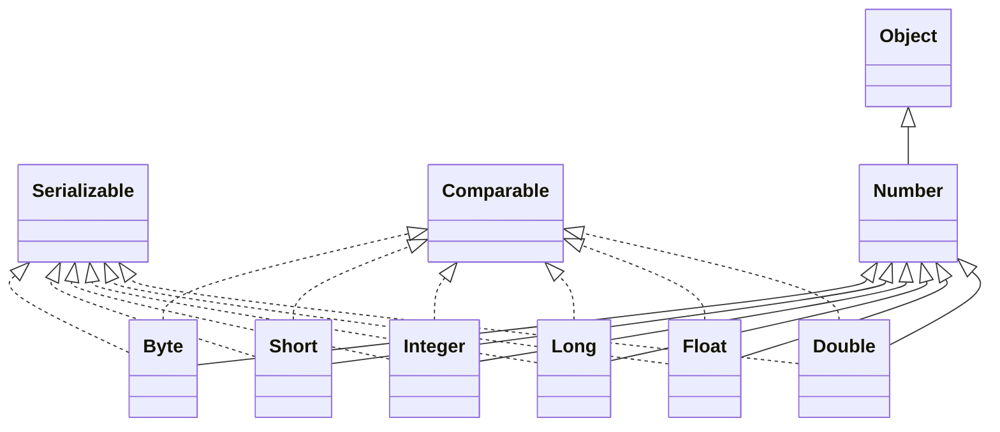

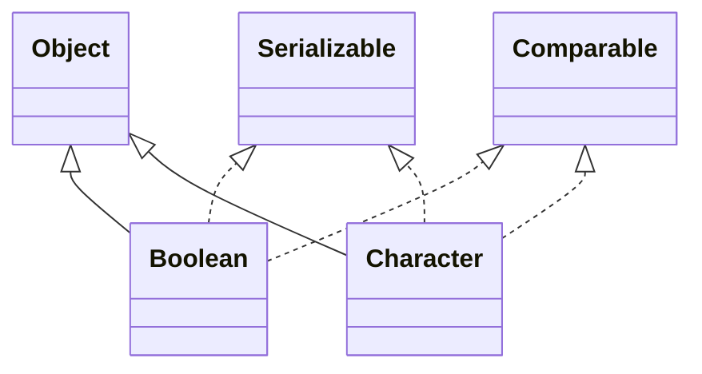

### 包装类与基本数据类型的转换

JDK5 之前需要手动装箱与拆箱。

- 装箱：基本数据类型 --> 包装类
- 拆箱：包装类 --> 基本数据类型

#### 手动装箱与拆箱

```java
int n1 = 100;
// 手动装箱
Integer integer01 = new Integer(n1);
Integer integer02 = Integer.valueOf(n1);

// 手动拆箱
int n2 = integer02.intValue();
```

- `new Integer()`  每次都会创建新的对象，无论数值是否存在，增加内存使用。

- `Integer.valueOf()`  在-128 ~ 127 内使用缓存池，避免重复创建（只对缓存池内的对象生效），性能优。

  ```java
  public static Integer valueOf(int i) {
          if (i >= IntegerCache.low && i <= IntegerCache.high)
              return IntegerCache.cache[i + (-IntegerCache.low)];
          return new Integer(i);
      }
  ```

#### 自动装箱与拆箱

```java
int n1 = 100;
// 自动装箱：底层使用 Integer.valueOf(n1)
Integer integer02 = n1;

// 自动拆箱：底层使用 integer03.intValue()
int n3 = integer02;
```

### 包装类与 String 类型的转换

```java
Integer i = 2002;
// f1
String s1 = i + "";
// f2
String s2 = i.toString();
// f3
String s3 = String.valueOf(i);


Integer i1 = Integer.parseInt(s1); // 调用自动装箱

Integer i2 = new Integer(s1);
```

### 基本数据类型与包装数据类型并存

只要有基本数据类型就按照基本数据类型

```java
Integer i1 = 1;
int i2 = 1;
System.put.println(i1 == i2); // true
```

## String 类

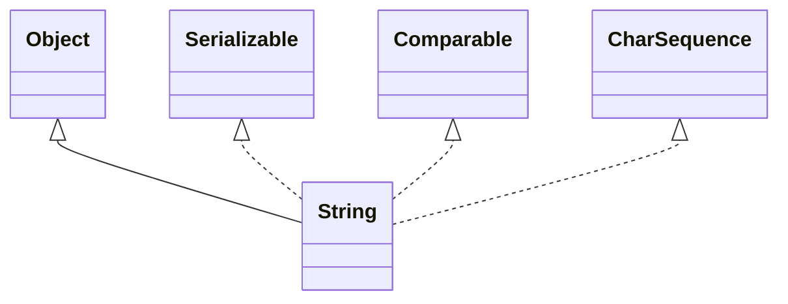


### String 特性

- 字符使用 Unicode 字符编码，一个字符占两个字节；
- String 是 final 类，不能被继承；
- String 的 private final char value[] 属性用于存放字符串内容，**~~数组元素可修改~~，数组引用不可修改**（重新赋值生成新的对象）；
- 实现 Serializable 接口，String 类可以串行化（即可存储在文件，又可在**网络上传输**）；
- 实现 Comparable 接口，String 对象可以相互比较；

### value 数组元素的可更改 与 String 对象的不可变性是否相悖？

答案：不相悖！

1. 不要被数组元素的可更改误会。首先，虽说数组元素可以更改，但 String 类的 value 数组是私有属性的，外部无法访问，无法直接修改。其次，String 没有提供任何一个成员方法以修改 value 数组的元素值。
2. Stirng 类的 value 数组使用 final 修饰的真正作用是保证数组引用不可变。

所以，通过私有化 value 数组防止修改数组元素与 final 限制 value 数组的应用被修改，实现 String 对象的不可变性。

### 常用构造器

```java
String();
String(String original);
String(char[] a);
String(char a, int startIndex, int count);
String(byte[] b);
```

### 创建方式

#### 方式 1

```java
String s1 = "zxb";
```

先检查常量池是否存在此字符常量，如果有，直接指向。否则，先在常量池创建再指向。这种情况下的 String 对象指向的是常量池的地址空间。

#### 方式 2

```java
String s2 = new String("zxb");
```

每次都在堆中强制创建一个新的 `String` 对象，字符串引用常量池中相同的字符串，如果池中没有，则新建。

### 常用方法

#### String intern(void)

当调用 intern() 方法时，如果常量池中已经包含一个等于此 String 对象的字符串，则**返回常量池的字符串对象**。否则，先在常量池创建一个相同的字符串对象，再返回这个常量池对象。

```java
String s1 = "zxb";
String s2 = new String("zxb");

System.out.println(s1 == s1.intern()); // true
System.out.println(s2 == s2.intern()); // false
```

#### boolean equals(String)

判断两个字符串内容是否相等（区分大小写）。

#### boolean equalsIgnoreCase(String)

判断两个字符串内容是否相等（忽略大小写）。

#### int length(void)

返回字符串的长度。

#### int indexOf(char)

返回字符在字符串中第一次出现的索引（从 0 开始）。如果没有，返回 `-1`。

#### int lastIndexOf(char)

返回字符在字符串中最后一次出现的索引（从 0 开始）。如果没有，返回 `-1`。

#### String substring(int begin, int end)

返回截取后的子串，begin 至 end - 1。

#### Char charAt(int)

返回指定索引位置对应的字符，不能使用数组的方式调用 String 字符串的字符。

#### String trim(void)

去除字符串首尾的空格。

#### String toUpperCase(void)

返回大写化的字符串。

#### String toLowerCase(void)

返回小写化的字符串。

#### String contact(String)

返回拼接后的字符串。

#### String replace(String s1. String s2)

将所有的 s1 替换成 s2，并返回替换后的字符串。

#### String[] split(String)

分割字符串，结果返回字符串数组。

#### char[] toCharArray(void)

将字符串转换为字符数组，返回字符数组。

#### int compareTo(String)

按照字典序比较字符串大小。

#### String format(String, String...)

用占位符格式化字符串，类似 C 语言的 `scanf()`。

```java
String name = "zxb";
int age = 22;
double score = 99.5;

String res = String.format("我的姓名是 %s，" +
        "我的成绩是 %.2f," +
        "我的年龄是 %d", name, score, age);

System.out.println(res);
```

---

更多的方法请查阅 Java 手册。

### 字符串拼接 $\bigstar$

字符串拼接的底层实现是借助 StringBuilder 对象一个一个 append 需要拼接的内容，最后将拼接的结果以 Stirng 对象的形式存储在**堆**中。

字符串常量相加，结果对象存放在常量池。两个字符串变量相加，结果对象存放在堆。

```java
String "zxb"
/ *
	t1 这行代码会先创建一个 StringBuilder
    调用 append 拼接字符串
    把结果 Stirng 对象存储在堆中
*/
String t1 = "hello" + s1;
String s2 = "hellozxb";
```

### Stirng 的 JVM 内存结构

```java
package com.string_;

/**
 * @Project: JavaSeCode
 * @Author: SinbinZhou
 * @Date: 2024/11/12 21:04
 * @Description: 读程序说出结果，理解内存结构图 ！！！
 */
public class Test05 {
    String str = new String("hsp");
    final char[] ch = { 'j', 'a', 'v', 'a' };

    public void change(String str, char ch[]) {
        str = "java";
        ch[0] = 'h';
    }

    public static void main(String[] args) {
        Test05 ex = new Test05();
        ex.change(ex.str, ex.ch);
        System.out.print(ex.str + " and ");
        System.out.println(ex.ch);
    }
}
```


## StringBuffer 类

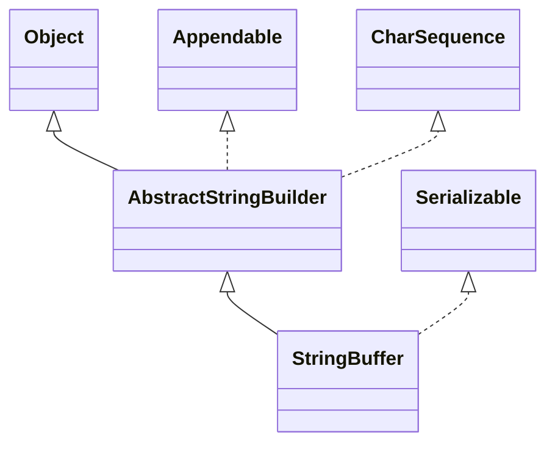


- StringBuffer 是可变的字符序列，是一个容器，是对 String 类的增强。
- StringBuffer 父类 AbstractStringBuilder 属性有 `char[] value` ，不是 `final` 的，字符串存放在堆中。
- StringBuffer 类是一个 final 类，不能被继承。

### String VS StringBuffer

|            | String                                           | StringBuffer                                     |
| ---------- | ------------------------------------------------ | ------------------------------------------------ |
| 保存的内容 | 字符串常量                                       | 字符串变量                                       |
| 可修改性   | 值不可修改，每次更新创建新的对象，并更新引用地址 | 可以修改，不用创建新的对象，不用每次更新引用地址 |
| 效率       | 占用额外内存空间，效率低                         | 效率高                                           |
| 位置       | 存储在常量池                                     | 存储在堆                                         |
| 复用率     | 高                                               | 低                                               |

**结论**：在对字符串进行大量修改的场景下，Stirng 类会占用内存，导致效率降低，可根据线程模式选择 StringBuffer 或 StringBuilder。

### 构造方法

#### StringBuffer(void)

构造一个空的 StringBuffer 对象，初始容量为 16 个字符。

#### StringBuffer(int)

构造一个空的 StringBuffer 对象，并且指定初始容量。

#### StringBuffer(String)

构造一个 StringBuffer 对象，内容初始化为字符串的内容。容量大小 = 字符串长度 + 16。

#### StringBuffer(Sequence seq)

...

### StringBuffer2String

```java
StringBuffer sb1 = new StringBuffer("zxb");
// f1 toString()
String s1 = sb1.toString();
// f2 构造器
String s1 = new String(sb1);
```

### String2StringBuffer

```java
String s2 = "zxb";
// f1
StringBuffer sb2 = new StringBuffer(s2);
// f2
StringBuffer sb3 = new StringBuffer();
sb3 = sb3.append(s2);
```

### 常用方法

#### StringBuffer append(String)

在 SB 对象后追加字符串，返回拼接之后的 SB 对象。

#### StringBuffer delete(int, int)

删除 begin 至 end - 1 索引位置的子串，返回新的 SB 对象。

#### StringBuffer replace(int, int, String)

使用字符串参数替换 begin 至 end - 1 索引位置的子串，返回新的 SB 对象。

#### StringBuffer insert(int, String)

在参数索引之前插入参数字符串。

#### int indexOf(String)

返回子串第一次出现的位置的索引。

#### int length(void)

返回 SB 对象字符串的长度。

## StringBuilder 类

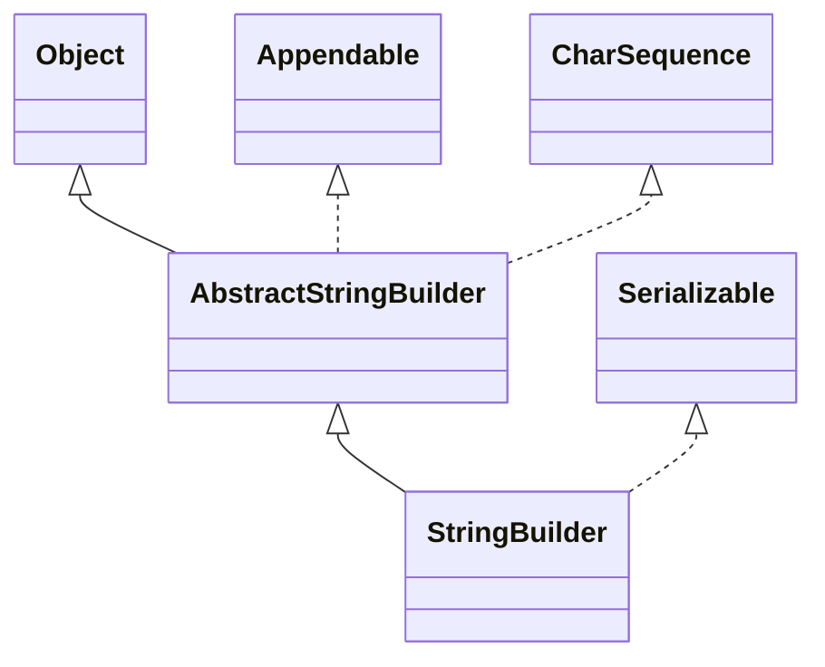


- 是一个可变动的字符序列，提供与 StringBuffer 兼容的 API，但不保证同步；
- 被设计用作 StringBuffer 的建议替换，用在字符串缓冲区被**单线程使用**；
- 如果可能优先采用 StringBuilder，因为比 StringBuffer 要快；
- 主要操作是 append 与 insert 方法，可以重载这些方法，以接受任意类型的数据。

### StringBuffer VS StringBuilder

|              | StringBuffer | StringBuilder            |
| ------------ | ------------ | ------------------------ |
| 线程场景     | 多线程       | 单线程                   |
| 线程安全性   | 线程安全     | 非线程安全，未做互斥处理 |
| 对象字符串   | 可变字符序列 | 可变字符序列             |
| 对象字符位置 | 堆           | 堆                       |
| 继承性       | final        | final                    |
| 效率         | 较高         | 最高                     |

## Math 类

提供数学相关的方法，都是静态方法。

### 常用方法

#### int abs(int)

绝对值

#### double sqrt(double)

开平方

#### double pow(double, double)

幂函数

#### double ceil(double)

向上取整

#### double floor(double)

向下取整

#### long round(double)

四舍五入

#### double random(void)

返回 $ [0, 1)$ 之间的随机小数

```java
// 求出 [a, b] 之间的随机整数
int res = (int)(a + Math.random() * (b - a) + 1);
```

## Arrays 类

`Arrays` 类是 Java 标准库中非常实用的一个工具类。它的静态方法可以极大简化对数组的操作，提高代码的可读性和效率。

### String toString(Object[])

将数组转换成字符串

```java
int[] a = {1, 2, 3};

System.out.println(Arrays.toString(a));

// [1, 2, 3]
```

### void sort(Object[])

默认升序排序

```java
public static void main(String[] args) {
    Integer[] a = {1, 3, 2, 5, 4};

    System.out.println(Arrays.toString(a));

    Arrays.sort(a);

    System.out.println(Arrays.toString(a));

    // 降序
    Arrays.sort(a, new Comparator() {
        @Override
        public int compare(Object o1, Object o2) {
            return (int)o2 - (int)o1;
        }
    });

    System.out.println(Arrays.toString(a));
}
```

#### 使用接口 + 自定义排序

```java
package com.arrays_;

import java.util.Arrays;
import java.util.Comparator;

/**
 * @Project: JavaSeCode
 * @Author: SinbinZhou
 * @Date: 2024/11/12 12:01
 * @Description: 用接口实现自定义排序
 */
public class DiySortAndComparator {
    public static void main(String[] args) {
        int[] a = {3, 1, 2, 5, 4};

        bubbleSort(a, new Comparator() {
            @Override
            public int compare(Object o1, Object o2) {
                int i1 = (Integer)o1;
                int i2 = (Integer)o2;
//                return i1 - i2;
                return i2 - i1;
            }
        });

        System.out.println(Arrays.toString(a));
    }

    public static void bubbleSort(int[] a, Comparator c) {
        int temp = 0;
        for (int i = 0; i < a.length - 1; i++) {
            for (int j = i + 1; j < a.length; j++) {
                if (c.compare(a[i], a[j]) > 0) {
                    temp = a[i];
                    a[i] = a[j];
                    a[j] = temp;
                }
            }
        }
    }
}
```

#### 使用接口

```java
package com.arrays_;

import java.util.Arrays;
import java.util.Comparator;

/**
 * @Project: JavaSeCode
 * @Author: SinbinZhou
 * @Date: 2024/11/12 13:23
 * @Description: 对 Book 类内的 4 个对象按照价格进行排序
 */
public class Test02 {
    public static void main(String[] args) {
        Book[] books = new Book[4];
        books[0] = new Book("红楼梦", 100);
        books[1] = new Book("金瓶梅", 90);
        books[2] = new Book("青年文摘", 5);
        books[3] = new Book("Java从入门到放弃",300);

        Arrays.sort(books, new Comparator() {
            @Override
            public int compare(Object o1, Object o2) {
                Book b1 = (Book) o1;
                Book b2 = (Book) o2;

                double res = b2.getPrice() - b1.getPrice();
                // 适应返回类型
                if (res > 0) return 1;
                else if (res < 0) return -1;
                else return 0;
            }
        });

        System.out.println(Arrays.toString(books));
    }
}

class Book {
    String name;
    double price;

    Book(){}
    Book(String name, double price) {
        this.name = name;
        this.price = price;
    }

    public String getName() {
        return name;
    }

    public void setName(String name) {
        this.name = name;
    }

    public double getPrice() {
        return price;
    }

    public void setPrice(double price) {
        this.price = price;
    }

    @Override
    public String toString() {
        return "Book{" +
                "name='" + name + '\'' +
                ", price=" + price +
                '}';
    }
}
```

### int binarySearch(Object[])

二分查找，返回索引下标，不存在返回 `-(low + 1)`。前提数组有序。

### Object[] copyOf(Object[], int)

拷贝指定个数（从索引 0 开始计数）的数组元素到新的数组。当个数大于原数组长度时，在后面填充 `null`。底层调用的是` System.arraycopy()` 。

### void fill(Object[], Object)

把数组所有元素替换成指定参数。

### boolean equals(Object[], Object[])

比较数组。

### List\<T> asList(\<T>)

将数组转换为 List，实际是数组的视图，不可对列表进行删除和插入，只能修改值。修改值之后同步修改原数组。 

```java
public class AsList {
    public static void main(String[] args) {
        Integer[] a = {1, 2, 3, 4, 5};
        List al = Arrays.asList(a);
        al.set(0, 99);
        System.out.println(Arrays.toString(a)); // [99, 2, 3, 4, 5]
    }
}
```

## System 类

### long currentTimeMillis(void)

用于获取自 1970 年 1 月 1 日（Unix 纪元）以来的毫秒数。常用于测量程序的运行时间或作为时间戳。

### void exit(int)

终止当前运行的 Java 虚拟机（JVM），并带一个状态码。通常 `0` 表示正常退出，非零值表示异常退出。

### void gc(void)

建议 JVM 进行垃圾回收，但不保证立即执行。垃圾回收会尝试清理无用的对象，释放内存。

### void arraycopy(Object, int, Object, int, int)

```
* @param      src      the source array.
* @param      srcPos   starting position in the source array.
* @param      dest     the destination array.
* @param      destPos  starting position in the destination data.
* @param      length   the number of array elements to be copied.
```

高效地复制数组内容，从源数组复制到目标数组。比手动遍历复制更快，是系统级的操作。 

## 大数类

当某个场景的数据大小溢出 `long` 或 `double` 时可以使用 `BigInteger` 或 `BigDicimal`。

### BigInteger

#### 构造方法

```java
void BigInteger(String)
```

#### 成员方法

| 方法名      | 作用 | 返回类型   | 参数类型   |
| ----------- | ---- | ---------- | ---------- |
| add()       | 加   | BigInteger | BigInteger |
| substract() | 减   | BigInteger | BigInteger |
| multiply()  | 乘   | BigInteger | BigInteger |
| divide()    | 除   | BigInteger | BigInteger |

当 `BigInteger` 与一个基本数据类型进行混合运算时，需要先把基本数据类型转换为 `BigInteger`。

### BigDicimal

构造方法和成员方法基本与 `BigInteger` 一致。需要注意除法可能除不尽，导致抛出异常。

除不尽解决方法：在除法方法内加上精度参数。

```java
BigDecimal bigDecimal01 = new BigDecimal("123123123123123123123123.11");
BigDecimal bigDecimal02 = new BigDecimal("3");
BigDecimal res = bigDecimal01.divide(bigDecimal02, BigDecimal.ROUND_CEILING);
System.out.println(res);
```

## 日期类

> java.util.date

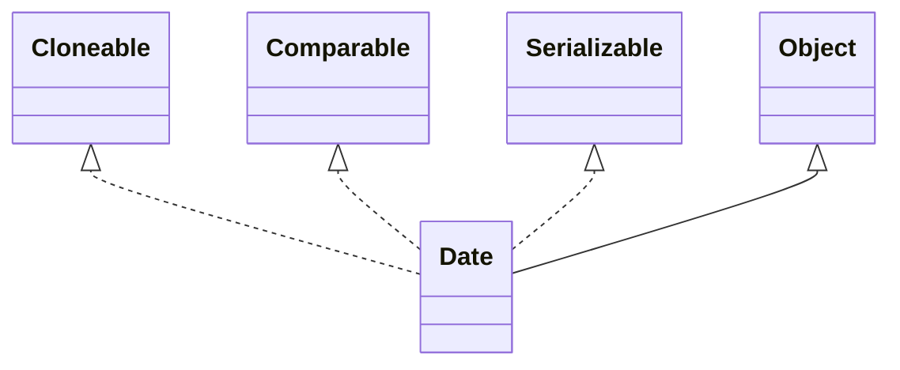

### Date (Version 1)

#### 构造方法

```java
// 无参构造方法默认为系统当前时间
Date date = new Date();
System.out.println(date);
// Tue Nov 12 14:53:00 CST 2024
```

#### 格式化

SimpleDateFormat 类可以对 Date 转换成指定格式的 String。

```java
Date date = new Date();
System.out.println(date);

SimpleDateFormat sdf = new SimpleDateFormat("yyyy年MM月dd日 hh:mm:ss E");
String res = sdf.format(date);
System.out.println(res); // 2024年11月12日 02:57:34 星期二
```

SimpleDateFormat 类可以对 String 转换成指定格式的 Date。

```java
String s = "2024年11月12日 02:57:34 星期二";

SimpleDateFormat sdf = new SimpleDateFormat("yyyy年MM月dd日 hh:mm:ss E");
Date d2 = sdf.parse(s);
System.out.println(d2); // Tue Nov 12 02:57:34 CST 2024
```

#### 时间戳 与 Date

```java
public class Instant_ {
    public static void main(String[] args) {
        // 获取时间戳
        Instant instant = Instant.now();
        System.out.println(instant);
        // 时间戳 2 Date
        Date date = Date.from(instant);
        System.out.println(date);
        // Date 2 时间戳
        Instant instant1 = date.toInstant();
        System.out.println(instant1);
    }
}
```

### Calendar (Version 2)

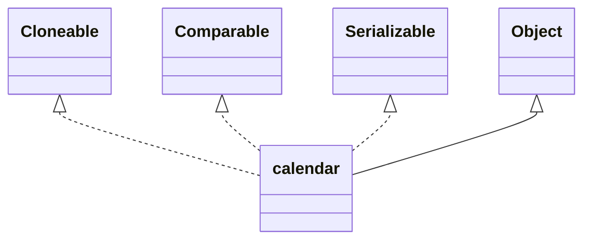

- calendar 是一个抽象类。构造方法私有，通过getInstance() 获取对象实例；
- 没有对应的格式化类，需要程序员自己组合输出格式；

```java
public class Calendar_ {
    public static void main(String[] args) {
        Calendar c = Calendar.getInstance();

        System.out.println(c);

        System.out.println(c.get(Calendar.DATE));
        System.out.println(c.get(Calendar.YEAR) + 1); // 月默认从 0 开始
        System.out.println(c.get(Calendar.MONTH));
        System.out.println(c.get(Calendar.DAY_OF_MONTH));
        System.out.println(c.get(Calendar.HOUR));
        System.out.println(c.get(Calendar.MINUTE));
        System.out.println(c.get(Calendar.SECOND));
    }
}

```

### LocalDateTime (Version 3)

#### 前两代缺点

- 偏移性：Date 年份从1970 年开始，而 Calendar 月份是从 0 开始；
- 格式化：Date 能格式化，Calendar 不能格式化；
- 安全性：两个都不是线程安全的，且都不能处理闰秒（每隔 2 天，多 1 秒）；
- 可变性：日期和时间应该是不可变的；

从 Java8 开始引入了第三代日期类，提供三个类：

1. LocalDate 包含年月日
2. LocalTime 包含时分秒
3. LocalDateTime 包含日期和时间

#### 获取日期时间

返回当前日期时间。

```java
public class Version3 {
    public static void main(String[] args) {
        LocalDateTime ldt = LocalDateTime.now();
        System.out.println(ldt);

        System.out.println(ldt.getYear());
        System.out.println(ldt.getMonthValue());
        System.out.println(ldt.getDayOfMonth());
        System.out.println(ldt.getHour());
        System.out.println(ldt.getMinute());
        System.out.println(ldt.getSecond());
        System.out.println(ldt.getNano());
        System.out.println(ldt.getDayOfWeek());
    }
}
```

#### 格式化

使用 DateTimeFormatter 类进行格式化。占位符参阅官方手册。

```java
DateTimeFormatter dtf = DateTimeFormatter.ofPattern("yyyy年MM月dd日 HH小时mm分钟ss秒");
String res = dtf.format(ldt);
System.out.println(res);
```

#### 更多方法

- 判断闰年；
- plus 加值；

更多的阅读源码或手册...

## Cellections 类

Collections 是一个操作 Set、List 和 Map 等集合的工具类。提供了一系列静态方法对几何元素进行排序、查询和修改等操作。

| 方法名     | 返回类型 | 参数类型                     | 作用                                      |
| ---------- | -------- | ---------------------------- | ----------------------------------------- |
| reverse    | void     | List                         | 翻转 List 中的元素                        |
| shuffle    | void     | List                         | 随机排序 List 中的元素                    |
| sort       | void     | List                         | 升序                                      |
| sort       | void     | List, Comparator             | 自定义排序                                |
| swap       | void     | List, int, int               | 交换指定位置的两个元素                    |
| max / min  | Object   | Collection                   | 根据元素自然排序，返回集合中最大 / 小元素 |
| max / min  | Object   | Collection                   | 根据元素定义排序，返回集合中最大 / 小元素 |
| frequency  | int      | Collection, Object           | 返回集合中指定元素的出现次数              |
| copy       | void     | List dest, List src          | 将 src 拷贝到 dest                        |
| replaceAll | boolean  | List, Object old, Object new | 将 List 中所有 old 替换为 new             |

# 集合

> 集合：多种数据放在一起。

## 数组过度到集合

### 数组缺点

1. 长度事先指定，后期不能更改；
2. 保存的元素必须为同一类型；
3. 数组元素的增加和删除比较麻烦。

### 集合优点

1. **动态保存**任意多个对象；
2. 提供一系列操作对象的方法。

## 集合框架体系

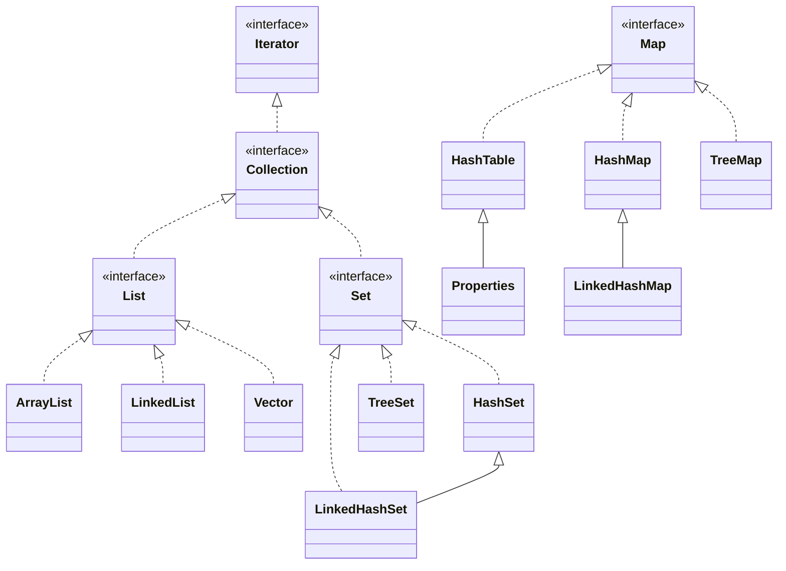

## Iterator 接口

集合的迭代器，Collection 实现了 Iterator 迭代器接口。Iterator 接口提供方法，供遍历集合使用。

### 常用方法

迭代器初始指向集合首元素的之前，所以第一个 next() 是集合的第 1 个元素。

| 方法名  | 返回类型 | 参数类型 | 作用                                         |
| ------- | -------- | -------- | -------------------------------------------- |
| hasNext | boolean  | void     | 判断迭代器下一位置是否还有元素               |
| next    | \<E>     | void     | 1. 将迭代器后移<br />2. 返回移动后位置的元素 |

注意：在调用 next 之前，先调用 hasNext 判断是否有元素，防止抛出异常。

## Collection 接口

### 常用方法

| 方法名      | 返回类型     | 参数类型   | 作用                                   |
| ----------- | ------------ | ---------- | -------------------------------------- |
| size        | int          | void       | 返回集合中元素个数                     |
| isEmpty     | boolean      | void       | 返回集合是否为空                       |
| contains    | boolean      | Object     | 判断制定元素是否存在                   |
| add         | boolean      | Object     | 添加单个元素                           |
| remove      | boolean      | Object     | 删除指定某个元素（如有多个，只删一次） |
| clear       | void         | void       | 清空集合元素                           |
| addAll      | boolean      | Collection | 添加多个元素                           |
| containsAll | boolean      | Collection | 判断是否包含多个元素                   |
| removeAll   | boolean      | Collection | 删除多个元素                           |
| iterator    | Iterator\<E> | void       | 返回一个迭代器                         |

### 遍历方式

#### Iterator 迭代器

```java
public class Collection02 {
    @SuppressWarnings({"all"})
    public static void main(String[] args) {
        ArrayList arrayList = new ArrayList();
        arrayList.add("zxb");
        arrayList.add(22);
        arrayList.add(true);

        Iterator iterator = arrayList.iterator();
        // 迭代器 while 遍历快捷关键词 itit
        while (iterator.hasNext()) {
            System.out.println(iterator.next());
        }

        // 迭代器遍历完不会归零，再次遍历需要重新申请迭代器对象
        iterator = arrayList.iterator();
        while (iterator.hasNext()) {
            Object next =  iterator.next();
            System.out.println(next);
        }
    }
}
```

#### 增强 for 循环

增强 for 循环是简化版的 Iterator，底层调用 Iterator ，适用于遍历集合或数组。

```java
ArrayList arrayList = new ArrayList();
arrayList.add("zxb");
arrayList.add(22);
arrayList.add(true);

for (Object obj : arrayList) {
    System.out.println(obj);
}
```

## List 接口

### 特点

- 元素有序：指添加和取出的顺序一致；
- 元素可重复；
- 元素可索引：每个元素都有对应的顺序索引（从 0 开始），**底层是数组**；
- List 容器中的元素都对应一个整数型序号记录所在容器的位置，可以根据序号存取容器中的元素；

### 常用方法

| 方法名      | 返回类型 | 参数类型        | 作用                                             |
| ----------- | -------- | --------------- | ------------------------------------------------ |
| add         | void     | int, Object     | 在索引位置开始插入                               |
| add         | void     | Object          | 在最后插入                                       |
| addAll      | void     | int, Collection | 在索引位置开始插入集合                           |
| addAll      | void     | Collection      | 在最后插入集合                                   |
| get         | Object   | int             | 返回指定索引位置的元素                           |
| indexOf     | int      | Object          | 返回指定元素在集合中的首位置                     |
| lastIndexOf | int      | Object          | 返回指定元素在集合中的尾位置                     |
| remove      | boolean  | int             | 返回指定索引位置的元素，返回被删除的元素         |
| set         | \<E>     | int, Object     | 将指定索引位置的元素替换成新的，返回被替换的元素 |
| subList     | List     | int, int        | 返回指定索引区间 $[l, r)$ 的子集合               |

### 遍历方式

1. Iterator 迭代器；
2. 增强版 for 循环；
3. 普通版 for 循环 + get() 方法。

### 排序

```java
public static void sort(List list) {
    for (int i = 0; i < list.size() - 1; i ++) {
        for (int j = i + 1; j < list.size(); j ++) {
            Book book1 = (Book)list.get(i);
            Book book2 = (Book)list.get(j);

            if (book1.getPrice() > book2.getPrice()) {
                list.set(i, book2);
                list.set(j, book1);
            }
        }
    }
}
```

## ArrayList 类

###  特性

- 元素可以是任何数据类型，包括空值，可以重复元素；
- ArrayList 底层实现是对象数组；
- ArrayList $\approx$ Vector，除了 ArrayList 是线程不安全的（效率较高），不适合多线程场景。

### 底层机制

- 底层实现是 Object 类型的数组 `elementData`，被 transient 修饰，表示该属性不会被**序列化**；

### 扩容机制

- 使用无参构造器创建对象时，初始容量为 0，**初次添加元素时扩容为 10**；
- 使用有参构造器创建对象时，初始容量为参数值；
- 无论如何构造，每当容量达到上限后扩容为原来的 1.5 倍（除了无参构造的对象首次扩容） 。

```java
private void grow(int minCapacity) {
    // overflow-conscious code
    int oldCapacity = elementData.length;
    int newCapacity = oldCapacity + (oldCapacity >> 1);
    if (newCapacity - minCapacity < 0)
        newCapacity = minCapacity;
    if (newCapacity - MAX_ARRAY_SIZE > 0)
        newCapacity = hugeCapacity(minCapacity);
    // minCapacity is usually close to size, so this is a win:
    elementData = Arrays.copyOf(elementData, newCapacity);
}
```

## Vector 类

### 特性

1. 底层是对象数组；
2. 线程安全：Vector 类的方法带有 `synchronized` ，是线程同步的，适合**多线程**；
3. 因为同步机制的原因，导致 Vector 比 ArrayList 效率稍低。

### 扩容机制

- 如果构造是无参的，初始容量为10，每当容量达到上限后扩容为原来的 2 倍；
- 如果构造是有参的，初始容量为参数值，每当容量达到上限后扩容为原来的 2 倍。

```java
private void grow(int minCapacity) {
    // overflow-conscious code
    int oldCapacity = elementData.length;
    int newCapacity = oldCapacity + ((capacityIncrement > 0) ?
                                     capacityIncrement : oldCapacity);
    if (newCapacity - minCapacity < 0)
        newCapacity = minCapacity;
    if (newCapacity - MAX_ARRAY_SIZE > 0)
        newCapacity = hugeCapacity(minCapacity);
    elementData = Arrays.copyOf(elementData, newCapacity);
}
```

### Vector VS ArrayList

|          | ArrayList                                                   | Vector                                                       |
| -------- | ----------------------------------------------------------- | ------------------------------------------------------------ |
| 底层结构 | 可变数组                                                    | 可变数组                                                     |
| 起源版本 | JDK1.2                                                      | JDK1.0                                                       |
| 线程安全 | 不安全                                                      | 安全                                                         |
| 效率     | 效率高                                                      | 效率低                                                       |
| 扩容倍数 | 有参构造器 1.5 倍。无参构造器，第一次扩容为 10，满后 1.5 倍 | 有参构造器 2 倍。无参构造器，第一次扩容为 10，满后 2 倍扩容。 |

## LinkedList 类

### 特性

- LinkedList 底层实现了双向链表和双端队列；
- 可以添加任意元素，包括重复和 null；
- 线程不安全，没有同步处理。

### 底层机制

- 底层维护的是一个双向链表，适合**添加和删除**密集型操作，不需要考虑扩容问题，效率较高；
- LinkedList 维护两个属性 first 和 last，分别指向双向链表的头尾结点；
- 每个结点又是一个内部类 Node 的对象，其中包含 prev, next, item 三个属性。

### 字段

| 字段名 | 属性 |
| ------ | ---- |
| size   | int  |
| first  | Node |
| end    | Node |

### 常用方法

| 方法名 | 返回类型 | 参数类型    | 作用                       |
| ------ | -------- | ----------- | -------------------------- |
| add    | boolean  | E           | 尾插法添加元素             |
| remove | Object   | int         | 删除指定索引的元素         |
| remove | Object   | Object      | 删除指定对象的元素         |
| remove | Object   | void        | 删除头结点                 |
| set    | void     | int, Object | 修改指定索引位置的元素的值 |
| get    | Object   | int         | 返回指定索引位置的值       |

### 遍历方式

实现了 List 接口，可以使用三种方式遍历。

### ArrayList VS LinkedList

|            | 底层结构 | 增删效率 | 改查效率 |
| ---------- | -------- | -------- | -------- |
| ArrayList  | 可变数组 | 较低     | 较高     |
| LinkedList | 双向链表 | 较高     | 较低     |

## Set 接口

### 特性

- 无序，添加与取出的顺序不一致，但取出顺序总是一致，没有索引；
- 不允许重复元素。

### 遍历方法

1. 迭代器；
2. 增强版 for 循环。

### 常用方法

| 方法名   | 返回类型 | 参数类型 | 作用             |
| -------- | -------- | -------- | ---------------- |
| add      | boolean  | E        | 添加元素         |
| remove   | boolean  | Object   | 删除元素         |
| contains | boolean  | Object   | 查询元素是否存在 |

## HashSet 类

### 特性

- 不能重复对象 或 元素；
- 可以有 null 值；
- 无序；

### 底层机制

- 底层由 HashMap 实现；
- HashMap 底层是数组 + 链表 + 红黑树；数组和链表组成邻接表；
- 通过调用 hash() 方法计算元素的哈希值得到所在数组的索引值；
  - 如果索引位置无结点，直接添加当前元素；
  - 如果索引位置有结点，判断是否有重复元素（**判重标准**：对象相同或对象内容 equals() 相同）。
    - 如果有重复元素，放弃添加；
    - 如果无重复元素，加到末尾。 
- 在 Java8 中，当一条链表长度 $>$ 8 ，并且 table 数组的大小 $\geq$ 64 时，就会进化为红黑树；
- 当链表长度到达阈值，数组未达到时，会先按 2 倍扩容数组；
- table 初始容量为 16，阈值系数为 0.75，达到阈值执行 2 倍扩容；

```java
public class hashSet_ {
    public static void main(String[] args) {
        HashSet objects = new HashSet();

        objects.add(null);
        objects.add(null);
        objects.add(new Dog("tom"));
        objects.add(new Dog("tom"));

        System.out.println(objects); // [null, Dog{name='tom'}, Dog{name='tom'}]
        
        objects.add(new String("zxb"));
        objects.add(new String("zxb"));
        System.out.println(objects); // [null, Dog{name='tom'}, Dog{name='tom'}, zxb]
    }
}
```

#### 创建 HashSet 对象过程

创建 HashSet 对象实际上是在 HashSet 对象内创建一个 HashMap 对象。

#### 首次添加元素过程

1. HashSet 对象调用add() 方法，返回布尔值表示添加结果；

   ```java
   objects.add(null);
   ```

2. HashSet.add() 调用 map.put(E, PRESENT) 方法；

   ```java
   public boolean add(E e) {
       return map.put(e, PRESENT)==null;
   }
   ```

3. HashMap.put(K, V) 方法调用 HashMap.putVal() 方法；

   ```java
   public V put(K key, V value) {
       return putVal(hash(key), key, value, false, true);
   }
   ```

4. hash() 方法调用 hashCode() 方法，通过算法得到优化的哈希值；

   ```java
   static final int hash(Object key) {
       int h;
       return (key == null) ? 0 : (h = key.hashCode()) ^ (h >>> 16);
   }
   ```

5. HashMap.putValue() 执行元素添加逻辑；

   ```java
   final V putVal(int hash, K key, V value, boolean onlyIfAbsent,
                      boolean evict) {
       // 临时变量
       Node<K,V>[] tab; Node<K,V> p; int n, i;
       // 如果 数组为空 或 长度为 0，执行首次扩容
       if ((tab = table) == null || (n = tab.length) == 0)
           n = (tab = resize()).length;
       // 如果索引位置没有对象，直接将元素的 Node 对象加入指定索引
       if ((p = tab[i = (n - 1) & hash]) == null)
           tab[i] = newNode(hash, key, value, null);
       else {
           Node<K,V> e; K k;
           // 判重条件：首先，索引相同；其次，对象相同或调 equals() 内容相同。
           // equals() 方法可以根据自己重写规则判定
           if (p.hash == hash &&
               ((k = p.key) == key || (key != null && key.equals(k))))
               e = p;
           // 判断索引首结点 p 是不是红黑树，如果是的话按照树比较
           else if (p instanceof TreeNode)
               e = ((TreeNode<K,V>)p).putTreeVal(this, tab, hash, key, value);
           else { // 循环判断索引所在链表剩余结点
               for (int binCount = 0; ; ++binCount) {
                   if ((e = p.next) == null) {
                       p.next = newNode(hash, key, value, null);
                       // 添加后，判断链表长度大于 8，达到转化为红黑树
                       if (binCount >= TREEIFY_THRESHOLD - 1) // -1 for 1st
                           treeifyBin(tab, hash);
                       break;
                   }
                   if (e.hash == hash &&
                       ((k = e.key) == key || (key != null && key.equals(k))))
                       break;
                   p = e;
               }
           }
           // 索引所在链表存在相同元素的结点
           if (e != null) { // existing mapping for key
               V oldValue = e.value;
               if (!onlyIfAbsent || oldValue == null)
                   e.value = value;
               afterNodeAccess(e);
               // 返回重复元素的值
               return oldValue;
           }
       }
       ++modCount;
       // 添加结点后，数组容量如果达到阈值，执行再次扩容（2 倍）
       if (++size > threshold)
           resize();
       afterNodeInsertion(evict);
       // 添加成功返回 null
       return null;
   }
   ```

#### 数组扩容机制

- 首次扩容为 16，阈值系数为 0.75；
- 所有链表的结点个数之和 $>$ 阈值，数组扩容为原来的 2 倍，不是数组占用数达到阈值才扩容；
- 当单个链表元素大于 8 ，数组容量 < 64 时，触发数组扩容；

```java
final Node<K,V>[] resize() {
   Node<K,V>[] oldTab = table;
   int oldCap = (oldTab == null) ? 0 : oldTab.length;
   int oldThr = threshold;
   int newCap, newThr = 0;
   if (oldCap > 0) {
       if (oldCap >= MAXIMUM_CAPACITY) {
           threshold = Integer.MAX_VALUE;
           return oldTab;
       }
       else if ((newCap = oldCap << 1) < MAXIMUM_CAPACITY &&
                oldCap >= DEFAULT_INITIAL_CAPACITY)
           newThr = oldThr << 1; // double threshold
   }
   else if (oldThr > 0) // initial capacity was placed in threshold
       newCap = oldThr;
   else {               // zero initial threshold signifies using defaults
       newCap = DEFAULT_INITIAL_CAPACITY; // 16
       newThr = (int)(DEFAULT_LOAD_FACTOR * DEFAULT_INITIAL_CAPACITY); // * 0.75
   }
   if (newThr == 0) {
       float ft = (float)newCap * loadFactor;
       newThr = (newCap < MAXIMUM_CAPACITY && ft < (float)MAXIMUM_CAPACITY ?
                 (int)ft : Integer.MAX_VALUE);
   }
   threshold = newThr;
   @SuppressWarnings({"rawtypes","unchecked"})
       Node<K,V>[] newTab = (Node<K,V>[])new Node[newCap];
   table = newTab;
   if (oldTab != null) {
       for (int j = 0; j < oldCap; ++j) {
           Node<K,V> e;
           if ((e = oldTab[j]) != null) {
               oldTab[j] = null;
               if (e.next == null)
                   newTab[e.hash & (newCap - 1)] = e;
               else if (e instanceof TreeNode)
                   ((TreeNode<K,V>)e).split(this, newTab, j, oldCap);
               else { // preserve order
                   Node<K,V> loHead = null, loTail = null;
                   Node<K,V> hiHead = null, hiTail = null;
                   Node<K,V> next;
                   do {
                       next = e.next;
                       if ((e.hash & oldCap) == 0) {
                           if (loTail == null)
                               loHead = e;
                           else
                               loTail.next = e;
                           loTail = e;
                       }
                       else {
                           if (hiTail == null)
                               hiHead = e;
                           else
                               hiTail.next = e;
                           hiTail = e;
                       }
                   } while ((e = next) != null);
                   if (loTail != null) {
                       loTail.next = null;
                       newTab[j] = loHead;
                   }
                   if (hiTail != null) {
                       hiTail.next = null;
                       newTab[j + oldCap] = hiHead;
                   }
               }
           }
       }
   }
   return newTab;
}
```

## LinkedHashSet 类

### 特性

- LinkedHashSet 是 HashSet 的子类；
- LinkedHashSet 底层是 LinkedHashMap 类，该类的底层实现是数组 + 双链表;
- LinkedHashSet 不允许添加重复元素；
- LinkedHashSet 元素有序。

### 底层实现

- LinkedHashSet 继承了 HashSet，底层实现是LinkedHashMap；
- HashMap\$Node 的 table 数组存储的类型为 LinkedHashMap\$Entry
- LinkedHashSet 的添加元素还是靠 HashMap 类的 putValue 实现，只不过多了调用 LinkedHashMap 的 afterNodeAccess 方法实现将所有结点按照添加顺序串联到双向链表中；
- 双链表结点还是和 HashSet 一样根据 hashCode() 确定索引位置；
- 还是根据 equals 判重。

## TreeSet 类

### 特性

- TreeSet 在构造的时候传入一个比较器 Comparator，指定排序规则，**实现排序**。
- 使用无参构造器时，仍然无序。
- TreeSet 底层是 TreeMap，TreeMap 是二分查找树。
- 不允许 null 值。

### 添加过程

1. 判断树是否为空。
2. 从根节点开始遍历树，从树上找到最接近待加入的结点。
3. 判断待加入结点属于左还是右。

## Map 接口

### 特性

- Map 与 Collection 并列存在，用于保存具有映射关系的数据 <Object Key, Object Value>
- 存取无序；
- Key 不能重复，Value 可以重复；当添加的键值对的 Key重复时，更新 Value；
- 键值对是唯一的，每个 Key 都有独一无二的 Value。
- 线程不安全，未做同步。

## HashMap 类

### 底层机制

- HashMap 内有一个静态内部类 Node，包含 hash, key, value, next 属性；

- 键值对放在 Node 对象内；

- 为了方便遍历，HashMap 有一 个Map.Entry\<K, V\> 类型的集合 EntrySet；而 entrySet 集合对象实际存储的是 HaspMap\$Node 类型的对象，因为 HaspMap\$Node 实现了 Map.Entry 接口；

- SetEntry 集合中的 HashMap\$Node **引用**了 HashMap\$Node 对象（经过调试发现两者对象地址一样）。

- 除此之外，类似的 HashMap 中还有内部类 KeySet 和 Values 集合，以分别方便遍历 Key 和 Value。


### 常用方法

| 方法名      | 返回类型 | 参数类型 | 作用                  |
| ----------- | -------- | -------- | --------------------- |
| put         | boolean  | K, V     | 添加键值对            |
| containsKey | boolean  | K        | 查找键是否存在        |
| remove      | V        | K        | 根据 key 删除映射关系 |
| get         | V        | K        | 根据 key 获取 value   |
| size        | int      | void     | 返回键值对个数        |
| isEmpty     | boolean  | void     | 判断是否为空          |
| clear       | void     | void     | 清除所有键值对        |

### 遍历方式

#### KeySet 集合

1. 用 keySet 取出所有 Key 然后用增强 for 循环 + get() 获取所有 Key 对应的 Value；
2. 迭代器得到 Key，再用 get() 获取 Value；

#### Values 集合

1. 用 Values 取出所有 value 然后增强 for 循环输出；
2. 用 Values 取出所有 value 然后迭代器；

#### EntrySet 集合

1. 用 EntrySet 取出所有键值对，用增强 for 循环；
2. 用 EntrySet 取出所有键值对，用迭代器遍历。

#### 演示代码

```java
public class Map03 {
    public static void main(String[] args) {
        HashMap hashMap = new HashMap();
        hashMap.put(1, "zxb");
        hashMap.put(2, "zxb");
        hashMap.put(3, "zxb");
        // fun 1
        Set keySet = hashMap.keySet();
        for (Object key : keySet) {
            Object value = hashMap.get(key);
            System.out.println(key + " " + value);
        }
        // fun 2
        Iterator iterator1 = keySet.iterator();
        while (iterator1.hasNext()) {
            Object key =  iterator1.next();
            System.out.println(key + " " + hashMap.get(key));
        }
        // fun 3
        Collection values = hashMap.values();
        for (Object value : values) {
            System.out.println(value);
        }
        // fun 4
        Iterator iterator2 = values.iterator();
        while (iterator2.hasNext()) {
            Object value =  iterator2.next();
            System.out.println(value);
        }
        // fun 5
        Set entrySet = hashMap.entrySet();
        for (Object obj : entrySet) {
            Map.Entry entry = (Map.Entry)obj;
            System.out.println(entry.getKey() + " " + entry.getValue());
        }
        // fun 6
        Iterator iterator3 = entrySet.iterator();
        while (iterator3.hasNext()) {
            Object obj =  iterator3.next();
            System.out.println(obj.getClass());
            Map.Entry entry = (Map.Entry)obj;
            System.out.println(entry.getKey() + " " + entry.getValue());
        }
    }
}
```

### 扩容机制

> 与 HashSet 一样

## Hashtable 类

### 特性

- 存放键值对
- 键和值都不能为 null
- 使用方法与 HashMap 基本一样
- 线程安全
- 当 key 重复时，替换 value

### 扩容机制

- 底层有一个数组 `Hashtable$Entry[]` 初始容量为 $11$，初始阈值为 $8 = 11 * 0.75$。
- 当达到阈值后，触发扩容，扩容为原来的 $2$ 倍再加 $1$。

### 底层机制

- 底层数据结构是数组 + 链表
- 新元素的添加采用头插法

### HashMap VS Hashtable

|              | HaspMap | Hashtable |
| ------------ | ------- | --------- |
| 起源版本     | 1.2     | 1.0       |
| 线程安全     | 不安全  | 安全      |
| 效率         | 高      | 较低      |
| 允许 null 值 | 允许    | 不允许    |

## Properties 类

### 特性

- Properties 类继承于 Hashtable 类，实现了 Map 接口。
- 使用键值对存储数据，值不能为 null。
- 主要用于从 `*.properties` 文件中，加载数据到 Properties 类对象，并进行读取和修改。
- `*.properties` 文件通常作为配置文件。

### 底层机制

- 调用 Hashtable 的 put 方法进行添加元素。

## TreeMap 类

### 特性

- 存储键值对，键或值都不允许 null 值。
- key 唯一，重复添加更新 value，并返回 oldValue。
- 可以通过构造时传入 Comparator 类实现排序，是 TreeSet 的底层实现。

### 判重机制

- 如果该对象是 Comparator 构造的，根据实现的 compare() 方法返回值进行判断，如果为 0，说明重复。
- 如果该对象是无参构造的，根据添加的对象实现的 Compareable 接口的 compareTo() 去重。

## 集合选型


老韩强调：阅读源码的能力！

# 泛型

## 引入泛型

> 目前有如下需求：
>
> 1. 用 ArrayList 对象存储三个 Dog 类对象，Dog 类包含 name 和 age 字段；
> 2. 遍历 ArrayList 对象，输出每个 Dog 类对象的 name 和 age；

使用传统方法有如下缺点：

1. 不能对加入集合 ArrayList 中的元素的数据类型进行约束（不安全）；
2. 遍历对象时需要进行类型转换，步骤繁琐；

引入泛型**约束集合存放元素的数据类型**能完美解决上面的缺点。

```java
ArrayList arrayList = new ArrayList();
arrayList.add(new Dog("wangwang", 15));
arrayList.add(new Dog("laixi", 5));
arrayList.add(new Dog("laifu", 5));
for (Object o : arrayList) {
    Dog dog = (Dog) o;
    System.out.println(dog.getName() + " " + dog.getAge());
}

/*
    1. 程序员可能不小心添加一只猫到 ArrayList 中，可以使用泛型对数组的对象进行限制
    2. 编历时需要额外的向下转型
        -->引出泛型
 */

ArrayList<Dog> dogs = new ArrayList<>();
dogs.add(new Dog("wangwang", 15));
dogs.add(new Dog("laixi", 5));
dogs.add(new Dog("laifu", 5));
for (Dog dog : dogs) {
    System.out.println(dog.getName() + " " + dog.getAge());
}
```

- 泛型又称参数化类型，是 JDK5.0 出现的新特性，解决数据类型的安全问题。
- 在类的声明和实例化时需要指定具体数据类型，在编译期间就确定数据类型。
- 泛型保证，如果程序在编译时无警告，那么运行时也不会产生 ClassCastException 异常。
- 使用泛型可以使得代码更简洁和健壮，提高代码复用性。
- 泛型的作用：可以在类声明时，通过一个标识表示类中某个**属性**、**返回值**和**参数**的类型。

## 使用泛型

### 泛型的声明

```java
interface interfaceName<T> {}

class className<K, V> {}
```

1. T、K 和 V 不代表值，代表类型。
2. 泛型可以使用任意的字母，常用 T (Type) 。

### 泛型的实例化

```java
ArrayList<Dog> dogs = new ArrayList<>();

Iterator<Customer> iterator = customers.iterator();
```

### 使用细节

- 泛型只能是**引用类型**，不能是基本数据类型。

- 在指定泛型具体类型后，可以传入**本类型和其子类型**。

- 泛型可以简写，可只在变量声明时（等号左）指定泛型，对象实例化时（等号右）可省略。

  ```java
  HashMap<String, Student> hashMap = new HashMap<>();
  ```

- 如果不指定泛型类型，则默认为 Object。

  ```java
  HashMap hashMap = new HashMap();
  HashMap<Object, Object> hashMap = new HashMap<Object, Object>();
  ```

## 自定义泛型

自定义泛型：给自己写的类或接口定义泛型。

### 语法

```java
class 类名 / 接口名 <T, ...> {
   	修饰符 <T, ...> 方法名(参数列表) {
        
    }
}
```

### 自定义泛型类细节

1. 成员属性和方法都可以使用泛型。
2. 数组使用泛型之后，不能初始化。因为在未指定泛型类型时，编译器不知道要给数组分配多少空间。
3. 类的静态成员不能使用泛型。静态成员与类同时加载，未实例化对象时，同样无法获取泛型类型。
4. 泛型类的类型，在**实例化对象**时确定。
5. 如果未指定泛型类型，默认为 Object。

### 自定义泛型接口细节

1. 接口的静态成员不能使用泛型，原因与类的静态成员一样。
2. 泛型接口的类型，在**继承接口**或**实现接口**时确定。
3. 如果未指定泛型类型，默认为 Object。

### 自定义泛型方法细节

1. 泛型方法可以定义在普通类中，也可以定义在泛型类中。
2. 当泛型方法被调用时，编译器根据实参类型确定泛型类型。
3. 方法的修饰符后没有 <> 说明不是泛型方法，而是**方法使用了泛型**。
4. 泛型方法的泛型类型的作用于仅在该方法内。

## 泛型通配符

泛型不具有继承性，可以使用通配符对泛型类型进行约束。

1. `<?>` 表示支持任意泛型类型。
2. `<? extends A>` 表示支持 A 类以及 A 类的子类（规定了泛型的上限）。
3. `<? super A>` 表示支持 A 类以及 A 类的父类**们**（规定了泛型的下限）。

# 线程

## 基本概念

- 程序：为完成某种任务，编写的指令的集合。
- 进程：运行中的程序是动态过程。有自身产生、存在和消亡的过程。
- 线程：线程是进程创建的一个实体，一个进程可以拥有多个线程。
- 单线程：同一个时刻，只能执行一个线程。
- 多线程：同一个时刻，可以执行多个线程。
- 并发：同一时刻，多个任务交替执行，产生 “同时执行多个任务” 的错觉。（单核 CPU）
- 并行：同一时刻，多个任务同时执行。（多核 CPU）
- 并发混合并行：任务数 $>$ 进程数。
- 超线程：通常为 2 个逻辑线程共享 1 个物理核心，能够优化并发，让线程交替执行更高效。

## 线程使用

在 Java 中，线程使用有两种方法：

1. 继承 Thread 类，重写 run 方法。
2. 实现 Runnable 接口，重写 run 方法。

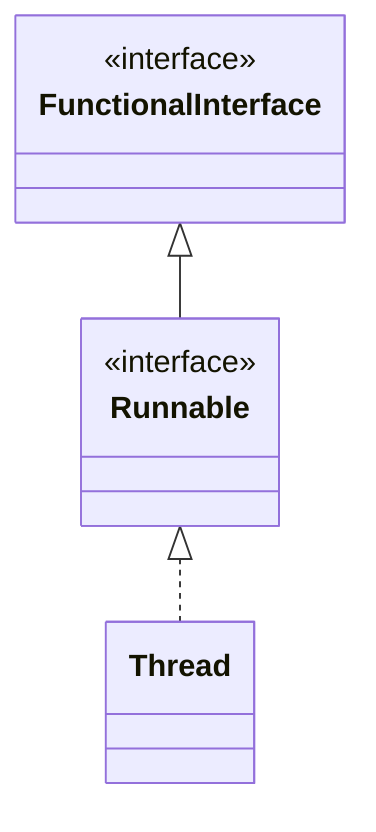

## Thread 类

### 线程创建

1. 调用 start 方法，启动一个新线程

  ```java 
  public synchronized void start() {
  	start0();
  }
  ```

2. 底层是 start0 本地方法，由 JVM 调用，底层由 C/C++ 实现

  ```java
  private native void start0();
  ```

注：调用 start0 方法之后，线程变成了可运行状态，线程不一定会立即执行。执行时机取决于 CPU 调度。

### 代码演示

```java
public class Thread01{
    public static void main(String[] args) {
        Cat cat1 = new Cat();
        cat1.start();
    }
}

class Cat extends Thread {
    @Override
    public void run() {
        int times = 80;
        while (-- times >= 0) {
            System.out.println("Hello~" + Thread.currentThread().getName());
            try {
                Thread.sleep(1000);
            } catch (InterruptedException e) {
                throw new RuntimeException(e);
            }
        }
    }
}
```

## Runnable 接口

> Java 是单继承的，某个类已经继承别的类，如果还需要使用多线程，那么就只能实现接口了。

### 代理模式

实现 Runnable 类的对象在创建线程时不能直接调用 start() 方法，需要把源对象作为参数创建一个 Thread 类的对象，再执行 start() 方法。

### 代码演示

```java
public class Thread02 {
    public static void main(String[] args) {
        Dog dog = new Dog();
        // 静态代理模式
        Thread thread = new Thread(dog);
        thread.start();
    }
}

class Dog implements Runnable {
    @Override
    public void run() {
        int cnt = 0;
        while (cnt ++ < 6) {
            System.out.println("汪~" + Thread.currentThread().getName());
            try {
                Thread.sleep(1000);
            } catch (InterruptedException e) {
                throw new RuntimeException(e);
            }
        }
    }
}
```


