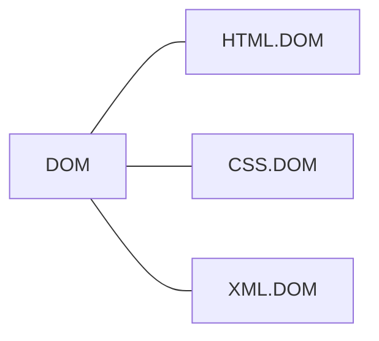
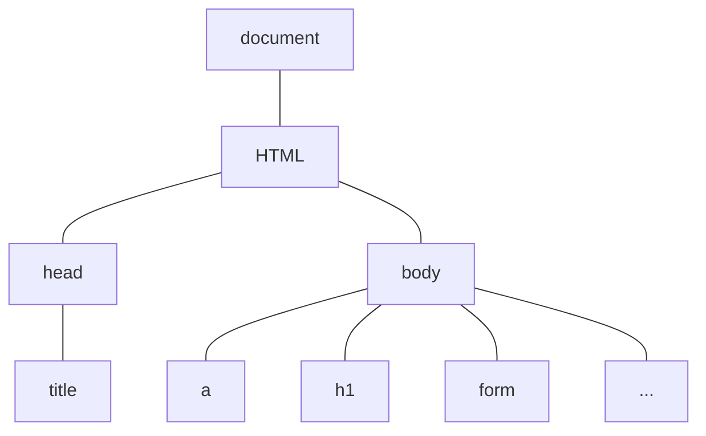
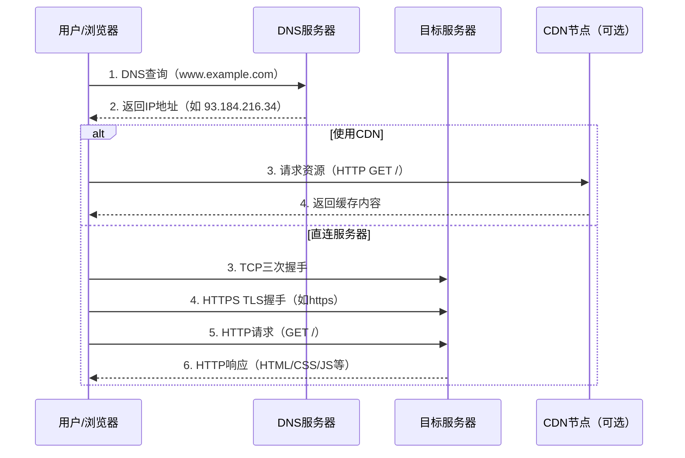
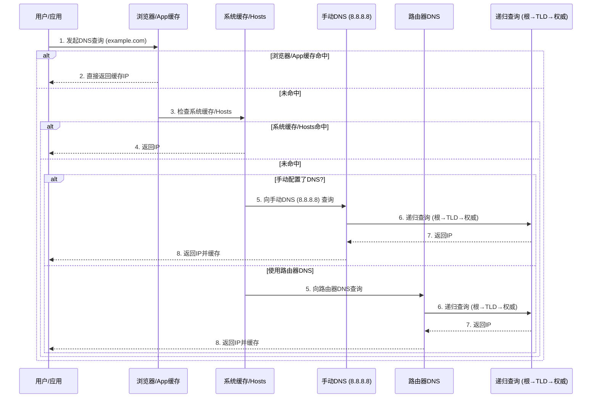
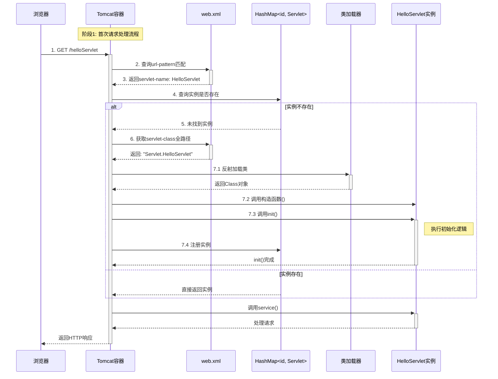
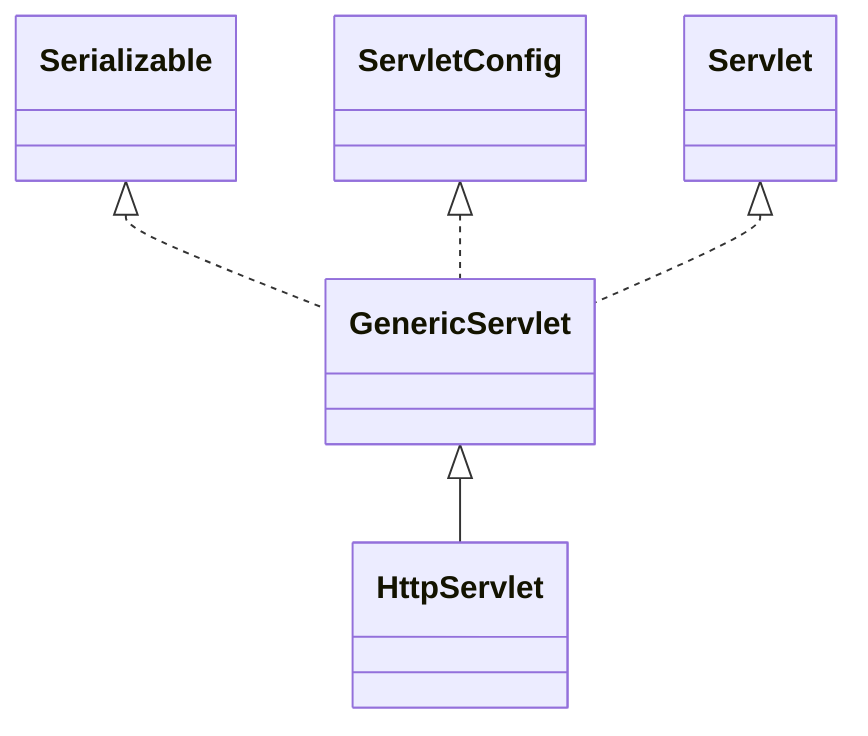
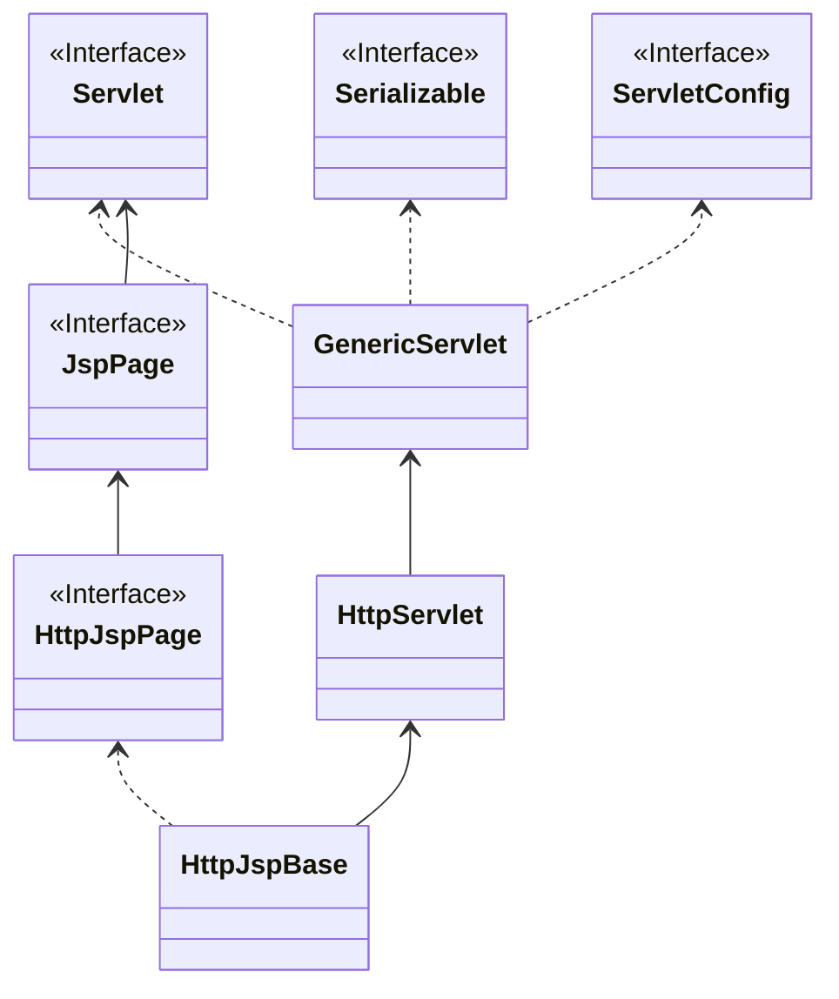

# JavaWeb

# HTML

> Hyper Text Marked Language 超文本标记语言

## 标签和元素

- 标签：用尖括号括起来 <>，一般为双标签\<html> \</html>，也有单标签 \<br/>
- 元素：尖括号括起来的叫元素

## 标签细节

- 标签不能交叉嵌套
- 注释不能嵌套
- 标签必须正确关闭
- HTML 语法严谨性：标签闭合、属性加双引号

## 字体标签

font 标签有三个基本属性：

1. size 字体大小
2. color 字体颜色
3. face 字体类型

## 字符实体

字符实体把符号转化为**文本**

| 显示结果 | 实体名称 | 实体编号 |
| -------- | -------- | -------- |
| 空格     | \&nbsp;  |          |
| <        | \&lt;    |          |
| >        | \&gt;    |          |
| &        | \&amp;   |          |
| "        | \&quot;  |          |
| '        | \&apos;  |          |

## 标题标签

\<h1> ~ \<h6> 从大到小

| 属性  | 作用     | 值                |
| ----- | -------- | ----------------- |
| align | 对齐方式 | left right center |

## 超链接标签

本标签页打开

```html
<a href="https://bing.com" target="_self">必应</a>
```

新标签页打开

```html
<a href="https://bing.com" target="_blank">必应 </a>
```

邮箱地址

```html
<a href="mailto:tom@163.com">联系邮箱</a>
```

## 列表标签

### 无序列表 ul

```html
<ul type="无序类型">
  <li>列表内容</li>
  <li>...</li>
</ul>
```

- disc 实心圆
- circle 空心圆
- square 空心正方形

### 有序列表 ol

```html
<ol type="有序类型" start="1">
  <li>...</li>
</ol>
```

1. A
2. a
3. 1
4. i
5. I

默认从第一个开始

## 图像标签

```html

```

- src 绝对路径和相对路径，绝对路径使用 URL 访问而不是盘符定位
- 仅指定高度或宽度，另一边会根据宽高比缩放
- board 边框厚度
- alt 图片找不到时提示的文字 

## 表格标签

常用标签：

- \<tr> 代表行，列数由 \<th>/\<td> 决定
- \<th> 代表表头单元格
- \<td> 代表普通单元格

常用属性：

- cellspacing 单元格间距
- cellpadding 单元格内容与边框的距离
- align 水平对齐方式
- border 边框宽度
- bordercolor 边框颜色

### 普通表格

```html
<table width="500" board="5" align="center">
  <tr>
    <th>Name</th>
    <th>Phone</th>
  </tr>
  <tr>
    <td>zxb</td>
    <td>19990079994</td>
  </tr>
</table>
```

### 跨行跨列

```html
<table border="5" bordercolor="red" align="center" width="500">
    <tr>
        <td colspan="3" align="center">合并3列</td>
    </tr>
    <tr>
        <td rowspan="2">合并两行，占位下n-1行</td>
        <td>2,2</td>
        <td>2,3</td>
    </tr>
    <tr>
        <td>3,2</td>
        <td>3,3</td>
    </tr>
    <tr>
        <td rowspan="2">4,1</td>
        <td>4,2</td>
        <td>4,3</td>
    </tr>
    <tr>
        <td>5,2</td>
        <td>5,3</td>
    </tr>
</table>
```

## 表单标签

### form

- action 表单提交的目标 URL 位置
- method 提交主要方法：GET 和 POST

### input

- text
- password
- submit
- reset checked 默认选项
- checkbox 复选框
- radio 单选框
- **hidden 隐藏元素：用于隐式向服务器提交必要信息**
- file 文件

```html
<form action="ok.html" method="get">
    用户: <input type="text" name="username"><br>
    密码: <input type="password" name="password"><br>
    <input type="checkbox" name="1" value="xj">香蕉
    <input type="checkbox" name="1" value="pg" checked>苹果<br>
    <input type="radio" name="2" value="sj">phone
    <input type="radio" name="2" value="dn" checked>computer<br>
    <input type="hidden" name="id" value="001">
    <input type="submit" name="submit" value="登陆">
    <input type="reset" name="reset" value="清空"><br>
    <input type="image" name="submit" src="img.png">   
</form>
```

### 下拉列表

```html
<select name="like">
    <option value="游戏" selected>游戏</option>
    <option value="篮球">篮球</option>
    <option value="网球">网球</option>
</select>
```

### 文本域

```html
<textarea name="comment" rows="4" cols="25"></textarea>
```

### 表单美化

元素嵌套在 table 内

### GET 与 POST 的区别

1. GET 地址栏显示参数名和值，POST 只显示Action 值
2. GET 数据有长度限制
3. POST 安全

## div 标签

- \<div> 标签可以把文档分割为独立不同的部分
- \<div> 是一个块级元素，他会自动从下一行开始

```html
<div style:color=red>
  
</div>
```

## p 标签

段落元素，会自动在段前段后创建空白

## span 标签

内联元素，没有换行效果

```html
您的购物车有<span style="color: red;font-size: 40px">10</span>个商品
```

# CSS

> Cascading Style Sheets 层叠样式表
>
> CSS 让 HTML 页面的内容和样式分离，降低耦合程度，提高 Web 开发效率。

## CSS 语法

- CSS 由**选择器**（元素、标签）和**声明**组成；
- 声明由属性和值组成，多个属性之间使用分号隔开；
- CSS 注释语法 /* 注释内容 */

## CSS 常用样式

### 字体颜色

颜色属性的值有三种写法：

1. 颜色的英文：red, orange, green
2. 颜色的十六进制：#FF0000
3. 颜色的RGB：rgb(255, 255, 255)

```html
<style type="text/css">
  div {
    /*color: red;*/
    /*color: #ff7d44;*/
    color: rgb(255, 255, 255);
  }
</style>
```

### 边框

boarder 属性有三个参数，分别为：边框宽度、边框样式、边框颜色。三个参数使用空格隔开。

```
<line-width> || <line-style> || <color>
<line-width> = <length [0,∞]> | thin | medium | thick
<line-style> = none | hidden | dotted | dashed | solid | double | groove | ridge | inset | outset
```

```html
<head>
    <meta charset="UTF-8">
    <title>边框</title>
  <style type="text/css">
    div {
      width: 300px;
      height: 100px;
      border: 10px dashed blue;
    }
  </style>
</head>
```

### 背景颜色

```html
<!DOCTYPE html>
<html lang="en">
<head>
    <meta charset="UTF-8">
    <title>CSS 快速入门</title>
  	<!-- div 表示对 <div> 元素进行样式指定 -->
    <style type="text/css">
      div {
        width: 300px;
        height: 100px;
        background-color: orange;
      }
    </style>
</head>
<body>
  <div> hello Beijing </div>
  <br>
  <div> hello Nanjing </div>
</body>
</html>
```

### 字体样式

字体样式常用属性有：

1. font-size: 字体大小
2. font-weight: 字体是否加粗
3. font-family: 字体类型

```html
<!DOCTYPE html>
<html lang="en">
<head>
    <meta charset="UTF-8">
    <title>字体样式</title>
    <style type="text/css">
        div {
            font-size: 36px;
            font-family: "fangsong";
            font-weight: bold;
        }
    </style>
</head>
<body>
<div> 周新斌</div>
</body>
</html>
```

### div 水平居中

 ```html
 <!DOCTYPE html>
 <html lang="en">
 <head>
     <meta charset="UTF-8">
     <title>div居中</title>
     <style type="text/css">
         div {
             margin-left: auto;
             margin-right: auto;
             height: 100px;
             width: 300px;
             border: 5px dashed red;
         }
     </style>
 </head>
 <body>
 <div> 周新斌</div>
 </body>
 </html>
 ```

### 文本水平居中

```html
<!DOCTYPE html>
<html lang="en">
<head>
  <meta charset="UTF-8">
  <title>文本居中</title>
  <style type="text/css">
    div {
      text-align: center;
    }
  </style>
</head>
<body>
<div> 周新斌 </div>
</body>
</html>
```

### 超链接去下划线

```html
<!DOCTYPE html>
<html lang="en">
<head>
    <meta charset="UTF-8">
    <title>超链接</title>
    <style type="text/css">
        a {
            text-decoration: none;
        }
    </style>
</head>
<body>
<a href="https://jd.com">跳转到京东</a>
</body>
</html>
```

### 表格

```html
<!DOCTYPE html>
<html lang="en">
<head>
    <meta charset="UTF-8">
    <title>表格细线</title>
    <style type="text/css">
        /* 共用样式 */
        table, tr, td {
            width: 300px;
            border: 1px solid black;
            border-collapse: collapse;
            text-align: center;
        }
    </style>
</head>
<body>
<table>
    <tr>
        <td> 1</td>
        <td> 2</td>
        <td> 3</td>
        <td> 4</td>
    </tr>
    <tr>
        <td> 苹果</td>
        <td> 杨桃</td>
        <td> 香蕉</td>
        <td> 李子</td>
    </tr>
</table>

</body>
</html>
```

### 无序列表去符号

```html
<!DOCTYPE html>
<html lang="en">
<head>
    <meta charset="UTF-8">
    <title>无序列表去符号</title>
    <style type="text/css">
        ul {
            list-style: none;
        }
    </style>
</head>
<body>
<ul>
    <li> a</li>
    <li> b</li>
</ul>
</body>
</html>
```

## CSS 使用方式

1. 在标签的 style 属性上设置 CSS 样式
2. 在 head 标签中，使用 style 标签定义样式
3. 把 CSS 样式写成单独的 CSS 文件，在通过 link 标签引入

**CSS3.html**

```html
<!DOCTYPE html>
<html lang="en">
<head>
    <meta charset="UTF-8">
    <title>link 引入 css</title>
    <link href="./CSS/use/my.css" rel="stylesheet"/>
</head>
<body>
<div> link 标签引入 CSS</div>
<br>
<span> hello, world</span>
</body>
</html>
```

**my.css**

```css
div {
    width: 400px;
    height: 200px;
    background-color: #ff7d44;
}

span {
    border: 2px dashed blue;
}
```

## CSS 选择器

### 元素选择器

元素选择器是最常见的选择器，CSS 元素选择器的元素/标签通常是 HTML 的某个元素或标签。

```html
<!DOCTYPE html>
<html lang="en">
<head>
    <meta charset="UTF-8">
    <title>元素选择器</title>
    <style type="text/css">
        p {
            font-family: fangsong;
            font-size: 24px;
            color: red;
        }
      
        div {
            width: 300px;
            height: 100px;
        }
    </style>
</head>
<body>
<p>元素选择器会修饰所有的对应元素</p>
</body>
</html>
```

### ID 选择器

- ID 选择器为**特定元素**指定样式；
- ID 选择器用 #id 标记特定元素；
- ID 选择器不能重复，每个 ID 只能被使用一次；

```html
<!DOCTYPE html>
<html lang="en">
<head>
    <meta charset="UTF-8">
    <title>ID 选择器</title>
    <style type="text/css">
        #css1 {
            color: orange;
        }

        #css2 { 
            color: red;
        }
    </style>
</head>
<body>
<p id="css1"> hello</p>
<p id="css2"> world</p>
</body>
</html>
```

### 类选择器

 class 属性的值可以重复，每个 class 可以被多次使用。

```html
<!DOCTYPE html>
<html lang="en">
<head>
    <meta charset="UTF-8">
    <title>类选择器</title>
    <style type="text/css">
        .css1 {
            color: red;
        }

        .css2 {
            color: orange;
        }
    </style>
</head>
<body>
<div class="css1"> zxb</div>
<div class="css1"> zxb zxb</div>
</body>
</html>
```

### 组合选择器

**组合选择器**让多个选择器共用一个 CSS 样式代码。

```html
<!DOCTYPE html>
<html lang="en">
<head>
    <meta charset="UTF-8">
    <title>组合选择器</title>
    <style type="text/css">
        .css1, #css1 {
            width: 300px;
            height: 100px;
            color: red;
            background-color: cornflowerblue;
        }
    </style>
</head>
<body>
<div id=css1> zxb</div>
<br>
<div class=css1> zxb</div>
</body>
</html>
```

### 选择器优先级

1. 行内样式
2. ID 选择器
3. class 选择器
4. 元素选择器

# JavaScript

## 特点

1. 解释型脚本语言
2. 弱类型变量
3. 基于对象的脚本语言，可以创建对象，也可以使用现有的对象

## 使用方式

同一个 \<script> 标签中，两种方式只能生效一个，生效的是引入的 JS 代码

### \<script> 标签直接使用

```html
<head>
    <meta charset="UTF-8">
    <title>使用方式</title>
    <script type="text/javascript">
        console.log("在 script 中使用")
    </script>
</head>
<body>
<script type="text/javascript">
    console.log("在 body 中使用")
</script>
</body>
</html>
```

### \<script> 标签引入 JS 文件

```html
<head>
    <meta charset="UTF-8">
    <title>引入 js 文件</title>
    <script type="text/javascript" src="/JavaScript/script_use2.js"></script>
</head>
<body>

</body>
</html>
```

## 查看错误信息

浏览器打开 检查，console 栏报错信息；


可以在浏览器中定位错误代码。


## 调试代码

JS 代码中可以使用 `console.log()` 方法在浏览器后台输出调试信息：

- 逗号分隔：同时输出多个独立的值，保留各自的数据类型和格式
- 加号连接：先将所有值转换为字符串，然后连接成一个字符串输出

## 数据类型

### 数据类型

| 数据类型 | 变量含义   |
| -------- | ---------- |
| number   | 数值类型   |
| string   | 字符串类型 |
| object   | 对象类型   |
| boolean  | 布尔类型   |
| function | 函数类型   |

### 特殊值

| 特殊值    | 含义                |
| --------- | ------------------- |
| undefined | 未赋值的初始值      |
| null      | 空值                |
| NaN       | Not a Number 非数值 |

### var let const

| 特性         | `var`                      | `let`                | `const`              |
| ------------ | -------------------------- | -------------------- | -------------------- |
| **作用域**   | 函数作用域                 | 块级作用域           | 块级作用域           |
| **变量提升** | 是（赋值前为 `undefined`） | 否（存在暂时性死区） | 否（存在暂时性死区） |
| **重复声明** | 允许                       | 不允许               | 不允许               |
| **可变性**   | 可变                       | 可变                 | 不可变（常量）       |

### 注意事项

- stirng 字符串可以使用单双引号；
- var 变量可以被多次声明，值不变；

## 运算符

### 算术运算符

同 Java

### 赋值运算符

同 Java

### 关系运算符

基本同 Java，多了一个 ===，意为全等（类型和值）

### 逻辑运算符

同 Java

- 所有变量都可以作为 boolean 类型使用，0 null undefined “” 都认为是 false。
- 对于 && 运算。
  - 表达式两边全真时，返回最后一个表达式的值。
  - 有一个为假，返回第一个为假的表达式的值。
- 对于 || 运算。
  - 表达式两边全假时，返回最后一个表达式的值。
  - 有一个为真，返回第一个为真的表达式的值。
- && 与 || 运算有 **短路** 现象：运算结果确定后，后面表达式不再进行。

### 条件运算符

同 Java

## 数组

### 定义数组

```js
// f1
let cars1 = ["BMW", "Benz", "Audi"];
console.log(cars1);
console.log(cars1[0]);

// f2
let cars2 = [];  // 空数组
cars2[0] = "BMW";
cars2[1] = "Benz";
cars2[2] = "Audi";
console.log(cars2);
console.log(cars2[1]);

// f3
let cars3 = new Array("BMW", "Benz", "Audi");
console.log(cars3);
console.log(cars3[2]);

// f4
let cars4 = new Array();
console.log("type of cars4 " + typeof cars4);
cars4[0] = "宝马";
cars4[1] = "奔驰";
cars4[2] = "奥迪";
cars4[3] = "沃尔沃";
console.log(cars4);
console.log(cars4[3]);
```

### 遍历数组

```javascript
console.log("type of cars4 " + typeof cars4);
cars4[0] = "宝马";
cars4[1] = "奔驰";
cars4[2] = "奥迪";
cars4[3] = "沃尔沃";
console.log(cars4);
for (let i = 0; i < cars4.length; i ++) {
  console.log(cars4[i]);
}
```

## 函数

函数是由事件驱动的，当他被调用时，执行可重复使用的代码块。

### 函数定义

```js
// 无参
function f1() {
    console.log("函数 f1 被调用");
}
f1();
// 有参数，无需定义参数类型
function f2(n1) {
    console.log(n1);
}
f2("123");
// 有参数和返回值，同样不需要定义返回类型
function f3(n1, n2) {
    return n1 + n2;
}
console.log(f3(1, 2));
```

### 函数赋值给变量

```js
let f4 = function () {
    console.log("hello");
}
console.log(typeof f4);
f4();

let f5 = f4;
f5();
```

### 函数调用

执行函数有两种方式，**主动调用** 或 **事件触发**。

```html
<html lang="en">
<head>
    <meta charset="UTF-8">
    <title>函数</title>
    <script type="text/javascript">
        function hi() {
          alert("hello world");
        }
        // 主动调用
        hi();
    </script>
</head>
<body>
<!-- 绑定点击事件触发 hi() 函数 -->
<button onclick="hi()">点我一下</button>
</body>
</html>
```

### 注意事项

- js 函数没有重载，重复定义会覆盖上一个函数定义。
- 函数带有隐藏参数 arguments，本质是一个对象数组。函数有形参的时候，在传入实参时按照顺序匹配：
  - 实参个数 >= 形参个数：匹配上的赋值，最后把所有实参赋值给 arguments。
  - 实参个数 < 形参个数：匹配上的赋值，多余形参为 undefined，所有赋给 arguments。

## 对象

### 使用 Object 定义

```js
let person = new Object();
person.name = "zxb";
person.age = 22;
person.say = function() {
  	console.log("hello" + this.name + " " + this.age);
};

person.say();
```

### 使用 {} 定义

```js
let objectName = {
		fielddName: fieldValue,
  	functionName: function() {
      	
    }
};

objectName.functionName();
objectName.fieldName;
```

## 事件

### 事件分类

| 事件类型 | 含义                                            |
| -------- | ----------------------------------------------- |
| onload   | 页面加载之后                                    |
| onclick  | 鼠标单击某个对象                                |
| onblur   | 失去焦点                                        |
| onchange | 内容发生改变                                    |
| onsubmit | 表单提交（**重要，form 表单提交前先 JS 校验**） |

### 动态注册

1. 获取标签对象/dom 对象
2. 标签对象.事件名 = function() {}

```js
// onload 页面加载完毕之后执行代码
window.onload = function () {
    console.log("动态绑定");
};
```

示例代码：

```html
<!DOCTYPE html>
<html lang="en">
<head>
    <meta charset="UTF-8">
    <title>失去焦点-小写转大写</title>
    <script type="text/javascript">
        // 动态绑定
      	// 先等页面加载完毕，不然获取不到 id
        window.onload = function () {
            document.getElementById("ip2").onblur = function () {
                document.getElementById("ip2").value =
                    document.getElementById("ip2").value.toUpperCase();
            }
        }
    </script>
</head>
<body>
<input type="text" id="ip2"/>
</body>
</html>
```

### 静态注册

在 HTML 标签上绑定

```html
<body onload="init()">
```

示例代码：

```html
<!DOCTYPE html>
<html lang="en">
<head>
    <meta charset="UTF-8">
    <title>失去焦点-小写转大写</title>
    <script type="text/javascript">
        // 静态绑定
        function upperCase() {
            document.getElementById("ip1").value =
                document.getElementById("ip1").value.toUpperCase();
        }
    </script>
</head>
<body>
<input type="text" id="ip1" onblur="upperCase()"/>
</body>
</html>
```

### 动态 VS 静态

| **对比项**   | 静态注册                            | 动态注册                              |
| ------------ | ----------------------------------- | ------------------------------------- |
| **绑定方式** | HTML 标签属性（如 `<body onload>`） | JavaScript 代码（如 `window.onload`） |
| **灵活性**   | 固定，不可修改                      | 可动态绑定/解绑                       |
| **事件覆盖** | 多次声明会覆盖                      | 可通过 `addEventListener` 避免覆盖    |
| **维护性**   | 较差（HTML 与 JS 混合）             | 较好（行为与结构分离）                |

# DOM

> Document Object Model 文档对象模型

DOM 是把文档中的标签、属性、文本等元素转换成对象来管理



## HTML DOM 树

当页面被加载时，浏览器会创建页面的文档对象模型



## Document 对象

当 HTML 文档加载到 Web 浏览器中时，它就变成了一个**文档对象**。

**文档对象**是 HTML 文档的根节点。

**文档对象**是*窗口对象*的属性。

### 常用方法

| 方法名                                                       | 作用                                                         |
| ------------------------------------------------------------ | ------------------------------------------------------------ |
| [getElementById()](https://www.w3school.com.cn/jsref/met_document_getelementbyid.asp) | 返回拥有指定值的 ID 属性的元素。                             |
| [getElementsByClassName()](https://www.w3school.com.cn/jsref/met_document_getelementsbyclassname.asp) | 返回包含拥有指定类名的所有元素的 [HTMLCollection](https://www.w3school.com.cn/jsref/dom_obj_htmlcollection.asp)。 |
| [getElementsByName()](https://www.w3school.com.cn/jsref/met_doc_getelementsbyname.asp) | 返回包含拥有指定名称的所有元素的活动 [NodeList](https://www.w3school.com.cn/jsref/dom_obj_html_nodelist.asp)。 |
| [getElementsByTagName()](https://www.w3school.com.cn/jsref/met_document_getelementsbytagname.asp) | 返回包含拥有指定标签名称的所有元素的 [HTMLCollection](https://www.w3school.com.cn/jsref/dom_obj_htmlcollection.asp)。 |
| [createElement()](https://www.w3school.com.cn/jsref/met_document_createelement.asp) | 创建元素节点。                                               |

## Elemment 对象

Element 对象代表 HTML 元素，如 P、DIV、A、TABLE 或任何其他 HTML 元素。

### 常用方法

| 方法名                                                       | 作用                                 |
| ------------------------------------------------------------ | ------------------------------------ |
| [childElementCount](https://www.w3school.com.cn/jsref/prop_element_childelementcount.asp) | 返回元素的子元素个数。               |
| [childNodes](https://www.w3school.com.cn/jsref/prop_node_childnodes.asp) | 返回元素子节点的 NodeList。          |
| [children](https://www.w3school.com.cn/jsref/prop_element_children.asp) | 返回元素的子元素的 HTMLCollection。  |
| [getElementsByClassName()](https://www.w3school.com.cn/jsref/met_element_getelementsbyclassname.asp) | 返回拥有给定类名的子元素的集合。     |
| [getElementsByTagName()](https://www.w3school.com.cn/jsref/met_element_getelementsbytagname.asp) | 返回拥有给定标签名称的子元素的集合。 |
| [innerHTML](https://www.w3school.com.cn/jsref/prop_html_innerhtml.asp) | 设置或返回元素的内容。               |
| [innerText](https://www.w3school.com.cn/jsref/prop_node_innertext.asp) | 设置或返回节点及其后代的文本内容。   |
| [parentNode](https://www.w3school.com.cn/jsref/prop_node_parentnode.asp) | 返回元素的父节点。                   |
| [parentElement](https://www.w3school.com.cn/jsref/prop_node_parentelement.asp) | 返回元素的父元素节点。               |

### 子元素与子节点区别

- **子节点**：元素节点、文本节点或注释节点（元素之间的**空白**、**换行符**也是文本节点）
- **子元素**：不返回文本节点和注释节点

# XML

> eXtensible Markup Language 可扩展标记语言

- XML 也可以看做树结构
- XML 旨在存储和传输数据
- XML 常用作配置文件

## XML 组成

- 序言
- 元素
- 属性
- 注释
- CDATA、特殊字符

## XML 命名规则

- 元素名称区分大小写
- 元素名称必须以字母或下划线开头
- 元素名称不能以字母 xml（或 XML、Xml 等）开头
- 元素名称可以包含字母、数字、连字符、下划线和句点
- 元素名称不能包含空格

注：使用数据库的名称规则来命名 XML 文档中的元素

## XML 语法

### 序言

- 序言包含XML规范和字符编码
- 是可选的；如果有，则必须在第一行

### 元素

- 每个 XML 文档 **有且只有** 一个根元素
- 元素要有始末标签，标签不能嵌套
- 多个空格会被视为一个空格
- 标签对大小写敏感

### 属性

- XML 元素可以在开始标签中包含属性，提供关于元素的额外信息。
- 属性值必须加引号，可单可双。

**属性与元素：**

- 属性不能包含多个值（元素可以）
- 属性无法描述树结构（元素可以）
- 属性不易扩展（为未来的变化）

### 注释

同 HTML 注释格式，不能嵌套。

### CDATA

XML 文档中的所有文本均会被解析器解析。只有 CDATA 区段中的文本会被解析器忽略。

```xml
<?xml version="1.0" encoding="utf-8" ?>

<![CDATA[
    <script>
        console.log("hello");
    </script>
]]>
```

### 转义字符

| 转义字符 | 符号 | 含义           |
| -------- | ---- | -------------- |
| \&lt;    | <    | less than      |
| \&gt;    | >    | greater than   |
| \&amp;   | &    | ampersand      |
| \&apos;  | '    | apostrophe     |
| \&quot;  | "    | quotation mark |

## XML 解析器

- [XML DOM（文档对象模型）](https://www.w3school.com.cn/xml/dom_intro.asp)定义了用于访问和编辑 XML 的属性和方法。
- 然而，在访问 XML 文档之前，必须将其加载到 XML DOM 对象中。
- 所有现代浏览器都提供内置的 XML 解析器，可以将文本转换为 XML DOM 对象。

### DOM4J

JDOM 在 DOM 基础上进行了封装，DOM4J 在 JDOM 基础上进行了封装。

### 获取 Document 对象

```java
@Test
public void loadXML() throws DocumentException {
    // 创建解析器
    SAXReader reader = new SAXReader();
    // XML Document
    Document document = reader.read(
            new File("/Users/sinpin/Desktop/GitHub/MyCode/JavaWeb/04XML/students.xml"));
    // 在此设置断点，执行调试，可以发现 Document 对象是一个树形结构，对应 XML 文件内容
    System.out.println(document);
}
```

### 遍历

```java
// 遍历 Students
@Test
public void listStudents() throws DocumentException {
    SAXReader reader = new SAXReader();
    Document document = reader.read(
            new File("/Users/sinpin/Desktop/GitHub/MyCode/JavaWeb/04XML/students.xml"));
    // 获取根节点
    Element rootElement = document.getRootElement();
    // 获取根节点的子节点
    List<Element> student = rootElement.elements("student");
    // 输出信息
    System.out.println(student.size());
    for (Element o : student) {
        Element name = o.element("name");
        Element gender = o.element("gender");
        Element age = o.element("age");
        System.out.println(name.getText() + " " + age.getText() + " " + gender.getText());
    }
}
```

XPath 可以更方便的读取元素值，避免层层遍历。

### 添加

```java
@Test
public void addStudent() throws DocumentException, IOException {
    SAXReader reader = new SAXReader();
    Document document = reader.read(
            new File("/Users/sinpin/Desktop/GitHub/MyCode/JavaWeb/04XML/students.xml"));
    // 在内存中添加节点
    Element student = DocumentHelper.createElement("student");
    student.addAttribute("id","03");

    Element name = DocumentHelper.createElement("name");
    name.setText("宋江");
    student.add(name);

    Element gender = DocumentHelper.createElement("gender");
    gender.setText("男");
    student.add(gender);

    Element age = DocumentHelper.createElement("age");
    age.setText("55");
    student.add(age);

    document.getRootElement().add(student);

    // 解决乱码
    OutputFormat outputFormat = OutputFormat.createPrettyPrint();
    outputFormat.setEncoding("UTF-8");
    // XML 文件更新
    XMLWriter xmlWriter = new XMLWriter(
            new FileOutputStream(
                    new File("/Users/sinpin/Desktop/GitHub/MyCode/JavaWeb/04XML/students.xml")), outputFormat);
    xmlWriter.write(document);
    xmlWriter.close();
    // 遍历
    listStudents();
}
```

### 删除

1. 先找到被删除的元素
2. 再找到该元素的父元素
3. 通过父元素删除子元素

```java
@Test
public void removeStudent() throws DocumentException, IOException {
    SAXReader reader = new SAXReader();
    Document document = reader.read(
            new File("/Users/sinpin/Desktop/GitHub/MyCode/JavaWeb/04XML/students.xml"));

    Element rootElement = document.getRootElement();
    List<Element> student = (List<Element>) rootElement.elements("student");
    Element element = student.get(0);
    element.getParent().remove(element);
    // 解决乱码
    OutputFormat outputFormat = OutputFormat.createPrettyPrint();
    outputFormat.setEncoding("UTF-8");
    // XML 文件更新
    XMLWriter xmlWriter = new XMLWriter(
            new FileOutputStream(
                    new File("/Users/sinpin/Desktop/GitHub/MyCode/JavaWeb/04XML/students.xml")), outputFormat);
    xmlWriter.write(document);
    xmlWriter.close();
    // 遍历
    listStudents();
}
```

### 更新

1. 先找到被修改的元素
2. 修改元素属性

```java
@Test
public void updateStudent() throws DocumentException, IOException {
    SAXReader reader = new SAXReader();
    Document document = reader.read(
            new File("/Users/sinpin/Desktop/GitHub/MyCode/JavaWeb/04XML/students.xml"));

    Element rootElement = document.getRootElement();
    List<Element> students = (List<Element>) rootElement.elements("student");
    Element student = students.get(0);
    int age = Integer.parseInt(student.element("age").getText());
    age += 3;
    student.element("age").setText(String.valueOf(age));
    // 解决乱码
    OutputFormat outputFormat = OutputFormat.createPrettyPrint();
    outputFormat.setEncoding("UTF-8");
    // XML 文件更新
    XMLWriter xmlWriter = new XMLWriter(
            new FileOutputStream(
                    new File("/Users/sinpin/Desktop/GitHub/MyCode/JavaWeb/04XML/students.xml")), outputFormat);
    xmlWriter.write(document);
    xmlWriter.close();
    // 遍历
    listStudents();
}
```

# Tomcat

## URL 请求过程



## DNS 解析过程



## IDEA 创建 Web 项目

1. 新建一个普通 Java 项目
2. 打开项目设置，添加 Web 模块，设置对应工件
3. 配置 Tomcat，配置 Tomcat 的 Deployment

# Servlet

Servlet 本质是 Java 类，由 Server 调用，是开发动态 Web 的基础。

Servlet 是常驻内存的，是**单例**模式（一个类在整个程序中只有一个实例）。

```java
public class HelloServlet implements Servlet {
    // Servlet 是单例
    private int count = 0;
    /**
     * 1. 初始化 Servlet
     * 2. 创建 HelloServlet 实例时，调用 init()
     * 3. 该方法只会被调用一次
     * @param servletConfig
     * @throws ServletException
     */
    @Override
    public void init(ServletConfig servletConfig) throws ServletException {
        System.out.println("Initializing HelloServlet");
    }

    /**
     * 返回 ServletConfig
     * @return
     */
    @Override
    public ServletConfig getServletConfig() {
        return null;
    }
    /**
     * 1. 处理浏览器的请求
     * 2. 每请求一次，被调用一次
     * 3. 当 Tomcat 调用方法时，会把 HTTP 请求封装成实现了 ServletRequest 接口的 Request 对象
     * 4. 通过 ServletRequest 对象，获取提交的属性
     * 5. 把响应内容封装成 Response 对象给 Tomcat
     * @param servletRequest
     * @param servletResponse
     * @throws ServletException
     * @throws IOException
     */
    @Override
    public void service(ServletRequest servletRequest, ServletResponse servletResponse) throws ServletException, IOException {
        count++;
        System.out.println("servlet 被调用 " + count);
        System.out.println(Thread.currentThread().getId());
    }

    /**
     * 返回 Servlet 信息
     * @return
     */
    @Override
    public String getServletInfo() {
        return "HelloServlet";
    }

    /**
     * 该方法用于 Servlet 被销毁时，被 Tomcat 调用，只调用一次
     */
    @Override
    public void destroy() {
        System.out.println("Destroying HelloServlet");
    }
}
```

## Servlet 请求过程



## Servlet 生命周期

### Servlet 生命阶段

- 初始化阶段：init() 方法
- 浏览器请求阶段：service() 方法
- 终止阶段：destory() 方法

### 初始化阶段

浏览器请求 Servlet，Servlet 容器加载 Servlet，创建 Servlet 实例，并调用 init 方法。

### Servlet 装载时机

- Servlet 容器启动时自动装载 Servlet，需要在 web.xml 中添加：

  ```xml
  <load-on-startup>1</load-on-startup>
  ```

- Servlet 容器启动后，浏览器首次请求 Servlet 时。

- Servlet 重新装载时，如 Tomcat 进行 Redeploy 操作（摧毁 Servlet）后，浏览器再请求。

### 浏览器请求阶段

- 每收到一个 HTTP 请求，容器产生一个新的线程去处理请求。
- 创建一个封装了，HTTP 请求消息的 ServletRequest 对象和 HTTP 响应消息的 ServletResponse 对象。
- 调用 service 方法，请求对象和响应对象作为参数。

### 终止阶段

- Web 应用被终止
- Servlet 容器被终止
- Servlet 被重新装载

## Servlet 使用方式

### 注解方式

```java
@WebServlet(name = "Servlet3", urlPatterns = "/Servlet3")
// urlPatterns 支持多个
@WebServlet(name = "Servlet3", urlPatterns = {"/Servlet3", "/Servlet03"})
```

### web.xml 方式

```xml
<?xml version="1.0" encoding="UTF-8"?>
<web-app xmlns="http://xmlns.jcp.org/xml/ns/javaee"
         xmlns:xsi="http://www.w3.org/2001/XMLSchema-instance"
         xsi:schemaLocation="http://xmlns.jcp.org/xml/ns/javaee http://xmlns.jcp.org/xml/ns/javaee/web-app_4_0.xsd"
         version="4.0">
    <!--web.xml用来配置Web需要用的Servlet-->
    <servlet>
        <servlet-name>HelloServlet</servlet-name>
        <servlet-class>Servlet.HelloServlet</servlet-class> <!--类地址-->
    </servlet>
    <servlet-mapping>
        <servlet-name>HelloServlet</servlet-name>
        <url-pattern>/helloServlet</url-pattern> <!--URL地址-->
    </servlet-mapping>
</web-app>
```

## 手搓 HttpServlet

```java
@Override
public void service(ServletRequest servletRequest, ServletResponse servletResponse) throws ServletException, IOException {
    HttpServletRequest httpServletRequest = (HttpServletRequest) servletRequest;
    String method = httpServletRequest.getMethod();
    if ("POST".equals(method)) {
        doPost();
    } else if ("GET".equals(method)) {
        doGet();
    }
}

private void doGet() {
    System.out.println("GET");
}

private void doPost() {
    System.out.println("POST");
}
```

## HttpServlet

在实际项目中，为了方便开发，通常让自己的 Servlet 继承 HttpServlet。



```java
public class HttpServlet01 extends HttpServlet {
    @Override
    protected void doGet(HttpServletRequest request, HttpServletResponse response) throws ServletException, IOException {
        System.out.println("doGet");
    }

    @Override
    protected void doPost(HttpServletRequest request, HttpServletResponse response) throws ServletException, IOException {
        System.out.println("doPost");
    }
}

```

通过查看 HttpServlet 源码，发现浏览器每次请求，都会创建 HttpServletRequest 和 HttpServletResponse 对象传给 service() 方法。在 service 方法中根据 method 类型，传给 this 实例中对应的方法。

## IDEA 创建 Servlet 模板

较新版本的 IDEA 取消了 Servlet 模板的支持，需要手动添加模板：

在项目任意软件包下 - 右键 - 编辑文件模板 - 添加如下模板

### 注解方式

```java
#if (${PACKAGE_NAME} && ${PACKAGE_NAME} != "")package ${PACKAGE_NAME};#end
#parse("File Header.java")

#if ($JAVAEE_TYPE == "jakarta")
import jakarta.servlet.*;
import jakarta.servlet.http.*;
import jakarta.servlet.annotation.*;
#else
import javax.servlet.*;
import javax.servlet.http.*;
import javax.servlet.annotation.*;
#end
import java.io.IOException;

@WebServlet(urlPatterns="/${Entity_Name}")
public class ${Class_Name} extends HttpServlet {
    @Override
    protected void doGet(HttpServletRequest request, HttpServletResponse response) 
            throws ServletException, IOException {
        
    }

    @Override
    protected void doPost(HttpServletRequest request, HttpServletResponse response) 
            throws ServletException, IOException {
      
    }
}
```

### XML 方式

```java
#if (${PACKAGE_NAME} && ${PACKAGE_NAME} != "")package ${PACKAGE_NAME};#end
#parse("File Header.java")

#if ($JAVAEE_TYPE == "jakarta")
import jakarta.servlet.*;
import jakarta.servlet.http.*;
#else
import javax.servlet.*;
import javax.servlet.http.*;
#end
import java.io.IOException;

public class ${Class_Name} extends HttpServlet {
    @Override
    protected void doGet(HttpServletRequest request, HttpServletResponse response) throws ServletException, IOException {

    }

    @Override
    protected void doPost(HttpServletRequest request, HttpServletResponse response) throws ServletException, IOException {

    }
}
```

## Servlet 注解

### 注解方式解析过程

1. 浏览器向 Tomcat 发起请求。
2. Tomcat 对软件包进行扫描，被 @WebServlet 修饰的类被认为是 Servlet。
3. 得到 Servlet 类的全路径。
4. 根据全路径，得到 Class 对象；根据 Class 对象，得到注解对象；根据注解对象得到 urlPatterns。
5. 请求的 URL 与 urlPatterns 进行匹配。
6. 匹配成功，利用反射技术，实例化 Servlet，放入 Tomcat 维护的 HashMap 中。

```java
public class TestAnnotationServlet {
    private static final HashMap<String, Object> hm = new HashMap<>();
    public static void main(String[] args) throws ClassNotFoundException, InstantiationException, IllegalAccessException {
        // 扫描软件包，路径io，得到类的全路径
        String classPath = "Servlet/HelloServlet01";
        // 得到 class 对象
        Class<?> aClass = Class.forName(classPath);
        // 得到注解
        WebServlet annotation = aClass.getAnnotation(WebServlet.class);
        System.out.println(annotation);
        String[] strings = annotation.urlPatterns();
        for(String s : strings){
            System.out.println(s);
        }
        // 如果URL与请求的相匹配，创建实例，放入 HashMap
        Object instance = aClass.newInstance();
        hm.put("HelloServlet01", instance);
    }
}
```

### 注解参数

| 参数名        | 参数类型       | 含义                                                         |
| ------------- | -------------- | ------------------------------------------------------------ |
| name          | String         | Servlet 名称（可选），默认使用类全限定名。在 `web.xml` 或 Filter 链中引用时使用。 |
| value         | String[]       | **等价于 urlPatterns**，但只能用于单一路径（简化写法）。     |
| urlPatterns   | String[]       | 指定 Servlet 的 URL 映射规则（支持多个路径），必须以 `/` 开头。 |
| loadOnStartup | int            | 控制 Servlet 的加载顺序：<br/>\- `>=0` 表示容器启动时立即加载（值越小优先级越高）<br/>\- `-1`（默认）表示首次请求时加载 |
| initParams    | WebInitParam[] | 设置 Servlet 初始化参数（类似 `web.xml` 中的 `<init-param>`）。 |

```java
@WebServlet(
        urlPatterns = {
                "/HttpServlet01",
                "/HttpServlet001"},
        initParams = {
                @WebInitParam(name = "name", value = "zxb"),
                @WebInitParam(name = "name", value = "zxk")
        })
```

### URL 匹配方式

- **精确匹配**：`/xxx.yyy`
- **目录匹配**：`/xxx.*`
- **扩展名匹配**：`/*.yyy`
- **任意匹配**：`/*`

Tomcat 有个默认 DefaultServlet，该 Servlet 用于处理静态资源。当请求的 URL 在 XML 文件中无法匹配时，该 Servlet 进行拦截静态资源，并返回。如果自定义的 Servlet 的urlPatterns 配置了 `/`，会导致静态资源被拦截，无法显示。

**匹配优先级**：精确匹配 > 目录匹配 > 扩展名匹配 > 任意匹配 > `/`

## ServletConfig

- ServletConfig 类作为 Servlet 类的配置信息。
- 在实例 Servlet 时，Tomcat 自动实例化一个与之对应的 ServletConfig 对象。

### 作用

- 获取 Servlet 的 servlet-name
- 获取 Servlet 的初始化参数 init-param
- 获取 ServletContext 对象

```java
public class DBServlet extends HttpServlet {
    @Override
    public void init(ServletConfig config) throws ServletException {
        System.out.println(config);
        // 传给 GenericServlet
        super.init(config);
    }

    @Override
    protected void doGet(HttpServletRequest request, HttpServletResponse response) throws ServletException, IOException {
        ServletConfig servletConfig = getServletConfig();
        String username = servletConfig.getInitParameter("username");
        String password = servletConfig.getInitParameter("password");
        System.out.println(username);
        System.out.println(password);
    }

    @Override
    protected void doPost(HttpServletRequest request, HttpServletResponse response) throws ServletException, IOException {
        doGet(request, response);
    }
}
```

> ServletConfig 作为 GenericServlet 的成员属性，被 transient 修饰，表示不能被序列化。

### 初始化流程

1. 初始化 Servlet 时，Tomcat 创建一个 ServletConfig 对象，传给 Servlet 的 `init()` 方法。
2. 如果重写了 `init` 方法，就要把 config 对象用 `super.init(config)` 传递给 GenericServlet。
3. 再把 config 赋值给 GenericServlet 的 servletConfig 变量。

## ServletContext

ServletContext 是一个接口，是一个全局的资源空间，与 Tomcat 同生命周期。

1. 可以被多个 Servlet 共享，一个 Web 工程只有一个实例
2. K-V 数据存储方式
3. 可以实现多个 Servlet 通信

### 作用

- 获取 `web.xml` 中配置的上下文参数 `context-param`（属于整个 Web 项目）
- 获取当前工程路径（项目目录名）
- 获取工程部署之后在服务器上的绝对路径
- 像 Map 一样存取数据，用于多个 Servlet 间共享

### 示例代码

```java
@WebServlet(urlPatterns = "/ServletContext01")
public class ServletContext01 extends HttpServlet {
    @Override
    protected void doGet(HttpServletRequest request, HttpServletResponse response)
            throws ServletException, IOException {
        // 0. 获取 ServletContext 对象
        ServletContext servletContext = this.getServletContext();
        // 1. 获取上下文参数
        String website = servletContext.getInitParameter("website");
        System.out.println(website);
        // 2. 获取工程路径名
        String contextPath = servletContext.getContextPath();
        System.out.println(contextPath);
        // 3. 获取项目资源实际位置
        String realPath = servletContext.getRealPath("/");
        System.out.println(realPath);
    }

    @Override
    protected void doPost(HttpServletRequest request, HttpServletResponse response)
            throws ServletException, IOException {
        doGet(request, response);
    }
}
```

### 网页计数器

```java
public class Util {
    public static Integer counter(ServletContext servletContext) {
        Object counter = servletContext.getAttribute("counter");
        if (counter == null) {
            servletContext.setAttribute("counter", 1);
        } else {
            servletContext.setAttribute("counter", (Integer)counter + 1);
        }
        return (Integer) servletContext.getAttribute("counter");
    }
}

@WebServlet(urlPatterns = "/ServletOrder")
public class ServletOrder extends HttpServlet {
    @Override
    protected void doGet(HttpServletRequest request, HttpServletResponse response)
            throws ServletException, IOException {
        Integer counter = counter(getServletContext());

        response.setContentType("text/html;charset=UTF-8");
        PrintWriter out = response.getWriter();
        out.print("<h1>被访问的次数是" + counter + "</h1>");
        out.flush();
        out.close();
    }

    @Override
    protected void doPost(HttpServletRequest request, HttpServletResponse response)
            throws ServletException, IOException {
        doGet(request, response);
    }
}
```

## HttpServletRequest

HttpServletRequest 对象代表客户端请求，封装了 HTTP 请求包的所有信息。

### 乱码解决

首行加入以下代码：

```java
request.setCharacterEncoding("utf-8");
```

### 常用方法

| 方法名                   | 返回类型             | 方法作用                                                  |
| ------------------------ | -------------------- | --------------------------------------------------------- |
| getMethod()              | Stirng               | 获取请求的方式 GET POST                                   |
| getRequestURI()          | String               | 获取请求资源的相对路径                                    |
| getRequestURL()          | StringBuffer         | 获取请求资源的绝对路径                                    |
| getProtocol()            | String               | 获取请求协议类型                                          |
| getHeader(String)        | String               | 获取请求头，参数填请求包的字段名                          |
| getRemoteAddr()          | String               | 获取客户端**IP地址**                                      |
| getRemoteHost()          | Stirng               | 获取客户端**主机名**（需DNS反向解析，性能差，通常返回IP） |
| getParameter()           | String               | 获取请求的参数                                            |
| getParameterValues()     | String[]             | 获取请求的多个参数，如复选框                              |
| setAttribute(key, value) | void                 | 设置域数据                                                |
| getAttribute(key)        | Object               | 获取域数据                                                |
| removeAttribute(key)     | void                 | 删除域数据                                                |
| getAttributeNames()      | Enumeration\<String> | 获取所有域数据的 key                                      |
| getRequestDispatcher()   | RequestDispatcher    | 获取请求转发对象                                          |

### 请求转发

**请求转发**：指一个 Web 资源收到客户端请求后， 通知**服务器**去调用另外一个 Web 资源进行处理。

**请求转发语法：**

```java
// URL 是相对路径，不需要带项目名
RequestDispatcher requestDispatcher = request.getRequestDispatcher("/URL");
requestDispatcher.forward(request, response);
```

> 注意：
>
> 1. 无论请求转发多少次，都只有一次 HTTP 请求和响应，因为转发发生在服务器端。
> 2. 请求转发过程中浏览器的 URL 保持不变，如果刷新页面，会再次发出请求，所以支付页面不使用转发。
> 3. 在不同的 Servlet 中可以**共享 request 对象和域数据**。
> 4. 可以转发到 `WEB-INF` 目录下，不能访问当前项目之外的的资源。

## HttpServletResponse

HttpServletResponse 对象代表服务器端的响应信息。

### 乱码解决

首行加入以下代码：

```java
response.setContentType("text/html;charset=utf-8");
```

### 返回数据方法

| 方法名            | 作用                     |
| ----------------- | ------------------------ |
| getOutputStream() | 用于下载，处理二进制数据 |
| getWriter()       | 用于回传字符串           |

在同一个 Servlet 中只能使用一种流。

### getWriter()

```java
response.setContentType("text/html;charset=utf-8");
PrintWriter out = response.getWriter();
out.print("name=" + request.getParameter("name"));
out.print("password=" + request.getParameter("password"));
out.flush();
out.close();
```

### 响应重定向

**响应重定向**：指一个 Web 资源收到请求之后，通知客户端去访问另一个 Web 资源。

- 浏览器地址会发生变化，本质是两次 HTTP 请求。
- 产生两个 HttpServletRequest 对象，不能共享 Request 域中的数据。
- 不能重定向到 `WEB-INF` 下的资源，可以重定向到 Web 项目之外的资源。

**响应重定向语法：**

```java
response.setContentType("text/html;charset=utf-8");
// 动态获取项目名称
String contextPath = getServletContext().getContextPath();
// 组合 项目名 和 资源名
response.sendRedirect(contextPath + "/ServletNew");
```

# HTTP

## HTTP 协议介绍

- HTTP: Hyper Text Transfer Protocol
- TCP/IP 协议的一个应用层协议
- HTTP/1.0 短连接
- HTTP/1.1 长连接

## HTTP 状态码

### 状态码类别

| 状态码  | 分类       | 说明                     | 常见场景                              |
| ------- | ---------- | ------------------------ | ------------------------------------- |
| **1xx** | 信息性     | 请求已被接收，继续处理   | `100 Continue`（大文件上传）          |
| **2xx** | 成功       | 请求成功处理             | `200 OK`（成功）                      |
| **3xx** | 重定向     | 需要进一步操作以完成请求 | `301 Moved Permanently`（永久重定向） |
| **4xx** | 客户端错误 | 请求包含错误或无法完成   | `404 Not Found`（资源不存在）         |
| **5xx** | 服务端错误 | 服务器处理请求时出错     | `500 Internal Server Error`           |

### 常用状态码详解
- **200 OK**: 请求成功，响应体中包含结果。
- **201 Created**: 资源创建成功（如POST请求）。
- **302 Found**：资源重定向，会产生二次请求
- **304 Not Modified**：当浏览器未禁用缓存时，被请求资源未更改，返回 304，不返回资源。
- **400 Bad Request**: 请求参数错误。
- **401 Unauthorized**: 未认证（需登录）。
- **403 Forbidden**: 无权限访问。
- **404 Not Found**: 请求的资源不存在。
- **500 Internal Server Error**: 服务器内部错误。

## HTTP 请求次数

如下所示 HTML 源码，分析 HTTP 请求次数：

```html
<h1>abc</h1>


```

1. 请求 HTML 页面
2. 请求 1.jpg 文件
3. 请求 2.jpg 文件

## HTTP 请求包分析

### 请求包结构

- 请求行（第一行）
- 请求头

### GET 请求包

GET 请求中，参数在请求行 URL 中

```http
GET /JavaWeb/login?username=123&password=123 HTTP/1.1
Accept: text/html,application/xhtml+xml,application/xml;q=0.9,image/avif,image/webp,image/apng,*/*;q=0.8,application/signed-exchange;v=b3;q=0.7
Accept-Encoding: gzip, deflate, br, zstd
Accept-Language: zh-CN,zh;q=0.9,en;q=0.8
Connection: keep-alive
Cookie: JSESSIONID=447DF0C5A75584020EBB92EA00E69417; Idea-cbb7cfcc=96fe9100-849f-4ff7-81d7-7160c7f8fdfd
Host: localhost:8080
Referer: http://localhost:8080/JavaWeb/06HTTP/login.html
Sec-Fetch-Dest: document
Sec-Fetch-Mode: navigate
Sec-Fetch-Site: same-origin
Sec-Fetch-User: ?1
Upgrade-Insecure-Requests: 1
User-Agent: Mozilla/5.0 (Macintosh; Intel Mac OS X 10_15_7) AppleWebKit/537.36 (KHTML, like Gecko) Chrome/139.0.0.0 Safari/537.36
sec-ch-ua: "Not;A=Brand";v="99", "Google Chrome";v="139", "Chromium";v="139"
sec-ch-ua-mobile: ?0
sec-ch-ua-platform: "macOS"
```

### GET 请求包参数

| 参数名              | 说明                            | 示例值                                 |
| ------------------- | ------------------------------- | -------------------------------------- |
| **请求方法**        | 定义对资源的操作类型            | `GET`, `POST`, `PUT`, `DELETE`         |
| **URL**             | 请求的资源路径                  | `https://api.example.com/users`        |
| **协议版本**        | HTTP协议版本                    | `HTTP/1.1`                             |
| **Accept**          | 客户端可接受的响应类型          | `application/json`                     |
| **Accept-Encoding** | 客户端可接受的压缩编码          | `gzip, deflate, br, zstd`              |
| **Accept-language** | 客户端可接受的语言              | `zh-CN,zh;q=0.9,en;q=0.8`              |
| **Connection**      | 表示客户端希望保持TCP连接持久化 | `keep-alive`                           |
| **Cookie**          | 携带服务器先前设置的Cookie      | `-`                                    |
| **Host**            | 目标服务器域名和端口            | `localhost:8080`                       |
| **Referer:**        | 当前请求的发起页面              | `http://localhost:8080/.../login.html` |
| **User-Agent**      | 客户端标识（浏览器/设备信息）   | `Mozilla/5.0`                          |

### POST 请求包

Post 请求中，参数在请求体中

```http
POST /JavaWeb/login HTTP/1.1
Accept: text/html,application/xhtml+xml,application/xml;q=0.9,image/avif,image/webp,image/apng,*/*;q=0.8,application/signed-exchange;v=b3;q=0.7
Accept-Encoding: gzip, deflate, br, zstd
Accept-Language: zh-CN,zh;q=0.9,en;q=0.8
Cache-Control: max-age=0
Connection: keep-alive
Content-Length: 25
Content-Type: application/x-www-form-urlencoded
Cookie: JSESSIONID=447DF0C5A75584020EBB92EA00E69417; Idea-cbb7cfcc=96fe9100-849f-4ff7-81d7-7160c7f8fdfd
Host: localhost:8080
Origin: http://localhost:8080
Referer: http://localhost:8080/JavaWeb/06HTTP/login.html
Sec-Fetch-Dest: document
Sec-Fetch-Mode: navigate
Sec-Fetch-Site: same-origin
Sec-Fetch-User: ?1
Upgrade-Insecure-Requests: 1
User-Agent: Mozilla/5.0 (Macintosh; Intel Mac OS X 10_15_7) AppleWebKit/537.36 (KHTML, like Gecko) Chrome/139.0.0.0 Safari/537.36
sec-ch-ua: "Not;A=Brand";v="99", "Google Chrome";v="139", "Chromium";v="139"
sec-ch-ua-mobile: ?0
sec-ch-ua-platform: "macOS"

username=123&password=456
```

### POST 请求包参数

| 参数名             | 说明                     | 示例值                              |
| ------------------ | ------------------------ | ----------------------------------- |
| **Content-Length** | 请求体（Body）的字节长度 | `25`                                |
| **Content-Type**   | 声明请求体的编码格式     | `application/x-www-form-urlencoded` |
| **Origin**         | 请求来源的协议+域名+端口 | `http://localhost:8080`             |

> 注意：当请求参数出现中文时，会使用 URL 编码对中文数据进行编码

## HTTP 响应包分析

### 响应包结构

- 响应行
- 响应头
- 响应体

### 响应包源码

```http
HTTP/1.1 200 OK
accept-ranges: bytes
content-length: 310
content-type: text/html
date: Wed, 20 Aug 2025 16:10:16 GMT
etag: W/"310-1755703462855"
last-modified: Wed, 20 Aug 2025 15:24:22 GMT

<!DOCTYPE html>
<html lang="en">
<head>
    <meta charset="UTF-8">
    <title>登陆界面</title>
</head>
<body>
<form action="../login" method="post">
  <input type="text" name="username">
  <br>
  <input type="password" name="password">
  <br>
  <button type="submit">登陆</button>
</form>
</body>
</html>
```

### 响应包参数

| 参数名             | 说明                                            | 示例值                          |
| ------------------ | ----------------------------------------------- | ------------------------------- |
| **协议版本**       | HTTP协议版本                                    | `HTTP/1.1`                      |
| **状态码**         | 服务器返回的状态（见下方状态码表）              | `200`, `404`                    |
| **Accept-range**   | 服务器是否支持**范围请求**（断点续传/分块下载） | `bytes`, `none`                 |
| **Content-length** | 响应体字节长度                                  | `310`                           |
| **Content-type**   | 响应体媒体类型 + 编码类型                       | `text/html`                     |
| **Date**           | 响应时间                                        | `Wed, 20 Aug 2025 16:10:16 GMT` |
| **Etag**           | 资源唯一标识符，用于缓存验证                    | `W/"310-1755703462855"`         |
| **Last-modified**  | 最后修改时间，用于缓存控制                      | `Wed, 20 Aug 2025 15:24:22 GMT` |

## GET 与 POST

### 常见 GET 请求

1. form 标签指定 GET
2. a 标签
3. link 标签引入 CSS
4. script 标签引入 JS 文件
5. img 标签引入图片
6. iframe 引入 HTML 页面
7. 在浏览器地址栏输入地址按回车

### 常见 POST 请求

- from 标签指定 POST

### 请求类型选择

- 请求参数数据敏感的场景，如登陆选 POST。
- 数据传输量比较大时，选 POST。
- 页面间跳转展示，选 GET。
- 查询选 GET，增、删、改选 POST。

### 请求类型区别

- GET ：不安全、数据大小有限制
- POST：安全、数据大小无限制

## MIME 类型

 MIME（Multipurpose Internet Mail Extensions）类型是标识文件格式的标准。

### 作用

- 浏览器通过 `Content-Type` 头识别如何处理响应内容
- 服务端通过 `Accept` 头了解客户端能接收的格式

### 常见 MIME 类型分类表

| MIME类型                            | 说明                         | 文件扩展名示例 |
| ----------------------------------- | ---------------------------- | -------------- |
| `text/plain`                        | 纯文本                       | .txt           |
| `text/html`                         | HTML文档                     | .html, .htm    |
| `text/css`                          | CSS样式表                    | .css           |
| `text/javascript`                   | JavaScript代码               | .js            |
| `text/csv`                          | CSV数据                      | .csv           |
| `text/xml`                          | XML数据                      | .xml           |
|                                     |                              |                |
| `image/jpeg`                        | JPEG图像                     | .jpg, .jpeg    |
| `image/png`                         | PNG图像                      | .png           |
| `image/gif`                         | GIF图像                      | .gif           |
| `image/svg+xml`                     | SVG矢量图                    | .svg           |
| `image/webp`                        | WebP图像                     | .webp          |
|                                     |                              |                |
| `application/json`                  | JSON数据                     | .json          |
| `application/pdf`                   | PDF文档                      | .pdf           |
| `application/zip`                   | ZIP压缩包                    | .zip           |
| `application/x-www-form-urlencoded` | 表单编码数据                 | -              |
| `application/octet-stream`          | 二进制流（默认下载）         | .bin, .exe     |
|                                     |                              |                |
| `audio/mpeg`                        | MP3音频                      | .mp3           |
| `video/mp4`                         | MP4视频                      | .mp4           |
| `video/webm`                        | WebM视频                     | .webm          |
|                                     |                              |                |
| `multipart/form-data`               | 文件上传表单（含二进制数据） |                |
| `application/xhtml+xml`             | XHTML文档                    |                |
| `font/woff2`                        | WOFF2字体文件                |                |

# BIO 模拟 Tomcat 

## Tomcat 架构分析

### 运行模式

1. BIO：BIO 是 Blocking I/O（阻塞式 I/O）的缩写，是 Java 中传统的同步阻塞网络通信模型。它的核心特点是：当线程执行 I/O 操作时，会一直阻塞等待，直到数据就绪或操作完成。
2. NIO: 基于事件驱动和多路复用，单线程可处理多个连接，适合高并发场景。
3. APR: 使用本地方法提高性能，需要额外安装本地库。

### 运行流程

1. 启动 BIO Tomcat
2. 遍历 web.xml 文件，维护 Servlet 的名字、类地址和 URL 信息
3. BIO Server Socket 等待连接，创建线程处理连接
4. 解析 URL，判断请求资源类型，执行对应逻辑
   - 静态资源：返回静态资源
   - 动态资源：调用对应 Servlet 完成业务

### 技术实现

1. HTTP 协议
2. Socket 网络编程
3. IO 流
4. 多线程
5. 反射
6. DOM4J
7. 自定义 Servlet 规范

# Maven 入门

## Maven 介绍

- Maven 是一个包管理软件，方便项目的包管理。
- Maven Hub: 包的远程仓库。
- Maven Repository: 包的本地存放地址，从 Hub 下载。
- pom.xml 项目的 Maven 配置文件，里面包含项目所需的包名和版本信息。
- 项目所用的本地包，从 Repository 调用。

## IDEA 创建 Maven Web 项目


高级设置的三个参数为 Maven 项目的三要素，起唯一标识的作用。换句话说，我们自己的项目也有机会上传到 MavenHub 供其他开发者调用。

## Maven Web 项目目录

```shell
MavenWeb
├── pom.xml # Maven 配置文件
└── src
    └── main
        ├── java # 存放 Java 代码
        ├── resources
        └── webapp # web 目录
            ├── index.jsp
            └── WEB-INF
                └── web.xml
```

## pom.xml

```xml
<project xmlns="http://maven.apache.org/POM/4.0.0" xmlns:xsi="http://www.w3.org/2001/XMLSchema-instance"
  xsi:schemaLocation="http://maven.apache.org/POM/4.0.0 http://maven.apache.org/maven-v4_0_0.xsd">
  <modelVersion>4.0.0</modelVersion>
  <groupId>com.zhouxinbin</groupId>
  <artifactId>MyTomcat</artifactId>
  <packaging>war</packaging>
  <version>1.0-SNAPSHOT</version>
  <name>MyTomcat Maven Webapp</name>
  <url>http://maven.apache.org</url>
  <properties>
    <project.build.sourceEncoding>UTF-8</project.build.sourceEncoding> <!-- 源码编码 -->
    <maven.compiler.source>1.8</maven.compiler.source> <!-- JDK 版本 -->
    <maven.compiler.target>1.8</maven.compiler.target>
  </properties>
  <dependencies> <!-- 依赖列表 -->
    <dependency> <!-- 依赖1 --> 
      <groupId>junit</groupId>
      <artifactId>junit</artifactId>
      <version>3.8.1</version>
      <scope>test</scope>
    </dependency>
    <dependency> <!-- 依赖2 --> 
      <groupId>javax.servlet</groupId>
      <artifactId>javax.servlet-api</artifactId>
      <version>3.1.0</version>
      <scope>provided</scope>
    </dependency>
    <dependency> <!-- 依赖3 --> 
      <groupId>dom4j</groupId>
      <artifactId>dom4j</artifactId>
      <version>1.1</version>
    </dependency>
  </dependencies>
  <build>
    <finalName>MyTomcat</finalName>
  </build>
</project>
```

# Web 路径问题

> 题外话：结构化思维，是指对未知问题、未知领域的内容框架进行整体了解，再局部精进。

## 路径问题引入

在工程当中，绝对路径是一个隐患。绝对路径包含域名或IP、端口号、应用名、文件目录等信息，一旦写死在代码中，不方便后期更新和维护。为了符合**低耦合**的软件工程理念，在 Web 工程中，尽可能使用相对路径。

当然相对路径也有局限性，相对路径的起始位置是当前代码文件的所在位置。

比如在 `http://localhost:8080/projectName/index.html` 中调用 `action: ok` Servlet 等于 `http://localhost:8080/projectName/ok`。

如果涉及多级目录，则需要先定位到两个资源的最近公共祖先，再向下定位目标资源。还是有些费事。

所以引入了 **Base** 标签，可以指定相对路径的起始路径，提高相对路径的便捷性。

## Base 标签介绍

- 是 HTML 的单标签元素，位于 head 标签内
- 一个页面只能指定 1 个 base 标签

## Base 标签使用

```html
<base href="http://localhost:8080/ContextPath/"
```

浏览器解析 base 标签的时候，会把第一个 `/` 解析成 `http://localhost:8080/`，所以上面 base 的 href 还可以简化如下：

```html
<base href="/ContextPath/"
```

此时浏览器会把 base 解析为：`http://localhost:8080/ContextPath/`

## 斜杠的解析 

| 斜杠的位置 | 解析的位置    | 解析的结果                           |
| ---------- | ------------- | ------------------------------------ |
| 前端代码中 | 浏览器/客户端 | `http://localhost:8080/`             |
| 后端代码中 | 服务器        | `http://localhost:8080/ContextPath/` |

后端 路径无斜杠前缀 `http://localhost:8080/ContextPath/`

前端 路径无斜杠前缀 代表当前页面所在目录。

在 XML 文件中 `/` 代表 `http://localhost:8080/ApplicationContext/`

servletContext.getRealPath("/") 项目真实工作根目录

## forward 转发 

转发语句写在 Servlet 中，被服务端 Tomcat 执行，/ 代表 `http://localhost:8080/ApplicationContext/`

servlet 的相对路径起始点是当前请求中前端页面所在位置

## redirect 重定向

重定向语句虽然写在 Servlet 中，被 Servlet 执行，但路径由浏览器解析，所以 / 代表 `http://localhost:8080/`

最优写法 ContextPath + 相对路径

## 路径问题思路

1. 判断路径有没有前缀 /
2. 判断路径解析位置
3. 判断路径结尾有无 /

## 前端动态获取 ApplicationContext

使用 JSP 替换 HTML 页面

```jsp
<base href="<%=request.getContentPath()%>/">
```

# 会话技术

## Cookie

### Cookie 简介

- Cookie 是客户端技术，是服务器在客户端保存用户的信息。
- Cookie 数据量不大，在服务端需要的时候，从客户端获取(HTTP)。
- 浏览器发送请求时，请求头中携带自己的 Cookie。
- Cookie 总数没有限制，每个域名的 Cookie 数量和每个 Cookie 的大小是又限制的，不适合存储数据量大的信息。


### Cookie 作用

1. 保存上次登陆时间
2. 保存用户名和密码（短期内免登陆，比较危险）
3. 网站的个性化配置：主题、语言、用户偏好

### Cookie 创建

创建 Cookie: 

```java
Cookie c = new Cookie(String name, String value);
c.setMaxAge(); // 保存时间
```

将 Cookie 添加到客户端：

```java
response.addCookie(c);
// 在响应头添加一个字段 set-cookie
```

### Cookie 读取

在浏览器向指定目标发送请求时，会带上本地所有**与请求目标 (domain) 有关的** Cookie。

在服务端读取请求中所有的 Cookie: 

```java
Cookie[] cookies = request.getCookies();
if (cookies != null) {
    for (Cookie cookie : cookies) {
        System.out.println(
          cookie.getName() + ": " + cookie.getValue());
    }
}

/**
name: zxb
JSESSIONID: CBC7A2E5DE47851BEA68B68B61456562
*/
```

### JSESSIONID

JSESSIONID 用于服务器端区分客户端会话，用于唯一标识不同浏览器的会话。

用不同浏览器访问同一 Servlet 验证具有不同 JSESSIONID。

### Cookie 修改

1. 根据 name 找到对应的 cookie 再通过 setValue 方法修改值
2. 创建一个同 name 新的 cookie 覆盖旧 cookie

### Cookie 生命周期

cookie 可以通过方法设置自己的存活时间，单位为秒：

1. -1 为默认存活时间，与浏览器共存，浏览器关闭的时候，销毁 Cookie
2. 0 为浏览器立即删除 Cookie
3. 当存活时间已过，失效的 Cookie 还存在于浏览器本地，但发送请求时不再携带此 Cookie

```java
cookie.setMaxAge(int)
```

### Cookie 有效路径

Cookie 的属性 Path 用于指定哪些路径可以访问该 Cookie。它控制 Cookie 的作用范围，确保 Cookie 仅在特定路径及其子路径下被发送到服务器。

默认有效路径是工程路径 `http://localhost:8080/ApplicationContext/`

删除 Cookie 必须在有效路径 Path 内，否则删除无效。

### Cookie 中文乱码

不建议存放中文，需要使用 URL 编码和解码来解决。

## Session

### Session 简介

- Session 是服务端技术，为每个用户的浏览器创建一个独享的 Session 对象（集合）
- 因为是用户独享的，因此用户在访问不同页面时，都可以读写自己的 Session 对象

### Session 用途

- 用户信息（比 Cookie 安全）
- 存储较大数据，如购物车
- 供用户跨页面访问数据
- 防止用户非法登陆到某个页面

### Session 原理

1. 用户打开浏览器，访问网站，操作 Session 时，服务器在内存为该浏览器分配一个 Session 对象，由该浏览器独享，靠 JSESSIONID 唯一标识。
2. Session 对象可以看做一个集合，默认存活 30 min

默认存活时间在 Tomcat/conf/web.xml 下配置：

```xml
<session-config>
    <session-timeout>30</session-timeout>
</session-config>
```

### Session 存储结构

- Session 类似容器 HashMap，有两列分别为 K-V，每行是 Session 的一个属性
- K 为 String 类型，V 为 Object 类型

### Session 常用方法

| 方法名                                | 返回类型    | 备注                          |
| ------------------------------------- | ----------- | ----------------------------- |
| request.getSession()                  | HttpSession | 第一次调用是创建 Session 对象 |
| setAttribute(String name, Object val) | void        | 添加一个属性                  |
| getAttribute(String name)             | Object      | 得到一个属性                  |
| removeAttribute(String name)          | void        | 删除一个属性                  |
| isNew()                               | boolean     | 判断是否刚创建                |
| getId()                               | String      | 获取 Session 的唯一标识       |
| invalidate()                          | void        | 销毁该 Session 对象           |

### Session 底层机制

1. 浏览器向服务器发起 HTTP 请求，访问 Session 对象
2. 服务端调用 `request.getSession()`，判断浏览器是否带有 JSESSIONID 的Cookie
   - 无 JSESSIONID，是首次调用：创建一个与**当前浏览器本次会话**关联的 Session 对象，生成唯一的 JSESSIONID，通过 `Set-Cookie` 返回给浏览器。同时服务器维护一个 Map，K 为 JSESSIONID，V 为 Session 对象。
   - 有 JESESSIONID，拿它查询 Map，看是否已经存在 Session 对象
     - 如不存在：生成唯一的 JSESSIONID，创建 Session 对象，加入 Map，返回 Cookie
     - 如果存在：得到一个与**当前浏览器本次会话**关联（JSESSIONID）的 Session 对象
3. 读/写 Session 对象

### Session 生命周期

Session 对象可以调用 `setMaxInactiveInterval(int interval)` 设置 Session 的超时时间（秒），超过指定时长，Session 从 Map 中销毁。

- 正数：设定超时秒数
- 负数：用不超时

`getMaxInactiveInterval()` 获取 Session 对象超时时长。

如果 Session 对象没有指定超时时长，Tomcat 会以` /conf/web.xml` 配置文件为默认时长

Session 的生命周期不是从创建 Session 对象开始计算的，而是最长不活跃时长，当 Session 对象被访问，会重新倒数时长。

Tomcat 用一个线程轮询会话状态，如果某一个会话空闲时间超过最大值，则该会话被销毁。

Session 对象调用 `invalidate()` 可以立即销毁自己。

## Cookie VS Session

| **特性** | **Cookie**         | **Session**              |
| -------- | ------------------ | ------------------------ |
| 存储位置 | 客户端（浏览器）   | 服务端（内存/数据库）    |
| 安全性   | 较低（需额外防护） | 较高（数据不暴露）       |
| 生命周期 | 可持久化或会话级   | 通常会话级或自定义过期   |
| 存储容量 | 小（约 4KB）       | 大（受服务器限制）       |
| 性能影响 | 增加请求头大小     | 增加服务端查询开销       |
| 跨域支持 | 受限（同源策略）   | 依赖 Session ID 传递方式 |
| 典型用途 | 用户偏好、跟踪     | 登录状态、敏感数据       |

# JSP

## JSP 简介

JSP (Java Server Page) 解决了 Servlet 排版不方便的问题，又解决了 HTML 页面无法动态获取数据的问题。

JSP = HTML + Java + 标签 + JavaScript + CSS

JSP 在业界虽然已经过时，但是对后端程序员测试数据渲染效果时，JSP 相比 Vue 更便捷。

## JSP 运行原理

JSP 技术基于 Servlet，本质是 Servlet。

第一次访问 JSP 页面时，Tomcat 服务器把 JSP 页面解析称为一个 .java 源文件，对他进行编译成 .class 字节码程序。两个源文件在 Tomcat 启动时终端上的 `CATALINA_BASE` 目录下。

发现 .java 源文件继承了 HttpJspBase 类，HttpJspBase 又继承了 HttpServlet，所以 JSP 是一个 Servlet。

又因为 HttpJspBase 又实现了 HttpJspPage 接口，所以 JSP 页面有比 Servlet 更强大的功能（内置类）。



## Page 指令

```jsp
<%@ page import="org.apache.jasper.runtime.HttpJspBase" %>
<%@ page contentType="text/html;charset=UTF-8" language="java" %>
```

- contentType 代表 JSP 返回的数据类型
- language 代表 JSP 翻译后的语言，只支持 Java
- pageEncoding 代表 JSP 页面文件本身的字符集
- import 代表 导入包/类

## JSP 常用脚本

### 声明脚本

声明 JSP 需要使用的属性、方法、静态代码块、内部类。statement.jsp 如下：

```jsp
<%!
    // 声明 JSP 需要使用的属性、方法、静态代码块、内部类
    private String name = "zxb";
    private static String company;

    public String getName() {
        return name;
    }

    static {
        company = "ByteDance";
    }
%>
```

摘录 statement_jsp.java 如下：

```java
public final class statement_jsp extends org.apache.jasper.runtime.HttpJspBase
    implements org.apache.jasper.runtime.JspSourceDependent,
                 org.apache.jasper.runtime.JspSourceImports {
                   
    // 声明 JSP 需要使用的属性、方法、静态代码块、内部类
    private String name = "zxb";
    private static String company;

    public String getName() {
        return name;
    }

    static {
        company = "ByteDance";
    }
 }
```

### 表达式脚本

表达式脚本用于在 JSP 页面输出数据。

```jsp
<%=表达式%>
```

### Java 代码脚本

代码脚本用于在页面编写 Java 语句。

```java
<%
  	Java Code
%>
```

## JSP 注释

JSP 文件中可以有三种注释：

1. HTML 注释（在浏览器查看源代码是可以看到）
2. Java 注释
3. JSP 注释

```jsp
<%-- JSP 注释内容 --%>
<!-- HTML 注释 -->
<%
		// Java 注释
%>
```

## JSP 内置对象

Tomcat 把 jsp 页面转换成 java 源文件后，内部提供 9 个对象，称为内置对象。

| 对象名      | 作用                                                         |
| ----------- | ------------------------------------------------------------ |
| out         | 向客户端输出数据                                             |
| request     | 客户端的 HTTP 请求对象                                       |
| response    | 客户端的 HTTP 响应对象                                       |
| session     | 会话对象                                                     |
| application | 本质是 ServletContext，作用域为整个工程，与 Tomcat 同生命周期 |
| pageContext | 域对象，作用范围是本 JSP 页面，可以存放 KV 数据              |
| exception   | 异常对象                                                     |
| page        | 此 JSP 实例本身，类似 this                                   |
| config      | 本质是 ServletConfig                                         |

## JSP 域对象

| 对象名      | 作用范围                                              |
| ----------- | ----------------------------------------------------- |
| pageContext | 当前页面                                              |
| request     | 当前 request 请求内                                   |
| session     | 当前用户的当前会话，跨页面和请求                      |
| application | 整个 Web 应用运行期间，所有用户、页面、请求范围内共享 |

## JSP 请求转发

jsp 请求转发相当于 `request.getDispatcher().forward("")`，转发之后浏览器 URL 不变。

```jsp
<jsp:forward page="sum.jsp"></jsp:forward>
```

## EL 表达式

EL 全称为 Expression Language，是表达式语言。比 JSP 页面的表达式脚本更简洁。

### EL 语法

```jsp
<body>
<%
    request.setAttribute("name", "zxb");
%>
<%=request.getAttribute("name")%>
${name}
<%=request.getAttribute("name") == null ? "" : request.getAttribute("name")%>
</body>
```

如果 `key` 为 `null`: 

- `requset.getAttribute()` 返回 `null` 字符串
- EL 表达式返回 `“”`

### EL 输出

```jsp
<%@ page contentType="text/html;charset=UTF-8" language="java" %>
<html>
<head>
    <title>Title</title>
</head>
<body>
<%
    Book book = new Book();
    book.setName("活着");
    book.setAuthor(new String[]{"余华", "余hua"});
    ArrayList<String> reader = new ArrayList<>();
    reader.add("zxb");
    reader.add("xb");
    book.setReader(reader);

    HashMap<String, String> comments = new HashMap<>();
    comments.put("1", "good");
    comments.put("2", "nice");
    book.setComment(comments);

    request.setAttribute("book", book);
%>
book对象: ${book}
<br>
book_name = ${book.name}
<br>
book_authors = ${book.author}
<br>
book_author = ${book.author[0]}
<br>
book_readers = ${book.reader}
<br>
book_reader = ${book.reader.get(1)}
<br>
book_comments = ${book.comment}
<br>
book_comment = ${book.comment.get("1")}
</body>
</html>
```

### EL 运算

```jsp
${运算表达式}
```

### EL empty

empty 用于判断数据是否为空，以下情况返回空：

- null
- "" 空串
- 长度为 0 的 Object 类型的数组
- 元素个数为 0 的 List 集合
- 元素个数为 0 的 Map 集合

```jsp
${empty key}
```

### EL 隐含对象

EL 有 11 个隐含对象，可以直接使用。

| 变量             | 类型                 | 说明                                               |
| ---------------- | -------------------- | -------------------------------------------------- |
| pageContext      | PageContextImpl      | 获取 jsp 中的九大内置对象                          |
| pageScope        | Map<String,Object>   | 获取 pageContext 域中的数据                        |
| requestScope     | Map<String,Object>   | 获取 Request 域中的数据                            |
| sessionScope     | Map<String,Object>   | 获取 Session 域中的数据                            |
| applicationScope | Map<String,Object>   | 获取 ServletContext 域中的数据                     |
| param            | Map<String,String>   | 获取请求参数的值                                   |
| paramValues      | Map<String,String[]> | 获取多个值                                         |
| header           | Map<String,String>   | 获取请求头的信息                                   |
| headerValues     | Map<String,String[]> | 获取请求头的多个信息                               |
| cookie           | Map<String,Cookie>   | 获取当前请求的 Cookie 信息                         |
| initParam        | Map<String,String>   | 获取在 web.xml 中配置的 <context-param> 上下文参数 |

### pageContext

```jsp
<body>
<h1>pageContext 对象的使用</h1>
<%--
//通过 request 对象来获取和 HTTP 协议相关的数据
request.getScheme() 它可以获取请求的协议
request.getServerName() 获取请求的服务器 ip 或域名
request.getServerPort() 获取请求的服务器端口号
getContextPath() 获取当前工程路径
request.getMethod() 获取请求的方式（GET 或 POST）
request.getRemoteHost() 获取客户端的 ip 地址
session.getId() 获取会话的唯一标识韩顺平 Java 工程师
--%>
<hr/>
协议： ${ pageContext.request.scheme }<br>
服务器 ip：${ pageContext.request.serverName }<br>
服务器端口：${ pageContext.request.serverPort }<br>
工程路径：${ pageContext.request.contextPath }<br>
请求方法：${ pageContext.request.method }<br>
客户端 ip 地址：${ pageContext.request.remoteHost }<br>
会话 id ：${ pageContext.session.id }<br>
<h1>使用 jsp 表达式脚本获取如上信息</h1>
ip 地址: <%=request.getRemoteHost() %> <br>
<h1>使用 el 表达式形式获取信息</h1>
<%
    pageContext.setAttribute("req", request);
%>
ip 地址: ${req.remoteHost} <br>
获取请求方法: ${req.method} <br>
</body>
```

> 如果使用 EL 表达式获取域对象的属性值时，未标明所在域对象，会从小到大获取。

## JSTL

JSTL 全称 JSP Standard Tag Library，JSP 标准标签库。JSTL 为了替换代码脚本。

JSTL 标签里面可以嵌套 HTML 标签，而 JSP 代码脚本里面不能嵌套 HTML 标签。

使用 JSTL 需要导入 jar 包：impl 和 spec

### JSTL 标签库

| 功能范围              | URI                                    | 前缀 |
| --------------------- | -------------------------------------- | ---- |
| 核心标签库 $\bigstar$ | http://java.sun.com/jsp/jstl/core      | c    |
| 格式化                | http://java.sun.com/jsp/jstl/fmt       | fmt  |
| 函数                  | http://java.sun.com/jsp/jstl/functions | fn   |
| 数据库                | http://java.sun.com/jsp/jstl/sql       | sql  |
| XML                   | http://java.sun.com/jsp/jstl/xml       | x    |

### JSTL Quick Start

taglib 需要放在行首

```jsp
<%@taglib prefix="c" uri="http://java.sun.com/jsp/jstl/core" %>
<%@ page contentType="text/html;charset=UTF-8" language="java" %>
<html>
<head>
    <title>Title</title>
</head>
<body>
<c:if test="${10 > 2}">
    <h1> 10 > 2 成立</h1>
</c:if>
</body>
</html>
```

### \<c:set/>

等价于 `域对象.setAttribute()`：

- scope 代表保存到哪个域对象
- var 代表属性的 Key
- value 代表属性的 值

```jsp
<%
    request.setAttribute("name", "zxb");
%>

<c:set scope="request" var="name" value="zxb"></c:set>
```

### \<c:if/>

用于判断

```jsp
<%
    if (10 > 2) {
        out.print("<h1> 10 > 2 成立</h1>");
    }
%>

<c:if test="${10 > 2}">
    <h1> 10 > 2 成立</h1>
</c:if>
```

### \<c:choose/>

多路判断，类似 switch case default

```jsp
<c:set scope="request" var="scope" value="90"></c:set>
<c:choose>
    <c:when test="${scope > 80}">
        <h1>优秀</h1>
    </c:when>
    <c:when test="${scope > 60}">
        <h1>及格</h1>
    </c:when>
    <c:otherwise>
        <h1>不及格</h1>
    </c:otherwise>
</c:choose>
```

### \<c:ForEach/>

```jsp
<%--遍历 fori--%>
<c:forEach begin="1" step="1" end="5" var="i">

</c:forEach>

<%--遍历 数组--%>
<c:forEach items="${items}" var="item">

</c:forEach>
<%--遍历 Map--%>
<c:forEach items="${items}" var="item">

</c:forEach>
```

# Listener

> JavaWeb 三大组件：Servlet 程序 Listener 监听器 Filter 过滤器

Listener 是一个接口，也是属于 Servlet，作用是监听某种变化，触发对应的操作。

## 配置监听器

除了指定 Servlet 实现接口，还要在 web.xml 文件中编写配置信息：

```xml
<listener>
        <listener-class>Listener.ServletContextListenerCase</listener-class>
    </listener>
```

## ServletContextListener

监听 ServletContext 的创建或销毁，也就是 Web 工程的启动和结束。

### 应用场景

1. 加载初始化的配置文件：如 Spring 的配置文件
2. 任务调度：配合定时器 Timer 或 TimterTask

### 相关方法

| 方法名             | 参数                    | 返回值 | 作用                         |
| ------------------ | ----------------------- | ------ | ---------------------------- |
| contextInitialized | ServletContextEvent sce | void   | 创建 `ServletContext` 时触发 |
| contextDestroyed   | ServletContextEvent sce | void   | 销毁 `ServletContext` 时触发 |

## ServletContextAttributeListener

监听 ServletContext 属性的变化，可以得到属性最新名称和值。

### 相关方法

| 方法名            | 参数                                 | 返回值 | 作用           |
| ----------------- | ------------------------------------ | ------ | -------------- |
| attributeAdded    | (ServletContextAttributeEvent event) | void   | 添加属性时调用 |
| attributeReplaced | (ServletContextAttributeEvent event) | void   | 替换属性时调用 |
| attributeRemoved  | (ServletContextAttributeEvent event) | void   | 移除属性时调用 |

### 代码举例

```java
public class ServletContextAttributeListenerCase implements ServletContextAttributeListener {
    public void attributeAdded(ServletContextAttributeEvent event) {
        System.out.println("添加的属性：" + event.getName() + event.getValue());
    }
    public void attributeRemoved(ServletContextAttributeEvent event) {
        System.out.println("删除的属性：" + event.getName() + event.getValue());
    }
    public void attributeReplaced(ServletContextAttributeEvent event) {
        System.out.println("改前的属性：" + event.getName() + event.getValue());
    }
}
```

## HttpSessionListener

监听 Session 的创建或销毁，可以监控用户的上线和离线。

```java
public class HttpSessionListenerCase implements HttpSessionListener {
    public void sessionCreated(HttpSessionEvent se) {
        System.out.println(se.getSession().getId() + " session created");
    }
    public void sessionDestroyed(HttpSessionEvent se) {
        System.out.println(se.getSession().getId() + " session destroyed");
    }
}
```

## HttpSessionAttributeListener

监听 Session 的属性的变化

```java
public class HttpSessionAttributeListenerCase implements HttpSessionAttributeListener {
    public void attributeAdded(HttpSessionBindingEvent event) {
        System.out.println("session added" + event.getName() + " " + event.getValue());
    }
    public void attributeRemoved(HttpSessionBindingEvent event) {
        System.out.println("session removed" + event.getName() + " " + event.getValue());
    }
    public void attributeReplaced(HttpSessionBindingEvent event) {
        System.out.println("session replaced" + event.getName() + " " + event.getValue());
    }
}
```

## ServletRequestListener

监听 Request 的创建和销毁，可以用来监控某个 IP 访问网站的频率、日志记录、访问资源的情况。

```java
public class ServletRequestListenerCase implements ServletRequestListener {
    public void requestDestroyed(ServletRequestEvent arg0) {

    }
    public void requestInitialized(ServletRequestEvent arg0) {
        ServletRequest servletRequest = arg0.getServletRequest();
        System.out.println(servletRequest.getRemoteAddr());
        System.out.println(((HttpServletRequest)servletRequest).getRequestURL());
    }
}
```

## ServletRequestAttributeListener

监听 Request 属性变化

```java
public class ServletRequestAttributeListenerCase implements ServletRequestAttributeListener {
    @Override
    public void attributeAdded(ServletRequestAttributeEvent srae) {
    
    }

    @Override
    public void attributeReplaced(ServletRequestAttributeEvent srae) {
    
    }

    @Override
    public void attributeRemoved(ServletRequestAttributeEvent srae) {
        
    }
}
```

## HttpSessionBindingListener

监听对象**绑定（bind）**或**解绑（unbind）**到 `HttpSession` 的事件。

```java
void valueBound(HttpSessionBindingEvent event)  // 对象被绑定到Session时触发
void valueUnbound(HttpSessionBindingEvent event) // 对象从Session移除时触发
```

## HttpSessionActivationListener

监听Session的**钝化（passivation）**和**活化（activation）**事件，用于分布式环境或服务器内存管理。

```java
void sessionWillPassivate(HttpSessionEvent event)  // Session钝化前触发（序列化到磁盘）
void sessionDidActivate(HttpSessionEvent event)    // Session活化后触发（从磁盘反序列化）

```

# Filter

## Filter 简介

在每个前端页面使用传统的方式进行 Session 验证权限，造成代码冗余，比较麻烦。

此时，引出过滤器进行权限、身份、日志、事务的验证。

Filter 过滤器时 JavaEE 的规范，是一个接口。作用是拦截请求，过滤响应。

应用场景：权限检查、日志操作、事务管理

## Filter 架构


## Filter QS

### web.xml 配置

```xml
<!--Filter 的配置需要写在 Servlet 之前-->
<filter>
    <filter-name>MyFilter</filter-name>
    <filter-class>filter.MyFilter</filter-class>
</filter>
<filter-mapping>
    <filter-name>MyFilter</filter-name>
    <url-pattern>/10Filter/*</url-pattern>
</filter-mapping>

```

url-pattern 是指要被 MyFilter 拦截的目录。可以进行精准匹配、目录匹配、后缀名匹配。

Filter 过滤器只关心 URL 是否匹配，不关心资源是否存在。 

### MyFilter

```java
public class MyFilter implements Filter {
    @Override
    public void init(FilterConfig filterConfig) throws ServletException {
        Filter.super.init(filterConfig);
        System.out.println("MyFilter init");
    }

    @Override
    public void doFilter(ServletRequest servletRequest,
                         ServletResponse servletResponse,
                         FilterChain filterChain) throws IOException, ServletException {
        System.out.println("MyFilter doFilter");
        HttpServletRequest httpServletRequest = (HttpServletRequest) servletRequest;
        HttpServletResponse httpServletResponse = (HttpServletResponse) servletResponse;

        HttpSession session = httpServletRequest.getSession();
        // 判断 Session 放行
        if (session.getAttribute("username") != null) {
            // servletRequest 和 servletResponse 传递给目标资源
            filterChain.doFilter(servletRequest, servletResponse);
        } else { // 回到登陆界面
            httpServletResponse.sendRedirect(
                    httpServletRequest.getContextPath() + "/10Filter/login.jsp");
        }
    }

    @Override
    public void destroy() {
        Filter.super.destroy();
    }
}
```

## Filter 生命周期

- 当 Web 工程启动时，创建 Filter 实例，同时进行 Filter 初始化
- 当 Web 工程停止时，Filter 被销毁
- 当路径匹配，调用 doFilter 方法，创建 servletRequest servletResponse filterChain 对象

不同浏览器访问同一个拦截目录下的资源，被同一个 Filter 实例拦截

## FilterConfig

初始化创建一个 FilterConfig 对象，传入 `init()` 方法

### 方法

| 方法名                | 参数   | 返回类型             | 说明                     |
| --------------------- | ------ | -------------------- | ------------------------ |
| getInitParameter      | String | String               | 获取指定参数值           |
| getInitParameterNames | void   | Enumeration\<String> | 获取全部参数名           |
| getServletContext     | void   | ServletContext       | 获取 ServletContext 对象 |
| getFilterName         | void   | String               | 获取 Filter 名称         |

### 代码

```java
public void init(FilterConfig filterConfig) throws ServletException {
    String filterName = filterConfig.getFilterName();
    System.out.println(filterName);

    ServletContext servletContext = filterConfig.getServletContext();
    System.out.println(servletContext);

    Enumeration<String> initParameterNames = filterConfig.getInitParameterNames();
    while (initParameterNames.hasMoreElements()) {
        String initParameterName = initParameterNames.nextElement();
        System.out.println(initParameterName);
    }

    String ip = filterConfig.getInitParameter("ip");
    System.out.println(ip);
}
```

## FilterChain

在处理复杂业务时，一个过滤器无法满足业务需求，往往使用多个过滤器**递归**完成任务，形成过滤器链。

过滤器链顺序要与 web.xml 文件配置的顺序一致。

### 执行细节

1. 多个 Filter 和目标资源在一次 HTTP 请求，在同一个线程中。
2. 当一个请求 URL 和 Filter 的 `url-pattern` 匹配时，才会被执行，如果有多个匹配上，就会顺序执行，形成一个 Filter 调用链（底层可以使用 LinkedHashMap）
3. 多个 Filter 共同执行时, 因为是一次 HTTP 请求, 使用同一个Request 对象。
4. 多个 Filter 执行顺序，和 `web.xml` 配置顺序保持一致。
5. `chain.doFilter(req, resp)` 方法将执行下一个过滤器的 `doFilter` 方法，如果后面没有过滤器，则执行目标资源。
6. 注意执行过滤器链时，顺序是(用前面的案例分析) Http请求 -> A过滤器 dofilter() -> A过滤器前置代码 -> A过滤器 chain.doFilter() -> B过滤器 dofilter() -> B过滤器前置代码 -> B过滤器 chain.doFilter() -> 目标文件 -> B过滤器后置代码 -> A过滤器后置代码 -> 返回给浏览器页面/数据

### 代码案例

web.xml

```xml
<filter>
        <filter-name>FilterA</filter-name>
        <filter-class>filter.FilterA</filter-class>
    </filter>
    <filter-mapping>
        <filter-name>FilterA</filter-name>
        <url-pattern>/10Filter/abc/*</url-pattern>
    </filter-mapping>

    <filter>
        <filter-name>FilterB</filter-name>
        <filter-class>filter.FilterB</filter-class>
    </filter>
    <filter-mapping>
        <filter-name>FilterB</filter-name>
        <url-pattern>/10Filter/abc/*</url-pattern>
    </filter-mapping>
```

FilterA

```java
public void doFilter(ServletRequest servletRequest, ServletResponse servletResponse, FilterChain filterChain) throws IOException, ServletException {
    System.out.println("FilterA 前置代码");
    System.out.println("FilterA 执行");
    filterChain.doFilter(servletRequest, servletResponse);
    System.out.println("FilterA 后置代码");
}
```

FilterB

```java
public void doFilter(ServletRequest servletRequest, ServletResponse servletResponse, FilterChain filterChain) throws IOException, ServletException {
    System.out.println("FilterB 前置代码");
    System.out.println("FilterB 执行");
    filterChain.doFilter(servletRequest, servletResponse);
    System.out.println("FilterB 后置代码");
}
```

输出结果

```
FilterA 前置代码
FilterA 执行
FilterB 前置代码
FilterB 执行
FilterB 后置代码
FilterA 后置代码
```

# jQuery

jQuery 是一个 JavaScript 库。

jQuery 极大地简化了 JavaScript 编程。

解决了浏览器的兼容问题。

提供方法、events、选择器，方便的为网站提供 AJAX 交互。

## jQuery 与 DOM

- jQuery 对象是对 DOM 对象进行包装后产生的对象
- jQuery 对象是 jQuery 独有的，可以使用 jQuery 里面的全部方法
- jQuery 对象变量名前要加美元符号 \$

### DOM2jQuery

```js
let jQueryName = $(domObjectName);
```

### jQuery2DOM

jQuery 对象是一个数组对象：

1. 可以通过 [index] 得到 DOM 对象
2. jQuery 对象本身提供 `.get(index)` 方法得到 DOM 对象

```js
let domName1 = $jQueryName[0];
let domName2 = $jQueryName.get(0);
```

## jQuery 选择器

选择器简化了 DOM 获取元素：

- `$("#id")` 等价于 `document.getElementById("id")`
- `$("tagName")` 等价于 `document.getElementByTagName("TagName")`

jQuery 兼容性更强，比如遇到 null 对象，不会报错。

### 基本选择器

| 选择器       | 实例             | 选取                                          |
| :----------- | :--------------- | :-------------------------------------------- |
| *            | $("*")           | 所有元素                                      |
| #id          | $("#lastname")   | `id="lastname"` 的元素                        |
| .class       | $(".intro")      | 所有 `class="intro"` 的元素                   |
| element      | $("p")           | 所有 `<p>` 元素                               |
| .class.class | $(".intro.demo") | 所有 `class="intro"` 且 `class="demo"` 的元素 |

### 层级选择器

| 选择器语法                  | 说明                                                         |
| --------------------------- | ------------------------------------------------------------ |
| `$("form input")`           | **后代选择器**：匹配 form 内部所有层级的 input 元素（包括子、孙等） |
| `$("form > input")`         | **子元素选择器**：仅匹配 form 的直接子元素 input（不包含孙辈） |
| `$("label + input")`        | **相邻兄弟选择器**：匹配紧跟在 label 后面的第一个 input 元素 |
| `$("form ~ input")`         | **通用兄弟选择器**：匹配 form 之后的所有同层级 input 元素    |
| `$("#two").siblings("div")` | **兄弟遍历方法**：匹配 `#two` 的所有 `<div>` 兄弟元素（不含自身） |

### 基础过滤选择器

| 选择器           | 代码示例                 | 说明                                       |
| ---------------- | ------------------------ | ------------------------------------------ |
| `:first`         | `$("p:first")`           | 选择第一个 `<p>` 元素                      |
| `:last`          | `$("p:last")`            | 选择最后一个 `<p>` 元素                    |
| `:even`          | `$("tr:even")`           | 选择所有偶数位置的 `<tr>` 元素             |
| `:odd`           | `$("tr:odd")`            | 选择所有奇数位置的 `<tr>` 元素             |
| `:eq(index)`     | `$("ul li:eq(3)")`       | 选择索引等于 3 的元素（第四个元素）        |
| `:gt(index)`     | `$("ul li:gt(3)")`       | 选择索引大于 3 的所有元素                  |
| `:lt(index)`     | `$("ul li:lt(3)")`       | 选择索引小于 3 的所有元素                  |
| `:not(selector)` | `$("input:not(:empty)")` | 排除匹配选择器的元素（本例选择非空 input） |

### 内容过滤选择器

| 选择器          | 代码示例                         | 说明                             |
| --------------- | -------------------------------- | -------------------------------- |
| :contains(text) | $(":contains('W3School')")       | 包含指定字符串的所有元素         |
| :empty          | $(":empty")                      | 无子（元素）节点的所有元素       |
| :has(selector)  | $("div:has(p)").addClass("test") | 匹配含有选择器所匹配的元素的元素 |
| :parent         | $("td:parent")                   | 匹配含有子元素或者文本的元素     |

### 可见度过滤选择器

| 选择器   | 代码示例           | 说明                 |
| -------- | ------------------ | -------------------- |
| :hidden  | $("p:hidden")      | 所有隐藏的 \<p> 元素 |
| :visible | $("table:visible") | 所有可见的表格       |

### 属性过滤选择器

| 选择器                                                   | 代码示例                      | 说明                                                   |
| -------------------------------------------------------- | ----------------------------- | ------------------------------------------------------ |
| [attribute\]                                             | $("[href]")                   | 所有带有 href 属性的元素                               |
| [attribute=value\]                                       | $("[href='#']")               | 所有 href 属性的值等于 "#" 的元素                      |
| [*attribute*!=value]                                     | $("[href!='#']")              | 所有 href 属性的值不等于 "#" 的元素                    |
| [attribute$=value]                                       | $("[href\$='.jpg']")          | 所有 href 属性的值包含以 ".jpg" 结尾的元素             |
| [attribute^=value]                                       | $("[href^='.jpg']")           | 所有 href 属性的值包含以 ".jpg" 开头的元素             |
| [attribute*=value]                                       | $("[href*='.jpg']")           | 所有 href 属性的值包含 ".jpg" 的元素                   |
| \[attributeFilter1]\[attributeFilter2][attributeFilterN] | $("input[id]\[name\$='man']") | 所有含有 id 属性,并且它的 name 属性是以 man 结尾的元素 |

### 子元素过滤选择器

| 选择器                                        | 代码示例                   | 说明                                                         |
| --------------------------------------------- | -------------------------- | ------------------------------------------------------------ |
| **:nth-child<br />(index/even/odd/equation)** | `$("ul li:nth-child(2)")`  | 匹配父元素下第N个子元素（从1开始计数）：<br>- `:nth-child(2)` 第2个子元素<br>- `:nth-child(even)` 偶数位子元素<br>- `:nth-child(3n+1)` 符合3n+1公式的子元素 |
| **:first-child**                              | `$("div p:first-child")`   | 匹配父元素下的**第一个子元素**，且必须符合选择器条件（如示例中需是`<p>`标签） |
| **:last-child**                               | `$(".list li:last-child")` | 匹配父元素下的**最后一个子元素**，且必须符合选择器条件       |
| **:only-child**                               | `$("div span:only-child")` | 匹配父元素下**唯一的子元素**（没有兄弟节点），且必须符合选择器条件 |

### 表单属性过滤选择器

| 选择器                                                       | 代码示例       | 说明                    |
| ------------------------------------------------------------ | -------------- | ----------------------- |
| [:enabled](https://www.w3school.com.cn/jquery/selector_input_enabled.asp) | $(":enabled")  | 所有激活的 input 元素   |
| [:disabled](https://www.w3school.com.cn/jquery/selector_input_disabled.asp) | $(":disabled") | 所有禁用的 input 元素   |
| [:selected](https://www.w3school.com.cn/jquery/selector_input_selected.asp) | $(":selected") | 所有被选取的 input 元素 |
| [:checked](https://www.w3school.com.cn/jquery/selector_input_checked.asp) | $(":checked")  | 所有被选中的 input 元素 |

### 表单选择器

| 选择器                                                       | 代码示例       | 说明                                 |
| ------------------------------------------------------------ | -------------- | ------------------------------------ |
| [:input](https://www.w3school.com.cn/jquery/selector_input.asp) | $(":input")    | 所有 <input> 元素                    |
| [:text](https://www.w3school.com.cn/jquery/selector_input_text.asp) | $(":text")     | 所有 type="text" 的 <input> 元素     |
| [:password](https://www.w3school.com.cn/jquery/selector_input_password.asp) | $(":password") | 所有 type="password" 的 <input> 元素 |
| [:radio](https://www.w3school.com.cn/jquery/selector_input_radio.asp) | $(":radio")    | 所有 type="radio" 的 <input> 元素    |
| [:checkbox](https://www.w3school.com.cn/jquery/selector_input_checkbox.asp) | $(":checkbox") | 所有 type="checkbox" 的 <input> 元素 |
| [:submit](https://www.w3school.com.cn/jquery/selector_input_submit.asp) | $(":submit")   | 所有 type="submit" 的 <input> 元素   |
| [:reset](https://www.w3school.com.cn/jquery/selector_input_reset.asp) | $(":reset")    | 所有 type="reset" 的 <input> 元素    |
| [:button](https://www.w3school.com.cn/jquery/selector_input_button.asp) | $(":button")   | 所有 type="button" 的 <input> 元素   |
| [:image](https://www.w3school.com.cn/jquery/selector_input_image.asp) | $(":image")    | 所有 type="image" 的 <input> 元素    |
| [:file](https://www.w3school.com.cn/jquery/selector_input_file.asp) | $(":file")     | 所有 type="file" 的 <input> 元素     |

## jQuery 遍历

选择器返回的是 jQuery对象集合，使用 `each()` 方法进行遍历

```js
$("p").each(function (){
    $(this).click(function (){
        alert("hello: " + $(this).text())
    })
})
```

## JQuery DOM 操作

### 获取内容

| 语法   | 作用                                       |
| ------ | ------------------------------------------ |
| text() | 设置或返回所选元素的文本内容               |
| html() | 设置或返回所选元素的内容（包括 HTML 标记） |
| val()  | 设置或返回表单字段的值                     |

### 节点操作

| 语法              | 作用                     | 说明                             |
| ----------------- | ------------------------ | -------------------------------- |
| $("HTML 代码")    | 创建 HTML 的 jQuery 对象 | 创建不等于生效，还需添加到文档   |
|                   |                          |                                  |
| A.append(B)       | 向 A 内部结尾追加 B      |                                  |
| A.appendTo(B)     | 向 B 内部结尾追加 A      |                                  |
| A.prepend(B)      | 向 A 内部开头追加 B      |                                  |
| A.prependTo(B)    | 向 B 内部开头追加 A      |                                  |
|                   |                          |                                  |
| A.after(B)        | B 插入到 A 之后          |                                  |
| A.before(B)       | B 插入到 A 之前          |                                  |
| A.insertAfter(B)  | A 插入到 B 之后          |                                  |
| A.insertBefore(B) | A 插入到 B 之前          | 以上 8 种适用于新旧 jQuery 对象  |
|                   |                          |                                  |
| remove()          | 删除指定节点             | 同时删除后代节点（参数可以过滤） |
| empty()           | 清空指定节点             | 同时清空后代节点，不包含属性     |
|                   |                          |                                  |
| clone()           | 克隆节点，返回克隆后对象 |                                  |
| clone(true)       | 同时复制节点的事件       |                                  |
|                   |                          |                                  |
| A.replaceWith(B)  | B 替换 A                 |                                  |
| A.replaceAll(B)   | A 替换 B                 |                                  |

### 属性操作

jQuery 中的很多方法都是重载的，单参数时一般为获取属性，双参数时一般为设置属性。如：

- attr()
- html()
- text()
- val()
- height()
- weight()
- css()

| 语法         | 作用                 | 备注                           |
| ------------ | -------------------- | ------------------------------ |
| attr()       | 获取属性 或 设置属性 | 单参数获取属性，双参数设置属性 |
| removeAttr() | 删除指定属性         |                                |

### 样式操作

| 语法          | 作用                 | 备注                                   |
| ------------- | -------------------- | -------------------------------------- |
| class()       | 获取样式 或 设置样式 |                                        |
| addClass()    | 追加样式             |                                        |
| removeClass() | 删除全部 或 指定样式 |                                        |
| toggleClass() | 控制样式的开闭       | 如果没有指定样式，则设置。反之，取消。 |
| hasClass()    | 判断有误指定 class   |                                        |
|               |                      |                                        |
| height()      | 设置高度             |                                        |
| width()       | 设置宽度             |                                        |
| offset()      | 获取节点相对位移     | 提供两个属性 top 和 left               |

### 节点遍历

| 方法                       | 描述                                                         |
| -------------------------- | ------------------------------------------------------------ |
| `children()`               | 取得匹配元素的所有子元素组成的集合（只考虑子元素，不考虑任何后代元素） |
| `next()` / `nextAll()`     | 取得匹配元素后面的同辈元素的集合                             |
| `prev()` / `prevAll()`     | 取得匹配元素前面的同辈元素的集合                             |
| `siblings()`               | 取得匹配元素前后所有的同辈元素                               |
| `nextAll().eq(index)`      | 获取指定的第几个元素                                         |
| `nextAll().filter("标签")` | 对获取到的同辈元素进行过滤                                   |

## 页面加载完毕触发

```js
$(document).ready(function() {
  	
})
// 简化后
$(function() {
  	
})
```

# JSON

Java Script Object Notation，自描述，独立于语言，轻量级的数据交换格式。

## JSON in JS

```js
var json = {
  "k1": 123, // Number
  "k2": "123", // 字符串
  "k3": [1, 2.0, "3"], // 数组
  "k4": {"age": 12, "name": "tom"}, // JSON对象
  "k5": [{}, {}] // JSON 数组
};
```

### JSON2String

```js
JSON.stringify(json);
```

### String2JSON

```js
JSON.parse(jsonString)
```

### 注意

定义 JSON 对象时可以使用单引号，但是字符串转 JSON 对象时，必须使用双引号。

## JSON in Java

在 Java 中使用 JSON 需要引入 Google 的包 `gson.jar`，用于 Java 对象和 JSON 数据映射。

### Javabean & JSON 字符串

```java
Gson gson = new Gson();
Book book = new Book(1, "zxb");

String strBook = gson.toJson(book);
System.out.println("strBook: " + strBook);

Book book1 = gson.fromJson(strBook, Book.class);
System.out.println("book1: " + book1);
```

### List & JSON 字符串

```java
ArrayList<Book> bookList = new ArrayList<>();
bookList.add(new Book(1, "zxb"));
bookList.add(new Book(2, "xbb"));

String strBookList = gson.toJson(bookList);
System.out.println("strBookList: " + strBookList);
// 得到完整的 List 路径，然后进行底层反射
// Typetoken 的无参构造器是 protected，加上大括号变成匿名内部类，变成了其子类
// 匿名内部类有自己的无参构造器（隐式），执行子类无参构造器，默认 super() 到 TypeToken
Type type = new TypeToken<ArrayList<Book>>() {
}.getType();
System.out.println("type: " + type);
ArrayList<Book> bookList2 = gson.fromJson(strBookList, type);
System.out.println("bookList2: " + bookList2);
```

### Map & JSON 字符串

```java
HashMap<String, Book> bookMap = new HashMap<>();
bookMap.put("b1", new Book(1, "zxb"));
bookMap.put("b2", new Book(2, "xbb"));

String strBookMap = gson.toJson(bookMap);
System.out.println("strBookMap: " + strBookMap);

Type type2 = new TypeToken<HashMap<String, Book>>() {
}.getType();
System.out.println("type2: " + type2);
HashMap<String, Book> bookMap2 = gson.fromJson(strBookMap, type2);
System.out.println("bookMap2: " + bookMap2);
```

# Ajax

Ajax: Asynchronous JavaScript And XML 异步 JavaScript 和 XML

## Ajax 介绍

Ajax 是一种浏览器**异步发起请求**（发送指定数据），**局部更新页面**的技术

## Ajax 应用场景

传统 HTTP 请求缺点：

1. 表单所有数据被提交给服务器，存在垃圾数据
2. 在服务端返回 HTTP 响应前，浏览器前端页面处于挂起状态，暂时停用
3. 不能进行局部刷新

Ajax 请求优点：

1. 可以使用 XMLHttpRequest 对象发送指定数据
2. 异步发送，服务端响应之前浏览器不需要等待，可以进行其他操作
3. 可以进行局部刷新

## Ajax 数据通信方式


## JS 原生 Ajax

```js
<script type="text/javascript">
window.onload = function () {
    document.getElementById("checkButton").onclick = function () {
        // 得到 XMLHttpRequest 对象
        let xmlHttpRequest = new XMLHttpRequest();
        let username = document.getElementById("username").value;
        // 配置请求方式、请求地址及是否异步
        xmlHttpRequest.open("GET", "/JavaWeb/UserCheck?username=" + username, true);
        // 注册回调函数，监听请求状态变化
        xmlHttpRequest.onreadystatechange = function () {
            // 4 代表请求完成，且响应已就绪，200 表示成功
            if (xmlHttpRequest.readyState == 4 && xmlHttpRequest.status == 200) {
                // 动态更新 div 内容
                let responseText = xmlHttpRequest.responseText;
                document.getElementById("div1").innerHTML = responseText;
                if (responseText != "") {
                    document.getElementById("res").value = "不可用";
                } else {
                    document.getElementById("res").value = "可用";
                }
            }
        }
        // 发送请求到服务器，GET 不带请求体，如果是 POST 则需要将请求体放入 send() 方法中
        xmlHttpRequest.send();
    }
}
</script>
```

## jQuery 使用 Ajax

> 原生 Ajax 在不同的浏览器环境中可能有兼容性问题，使用 JS 库操作 Ajax 更方便好用。

### $.ajax()

```js
$.ajax({
  url: "", 
  type: "", 
  data: {
    k: v,
    k: v
  }, 
  success/error: function () {
  	
	}, 
  dataType=
})
```

| 参数     | 含义                                           |
| -------- | ---------------------------------------------- |
| url      | 请求的地址                                     |
| type     | 请求的方式: get / post                         |
| data     | 发送到服务器的数据（自动转换为请求字符串格式） |
| success  | 成功的回调函数                                 |
| error    | 失败的回调函数                                 |
| dataType | 返回的数据类型，常用 JSON 或 Text              |

```js
$(function () {
    $("#checkButton").click(function () {
        $.ajax({
            url: "/JavaWeb/UserCheck2",
            type: "post",
            data: {
                username: $("#username").val(),
                date: new Date() //防止浏览器缓存
            },
            error: function () { // 失败的回调函数
                console.log("失败")
            },
            success: function (data, status, xhr) { // 成功的回调函数
                console.log("成功")
                console.log(data)
                console.log(status)
                console.log(xhr)
                $("#div1").html(JSON.stringify(data))
                if ("" == data.name) {
                    $("#res").val("用户名可用")
                } else {
                    $("#res").val("用户名不可用")
                }
            },
            dataType: "json"
        })
    })
})
```

### $.get()

```js
$.get(url,data,success(response,status,xhr),dataType)
```

| 参数                           | 描述                                                         |
| :----------------------------- | :----------------------------------------------------------- |
| *url*                          | 必需。规定将请求发送的哪个 URL。                             |
| *data*                         | 可选。规定连同请求发送到服务器的数据。                       |
| *success(response,status,xhr)* | 可选。规定当请求成功时运行的函数。额外的参数：response - 包含来自请求的结果数据status - 包含请求的状态xhr - 包含 XMLHttpRequest 对象 |
| *dataType*                     | 可选。规定预计的服务器响应的数据类型。默认地，jQuery 将智能判断。可能的类型："xml""html""text""script""json""jsonp" |

```js
// 参数有顺序
$.get(
    "/JavaWeb/UserCheck2",
    {
        username: $("#username").val(),
        date: new Date()//防止浏览器缓存
    },
    function (data, status, xhr) {// 成功的回调函数
        console.log("get()成功")
        console.log(data)
        console.log(status)
        console.log(xhr)
        $("#div1").html(JSON.stringify(data))
        if ("" == data.name) {
            $("#res").val("用户名可用")
        } else {
            $("#res").val("用户名不可用")
        }
    },
    "json"
)
```

### $.post()

```js
$.post(url,data,success(data, textStatus, jqXHR),dataType)
```

| 参数                               | 描述                                                         |
| :--------------------------------- | :----------------------------------------------------------- |
| *url*                              | 必需。规定把请求发送到哪个 URL。                             |
| *data*                             | 可选。映射或字符串值。规定连同请求发送到服务器的数据。       |
| *success(data, textStatus, jqXHR)* | 可选。请求成功时执行的回调函数。                             |
| *dataType*                         | 可选。规定预期的服务器响应的数据类型。默认执行智能判断（xml、json、script 或 html）。 |

```js
// 参数有顺序
$.post(
    "/JavaWeb/UserCheck2",
    {
        username: $("#username").val(),
        date: new Date()//防止浏览器缓存
    },
    function (data, status, xhr) {// 成功的回调函数
        console.log("post()成功")
        console.log(data)
        console.log(status)
        console.log(xhr)
        $("#div1").html(JSON.stringify(data))
        if ("" == data.name) {
            $("#res").val("用户名可用")
        } else {
            $("#res").val("用户名不可用")
        }
    },
    "json"
)
```

### $.getJSON()

如果使用 jQuery 发出的 Ajax 请求是 get 的并且返回类型是 JSON 格式，可直接使用 getJSON

```js
$.getJSON(url,data,success(data,status,xhr))
```

| 参数                       | 描述                                                         |
| :------------------------- | :----------------------------------------------------------- |
| *url*                      | 必需。规定将请求发送的哪个 URL。                             |
| *data*                     | 可选。规定连同请求发送到服务器的数据。                       |
| *success(data,status,xhr)* | 可选。规定当请求成功时运行的函数。额外的参数：*response* - 包含来自请求的结果数据*status* - 包含请求的状态*xhr* - 包含 XMLHttpRequest 对象 |

```js
$.getJSON(
    "/JavaWeb/UserCheck2",
    {
        username: $("#username").val(),
        date: new Date()//防止浏览器缓存
    },
    function (data, status, xhr) {// 成功的回调函数
        console.log("getJSON()成功")
        console.log(data)
        console.log(status)
        console.log(xhr)
        $("#div1").html(JSON.stringify(data))
        if ("" == data.name) {
            $("#res").val("用户名可用")
        } else {
            $("#res").val("用户名不可用")
        }
    }
)
```


