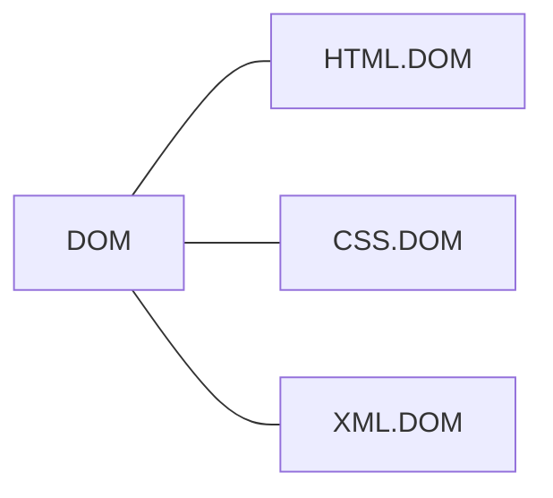
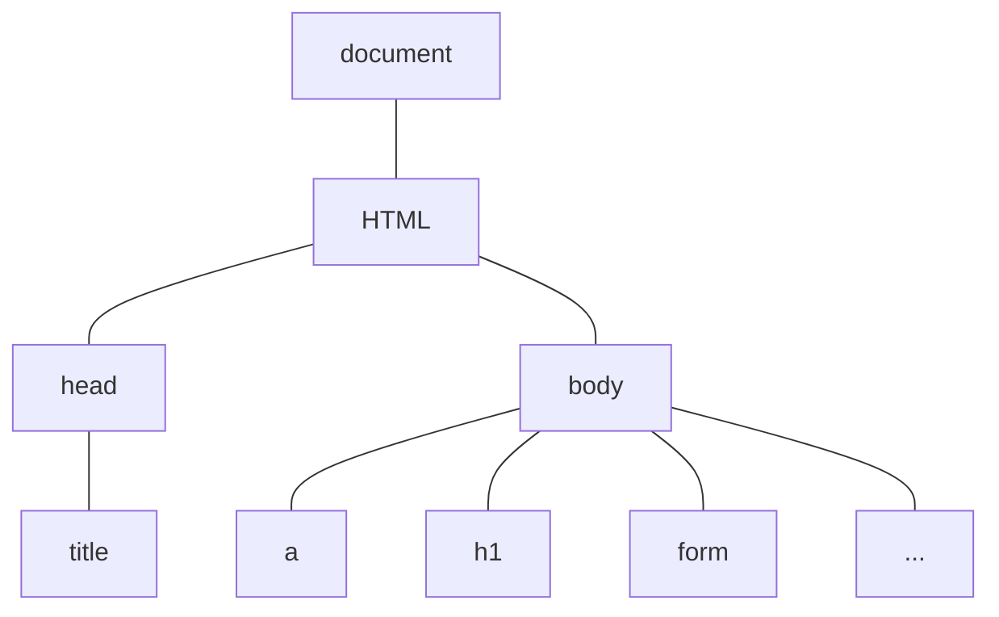
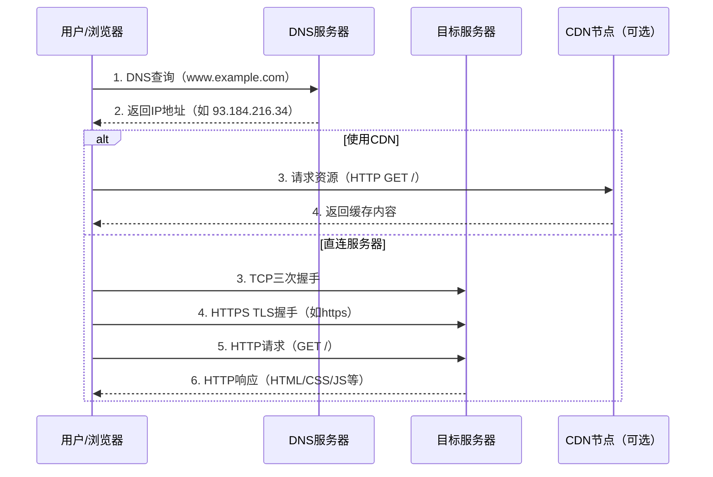
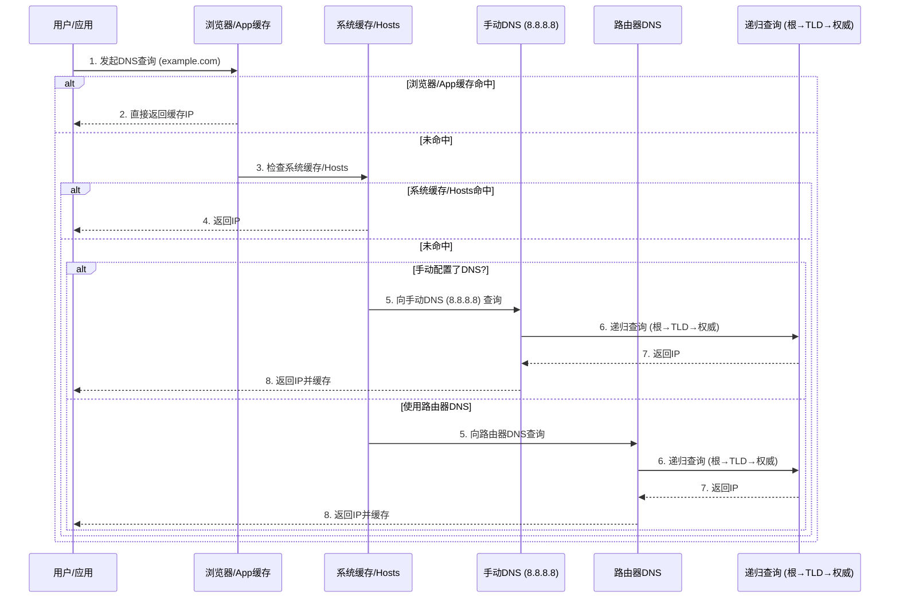
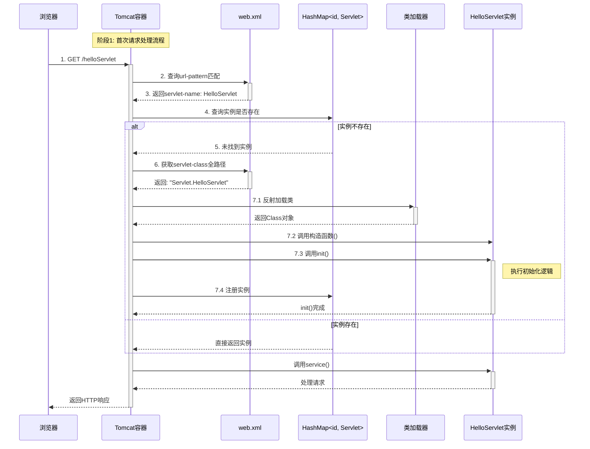
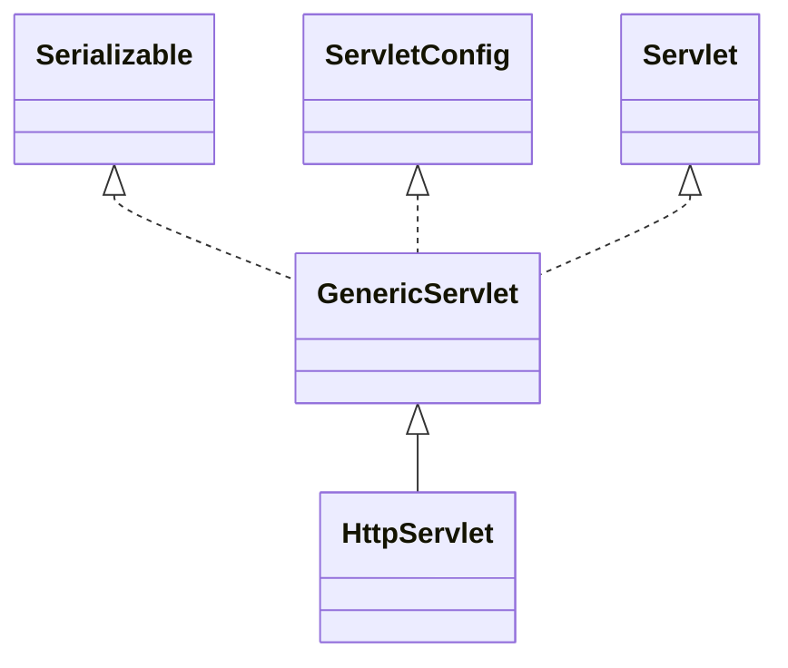

# JavaWeb

# HTML

> Hyper Text Marked Language 超文本标记语言

## 标签和元素

- 标签：用尖括号括起来 <>，一般为双标签\<html> \</html>，也有单标签 \<br/>
- 元素：尖括号括起来的叫元素

## 标签细节

- 标签不能交叉嵌套
- 注释不能嵌套
- 标签必须正确关闭
- HTML 语法严谨性：标签闭合、属性加双引号

## 字体标签

font 标签有三个基本属性：

1. size 字体大小
2. color 字体颜色
3. face 字体类型

## 字符实体

字符实体把符号转化为**文本**

| 显示结果 | 实体名称 | 实体编号 |
| -------- | -------- | -------- |
| 空格     | \&nbsp;  |          |
| <        | \&lt;    |          |
| >        | \&gt;    |          |
| &        | \&amp;   |          |
| "        | \&quot;  |          |
| '        | \&apos;  |          |

## 标题标签

\<h1> ~ \<h6> 从大到小

| 属性  | 作用     | 值                |
| ----- | -------- | ----------------- |
| align | 对齐方式 | left right center |

## 超链接标签

本标签页打开

```html
<a href="https://bing.com" target="_self">必应</a>
```

新标签页打开

```html
<a href="https://bing.com" target="_blank">必应 </a>
```

邮箱地址

```html
<a href="mailto:tom@163.com">联系邮箱</a>
```

## 列表标签

### 无序列表 ul

```html
<ul type="无序类型">
  <li>列表内容</li>
  <li>...</li>
</ul>
```

- disc 实心圆
- circle 空心圆
- square 空心正方形

### 有序列表 ol

```html
<ol type="有序类型" start="1">
  <li>...</li>
</ol>
```

1. A
2. a
3. 1
4. i
5. I

默认从第一个开始

## 图像标签

```html

```

- src 绝对路径和相对路径，绝对路径使用 URL 访问而不是盘符定位
- 仅指定高度或宽度，另一边会根据宽高比缩放
- board 边框厚度
- alt 图片找不到时提示的文字 

## 表格标签

常用标签：

- \<tr> 代表行，列数由 \<th>/\<td> 决定
- \<th> 代表表头单元格
- \<td> 代表普通单元格

常用属性：

- cellspacing 单元格间距
- cellpadding 单元格内容与边框的距离
- align 水平对齐方式
- border 边框宽度
- bordercolor 边框颜色

### 普通表格

```html
<table width="500" board="5" align="center">
  <tr>
    <th>Name</th>
    <th>Phone</th>
  </tr>
  <tr>
    <td>zxb</td>
    <td>19990079994</td>
  </tr>
</table>
```

### 跨行跨列

```html
<table border="5" bordercolor="red" align="center" width="500">
    <tr>
        <td colspan="3" align="center">合并3列</td>
    </tr>
    <tr>
        <td rowspan="2">合并两行，占位下n-1行</td>
        <td>2,2</td>
        <td>2,3</td>
    </tr>
    <tr>
        <td>3,2</td>
        <td>3,3</td>
    </tr>
    <tr>
        <td rowspan="2">4,1</td>
        <td>4,2</td>
        <td>4,3</td>
    </tr>
    <tr>
        <td>5,2</td>
        <td>5,3</td>
    </tr>
</table>
```

## 表单标签

### form

- action 表单提交的目标 URL 位置
- method 提交主要方法：GET 和 POST

### input

- text
- password
- submit
- reset checked 默认选项
- checkbox 复选框
- radio 单选框
- **hidden 隐藏元素：用于隐式向服务器提交必要信息**
- file 文件

```html
<form action="ok.html" method="get">
    用户: <input type="text" name="username"><br>
    密码: <input type="password" name="password"><br>
    <input type="checkbox" name="1" value="xj">香蕉
    <input type="checkbox" name="1" value="pg" checked>苹果<br>
    <input type="radio" name="2" value="sj">phone
    <input type="radio" name="2" value="dn" checked>computer<br>
    <input type="hidden" name="id" value="001">
    <input type="submit" name="submit" value="登陆">
    <input type="reset" name="reset" value="清空"><br>
    <input type="image" name="submit" src="img.png">   
</form>
```

### 下拉列表

```html
<select name="like">
    <option value="游戏" selected>游戏</option>
    <option value="篮球">篮球</option>
    <option value="网球">网球</option>
</select>
```

### 文本域

```html
<textarea name="comment" rows="4" cols="25"></textarea>
```

### 表单美化

元素嵌套在 table 内

### GET 与 POST 的区别

1. GET 地址栏显示参数名和值，POST 只显示Action 值
2. GET 数据有长度限制
3. POST 安全

## div 标签

- \<div> 标签可以把文档分割为独立不同的部分
- \<div> 是一个块级元素，他会自动从下一行开始

```html
<div style:color=red>
  
</div>
```

## p 标签

段落元素，会自动在段前段后创建空白

## span 标签

内联元素，没有换行效果

```html
您的购物车有<span style="color: red;font-size: 40px">10</span>个商品
```

# CSS

> Cascading Style Sheets 层叠样式表
>
> CSS 让 HTML 页面的内容和样式分离，降低耦合程度，提高 Web 开发效率。

## CSS 语法

- CSS 由**选择器**（元素、标签）和**声明**组成；
- 声明由属性和值组成，多个属性之间使用分号隔开；
- CSS 注释语法 /* 注释内容 */

## CSS 常用样式

### 字体颜色

颜色属性的值有三种写法：

1. 颜色的英文：red, orange, green
2. 颜色的十六进制：#FF0000
3. 颜色的RGB：rgb(255, 255, 255)

```html
<style type="text/css">
  div {
    /*color: red;*/
    /*color: #ff7d44;*/
    color: rgb(255, 255, 255);
  }
</style>
```

### 边框

boarder 属性有三个参数，分别为：边框宽度、边框样式、边框颜色。三个参数使用空格隔开。

```
<line-width> || <line-style> || <color>
<line-width> = <length [0,∞]> | thin | medium | thick
<line-style> = none | hidden | dotted | dashed | solid | double | groove | ridge | inset | outset
```

```html
<head>
    <meta charset="UTF-8">
    <title>边框</title>
  <style type="text/css">
    div {
      width: 300px;
      height: 100px;
      border: 10px dashed blue;
    }
  </style>
</head>
```

### 背景颜色

```html
<!DOCTYPE html>
<html lang="en">
<head>
    <meta charset="UTF-8">
    <title>CSS 快速入门</title>
  	<!-- div 表示对 <div> 元素进行样式指定 -->
    <style type="text/css">
      div {
        width: 300px;
        height: 100px;
        background-color: orange;
      }
    </style>
</head>
<body>
  <div> hello Beijing </div>
  <br>
  <div> hello Nanjing </div>
</body>
</html>
```

### 字体样式

字体样式常用属性有：

1. font-size: 字体大小
2. font-weight: 字体是否加粗
3. font-family: 字体类型

```html
<!DOCTYPE html>
<html lang="en">
<head>
    <meta charset="UTF-8">
    <title>字体样式</title>
    <style type="text/css">
        div {
            font-size: 36px;
            font-family: "fangsong";
            font-weight: bold;
        }
    </style>
</head>
<body>
<div> 周新斌</div>
</body>
</html>
```

### div 水平居中

 ```html
 <!DOCTYPE html>
 <html lang="en">
 <head>
     <meta charset="UTF-8">
     <title>div居中</title>
     <style type="text/css">
         div {
             margin-left: auto;
             margin-right: auto;
             height: 100px;
             width: 300px;
             border: 5px dashed red;
         }
     </style>
 </head>
 <body>
 <div> 周新斌</div>
 </body>
 </html>
 ```

### 文本水平居中

```html
<!DOCTYPE html>
<html lang="en">
<head>
  <meta charset="UTF-8">
  <title>文本居中</title>
  <style type="text/css">
    div {
      text-align: center;
    }
  </style>
</head>
<body>
<div> 周新斌 </div>
</body>
</html>
```

### 超链接去下划线

```html
<!DOCTYPE html>
<html lang="en">
<head>
    <meta charset="UTF-8">
    <title>超链接</title>
    <style type="text/css">
        a {
            text-decoration: none;
        }
    </style>
</head>
<body>
<a href="https://jd.com">跳转到京东</a>
</body>
</html>
```

### 表格

```html
<!DOCTYPE html>
<html lang="en">
<head>
    <meta charset="UTF-8">
    <title>表格细线</title>
    <style type="text/css">
        /* 共用样式 */
        table, tr, td {
            width: 300px;
            border: 1px solid black;
            border-collapse: collapse;
            text-align: center;
        }
    </style>
</head>
<body>
<table>
    <tr>
        <td> 1</td>
        <td> 2</td>
        <td> 3</td>
        <td> 4</td>
    </tr>
    <tr>
        <td> 苹果</td>
        <td> 杨桃</td>
        <td> 香蕉</td>
        <td> 李子</td>
    </tr>
</table>

</body>
</html>
```

### 无序列表去符号

```html
<!DOCTYPE html>
<html lang="en">
<head>
    <meta charset="UTF-8">
    <title>无序列表去符号</title>
    <style type="text/css">
        ul {
            list-style: none;
        }
    </style>
</head>
<body>
<ul>
    <li> a</li>
    <li> b</li>
</ul>
</body>
</html>
```

## CSS 使用方式

1. 在标签的 style 属性上设置 CSS 样式
2. 在 head 标签中，使用 style 标签定义样式
3. 把 CSS 样式写成单独的 CSS 文件，在通过 link 标签引入

**CSS3.html**

```html
<!DOCTYPE html>
<html lang="en">
<head>
    <meta charset="UTF-8">
    <title>link 引入 css</title>
    <link href="./CSS/use/my.css" rel="stylesheet"/>
</head>
<body>
<div> link 标签引入 CSS</div>
<br>
<span> hello, world</span>
</body>
</html>
```

**my.css**

```css
div {
    width: 400px;
    height: 200px;
    background-color: #ff7d44;
}

span {
    border: 2px dashed blue;
}
```

## CSS 选择器

### 元素选择器

元素选择器是最常见的选择器，CSS 元素选择器的元素/标签通常是 HTML 的某个元素或标签。

```html
<!DOCTYPE html>
<html lang="en">
<head>
    <meta charset="UTF-8">
    <title>元素选择器</title>
    <style type="text/css">
        p {
            font-family: fangsong;
            font-size: 24px;
            color: red;
        }
      
        div {
            width: 300px;
            height: 100px;
        }
    </style>
</head>
<body>
<p>元素选择器会修饰所有的对应元素</p>
</body>
</html>
```

### ID 选择器

- ID 选择器为**特定元素**指定样式；
- ID 选择器用 #id 标记特定元素；
- ID 选择器不能重复，每个 ID 只能被使用一次；

```html
<!DOCTYPE html>
<html lang="en">
<head>
    <meta charset="UTF-8">
    <title>ID 选择器</title>
    <style type="text/css">
        #css1 {
            color: orange;
        }

        #css2 { 
            color: red;
        }
    </style>
</head>
<body>
<p id="css1"> hello</p>
<p id="css2"> world</p>
</body>
</html>
```

### 类选择器

 class 属性的值可以重复，每个 class 可以被多次使用。

```html
<!DOCTYPE html>
<html lang="en">
<head>
    <meta charset="UTF-8">
    <title>类选择器</title>
    <style type="text/css">
        .css1 {
            color: red;
        }

        .css2 {
            color: orange;
        }
    </style>
</head>
<body>
<div class="css1"> zxb</div>
<div class="css1"> zxb zxb</div>
</body>
</html>
```

### 组合选择器

**组合选择器**让多个选择器共用一个 CSS 样式代码。

```html
<!DOCTYPE html>
<html lang="en">
<head>
    <meta charset="UTF-8">
    <title>组合选择器</title>
    <style type="text/css">
        .css1, #css1 {
            width: 300px;
            height: 100px;
            color: red;
            background-color: cornflowerblue;
        }
    </style>
</head>
<body>
<div id=css1> zxb</div>
<br>
<div class=css1> zxb</div>
</body>
</html>
```

### 选择器优先级

1. 行内样式
2. ID 选择器
3. class 选择器
4. 元素选择器

# JavaScript

## 特点

1. 解释型脚本语言
2. 弱类型变量
3. 基于对象的脚本语言，可以创建对象，也可以使用现有的对象

## 使用方式

同一个 \<script> 标签中，两种方式只能生效一个，生效的是引入的 JS 代码

### \<script> 标签直接使用

```html
<head>
    <meta charset="UTF-8">
    <title>使用方式</title>
    <script type="text/javascript">
        console.log("在 script 中使用")
    </script>
</head>
<body>
<script type="text/javascript">
    console.log("在 body 中使用")
</script>
</body>
</html>
```

### \<script> 标签引入 JS 文件

```html
<head>
    <meta charset="UTF-8">
    <title>引入 js 文件</title>
    <script type="text/javascript" src="/JavaScript/script_use2.js"></script>
</head>
<body>

</body>
</html>
```

## 查看错误信息

浏览器打开 检查，console 栏报错信息；


可以在浏览器中定位错误代码。


## 数据类型

### 数据类型

| 数据类型 | 变量含义   |
| -------- | ---------- |
| number   | 数值类型   |
| string   | 字符串类型 |
| object   | 对象类型   |
| boolean  | 布尔类型   |
| function | 函数类型   |

### 特殊值

| 特殊值    | 含义                |
| --------- | ------------------- |
| undefined | 未赋值的初始值      |
| null      | 空值                |
| NaN       | Not a Number 非数值 |

### var let const

| 特性         | `var`                      | `let`                | `const`              |
| ------------ | -------------------------- | -------------------- | -------------------- |
| **作用域**   | 函数作用域                 | 块级作用域           | 块级作用域           |
| **变量提升** | 是（赋值前为 `undefined`） | 否（存在暂时性死区） | 否（存在暂时性死区） |
| **重复声明** | 允许                       | 不允许               | 不允许               |
| **可变性**   | 可变                       | 可变                 | 不可变（常量）       |

### 注意事项

- stirng 字符串可以使用单双引号；
- var 变量可以被多次声明，值不变；

## 运算符

### 算术运算符

同 Java

### 赋值运算符

同 Java

### 关系运算符

基本同 Java，多了一个 ===，意为全等（类型和值）

### 逻辑运算符

同 Java

- 所有变量都可以作为 boolean 类型使用，0 null undefined “” 都认为是 false。
- 对于 && 运算。
  - 表达式两边全真时，返回最后一个表达式的值。
  - 有一个为假，返回第一个为假的表达式的值。
- 对于 || 运算。
  - 表达式两边全假时，返回最后一个表达式的值。
  - 有一个为真，返回第一个为真的表达式的值。
- && 与 || 运算有 **短路** 现象：运算结果确定后，后面表达式不再进行。

### 条件运算符

同 Java

## 数组

### 定义数组

```js
// f1
let cars1 = ["BMW", "Benz", "Audi"];
console.log(cars1);
console.log(cars1[0]);

// f2
let cars2 = [];  // 空数组
cars2[0] = "BMW";
cars2[1] = "Benz";
cars2[2] = "Audi";
console.log(cars2);
console.log(cars2[1]);

// f3
let cars3 = new Array("BMW", "Benz", "Audi");
console.log(cars3);
console.log(cars3[2]);

// f4
let cars4 = new Array();
console.log("type of cars4 " + typeof cars4);
cars4[0] = "宝马";
cars4[1] = "奔驰";
cars4[2] = "奥迪";
cars4[3] = "沃尔沃";
console.log(cars4);
console.log(cars4[3]);
```

### 遍历数组

```javascript
console.log("type of cars4 " + typeof cars4);
cars4[0] = "宝马";
cars4[1] = "奔驰";
cars4[2] = "奥迪";
cars4[3] = "沃尔沃";
console.log(cars4);
for (let i = 0; i < cars4.length; i ++) {
  console.log(cars4[i]);
}
```

## 函数

函数是由事件驱动的，当他被调用时，执行可重复使用的代码块。

### 函数定义

```js
// 无参
function f1() {
    console.log("函数 f1 被调用");
}
f1();
// 有参数，无需定义参数类型
function f2(n1) {
    console.log(n1);
}
f2("123");
// 有参数和返回值，同样不需要定义返回类型
function f3(n1, n2) {
    return n1 + n2;
}
console.log(f3(1, 2));
```

### 函数赋值给变量

```js
let f4 = function () {
    console.log("hello");
}
console.log(typeof f4);
f4();

let f5 = f4;
f5();
```

### 函数调用

执行函数有两种方式，**主动调用** 或 **事件触发**。

```html
<html lang="en">
<head>
    <meta charset="UTF-8">
    <title>函数</title>
    <script type="text/javascript">
        function hi() {
          alert("hello world");
        }
        // 主动调用
        hi();
    </script>
</head>
<body>
<!-- 绑定点击事件触发 hi() 函数 -->
<button onclick="hi()">点我一下</button>
</body>
</html>
```

### 注意事项

- js 函数没有重载，重复定义会覆盖上一个函数定义。
- 函数带有隐藏参数 arguments，本质是一个对象数组。函数有形参的时候，在传入实参时按照顺序匹配：
  - 实参个数 >= 形参个数：匹配上的赋值，最后把所有实参赋值给 arguments。
  - 实参个数 < 形参个数：匹配上的赋值，多余形参为 undefined，所有赋给 arguments。

## 对象

### 使用 Object 定义

```js
let person = new Object();
person.name = "zxb";
person.age = 22;
person.say = function() {
  	console.log("hello" + this.name + " " + this.age);
};

person.say();
```

### 使用 {} 定义

```js
let objectName = {
		fielddName: fieldValue,
  	functionName: function() {
      	
    }
};

objectName.functionName();
objectName.fieldName;
```

## 事件

### 事件分类

| 事件类型 | 含义                                            |
| -------- | ----------------------------------------------- |
| onload   | 页面加载之后                                    |
| onclick  | 鼠标单击某个对象                                |
| onblur   | 失去焦点                                        |
| onchange | 内容发生改变                                    |
| onsubmit | 表单提交（**重要，form 表单提交前先 JS 校验**） |

### 动态注册

1. 获取标签对象/dom 对象
2. 标签对象.事件名 = function() {}

```js
// onload 页面加载完毕之后执行代码
window.onload = function () {
    console.log("动态绑定");
};
```

示例代码：

```html
<!DOCTYPE html>
<html lang="en">
<head>
    <meta charset="UTF-8">
    <title>失去焦点-小写转大写</title>
    <script type="text/javascript">
        // 动态绑定
      	// 先等页面加载完毕，不然获取不到 id
        window.onload = function () {
            document.getElementById("ip2").onblur = function () {
                document.getElementById("ip2").value =
                    document.getElementById("ip2").value.toUpperCase();
            }
        }
    </script>
</head>
<body>
<input type="text" id="ip2"/>
</body>
</html>
```

### 静态注册

在 HTML 标签上绑定

```html
<body onload="init()">
```

示例代码：

```html
<!DOCTYPE html>
<html lang="en">
<head>
    <meta charset="UTF-8">
    <title>失去焦点-小写转大写</title>
    <script type="text/javascript">
        // 静态绑定
        function upperCase() {
            document.getElementById("ip1").value =
                document.getElementById("ip1").value.toUpperCase();
        }
    </script>
</head>
<body>
<input type="text" id="ip1" onblur="upperCase()"/>
</body>
</html>
```

### 动态 VS 静态

| **对比项**   | 静态注册                            | 动态注册                              |
| ------------ | ----------------------------------- | ------------------------------------- |
| **绑定方式** | HTML 标签属性（如 `<body onload>`） | JavaScript 代码（如 `window.onload`） |
| **灵活性**   | 固定，不可修改                      | 可动态绑定/解绑                       |
| **事件覆盖** | 多次声明会覆盖                      | 可通过 `addEventListener` 避免覆盖    |
| **维护性**   | 较差（HTML 与 JS 混合）             | 较好（行为与结构分离）                |

# DOM

> Document Object Model 文档对象模型

DOM 是把文档中的标签、属性、文本等元素转换成对象来管理



## HTML DOM 树

当页面被加载时，浏览器会创建页面的文档对象模型



## Document 对象

当 HTML 文档加载到 Web 浏览器中时，它就变成了一个**文档对象**。

**文档对象**是 HTML 文档的根节点。

**文档对象**是*窗口对象*的属性。

### 常用方法

| 方法名                                                       | 作用                                                         |
| ------------------------------------------------------------ | ------------------------------------------------------------ |
| [getElementById()](https://www.w3school.com.cn/jsref/met_document_getelementbyid.asp) | 返回拥有指定值的 ID 属性的元素。                             |
| [getElementsByClassName()](https://www.w3school.com.cn/jsref/met_document_getelementsbyclassname.asp) | 返回包含拥有指定类名的所有元素的 [HTMLCollection](https://www.w3school.com.cn/jsref/dom_obj_htmlcollection.asp)。 |
| [getElementsByName()](https://www.w3school.com.cn/jsref/met_doc_getelementsbyname.asp) | 返回包含拥有指定名称的所有元素的活动 [NodeList](https://www.w3school.com.cn/jsref/dom_obj_html_nodelist.asp)。 |
| [getElementsByTagName()](https://www.w3school.com.cn/jsref/met_document_getelementsbytagname.asp) | 返回包含拥有指定标签名称的所有元素的 [HTMLCollection](https://www.w3school.com.cn/jsref/dom_obj_htmlcollection.asp)。 |
| [createElement()](https://www.w3school.com.cn/jsref/met_document_createelement.asp) | 创建元素节点。                                               |

## Elemment 对象

Element 对象代表 HTML 元素，如 P、DIV、A、TABLE 或任何其他 HTML 元素。

### 常用方法

| 方法名                                                       | 作用                                 |
| ------------------------------------------------------------ | ------------------------------------ |
| [childElementCount](https://www.w3school.com.cn/jsref/prop_element_childelementcount.asp) | 返回元素的子元素个数。               |
| [childNodes](https://www.w3school.com.cn/jsref/prop_node_childnodes.asp) | 返回元素子节点的 NodeList。          |
| [children](https://www.w3school.com.cn/jsref/prop_element_children.asp) | 返回元素的子元素的 HTMLCollection。  |
| [getElementsByClassName()](https://www.w3school.com.cn/jsref/met_element_getelementsbyclassname.asp) | 返回拥有给定类名的子元素的集合。     |
| [getElementsByTagName()](https://www.w3school.com.cn/jsref/met_element_getelementsbytagname.asp) | 返回拥有给定标签名称的子元素的集合。 |
| [innerHTML](https://www.w3school.com.cn/jsref/prop_html_innerhtml.asp) | 设置或返回元素的内容。               |
| [innerText](https://www.w3school.com.cn/jsref/prop_node_innertext.asp) | 设置或返回节点及其后代的文本内容。   |
| [parentNode](https://www.w3school.com.cn/jsref/prop_node_parentnode.asp) | 返回元素的父节点。                   |
| [parentElement](https://www.w3school.com.cn/jsref/prop_node_parentelement.asp) | 返回元素的父元素节点。               |

### 子元素与子节点区别

- **子节点**：元素节点、文本节点或注释节点（元素之间的**空白**、**换行符**也是文本节点）
- **子元素**：不返回文本节点和注释节点

# XML

> eXtensible Markup Language 可扩展标记语言

- XML 也可以看做树结构
- XML 旨在存储和传输数据
- XML 常用作配置文件

## XML 组成

- 序言
- 元素
- 属性
- 注释
- CDATA、特殊字符

## XML 命名规则

- 元素名称区分大小写
- 元素名称必须以字母或下划线开头
- 元素名称不能以字母 xml（或 XML、Xml 等）开头
- 元素名称可以包含字母、数字、连字符、下划线和句点
- 元素名称不能包含空格

注：使用数据库的名称规则来命名 XML 文档中的元素

## XML 语法

### 序言

- 序言包含XML规范和字符编码
- 是可选的；如果有，则必须在第一行

### 元素

- 每个 XML 文档 **有且只有** 一个根元素
- 元素要有始末标签，标签不能嵌套
- 多个空格会被视为一个空格
- 标签对大小写敏感

### 属性

- XML 元素可以在开始标签中包含属性，提供关于元素的额外信息。
- 属性值必须加引号，可单可双。

**属性与元素：**

- 属性不能包含多个值（元素可以）
- 属性无法描述树结构（元素可以）
- 属性不易扩展（为未来的变化）

### 注释

同 HTML 注释格式，不能嵌套。

### CDATA

XML 文档中的所有文本均会被解析器解析。只有 CDATA 区段中的文本会被解析器忽略。

```xml
<?xml version="1.0" encoding="utf-8" ?>

<![CDATA[
    <script>
        console.log("hello");
    </script>
]]>
```

### 转义字符

| 转义字符 | 符号 | 含义           |
| -------- | ---- | -------------- |
| \&lt;    | <    | less than      |
| \&gt;    | >    | greater than   |
| \&amp;   | &    | ampersand      |
| \&apos;  | '    | apostrophe     |
| \&quot;  | "    | quotation mark |

## XML 解析器

- [XML DOM（文档对象模型）](https://www.w3school.com.cn/xml/dom_intro.asp)定义了用于访问和编辑 XML 的属性和方法。
- 然而，在访问 XML 文档之前，必须将其加载到 XML DOM 对象中。
- 所有现代浏览器都提供内置的 XML 解析器，可以将文本转换为 XML DOM 对象。

### DOM4J

JDOM 在 DOM 基础上进行了封装，DOM4J 在 JDOM 基础上进行了封装。

### 获取 Document 对象

```java
@Test
public void loadXML() throws DocumentException {
    // 创建解析器
    SAXReader reader = new SAXReader();
    // XML Document
    Document document = reader.read(
            new File("/Users/sinpin/Desktop/GitHub/MyCode/JavaWeb/04XML/students.xml"));
    // 在此设置断点，执行调试，可以发现 Document 对象是一个树形结构，对应 XML 文件内容
    System.out.println(document);
}
```

### 遍历

```java
// 遍历 Students
@Test
public void listStudents() throws DocumentException {
    SAXReader reader = new SAXReader();
    Document document = reader.read(
            new File("/Users/sinpin/Desktop/GitHub/MyCode/JavaWeb/04XML/students.xml"));
    // 获取根节点
    Element rootElement = document.getRootElement();
    // 获取根节点的子节点
    List<Element> student = rootElement.elements("student");
    // 输出信息
    System.out.println(student.size());
    for (Element o : student) {
        Element name = o.element("name");
        Element gender = o.element("gender");
        Element age = o.element("age");
        System.out.println(name.getText() + " " + age.getText() + " " + gender.getText());
    }
}
```

XPath 可以更方便的读取元素值，避免层层遍历。

### 添加

```java
@Test
public void addStudent() throws DocumentException, IOException {
    SAXReader reader = new SAXReader();
    Document document = reader.read(
            new File("/Users/sinpin/Desktop/GitHub/MyCode/JavaWeb/04XML/students.xml"));
    // 在内存中添加节点
    Element student = DocumentHelper.createElement("student");
    student.addAttribute("id","03");

    Element name = DocumentHelper.createElement("name");
    name.setText("宋江");
    student.add(name);

    Element gender = DocumentHelper.createElement("gender");
    gender.setText("男");
    student.add(gender);

    Element age = DocumentHelper.createElement("age");
    age.setText("55");
    student.add(age);

    document.getRootElement().add(student);

    // 解决乱码
    OutputFormat outputFormat = OutputFormat.createPrettyPrint();
    outputFormat.setEncoding("UTF-8");
    // XML 文件更新
    XMLWriter xmlWriter = new XMLWriter(
            new FileOutputStream(
                    new File("/Users/sinpin/Desktop/GitHub/MyCode/JavaWeb/04XML/students.xml")), outputFormat);
    xmlWriter.write(document);
    xmlWriter.close();
    // 遍历
    listStudents();
}
```

### 删除

1. 先找到被删除的元素
2. 再找到该元素的父元素
3. 通过父元素删除子元素

```java
@Test
public void removeStudent() throws DocumentException, IOException {
    SAXReader reader = new SAXReader();
    Document document = reader.read(
            new File("/Users/sinpin/Desktop/GitHub/MyCode/JavaWeb/04XML/students.xml"));

    Element rootElement = document.getRootElement();
    List<Element> student = (List<Element>) rootElement.elements("student");
    Element element = student.get(0);
    element.getParent().remove(element);
    // 解决乱码
    OutputFormat outputFormat = OutputFormat.createPrettyPrint();
    outputFormat.setEncoding("UTF-8");
    // XML 文件更新
    XMLWriter xmlWriter = new XMLWriter(
            new FileOutputStream(
                    new File("/Users/sinpin/Desktop/GitHub/MyCode/JavaWeb/04XML/students.xml")), outputFormat);
    xmlWriter.write(document);
    xmlWriter.close();
    // 遍历
    listStudents();
}
```

### 更新

1. 先找到被修改的元素
2. 修改元素属性

```java
@Test
public void updateStudent() throws DocumentException, IOException {
    SAXReader reader = new SAXReader();
    Document document = reader.read(
            new File("/Users/sinpin/Desktop/GitHub/MyCode/JavaWeb/04XML/students.xml"));

    Element rootElement = document.getRootElement();
    List<Element> students = (List<Element>) rootElement.elements("student");
    Element student = students.get(0);
    int age = Integer.parseInt(student.element("age").getText());
    age += 3;
    student.element("age").setText(String.valueOf(age));
    // 解决乱码
    OutputFormat outputFormat = OutputFormat.createPrettyPrint();
    outputFormat.setEncoding("UTF-8");
    // XML 文件更新
    XMLWriter xmlWriter = new XMLWriter(
            new FileOutputStream(
                    new File("/Users/sinpin/Desktop/GitHub/MyCode/JavaWeb/04XML/students.xml")), outputFormat);
    xmlWriter.write(document);
    xmlWriter.close();
    // 遍历
    listStudents();
}
```

# Tomcat

## URL 请求过程



## DNS 解析过程



## IDEA 创建 Web 项目

1. 新建一个普通 Java 项目
2. 打开项目设置，添加 Web 模块，设置对应工件
3. 配置 Tomcat，配置 Tomcat 的 Deployment

# Servlet

Servlet 本质是 Java 类，由 Server 调用，是开发动态 Web 的基础。

Servlet 是常驻内存的，是**单例**模式（一个类在整个程序中只有一个实例）。

```java
public class HelloServlet implements Servlet {
    // Servlet 是单例
    private int count = 0;
    /**
     * 1. 初始化 Servlet
     * 2. 创建 HelloServlet 实例时，调用 init()
     * 3. 该方法只会被调用一次
     * @param servletConfig
     * @throws ServletException
     */
    @Override
    public void init(ServletConfig servletConfig) throws ServletException {
        System.out.println("Initializing HelloServlet");
    }

    /**
     * 返回 ServletConfig
     * @return
     */
    @Override
    public ServletConfig getServletConfig() {
        return null;
    }
    /**
     * 1. 处理浏览器的请求
     * 2. 每请求一次，被调用一次
     * 3. 当 Tomcat 调用方法时，会把 HTTP 请求封装成实现了 ServletRequest 接口的 Request 对象
     * 4. 通过 ServletRequest 对象，获取提交的属性
     * 5. 把响应内容封装成 Response 对象给 Tomcat
     * @param servletRequest
     * @param servletResponse
     * @throws ServletException
     * @throws IOException
     */
    @Override
    public void service(ServletRequest servletRequest, ServletResponse servletResponse) throws ServletException, IOException {
        count++;
        System.out.println("servlet 被调用 " + count);
        System.out.println(Thread.currentThread().getId());
    }

    /**
     * 返回 Servlet 信息
     * @return
     */
    @Override
    public String getServletInfo() {
        return "HelloServlet";
    }

    /**
     * 该方法用于 Servlet 被销毁时，被 Tomcat 调用，只调用一次
     */
    @Override
    public void destroy() {
        System.out.println("Destroying HelloServlet");
    }
}
```

## Servlet 请求过程



## Servlet 生命周期

### Servlet 生命阶段

- 初始化阶段：init() 方法
- 浏览器请求阶段：service() 方法
- 终止阶段：destory() 方法

### 初始化阶段

浏览器请求 Servlet，Servlet 容器加载 Servlet，创建 Servlet 实例，并调用 init 方法。

### Servlet 装载时机

- Servlet 容器启动时自动装载 Servlet，需要在 web.xml 中添加：

  ```xml
  <load-on-startup>1</load-on-startup>
  ```

- Servlet 容器启动后，浏览器首次请求 Servlet 时。

- Servlet 重新装载时，如 Tomcat 进行 Redeploy 操作（摧毁 Servlet）后，浏览器再请求。

### 浏览器请求阶段

- 每收到一个 HTTP 请求，容器产生一个新的线程去处理请求。
- 创建一个封装了，HTTP 请求消息的 ServletRequest 对象和 HTTP 响应消息的 ServletResponse 对象。
- 调用 service 方法，请求对象和响应对象作为参数。

### 终止阶段

- Web 应用被终止
- Servlet 容器被终止
- Servlet 被重新装载

## Servlet 使用方式

### 注解方式

```java
@WebServlet(name = "Servlet3", urlPatterns = "/Servlet3")
// urlPatterns 支持多个
@WebServlet(name = "Servlet3", urlPatterns = {"/Servlet3", "/Servlet03"})
```

### web.xml 方式

```xml
<?xml version="1.0" encoding="UTF-8"?>
<web-app xmlns="http://xmlns.jcp.org/xml/ns/javaee"
         xmlns:xsi="http://www.w3.org/2001/XMLSchema-instance"
         xsi:schemaLocation="http://xmlns.jcp.org/xml/ns/javaee http://xmlns.jcp.org/xml/ns/javaee/web-app_4_0.xsd"
         version="4.0">
    <!--web.xml用来配置Web需要用的Servlet-->
    <servlet>
        <servlet-name>HelloServlet</servlet-name>
        <servlet-class>Servlet.HelloServlet</servlet-class> <!--类地址-->
    </servlet>
    <servlet-mapping>
        <servlet-name>HelloServlet</servlet-name>
        <url-pattern>/helloServlet</url-pattern> <!--URL地址-->
    </servlet-mapping>
</web-app>
```

## 手搓 HttpServlet

```java
@Override
public void service(ServletRequest servletRequest, ServletResponse servletResponse) throws ServletException, IOException {
    HttpServletRequest httpServletRequest = (HttpServletRequest) servletRequest;
    String method = httpServletRequest.getMethod();
    if ("POST".equals(method)) {
        doPost();
    } else if ("GET".equals(method)) {
        doGet();
    }
}

private void doGet() {
    System.out.println("GET");
}

private void doPost() {
    System.out.println("POST");
}
```

## HttpServlet

在实际项目中，为了方便开发，通常让自己的 Servlet 继承 HttpServlet。



```java
public class HttpServlet01 extends HttpServlet {
    @Override
    protected void doGet(HttpServletRequest request, HttpServletResponse response) throws ServletException, IOException {
        System.out.println("doGet");
    }

    @Override
    protected void doPost(HttpServletRequest request, HttpServletResponse response) throws ServletException, IOException {
        System.out.println("doPost");
    }
}

```

通过查看 HttpServlet 源码，发现浏览器每次请求，都会创建 HttpServletRequest 和 HttpServletResponse 对象传给 service() 方法。在 service 方法中根据 method 类型，传给 this 实例中对应的方法。

## IDEA 创建 Servlet 模板

较新版本的 IDEA 取消了 Servlet 模板的支持，需要手动添加模板：

在项目任意软件包下 - 右键 - 编辑文件模板 - 添加如下模板

### 注解方式

```java
#if (${PACKAGE_NAME} && ${PACKAGE_NAME} != "")package ${PACKAGE_NAME};#end
#parse("File Header.java")

#if ($JAVAEE_TYPE == "jakarta")
import jakarta.servlet.*;
import jakarta.servlet.http.*;
import jakarta.servlet.annotation.*;
#else
import javax.servlet.*;
import javax.servlet.http.*;
import javax.servlet.annotation.*;
#end
import java.io.IOException;

@WebServlet(urlPatterns="/${Entity_Name}")
public class ${Class_Name} extends HttpServlet {
    @Override
    protected void doGet(HttpServletRequest request, HttpServletResponse response) 
            throws ServletException, IOException {
        
    }

    @Override
    protected void doPost(HttpServletRequest request, HttpServletResponse response) 
            throws ServletException, IOException {
      
    }
}
```

### XML 方式

```java
#if (${PACKAGE_NAME} && ${PACKAGE_NAME} != "")package ${PACKAGE_NAME};#end
#parse("File Header.java")

#if ($JAVAEE_TYPE == "jakarta")
import jakarta.servlet.*;
import jakarta.servlet.http.*;
#else
import javax.servlet.*;
import javax.servlet.http.*;
#end
import java.io.IOException;

public class ${Class_Name} extends HttpServlet {
    @Override
    protected void doGet(HttpServletRequest request, HttpServletResponse response) throws ServletException, IOException {

    }

    @Override
    protected void doPost(HttpServletRequest request, HttpServletResponse response) throws ServletException, IOException {

    }
}
```

## Servlet 注解

### 注解方式解析过程

1. 浏览器向 Tomcat 发起请求。
2. Tomcat 对软件包进行扫描，被 @WebServlet 修饰的类被认为是 Servlet。
3. 得到 Servlet 类的全路径。
4. 根据全路径，得到 Class 对象；根据 Class 对象，得到注解对象；根据注解对象得到 urlPatterns。
5. 请求的 URL 与 urlPatterns 进行匹配。
6. 匹配成功，利用反射技术，实例化 Servlet，放入 Tomcat 维护的 HashMap 中。

```java
public class TestAnnotationServlet {
    private static final HashMap<String, Object> hm = new HashMap<>();
    public static void main(String[] args) throws ClassNotFoundException, InstantiationException, IllegalAccessException {
        // 扫描软件包，路径io，得到类的全路径
        String classPath = "Servlet/HelloServlet01";
        // 得到 class 对象
        Class<?> aClass = Class.forName(classPath);
        // 得到注解
        WebServlet annotation = aClass.getAnnotation(WebServlet.class);
        System.out.println(annotation);
        String[] strings = annotation.urlPatterns();
        for(String s : strings){
            System.out.println(s);
        }
        // 如果URL与请求的相匹配，创建实例，放入 HashMap
        Object instance = aClass.newInstance();
        hm.put("HelloServlet01", instance);
    }
}
```

### 注解参数

| 参数名        | 参数类型       | 含义                                                         |
| ------------- | -------------- | ------------------------------------------------------------ |
| name          | String         | Servlet 名称（可选），默认使用类全限定名。在 `web.xml` 或 Filter 链中引用时使用。 |
| value         | String[]       | **等价于 urlPatterns**，但只能用于单一路径（简化写法）。     |
| urlPatterns   | String[]       | 指定 Servlet 的 URL 映射规则（支持多个路径），必须以 `/` 开头。 |
| loadOnStartup | int            | 控制 Servlet 的加载顺序：<br/>\- `>=0` 表示容器启动时立即加载（值越小优先级越高）<br/>\- `-1`（默认）表示首次请求时加载 |
| initParams    | WebInitParam[] | 设置 Servlet 初始化参数（类似 `web.xml` 中的 `<init-param>`）。 |

```java
@WebServlet(
        urlPatterns = {
                "/HttpServlet01",
                "/HttpServlet001"},
        initParams = {
                @WebInitParam(name = "name", value = "zxb"),
                @WebInitParam(name = "name", value = "zxk")
        })
```

### URL 匹配方式

- **精确匹配**：`/xxx.yyy`
- **目录匹配**：`/xxx.*`
- **扩展名匹配**：`/*.yyy`
- **任意匹配**：`/*`

Tomcat 有个默认 DefaultServlet，该 Servlet 用于处理静态资源。当请求的 URL 在 XML 文件中无法匹配时，该 Servlet 进行拦截静态资源，并返回。如果自定义的 Servlet 的urlPatterns 配置了 `/`，会导致静态资源被拦截，无法显示。

**匹配优先级**：精确匹配 > 目录匹配 > 扩展名匹配 > 任意匹配 > `/`

## ServletConfig

- ServletConfig 类作为 Servlet 类的配置信息。
- 在实例 Servlet 时，Tomcat 自动实例化一个与之对应的 ServletConfig 对象。

### 作用

- 获取 Servlet 的 servlet-name
- 获取 Servlet 的初始化参数 init-param
- 获取 ServletContext 对象

```java
public class DBServlet extends HttpServlet {
    @Override
    public void init(ServletConfig config) throws ServletException {
        System.out.println(config);
        // 传给 GenericServlet
        super.init(config);
    }

    @Override
    protected void doGet(HttpServletRequest request, HttpServletResponse response) throws ServletException, IOException {
        ServletConfig servletConfig = getServletConfig();
        String username = servletConfig.getInitParameter("username");
        String password = servletConfig.getInitParameter("password");
        System.out.println(username);
        System.out.println(password);
    }

    @Override
    protected void doPost(HttpServletRequest request, HttpServletResponse response) throws ServletException, IOException {
        doGet(request, response);
    }
}
```

> ServletConfig 作为 GenericServlet 的成员属性，被 transient 修饰，表示不能被序列化。

### 初始化流程

1. 初始化 Servlet 时，Tomcat 创建一个 ServletConfig 对象，传给 Servlet 的 `init()` 方法。
2. 如果重写了 `init` 方法，就要把 config 对象用 `super.init(config)` 传递给 GenericServlet。
3. 再把 config 赋值给 GenericServlet 的 servletConfig 变量。

## ServletContext

ServletContext 是一个接口，是一个全局的资源空间，与 Tomcat 同生命周期。

1. 可以被多个 Servlet 共享，一个 Web 工程只有一个实例
2. K-V 数据存储方式
3. 可以实现多个 Servlet 通信

### 作用

- 获取 `web.xml` 中配置的上下文参数 `context-param`（属于整个 Web 项目）
- 获取当前工程路径（项目目录名）
- 获取工程部署之后在服务器上的绝对路径
- 像 Map 一样存取数据，用于多个 Servlet 间共享

### 示例代码

```java
@WebServlet(urlPatterns = "/ServletContext01")
public class ServletContext01 extends HttpServlet {
    @Override
    protected void doGet(HttpServletRequest request, HttpServletResponse response)
            throws ServletException, IOException {
        // 0. 获取 ServletContext 对象
        ServletContext servletContext = this.getServletContext();
        // 1. 获取上下文参数
        String website = servletContext.getInitParameter("website");
        System.out.println(website);
        // 2. 获取工程路径
        String contextPath = servletContext.getContextPath();
        System.out.println(contextPath);
        // 3. 获取项目资源实际位置
        String realPath = servletContext.getRealPath("/");
        System.out.println(realPath);
    }

    @Override
    protected void doPost(HttpServletRequest request, HttpServletResponse response)
            throws ServletException, IOException {
        doGet(request, response);
    }
}
```

### 网页计数器

```java
public class Util {
    public static Integer counter(ServletContext servletContext) {
        Object counter = servletContext.getAttribute("counter");
        if (counter == null) {
            servletContext.setAttribute("counter", 1);
        } else {
            servletContext.setAttribute("counter", (Integer)counter + 1);
        }
        return (Integer) servletContext.getAttribute("counter");
    }
}

@WebServlet(urlPatterns = "/ServletOrder")
public class ServletOrder extends HttpServlet {
    @Override
    protected void doGet(HttpServletRequest request, HttpServletResponse response)
            throws ServletException, IOException {
        Integer counter = counter(getServletContext());

        response.setContentType("text/html;charset=UTF-8");
        PrintWriter out = response.getWriter();
        out.print("<h1>被访问的次数是" + counter + "</h1>");
        out.flush();
        out.close();
    }

    @Override
    protected void doPost(HttpServletRequest request, HttpServletResponse response)
            throws ServletException, IOException {
        doGet(request, response);
    }
}
```

## HttpServletRequest

HttpServletRequest 对象代表客户端请求，封装了 HTTP 请求包的所有信息。

### 乱码解决

首行加入以下代码：

```java
request.setCharacterEncoding("utf-8");
```

### 常用方法

| 方法名                   | 返回类型             | 方法作用                                                  |
| ------------------------ | -------------------- | --------------------------------------------------------- |
| getMethod()              | Stirng               | 获取请求的方式 GET POST                                   |
| getRequestURI()          | String               | 获取请求资源的相对路径                                    |
| getRequestURL()          | StringBuffer         | 获取请求资源的绝对路径                                    |
| getProtocol()            | String               | 获取请求协议类型                                          |
| getHeader(String)        | String               | 获取请求头，参数填请求包的字段名                          |
| getRemoteAddr()          | String               | 获取客户端**IP地址**                                      |
| getRemoteHost()          | Stirng               | 获取客户端**主机名**（需DNS反向解析，性能差，通常返回IP） |
| getParameter()           | String               | 获取请求的参数                                            |
| getParameterValues()     | String[]             | 获取请求的多个参数，如复选框                              |
| setAttribute(key, value) | void                 | 设置域数据                                                |
| getAttribute(key)        | Object               | 获取域数据                                                |
| removeAttribute(key)     | void                 | 删除域数据                                                |
| getAttributeNames()      | Enumeration\<String> | 获取所有域数据的 key                                      |
| getRequestDispatcher()   | RequestDispatcher    | 获取请求转发对象                                          |

### 请求转发

**请求转发**：指一个 Web 资源收到客户端请求后， 通知**服务器**去调用另外一个 Web 资源进行处理。

**请求转发语法：**

```java
// URL 是相对路径，不需要带项目名
RequestDispatcher requestDispatcher = request.getRequestDispatcher("/URL");
requestDispatcher.forward(request, response);
```

> 注意：
>
> 1. 无论请求转发多少次，都只有一次 HTTP 请求和响应，因为转发发生在服务器端。
> 2. 请求转发过程中浏览器的 URL 保持不变，如果刷新页面，会再次发出请求，所以支付页面不使用转发。
> 3. 在不同的 Servlet 中可以**共享 request 对象和域数据**。
> 4. 可以转发到 `WEB-INF` 目录下，不能访问当前项目之外的的资源。

## HttpServletResponse

HttpServletResponse 对象代表服务器端的响应信息。

### 乱码解决

首行加入以下代码：

```java
response.setContentType("text/html;charset=utf-8");
```

### 返回数据方法

| 方法名            | 作用                     |
| ----------------- | ------------------------ |
| getOutputStream() | 用于下载，处理二进制数据 |
| getWriter()       | 用于回传字符串           |

在同一个 Servlet 中只能使用一种流。

### getWriter()

```java
response.setContentType("text/html;charset=utf-8");
PrintWriter out = response.getWriter();
out.print("name=" + request.getParameter("name"));
out.print("password=" + request.getParameter("password"));
out.flush();
out.close();
```

### 响应重定向

**响应重定向**：指一个 Web 资源收到请求之后，通知客户端去访问另一个 Web 资源。

- 浏览器地址会发生变化，本质是两次 HTTP 请求。
- 产生两个 HttpServletRequest 对象，不能共享 Request 域中的数据。
- 不能重定向到 `WEB-INF` 下的资源，可以重定向到 Web 项目之外的资源。

**响应重定向语法：**

```java
response.setContentType("text/html;charset=utf-8");
// 动态获取项目名称
String contextPath = getServletContext().getContextPath();
// 组合 项目名 和 资源名
response.sendRedirect(contextPath + "/ServletNew");
```

# HTTP

## HTTP 协议介绍

- HTTP: Hyper Text Transfer Protocol
- TCP/IP 协议的一个应用层协议
- HTTP/1.0 短连接
- HTTP/1.1 长连接

## HTTP 状态码

### 状态码类别

| 状态码  | 分类       | 说明                     | 常见场景                              |
| ------- | ---------- | ------------------------ | ------------------------------------- |
| **1xx** | 信息性     | 请求已被接收，继续处理   | `100 Continue`（大文件上传）          |
| **2xx** | 成功       | 请求成功处理             | `200 OK`（成功）                      |
| **3xx** | 重定向     | 需要进一步操作以完成请求 | `301 Moved Permanently`（永久重定向） |
| **4xx** | 客户端错误 | 请求包含错误或无法完成   | `404 Not Found`（资源不存在）         |
| **5xx** | 服务端错误 | 服务器处理请求时出错     | `500 Internal Server Error`           |

### 常用状态码详解
- **200 OK**: 请求成功，响应体中包含结果。
- **201 Created**: 资源创建成功（如POST请求）。
- **302 Found**：资源重定向，会产生二次请求
- **304 Not Modified**：当浏览器未禁用缓存时，被请求资源未更改，返回 304，不返回资源。
- **400 Bad Request**: 请求参数错误。
- **401 Unauthorized**: 未认证（需登录）。
- **403 Forbidden**: 无权限访问。
- **404 Not Found**: 请求的资源不存在。
- **500 Internal Server Error**: 服务器内部错误。

## HTTP 请求次数

如下所示 HTML 源码，分析 HTTP 请求次数：

```html
<h1>abc</h1>


```

1. 请求 HTML 页面
2. 请求 1.jpg 文件
3. 请求 2.jpg 文件

## HTTP 请求包分析

### 请求包结构

- 请求行（第一行）
- 请求头

### GET 请求包

GET 请求中，参数在请求行 URL 中

```http
GET /JavaWeb/login?username=123&password=123 HTTP/1.1
Accept: text/html,application/xhtml+xml,application/xml;q=0.9,image/avif,image/webp,image/apng,*/*;q=0.8,application/signed-exchange;v=b3;q=0.7
Accept-Encoding: gzip, deflate, br, zstd
Accept-Language: zh-CN,zh;q=0.9,en;q=0.8
Connection: keep-alive
Cookie: JSESSIONID=447DF0C5A75584020EBB92EA00E69417; Idea-cbb7cfcc=96fe9100-849f-4ff7-81d7-7160c7f8fdfd
Host: localhost:8080
Referer: http://localhost:8080/JavaWeb/06HTTP/login.html
Sec-Fetch-Dest: document
Sec-Fetch-Mode: navigate
Sec-Fetch-Site: same-origin
Sec-Fetch-User: ?1
Upgrade-Insecure-Requests: 1
User-Agent: Mozilla/5.0 (Macintosh; Intel Mac OS X 10_15_7) AppleWebKit/537.36 (KHTML, like Gecko) Chrome/139.0.0.0 Safari/537.36
sec-ch-ua: "Not;A=Brand";v="99", "Google Chrome";v="139", "Chromium";v="139"
sec-ch-ua-mobile: ?0
sec-ch-ua-platform: "macOS"
```

### GET 请求包参数

| 参数名              | 说明                            | 示例值                                 |
| ------------------- | ------------------------------- | -------------------------------------- |
| **请求方法**        | 定义对资源的操作类型            | `GET`, `POST`, `PUT`, `DELETE`         |
| **URL**             | 请求的资源路径                  | `https://api.example.com/users`        |
| **协议版本**        | HTTP协议版本                    | `HTTP/1.1`                             |
| **Accept**          | 客户端可接受的响应类型          | `application/json`                     |
| **Accept-Encoding** | 客户端可接受的压缩编码          | `gzip, deflate, br, zstd`              |
| **Accept-language** | 客户端可接受的语言              | `zh-CN,zh;q=0.9,en;q=0.8`              |
| **Connection**      | 表示客户端希望保持TCP连接持久化 | `keep-alive`                           |
| **Cookie**          | 携带服务器先前设置的Cookie      | `-`                                    |
| **Host**            | 目标服务器域名和端口            | `localhost:8080`                       |
| **Referer:**        | 当前请求的发起页面              | `http://localhost:8080/.../login.html` |
| **User-Agent**      | 客户端标识（浏览器/设备信息）   | `Mozilla/5.0`                          |

### POST 请求包

Post 请求中，参数在请求体中

```http
POST /JavaWeb/login HTTP/1.1
Accept: text/html,application/xhtml+xml,application/xml;q=0.9,image/avif,image/webp,image/apng,*/*;q=0.8,application/signed-exchange;v=b3;q=0.7
Accept-Encoding: gzip, deflate, br, zstd
Accept-Language: zh-CN,zh;q=0.9,en;q=0.8
Cache-Control: max-age=0
Connection: keep-alive
Content-Length: 25
Content-Type: application/x-www-form-urlencoded
Cookie: JSESSIONID=447DF0C5A75584020EBB92EA00E69417; Idea-cbb7cfcc=96fe9100-849f-4ff7-81d7-7160c7f8fdfd
Host: localhost:8080
Origin: http://localhost:8080
Referer: http://localhost:8080/JavaWeb/06HTTP/login.html
Sec-Fetch-Dest: document
Sec-Fetch-Mode: navigate
Sec-Fetch-Site: same-origin
Sec-Fetch-User: ?1
Upgrade-Insecure-Requests: 1
User-Agent: Mozilla/5.0 (Macintosh; Intel Mac OS X 10_15_7) AppleWebKit/537.36 (KHTML, like Gecko) Chrome/139.0.0.0 Safari/537.36
sec-ch-ua: "Not;A=Brand";v="99", "Google Chrome";v="139", "Chromium";v="139"
sec-ch-ua-mobile: ?0
sec-ch-ua-platform: "macOS"

username=123&password=456
```

### POST 请求包参数

| 参数名             | 说明                     | 示例值                              |
| ------------------ | ------------------------ | ----------------------------------- |
| **Content-Length** | 请求体（Body）的字节长度 | `25`                                |
| **Content-Type**   | 声明请求体的编码格式     | `application/x-www-form-urlencoded` |
| **Origin**         | 请求来源的协议+域名+端口 | `http://localhost:8080`             |

> 注意：当请求参数出现中文时，会使用 URL 编码对中文数据进行编码

## HTTP 响应包分析

### 响应包结构

- 响应行
- 响应头
- 响应体

### 响应包源码

```http
HTTP/1.1 200 OK
accept-ranges: bytes
content-length: 310
content-type: text/html
date: Wed, 20 Aug 2025 16:10:16 GMT
etag: W/"310-1755703462855"
last-modified: Wed, 20 Aug 2025 15:24:22 GMT

<!DOCTYPE html>
<html lang="en">
<head>
    <meta charset="UTF-8">
    <title>登陆界面</title>
</head>
<body>
<form action="../login" method="post">
  <input type="text" name="username">
  <br>
  <input type="password" name="password">
  <br>
  <button type="submit">登陆</button>
</form>
</body>
</html>
```

### 响应包参数

| 参数名             | 说明                                            | 示例值                          |
| ------------------ | ----------------------------------------------- | ------------------------------- |
| **协议版本**       | HTTP协议版本                                    | `HTTP/1.1`                      |
| **状态码**         | 服务器返回的状态（见下方状态码表）              | `200`, `404`                    |
| **Accept-range**   | 服务器是否支持**范围请求**（断点续传/分块下载） | `bytes`, `none`                 |
| **Content-length** | 响应体字节长度                                  | `310`                           |
| **Content-type**   | 响应体媒体类型 + 编码类型                       | `text/html`                     |
| **Date**           | 响应时间                                        | `Wed, 20 Aug 2025 16:10:16 GMT` |
| **Etag**           | 资源唯一标识符，用于缓存验证                    | `W/"310-1755703462855"`         |
| **Last-modified**  | 最后修改时间，用于缓存控制                      | `Wed, 20 Aug 2025 15:24:22 GMT` |

## GET 与 POST

### 常见 GET 请求

1. form 标签指定 GET
2. a 标签
3. link 标签引入 CSS
4. script 标签引入 JS 文件
5. img 标签引入图片
6. iframe 引入 HTML 页面
7. 在浏览器地址栏输入地址按回车

### 常见 POST 请求

- from 标签指定 POST

### 请求类型选择

- 请求参数数据敏感的场景，如登陆选 POST。
- 数据传输量比较大时，选 POST。
- 页面间跳转展示，选 GET。
- 查询选 GET，增、删、改选 POST。

### 请求类型区别

- GET ：不安全、数据大小有限制
- POST：安全、数据大小无限制

## MIME 类型

 MIME（Multipurpose Internet Mail Extensions）类型是标识文件格式的标准。

### 作用

- 浏览器通过 `Content-Type` 头识别如何处理响应内容
- 服务端通过 `Accept` 头了解客户端能接收的格式

### 常见 MIME 类型分类表

| MIME类型                            | 说明                         | 文件扩展名示例 |
| ----------------------------------- | ---------------------------- | -------------- |
| `text/plain`                        | 纯文本                       | .txt           |
| `text/html`                         | HTML文档                     | .html, .htm    |
| `text/css`                          | CSS样式表                    | .css           |
| `text/javascript`                   | JavaScript代码               | .js            |
| `text/csv`                          | CSV数据                      | .csv           |
| `text/xml`                          | XML数据                      | .xml           |
|                                     |                              |                |
| `image/jpeg`                        | JPEG图像                     | .jpg, .jpeg    |
| `image/png`                         | PNG图像                      | .png           |
| `image/gif`                         | GIF图像                      | .gif           |
| `image/svg+xml`                     | SVG矢量图                    | .svg           |
| `image/webp`                        | WebP图像                     | .webp          |
|                                     |                              |                |
| `application/json`                  | JSON数据                     | .json          |
| `application/pdf`                   | PDF文档                      | .pdf           |
| `application/zip`                   | ZIP压缩包                    | .zip           |
| `application/x-www-form-urlencoded` | 表单编码数据                 | -              |
| `application/octet-stream`          | 二进制流（默认下载）         | .bin, .exe     |
|                                     |                              |                |
| `audio/mpeg`                        | MP3音频                      | .mp3           |
| `video/mp4`                         | MP4视频                      | .mp4           |
| `video/webm`                        | WebM视频                     | .webm          |
|                                     |                              |                |
| `multipart/form-data`               | 文件上传表单（含二进制数据） |                |
| `application/xhtml+xml`             | XHTML文档                    |                |
| `font/woff2`                        | WOFF2字体文件                |                |

# BIO 模拟 Tomcat 

## Tomcat 架构分析

### 运行模式

1. BIO：BIO 是 Blocking I/O（阻塞式 I/O）的缩写，是 Java 中传统的同步阻塞网络通信模型。它的核心特点是：当线程执行 I/O 操作时，会一直阻塞等待，直到数据就绪或操作完成。
2. NIO: 基于事件驱动和多路复用，单线程可处理多个连接，适合高并发场景。
3. APR: 使用本地方法提高性能，需要额外安装本地库。

### 运行流程

1. 启动 BIO Tomcat
2. 遍历 web.xml 文件，维护 Servlet 的名字、类地址和 URL 信息
3. BIO Server Socket 等待连接，创建线程处理连接
4. 解析 URL，判断请求资源类型，执行对应逻辑
   - 静态资源：返回静态资源
   - 动态资源：调用对应 Servlet 完成业务

### 技术实现

1. HTTP 协议
2. Socket 网络编程
3. IO 流
4. 多线程
5. 反射
6. DOM4J
7. 自定义 Servlet 规范

# Maven 入门

## Maven 介绍

- Maven 是一个包管理软件，方便项目的包管理。
- Maven Hub: 包的远程仓库。
- Maven Repository: 包的本地存放地址，从 Hub 下载。
- pom.xml 项目的 Maven 配置文件，里面包含项目所需的包名和版本信息。
- 项目所用的本地包，从 Repository 调用。

## IDEA 创建 Maven Web 项目


高级设置的三个参数为 Maven 项目的三要素，起唯一标识的作用。换句话说，我们自己的项目也有机会上传到 MavenHub 供其他开发者调用。

## Maven Web 项目目录

```shell
MavenWeb
├── pom.xml # Maven 配置文件
└── src
    └── main
        ├── java # 存放 Java 代码
        ├── resources
        └── webapp # web 目录
            ├── index.jsp
            └── WEB-INF
                └── web.xml
```

## pom.xml

```xml
<project xmlns="http://maven.apache.org/POM/4.0.0" xmlns:xsi="http://www.w3.org/2001/XMLSchema-instance"
  xsi:schemaLocation="http://maven.apache.org/POM/4.0.0 http://maven.apache.org/maven-v4_0_0.xsd">
  <modelVersion>4.0.0</modelVersion>
  <groupId>com.zhouxinbin</groupId>
  <artifactId>MyTomcat</artifactId>
  <packaging>war</packaging>
  <version>1.0-SNAPSHOT</version>
  <name>MyTomcat Maven Webapp</name>
  <url>http://maven.apache.org</url>
  <properties>
    <project.build.sourceEncoding>UTF-8</project.build.sourceEncoding> <!-- 源码编码 -->
    <maven.compiler.source>1.8</maven.compiler.source> <!-- JDK 版本 -->
    <maven.compiler.target>1.8</maven.compiler.target>
  </properties>
  <dependencies> <!-- 依赖列表 -->
    <dependency> <!-- 依赖1 --> 
      <groupId>junit</groupId>
      <artifactId>junit</artifactId>
      <version>3.8.1</version>
      <scope>test</scope>
    </dependency>
    <dependency> <!-- 依赖2 --> 
      <groupId>javax.servlet</groupId>
      <artifactId>javax.servlet-api</artifactId>
      <version>3.1.0</version>
      <scope>provided</scope>
    </dependency>
    <dependency> <!-- 依赖3 --> 
      <groupId>dom4j</groupId>
      <artifactId>dom4j</artifactId>
      <version>1.1</version>
    </dependency>
  </dependencies>
  <build>
    <finalName>MyTomcat</finalName>
  </build>
</project>
```


