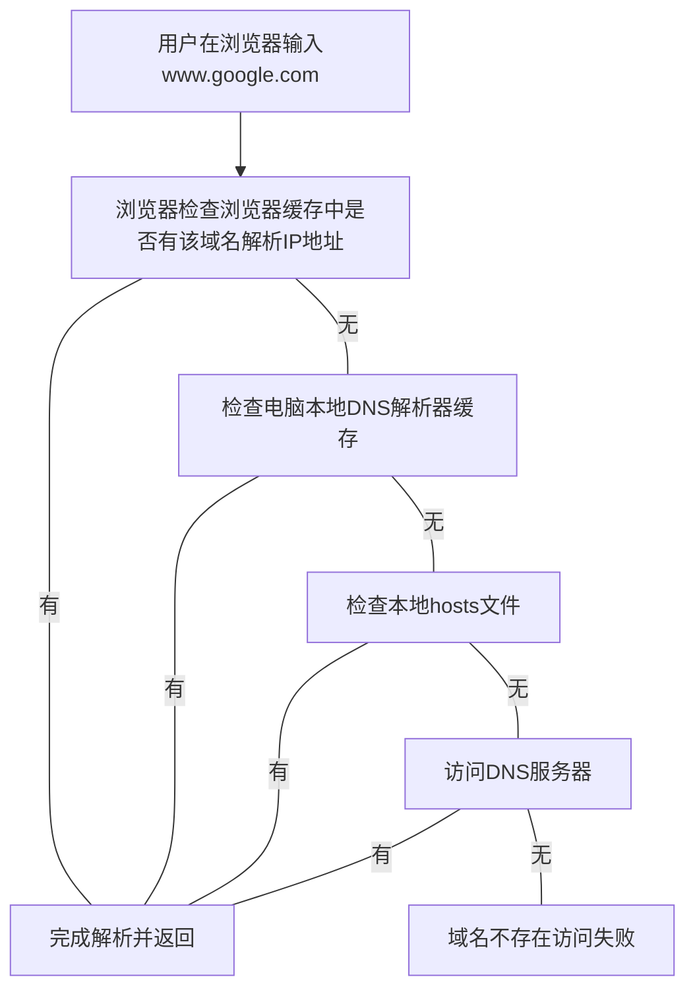

# Linux


## 1.Linux介绍

#### Linux应用场景

Linux运维工程师：服务器规划、调试优化、系统进程监控、故障处理

Linux嵌入式工程师

Linux下开发项目：JavaEE、大数据、Python、PHP、Ｃ/C++

#### Linux应用领域

个人桌面：最弱的领域

**服务器领域**：最强大的应用领域

嵌入式领域：运行稳定、对网络良好支持、低成本、内核最小可以裁剪到几百KB

#### Linux吉祥物

Tux企鹅


#### Linux作者

Linux Torvalds，Git作者、Linux作者、世界著名黑客。

#### Linux主要发行版

1. Ubuntu乌班图
2. RedHat红帽
3. CentOS（Redhat分支）
4. Debain蝶变
5. Fedora
6. SuSE
7. OPenSUSE

#### Linux特点

1. 免费
2. 稳定
3. 高效

#### Linux与Unix的关系

在20世纪70年代从贝尔实验室联合麻省理工和通用公司计划设计一个多用户分时系统，项目名称为multics，但是因为种种原因导致此项目被搁置。1969，Kenneth tompson，用B语言在multics基础上设计出来了第一代的Unix。1974年，Kenneth Thompson和Dennis Ritchie合写Unix。

IBM、SUN、HP三家公司设计了Unix的发行版本，Richard Stallman发现在当时发行版本的Unix只能在高性能的服务器主机上运行，普通PC无法运行。他发起了GNU计划（开源精神），目的是让更多的人能够使用Unix系统。


## 2.Linux安装

### 2.1虚拟机安装

VMware[下载地址](https://download3.vmware.com/software/wkst/file/VMware-workstation-full-16.1.2-17966106.exe)

可能某些电脑运行VM虚拟机需要先在BIOS设置开启虚拟化设备支持。

激活码：ZF71R-DMX85-08DQY-8YMNC-PPHV8

#### 虚拟机克隆

在原虚拟机关机的状态下，在VM软件中右击虚拟机名，选择克隆，进行虚拟机克隆。特点是克隆的虚拟系统与原系统内容完全相同，不需要从头开始镜像安装。另外，虚拟机的根文件夹的克隆不仅可以同设备进行，也可以跨设备克隆。

#### 虚拟机快照

虚拟机快照就类似于版本存档，在虚拟机的某个时间节点设置一个快照，在后期阶段出现系统异常是我们就可以回退到之前的快照。快照之间可以任意穿梭。


#### 虚拟机删除与迁移

删除：先从VM软件右击移除，再从磁盘把虚拟系统根文件夹删除。

迁移：直接迁移虚拟系统根文件夹。

#### 共享文件夹

安装vmtools，实现主机与虚拟机的文件进行互通。需要内置`gcc`。

1. 从虚拟机菜单右击安装vm-tools

   

2. 把桌面VMware Tools里面的`.gz`压缩包复制到根目录的`opt`文件夹下

3. 打开终端进入到`opt`文件夹目录

   `cd`空格后紧挨着的`/`的意思为根目录

   ```bash
   [root@bogon opt]# cd /opt
   [root@bogon opt]# ls
   rh  VMwareTools-10.3.23-17030940.tar.gz
   ```

4. 解压命令

   ```
   tar -zxvf 文件名
   ```

   ```bash
   [root@bogon opt]# tar -zxvf VMwareTools-10.3.23-17030940.tar.gz 
   [root@bogon opt]# ls
   rh  VMwareTools-10.3.23-17030940.tar.gz  vmware-tools-distrib
   ```

   解压命令输入到VM时，按`Tab`可以根据前缀VM自动补全文件名。

5. 进入解压后的文件夹目录

   ```shell
   [root@bogon opt]# cd vmware-tools-distrib/
   [root@bogon vmware-tools-distrib]# 
   [root@bogon vmware-tools-distrib]# ls
   bin  doc  etc  FILES  INSTALL  installer  lib  vgauth  vmware-install.pl
   ```

6. 安装

   ```
   ./文件名
   ```

   ```
   ./vmware-install.pl
   一顿回车
   ```

7. 从虚拟系统设置里面打开并配置好共享文件夹路径

8. Linux内共享文件夹的路径

   ```shell
   # cd /mnt/hgft/
   ```

注意：此种主机与Linux系统共享文件仅适用于两个系统在同一台主机上。当Linux系统在远程时，我们需要远程登陆Linux，使用网络进行上传下载的传输文件。

### 2.2Linux系统安装

CentOS 7.6镜像

#### 软件选择

勾选GNOME桌面下的传统X Windows兼容性、兼容性程序库和开发工具

#### Linux分区

文件系统`ext4`格式

1. boot引导分区 1GB
2. swap交换分区 与分配的内存大小一致2GB 内存不足时的补充机制 速度小于实际内存
   一个程序的执行，先要加载到内存当中去，如果当前运行的三个程序占满了分配的内存空间。如果有第4个程序想要到内存里面是进不来的，这个时候swap分区临时充当虚拟内存，等待实际内存剩余空间能容下第4个程序时，第4个程序此时从swap分区加载到实际内存中。
3. 根分区 17GB

#### KDUMP

Kdump是一个内核崩溃转储机制。在系统崩溃时，会捕获系统信息，用于诊断崩溃原因。实际生产中需要用，因为占用内存，所以日常学习可以关闭此功能。

#### root密码

工作中的各种密码强烈建议用密码生成器生成高复杂程度的密码，防止被黑。

### 2.3网络连接方式

前三个字段相同的IP地址，属于同一网段。


#### 桥接模式

可以和外部系统通信。虚拟系统占用与主机同网段的IP地址（与主机IP不同），一个网段内创建大量桥接模式的虚拟系统会造成IP冲突（不够用，一个网段最多256个IP）。双向通讯。

#### NAT模式（选用）

网络地址转换模式，是把内部私有网络地址（IP地址）翻译成合法网络IP地址的技术，虚拟系统可以和外部系统通讯，不造成IP冲突。

注意当我们用**Xshell**远程连接**Vmware**NAT网络模式的虚拟机，使用一段时间后，主机的IP会被Vmware的虚拟网卡更新，当我们用**Xshell**连接不上我们的虚拟机时，及时返回**Vmware**登陆系统查看最新**IP**。

#### 主机模式	

独立的系统，单机。

### 2.4Linux开机多个选项


前面几个选项正常启动，最后一个选项急救模式启动（系统出项问题不能正常启动时使用并修复系统）。在CentOS更新后,并不会自动删除旧内核。所以在启动选项中会有多个内核选项,可以手动使用以下命令删除多余的内核:

#### root与普通用户切换

终端提示符开头显示为`$`，则是普通用户，显示`#`为root用户。

root切到普通用户

```
su 用户名
```

普通用户切到root

```
su回车
输入管理密码
```

#### 查看当前系统内核版本

```
uname -a
```


#### 查看系统中全部的内核RPM包

```
rpm -qa | grep kernel
```


#### 删除就内核的RPM包

```
yum remove kernel-
```


#### 重启系统

```
reboot
```


## 3.Linux目录结构

实际工作Linux环境没有图形化桌面系统，只有命令行终端，程序员必须熟悉掌握文件树目录结构。

Linux的目录是规定好的，每个目录各有各的职能，硬件也映射成了文件来管理，不能随意增减文件。

——在Linux世界里，一切皆文件！

### 目录详解

#### /

根目录

#### /bin

是Binary的缩写，此目录存放着最常用的命令。

`/usr/bin`

`/usr/local/bin`

#### /sbin

s是Super User的意思，此目录存放系统管理员的系统管理程序。

`/usr/sbin` 

`/usr/local/sbin`

#### /home

是普通账户的主目录，在**Linux**中每个账户在`/homo`中都有一个自己的目录，以用户的账户名命名。

#### /root

是系统管理员/超级权限者的用户主目录。

#### /lib

是根文件系统上程序所需的动态连接共享库，类似于Windows里的`.dll`文件。几乎所有的应用程序都需要用到这些共享库。

#### /lost+found

隐藏的目录，一般情况下是空的，当系统非法关机后，存放一些文件。

#### /etc

存放所有的系统管理所需要的配置文件和子目录。

比如系统安装了**MySQL**，其配置文件**my.conf**存放那个在`/etc`中，也存储系统的相关配置文件。

#### /usr

存放用户的应用程序和文件，类似于Windows的`Program Files`目录。

#### /boot

存放**Linux**启动时需要的核心文件，包括连接文件以及镜像文件。

#### /proc

是一个虚拟的目录，时系统内存的映射，访问这个目录能获取系统信息。**（不能动）**

#### /srv

**service**缩写，存放一些服务启动之后需要提取的数据。**（不能动）**

#### /sys

是**Linux2.6**内核的一个很大的变化。该目录下安装了2.6内核中新出现的一个文件系统**sysfs**。**（不能动）**

#### /tmp

存放一些临时文件。

#### /dev

存放以文件的形式存储的硬件，类似于Windows的设备管理器。

#### /media

Linux系统会把自动识别的外设挂载到该目录下。

#### /mnt

用于临时挂载别的文件系统，可以将外部的存储挂载到`/mnt/`内。

#### /opt

给系统额外提供的存放软件安装包的目录，默认为空。

#### /usr/local

给系统额外提供的软件安装位置的目录，一般通过编译源码的方式安装的程序。

#### /var

存放不断扩充着的文件，习惯将经常被修改的目录放在这个目录下。包括各种日志文件。

#### /selinux

security-enhanced linux，是一种安全子系统，他能控制程序只能访问特定文件，三种工作模式，可自行设置。


## 4.远程操控服务器

Linux服务器是开发小组共享，Linux服务器是公网上远程的，并且正式上线的项目是运行在公网的，所以程序员需要远程登陆到Linux进行项目的管理和开发。

远程登陆的客户端有命令操作Xshell和文件传输Xftp。[下载地址](https://www.xshell.com/zh/free-for-home-school/)

### 远程登陆前的准备

#### 查询Linux系统IP地址

```shell
# ifconfig
```


#### 检查IP能否ping通

在个人系统环境的终端输入ping 远程IP

```
ping IP
```

#### 解决主机无法ping虚拟机

原因就是安装VMware时，由于防火墙等设置的影响，没有配置好Vmware的虚拟网卡，在控制面板网络中缺少VMware虚拟网卡，就没有办法保证NAT模式下虚拟网卡IP与虚拟机IP在同一网段，造成无法ping虚拟机。

1. 禁用防火墙
   1. win+r运行regedit打开注册表
   2. 按路径\HKEY_LOCAL_MACHINE\SYSTEM\CurrentControlSet\Services\MpsSvc 找到start，参数修改为“4”，确定，重启电脑。


2. 开启Device Install Service 、Device Setup Service 服务


​		最保险的关闭时先把服务改为手动再开启防止自动关闭！

3. 开启Network Setup Service 服务


4. 卸载VMware，用CCleaner清理注册表，重新安装Vmware。


### Xshell远程命令

Xshell是一个强大的安全终端模拟软件，支持SSH1，SSH2，以及Windows的TELNEYT协议。可以在Windows界面下访问远端不同操作系统的服务器，从而比较好的达到远程控制终端的目的。

#### 远程登陆

名称-主机-端口22-确定-输入登陆的用户名-密码-连接-一次性保存密钥


### Xftp远程传输文件

基于Windows平台的SFTP、FTP文件传输软件，用于Windows与UNIX/Linux传输文件。

#### 远程登陆

用户名-主机-端口22-用户名-密码-连接-一次性保存密钥

#### 解决中文乱码


从**xftp**菜单的小齿轮属性设置编码为UTF-8，即可解决。


## 5.vi与vim

**Linux**系统会内置**vi**文本编辑器，**Vim**具有程序编辑的能力，可以看做是**Vi**的增强版本，具有主动以字体颜色辨别语法的正确性、代码补完、编译及错误跳转等方便编程的功能特别丰富。

### 模式转换与常用快捷键

#### 正常模式

此模式下可以通过**移动光标**进行**删除字符**或删除整行。也可使用复制和粘贴。

以**vim**打开一个文档默认进入正常模式，按下`Esc`/`Ctrl+[`退出其他模式进入正常模式。

| 操作名称                           |  命令   |
| :--------------------------------- | :-----: |
| 拷贝光标所在行                     |   yy    |
| 单次拷贝从光标所在行向下$n$行      | **n**yy |
| 把拷贝的行粘贴到光标所在行的下一行 |    p    |
| 删除当前行                         |   dd    |
| 单次删除从光标所在行向下$n$行      |  $n$dd  |
| 定位到文档最末行                   |    G    |
| 定位到文档最首行                   |   gg    |
| 定位到第$n$行                      |  $n$G   |
| 撤销最近的一次编辑操作             |    u    |

#### 插入模式

正常模式下，按下`i`/`I`/`o`/`O`/`a`/`A`/`r`/`R`，进入编辑模式。

#### 命令行模式

正常模式下，输入`:`或`/`进入命令行模式。

| 操作名称                                                  |     命令      |
| --------------------------------------------------------- | :-----------: |
| 保存退出**vim**                                           |      :wq      |
| 如果有修改，不保存退出到正常模式。没有修改，退出**vim**。 |      :q       |
| 不保存强制退出**vim**                                     |      :q!      |
| 查找单词（区分大小写）                                    | /要查找的单次 |
| 遍历找的多个单词                                          |      按n      |
| 显示行号                                                  |    :set nu    |
| 隐藏行号                                                  |   :set nonu   |

### vim快捷键图


## 6.Linux终端命令

> 没有消息就是好消息，操作失败必然返回失败信息。

### 基础命令

| 操作名称                | 命令             |
| ----------------------- | ---------------- |
| 显示当前目录            | pwd              |
| 显示当前目录内容        | ls               |
| 清屏                    | clear            |
| 从终端显示文件信息      | cat 文件名       |
| 进入vim编辑显示文件信息 | vim 文件名       |
| 根据前缀自动补全        | `tab`            |
| 翻页                    | 空格             |
| 退出                    | CTRL+D           |
| 执行文件内的指令        | ./带有指令的文件 |

### 关机重启命令

虽然目前**shutdown/reboot/halt**命令均已经在关机和重启前自动执行**sync**命令，但工作还是要小心谨慎。

| 操作名称               | 命令                      |
| ---------------------- | ------------------------- |
| 把内存的数据同步到磁盘 | sync                      |
| 关机                   | shutdown -h now 或 halt   |
| $n$分钟后关机          | shutdown -h $n$           |
| 重启                   | shutdown -r now 或 reboot |

### 找回root密码

不同的**Linux**版本找回**root**方式不同~以下以**CentOS 7.6**演示。

1. 开机进入内核选择界面，通过按上下方向键解除自动启动系统，光标定位到我们使用的内核上按**e**。

2. 如果不确定系统是否开启了**Selinux**或者刚装完没有修改过的系统，则最好用下面的方法解决：既在以字符串"Linux16”开头的行，将光标移动到该行的结尾，然后输入`init=/bin/bash enforcing=0`(前者作用让系统登录后加载bash解释器，后者是且**关闭Selinux**)

   

3. 按下快捷键`Ctrl`+`X`启动，以单用户模式启动Linux。

   

4. 在光标闪烁位置输入`mount -o rw,remount /`，回车。图中的`mount -o rw,remount /`命令是重新挂载根目录为可写状态（`rw`表示可写，`remount`是重新挂载），在单用户模式下默认根文件系统是处于只读状态。

   

   在光标闪烁处输入`passwd`，回车，根据提示输入两次新密码。

5. 如果是系统的**SELinux**处于开启状态，并且前文修改内核选项时，没有增加**“enforcing=0”**，则此处需要多执行一条**“touch /.autorelabel”**命令以便在下次系统引导前重新标记系统中的所有相关文件，因为在**SELinux**开启时，修改**root**密码时修改**password**文件会导致**SELinux**安全上下文报错，如果前文修改内核选项时，已增加“**enforcing=0”**，那么在修改密码文件时,**Selinux**是关闭状态，因此，这里就不需要执行**“touch /.autorelabel”**命令了。

6. 配置完后，执行`exec /sbin/init`命令重启系统，过程较长，等待重启。此时，无法使用其它重启命令。

   


### 运行级别

#### 运行级别介绍

加粗为常用运行级别，也可以指定默认运行级别

0. 关机
1. 单用户（找回丢失密码）
2. 多用户状态无网络服务
3. **多用户状态有网络服务**
4. 系统未使用保留给用户
5. **图形界面**
6. 系统从重启

#### 3和5运行级别英文名称

在**/etc/inittab**文件中，摘抄如下。

```
# multi-user.target: analogous to runlevel 3
# graphical.target: analogous to runlevel 5
```

#### 切换运行级别

```
init 0123456
```

切换后某些级别需要根据提示输入账户和密码，进行登录。

#### 查看当前级别

```
systemctl get-default
```

```
[root@learnning ~]# systemctl get-default
graphical.target
```

显示当前为图形界面

#### 修改默认运行级别

修改之后在主机开机级别即为默认级别。

```
systemctl set-default 运行级别
```

### 帮助指令

#### man

获取帮助信息

``` 
man 命令/配置文件
例如 查看命令ls的帮助信息 man ls
```

#### help

获取**shell**内置命令的帮助信息

```
help 命令
```


### 文件目录指令

#### pwd

显示当前工作目录的绝对路径(从根目录开始定位，显示完整)。

```
[root@learnning ~]# cd /root
[root@learnning ~]# pwd
/root
```

#### ls

显示指定目录或文件或当前目录下的文件信息。

```
ls 选项 目录或文件
```

常用选项

`-a` 显示所有的文件和信息，包含隐藏文件。

`-l` 以列表的形式显示信息。

`-h` 以人看起来更舒服的模式显示。

更多选项可以通过使用上文介绍的`man`命令，查看`ls`的帮助信息中获得。

**选项可以组合使用**，例如`-al`表示以列表的形式显示包含隐藏文件的所有文件和信息。

#### cd

切换到指定目录，能定位绝对路径或者相对路径。

```
cd 位置
```

相对路径和绝对路径的解释，如果当前目录在`/home`，此时我们要访问`/root`。如果用绝对路径我们要执行，`cd /root`。相对路径执行`cd ../root`。

| 操作                     | 命令       |
| ------------------------ | ---------- |
| 回到用户的家目录         | cd ~或cd : |
| 回到当前目录的上一级目录 | cd ..      |

#### mkdir

 创建一个目录

```
mkdir 绝对位置
```

```shell
[root@learnning ~]# mkdir /home/sinbin/animal
[root@learnning ~]# cd /home/sinbin
[root@learnning sinbin]# ls
animal  公共  模板  视频  图片  文档  下载  音乐  桌面
```

创建多级目录

```
mkdir -p 绝对位置
```

```shell
[root@learnning sinbin]# mkdir -p /home/sinbin/animal/dog
[root@learnning sinbin]# ls
animal  公共  模板  视频  图片  文档  下载  音乐  桌面
```

#### rmdir

删除空目录**dog**

```
rmdir /home/sinbin/animal/dog
```

强制删除多级目录 谨慎操作

```
rm -rf /home/sinbin/animal
```

#### touch

创建空文件

```
touch 文件名
```

#### cp

拷贝文件到指定目录

```
cp 文件带目录或当前目录的文件名 目标目录
```

拷贝目录到指定目录

```
cp -r 目录 目标目录
```

```shell
[root@learnning home]# ls
bb  hello.txt  sinbin

[root@learnning home]# cd sinbin
[root@learnning sinbin]# ls
公共  模板  视频  图片  文档  下载  音乐  桌面

[root@learnning home]# cp -r /home/bb /home/sinbin/
[root@learnning home]# cd sinbin
[root@learnning sinbin]# ls
bb  公共  模板  视频  图片  文档  下载  音乐  桌面
[root@learnning sinbin]# cd bb
[root@learnning bb]# ls
hello.txt
```

强制拷贝覆盖不提醒

```
\cp -r 目录 目标目录
```

#### rm

删除文件带提示

```
rm 文件名
```

删除文件不带提示

```
rm -f 文件名
```

递归删除整个文件夹

```
rm -r 绝对路径
```

```shell
[root@learnning home]# ls
bb  sinbin
[root@learnning home]# rm -r /home/bb
rm：是否进入目录"/home/bb"? y
rm：是否删除普通空文件 "/home/bb/hello.txt"？y
rm：是否删除目录 "/home/bb"？y
[root@learnning home]# ls
sinbin
```

递归删除整个文件夹不提示

```
rm -rf 绝对路径
```

#### mv

文件/目录的重命名

```
mv oldName newName
```

```shell
123.md  a  b  sinbin
[root@learnning home]# mv 123.md 456.md
[root@learnning home]# ls
456.md  a  b  sinbin

[root@learnning home]# ls
b  sinbin
[root@learnning home]# mv b bb
[root@learnning home]# ls
bb  sinbin
```

移动文件/目录

```
mv 文件/目录的路径 新地址的路径
```

```shell
[root@learnning home]# mv /home/456.md /home/a
[root@learnning home]# cd a
[root@learnning a]# ls
456.md
[root@learnning a]# mv /home/a /home/b
[root@learnning a]# cd ..
[root@learnning b]# ls
a
[root@learnning b]# cd /home
[root@learnning home]# ls
b  sinbin
```

移动文件/目录 并且重命名

```
mv 文件或目录的路径 新地址的路径/新名称
```

```shell
[root@learnning home]# ls
aa  bb  sinbin
[root@learnning home]# mv aa bb/aaa
[root@learnning home]# ls
bb  sinbin
[root@learnning home]# cd bb
[root@learnning bb]# ls
aaa
```

#### cat

仅仅查看文件内容不能修改

```
cat [选项] 文件名
```

`-n`：显示行号

管道查看

```
cat 文件 | more
```

#### 管道符号

管道符号|，表示将前一个命令的处理结果输出传递给后面的命令处理。

#### more

是一个基于**VI**编辑器的文本过滤器，以全屏幕的方式按页显示文本文件的内容。**more**指令中内置快捷键。

```
more 文件
```

| 操作                           | 快捷键 |
| ------------------------------ | ------ |
| 向下翻一页                     | 空格   |
| 向下翻一行                     | 回车   |
| 立即离开more，不再显示文件内容 | q      |
| 向下滚动一屏                   | Ctrl+F |
| 返回上一屏                     | Ctrl+B |
| 输出当前行的行号               | =      |
| 输出文件名和当前行的行号       | :f     |

#### less

用来分屏查看文件的内容，与**more**指令相似，但是比**more**指令更加强大，支持各种显示终端。

less指令在显示文件内容时，并不是一次将整个文件加载之后才显示，而是根据显示需要加载内容，对于显示大型文件具有较高的效率。

```
less 文件
```

| 操作     | 快捷键                                   |
| -------- | ---------------------------------------- |
| 空格     | 向下翻动一页                             |
| pagedown | 向下翻动一页                             |
| pageup   | 向上翻动一页                             |
| /字串    | 向下搜寻字串的功能；n向下查找，N向上查找 |
| ?字串    | 向上搜寻字串的功能；n向上查找，N向下查找 |
| q        | 离开                                     |

#### echo

输出内容到控制台

```
echo 选项 输出内容
```

```shell
[root@learnning sinbin]# echo $HOSTNAME
learnning
[root@learnning sinbin]# echo $PATH
/usr/local/sbin:/usr/local/bin:/usr/sbin:/usr/bin:/root/bin
[root@learnning sinbin]# echo hello world
hello world
```

#### head

输出文件的开头部分的内容。

默认显示前10行

```
head 文件
```

指定行数

```
head -n 5 文件
```

#### tail

输出文件的尾部的内容。

默认显示前10行

```
tail 文件
```

指定行数

```
tail -n 5 文件
```

实时跟踪该文档的所有更新

```
tail -f 文件
```

#### >覆盖和>>追加

| 操作                                            | 语法                     |
| ----------------------------------------------- | ------------------------ |
| 把当前目录内容按列覆盖写入a.txt文件中           | ls -l > a.txt            |
| 把当前目录内容含隐藏文件按列追加到a.txt文件结尾 | ls -al >> a.txt          |
| cat 文件1 > 文件2                               | 将文件1的内容覆盖到文件2 |
| echo "内容" >> 文件                             | 内容追加到文件           |

如果要覆盖或追加的文件不存在，会自动创建。

#### ln

 软链接也称符号链接，类似于Windows里的快捷方式。主要存放了链接其他文件的路径。

```
ln -s 源文件/目录路径 软链接名路径
```

```shell
[root@learnning /]# ln -s /root /home/myroot
[root@learnning /]# cd /home
[root@learnning home]# ls
myroot  sinbin
[root@learnning home]# ls -l
总用量 4
lrwxrwxrwx.  1 root   root    5 7月  23 20:14 myroot -> /root #指向root
drwx------. 16 sinbin abc  4096 7月  23 15:59 sinbin
```

**myroot文件**就相当于**/root**

```shell
[root@learnning home]# cd myroot
[root@learnning myroot]# ls
anaconda-ks.cfg  password.txt  模板  图片  下载  桌面
original-ks.cfg  公共          视频  文档  音乐
```

##### 删除软链接

就使把**myroot文件**删除。

```shell
rm /home/myroot
```

#### history

查看已经执行过的命令，也可以执行历史指令。

```
history
```

显示最近使用的10个指令

```
history 10
```

执行历史编号为5的指令

```
!5
```

### 时间日期类

#### date

| 操作             | 语法                      |
| ---------------- | ------------------------- |
| 显示当前日期时间 | date                      |
| 显示当前日期     | date +%F                  |
| 显示当前年份     | date +%Y                  |
| 显示当前月份     | date +%m                  |
| 显示当前日份     | date +%d                  |
| 显示年月日时分秒 | date "+%Y-%m-%d %H:%M:%S" |

#### 设置日期时间

```
date -s "2019-05-05 20:00:00"
```

#### 同步网络时间

```
ntpdate 0.cn.pool.ntp.org
```

#### 日历

```
cal
```

指定日/月/年日历

```
[root@learnning home]# cal 5 2019
      五月 2019     
日 一 二 三 四 五 六
          1  2  3  4
 5  6  7  8  9 10 11
12 13 14 15 16 17 18
19 20 21 22 23 24 25
26 27 28 29 30 31

[root@learnning home]# cal 12 5 2019
      五月 2019     
日 一 二 三 四 五 六
          1  2  3  4
 5  6  7  8  9 10 11
12 13 14 15 16 17 18
19 20 21 22 23 24 25
26 27 28 29 30 31

[root@learnning home]# cal 2019
                               2019                               

        一月                   二月                   三月        
日 一 二 三 四 五 六   日 一 二 三 四 五 六   日 一 二 三 四 五 六
       1  2  3  4  5                   1  2                   1  2
 6  7  8  9 10 11 12    3  4  5  6  7  8  9    3  4  5  6  7  8  9
13 14 15 16 17 18 19   10 11 12 13 14 15 16   10 11 12 13 14 15 16
20 21 22 23 24 25 26   17 18 19 20 21 22 23   17 18 19 20 21 22 23
27 28 29 30 31         24 25 26 27 28         24 25 26 27 28 29 30
                                              31
        四月                   五月                   六月        
日 一 二 三 四 五 六   日 一 二 三 四 五 六   日 一 二 三 四 五 六
    1  2  3  4  5  6             1  2  3  4                      1
 7  8  9 10 11 12 13    5  6  7  8  9 10 11    2  3  4  5  6  7  8
14 15 16 17 18 19 20   12 13 14 15 16 17 18    9 10 11 12 13 14 15
21 22 23 24 25 26 27   19 20 21 22 23 24 25   16 17 18 19 20 21 22
28 29 30               26 27 28 29 30 31      23 24 25 26 27 28 29
                                              30
        七月                   八月                   九月        
日 一 二 三 四 五 六   日 一 二 三 四 五 六   日 一 二 三 四 五 六
    1  2  3  4  5  6                1  2  3    1  2  3  4  5  6  7
 7  8  9 10 11 12 13    4  5  6  7  8  9 10    8  9 10 11 12 13 14
14 15 16 17 18 19 20   11 12 13 14 15 16 17   15 16 17 18 19 20 21
21 22 23 24 25 26 27   18 19 20 21 22 23 24   22 23 24 25 26 27 28
28 29 30 31            25 26 27 28 29 30 31   29 30

        十月                  十一月                 十二月       
日 一 二 三 四 五 六   日 一 二 三 四 五 六   日 一 二 三 四 五 六
       1  2  3  4  5                   1  2    1  2  3  4  5  6  7
 6  7  8  9 10 11 12    3  4  5  6  7  8  9    8  9 10 11 12 13 14
13 14 15 16 17 18 19   10 11 12 13 14 15 16   15 16 17 18 19 20 21
20 21 22 23 24 25 26   17 18 19 20 21 22 23   22 23 24 25 26 27 28
27 28 29 30 31         24 25 26 27 28 29 30   29 30 31
```

### 搜索查找类

#### find

从指定目录向下递归遍历其各个子目录，将满足条件的文件或者目录显示在终端。

```
find 搜索范围 选项
```

| 选项         | 功能         |
| ------------ | ------------ |
| -name 文件名 | 根据名称查找 |
| -user 用户名 | 查找指定用户所有文 |
| -size 文件大小 （+nM 大于n兆、 -nM小于、nM 等于） | 按照指定文件大小查找文件 |

查找/home目录下所有txt文件
```
find /home -name *.txt
```

#### locate

快速定位文件路径。**Locate**利用实现建立的系统中所有文件名称及路径的locate数据库实现快速定位搜索的文件。locate指令无需遍历整个文件系统，查询速度较快。

```
locate 文件
```

根据它的特性，为了保证我们查询的准确性，在第一次使用前需要更新数据库或者平时定期更新数据库。

```
updatedb
```

#### which

查看Linux指令映射的文件位置

```
which 指令
```

#### grep

过滤查找文件内容

```
grep 选项 查找内容 源文件
```

`-n`显示匹配行及行号

`-i`不区分大小写

过滤查看内容

```
cat 文件 | grep 选项 要查看的内容
```

```shell
[root@learnning home]# cat -n hello.txt
     1	123
     2	abc
     3	123
     4	abc
     5	yes
     6	Yes
     7	yes

[root@learnning home]# cat hello.txt | grep -ni yes
5:yes
6:Yes
7:yes
```

### 压缩和解压

#### gzip/gunzip

主要用于单体文件的解压和压缩

````
gzip 被压缩的文件
gunzip 被解压的文件.gz
````

```shell
[root@learnning home]# gzip hello.txt
[root@learnning home]# ls
hello.txt.gz  sinbin
[root@learnning home]# gunzip hello.txt.gz
[root@learnning home]# ls
hello.txt  sinbin
```

#### zip/unzip

主要用于整个文件夹的项目的解压和压缩

```
zip -r 压缩后的文件名 被压缩的目录（不能是绝对路径，只能从该路径的上一级使用相对路径） 
unzip -d 解压后的位置 被解压的文件名
unzip (默认解压到当前文件夹)
```

用zip压缩/home下的a/时，最好cd在/home目录下执行`zip -r a.zip a`。否则在压缩时会多压缩一级目录。

zip 默认把压缩后的文件生成到当前cd的文件夹下。

#### tar

tar的压缩文件后缀名为**.tar.gz**。

```
tar -zcvf 生成的文件名.tar.gz 被打包的目录/文件（一定要从目录的上一级用相对路径，否则会多打包一级目录） 
```

```
tar -zxvf 要解包解压的文件 [-C 解压到的目录]
```

| 选项 | 作用                       |
| ---- | -------------------------- |
| -c   | 产生.tar打包文件           |
| -v   | 显示详细信息               |
| -f   | 指定压缩后的文件名         |
| -z   | 用gzip对存档进行压缩或解压 |
| -x   | 解包.tar文件               |

多种选项组合选项`f`一定要放到最后。


## 7.用户和组
### 用户

#### 用户切换注销
| 操作名称                     | 命令         |
| ---------------------------- | ------------ |
| 用户切换（不仅身份而且环境） | su - 用户名  |
| 用户切换（仅仅身份）         | su -p 用户名 |
| 注销当前用户                 | logout或exit |
当完全切换（身份和环境）到一个用户时，默认cd到用户主目录。

假设当前**xshell**连接的用户是**root** ,当把用户切换为另一个非**root**用户后，执行注销当前用户，会返回**root**用户，再次执行注销当前用户，会注销仅剩的**root**用户，回到用户选择界面。

从高权限用户切换到低权限用户不需要输入用户密码，反之需要。

#### 添加删除用户
| 操作名称                 | 命令                           |
| ------------------------ | ------------------------------ |
| 添加新用户               | useradd 用户名                 |
| 增加用户时分配组         | useradd -g 用户组 用户名       |
| 添加指定用户目录名的用户 | usreadd -d /home/目录名 用户名 |
| 删除用户保留用户主目录   | userdel 用户名                 |
| 删除用户不保留用户主目录 | userdel -r 用户名              |
添加新用户后默认在/home/下生成同名用户主目录。
一般情况下删除用户建议保留用户主目录里的工作资料。

#### 设置密码
| 操作名称       | 命令                      |
| -------------- | ------------------------- |
| 给用户添加密码 | passwd 要设置密码的用户名 |
| 修改密码       | passwd 要修改密码的用户名 |
只有自己和**root**拥有修改和添加密码的权限。

#### 查询用户信息
```
id 用户名
```

返回被查询用户的用户**uid**、组**gid**和组信息，没有此用户返回查无此人。

#### 查询登录用户
```
[sinbin@learnning ~]$ who am i
root     pts/0        2022-07-21 10:11 (192.168.159.1)
```

当我们在**sinbin**用户查询当前用户时，返回的是**root**。特别强调，此命令查询的是连接服务器的登陆用户。

### 组

#### 用户组的添加修改
Linux中每个用户必须属于一个组，不能独立于组外。
Linux中每个文件有所有者、所在组、其他组（其他组对此文件的权限划分）的概念。
系统可以对有共性（权限）的多个用户进行统一的管理。

| 操作                         | 命令                     |
| ---------------------------- | ------------------------ |
| 新增组                       | groupadd 组名            |
| 删除组                       | groupdel 组名            |
| 修改用户的组                 | usermod -g 用户组 用户名 |
| 查看当前登录用户所在组 | groups                   |

新增用户不指定组时，系统默认新建一个与用户同名的组用于存放新增的用户。

#### 用户和组相关文件

| 文件            | 内容                                                         |
| --------------- | ------------------------------------------------------------ |
| /etc/passwd文件 | 用户的配置文件：用户名:口令(隐藏):用户标识号:组标识号:注释性描述:主目录:登陆shell |
| /etc/shadow文件 | 口令的配置文件：加密口令:最后一次修改时间:最小时间间隔:最大时间间隔:警告时间:不活动时间:失效时间:标志 |
| /etc/group文件  | 组的配置文件：组名:口令:组标识号:组内用户列表                |

>shell
我们的指令是要通过~~解析器~~翻译后才能被Linux内核识别，这种解析器就是**shell**，国内用**bash shell**。

#### 修改文件/目录所有者
chown=change owner
```
chown 新的所有者的用户名 被修改的文件


[root@learnning home]# ll
-rw-r--r--.  1 root   root    0 7月  28 20:41 change.md

[root@learnning home]# chown sinbin change.md

[root@learnning home]# ll
-rw-r--r--.  1 sinbin root    0 7月  28 20:41 change.md
```
#### 修改文件/目录所在组
chgrp=change group
```
chgrp 新的组名 所修改的文件


[root@learnning home]# ll
-rw-r--r--.  1 sinbin root    0 7月  28 20:41 change.md

[root@learnning home]# chgrp abc change.md

[root@learnning home]# ll
-rw-r--r--.  1 sinbin abc        0 7月  28 20:41 change.md
```
#### 其他组
所有不是文件/目录的所有者的所在组的其他的组都叫该文件/目录的其他组。


### 权限

#### rwx解读

`r`可读：文件可以读取查看内容/目录可以`ls`列举目录下的文件。

`w`可写：目录可以进行目录内文件的创建或删除、重命名目录名。文件可以修改，但文件不代表可以删除（删除文件前提是对该文件所处的目录有可写的权限）。

`x`可执行（execute）：文件可以被执行/目录可以`cd`进入。

#### rwx数字表示

r=4，w=2，x=1

#### ls -l数据解读

```
-rw-r--r--.  1 sinbin abc      229 8月   1 19:21 change.md
```

##### 权限编号

第0位，确定文件类型。`-`是普通文件； `l`是链接，相当于快捷方式；`d`是目录，相当于文件夹；`c`是字符设备，比如键鼠；`b`是块设备，比如硬盘。

第1-3位，确定所有者对该文件的权限，权限为读、写不能执行。

第4-6位，确定所属组对该文件的权限，权限为读、不能写、执行。

第7-9位，确定其他用户拥对该文件的权限，权限为读，不能写、执行。

##### 数字

文件：硬连接数

目录：子目录数

##### 所属者

sinbin

##### 所在组

abc

##### 文件大写（字节）

229

##### 最后修改日期时间

##### 文件名

#### chmod修改文件/目录权限

##### rwx修改

u:所有者、g:所有组、o:其他人、a:所有人

给所有者设置rwx，所在组设置rx，其他人设置x

```
chmod u=rwx,g=rx,o=x 文件/目录
```

给其他人添加w权限

```
chmod o+w 文件/目录
```

给其他人禁用w权限

```
chmod o-w 文件/目录
```

##### 数字修改

相当于用数字修改权限为**rwx r-x --x**

```
chmod 751 文件/目录
```

#### chown修改文件/目录所有者

```
chown nerowner 文件/目录 新的所有者
```

递归修改目录下所有文件/目录的所有者

```
chown -R 新的所有者 路径
```

#### chown修改文件/目录所在组

```
chgrp newgroup 文件/目录 新的所在组
```

递归修改目录下所有文件/目录的所在组

```
chgrp -R 新的所在组 路径
```


## 8.定时任务调度

### crond任务调度

某个时间自动执行特定的程序或命令。

#### crontab

```
crond 选项
```

| 选项 | 作用                             |
| ---- | -------------------------------- |
| -e   | 编辑crontab定时任务 每行一个任务 |
| -l   | 查询crontab任务                  |
| -r   | 删除当前用户所有crontab任务      |

#### 重启任务调度

```
service crond restart
```

#### 任务结构

```
时间参数设置 指令
时间参数设置 脚本路径（该用户对脚本必须有执行权限的前提下）
```

#### 时间参数

五个位置依次为：分钟 小时 日 月 星期（0和7都代表日）

| 符号 | 含义                                                        |
| ---- | ----------------------------------------------------------- |
| *    | 任何时间。每一分钟/小时/天/月/星期                          |
| ,    | 不连续的时间。"0 8,12,14 * * *"代表每天8:00,12:00,14:00执行 |
| -    | 时间范围。"0 5 * * 1-6"代表每星期一到星期六的5:00执行       |
| */n  | 代表每隔多久执行一次。"*/10 * * * *"代表每隔10min执行一次   |

#### mysql案例

每天凌晨2:00点将mysql数据库testdb，备份到文件中。

1. ```
   crontab -e
   ```

2. ```
   0 2 * * * mysqldump -u root -p密码 数据库文件testdb > /home/db.bak
   ```

### at任务调度

#### 工作原理

一次性定时计划任务，at的守护进程atd会以后台的模式运行，每60秒检查任务队列，有任务时，检查作业运行时间，时间匹配执行任务。at的命令的前提是atd进程一定要在后台运行。

#### 检测当前运行的进程(atd)

```
ps -ef
```

```
[root@learnning ~]# ps -ef | grep atd
root       1086      1  0 12:55 ?        00:00:00 /usr/sbin/atd -f
root       9357   5649  0 19:49 pts/1    00:00:00 grep --color=auto atd
```

#### 任务添加

```
at 选项 时间
at> 指令
（两次CTRL+D 结束任务添加）
```

| 其他指令      | 作用             |
| ------------- | ---------------- |
| atq           | 查看队列中at任务 |
| atrm 任务编号 | 删除队列中at任务 |

#### 时间参数

1. hh:mm。时间当天没过当天执行，当天已过第二天执行。
2. 模糊时间。midnight、noon、teatime（一般是下午四点）。
3. 12小时制。加上AM/PM。例如12PM。
4. **指定日期**。格式，mm dd或yy-mm-dd。指定日期必须放在时间的后面，例如12:00 2022-08-06。
5. 相对计时法。now ＋ count time-units。count是时间数，time-units是时间单位。
6. 直接使用，today,tommor。

#### 实例

1. 19:40把ls /home下的内容追加到/home/sinbin/a.txt文件中

```
[root@learnning ~]# at 19:40
at> /bin/ls /home >> /home/sinbin/a.txt<EOT>
job 1 at Sat Aug  6 19:40:00 2022

[root@learnning sinbin]# ls
a.txt  公共  模板  视频  图片  文档  下载  音乐  桌面
[root@learnning sinbin]# cat a.txt
change.md
date.txt
fox
myroot
sinbin
```


## 9.磁盘和挂载

### 磁盘工作实用指令

| 指令                              | 作用                               |
| --------------------------------- | ---------------------------------- |
| ls -l 目录 \| grep "^-" \| wc -l  | 统计目录下文件的个数               |
| ls -lR 目录 \| grep "^-" wc -l    | 统计目录下文件的个数，包含子目录内 |
| ls -l 目录 \| grep "^d" \| wc -l  | 统计目录下目录的个数               |
| ls -lR 目录 \| grep "^d" \| wc -l | 统计目录下目录的个数，包含子目录内 |
| yum install tree                  | tree指令安装                       |
| tree 目录                         | 以树状显示目录结构                 |


### 硬盘

#### 硬盘分类

Linux硬盘分为**IDE**硬盘和**SCSI**硬盘，目前基本是**SCSI**。

对于SCSI硬盘，驱动器标识符为`sdx~`，sd表示分区所在设备的类型即**SCSI**硬盘，x表示盘号（a,b,c,d...）。~表示分区号主分区和扩展分区(1,2,3,4)，5为逻辑分区。例如sda1表示第一个SCSI硬盘的第一个分区。

对于IDE硬盘，驱动器标识符为`sdx~`，表示法与SCSI一样。

#### lsblk所有块设备信息

```
lsblk
```

```
[root@learnning home]# lsblk
NAME   MAJ:MIN RM  SIZE RO TYPE MOUNTPOINT
sda      8:0    0   20G  0 disk 
├─sda1   8:1    0  300M  0 part /boot
├─sda2   8:2    0    2G  0 part [SWAP]
└─sda3   8:3    0 17.7G  0 part /
sr0     11:0    1 53.5M  0 rom  /run/media/sinbin/VMware Tools
```

#### df文件系统磁盘使用情况

```
df -h
```

```
[root@learnning ~]# df -h
文件系统        容量  已用  可用 已用% 挂载点
devtmpfs        895M     0  895M    0% /dev
tmpfs           910M     0  910M    0% /dev/shm
tmpfs           910M   11M  900M    2% /run
tmpfs           910M     0  910M    0% /sys/fs/cgroup
/dev/sda3        18G  5.1G   13G   29% /
/dev/sdb1       991M  2.6M  922M    1% /newdisk
/dev/sda1       297M  164M  134M   55% /boot
tmpfs           182M     0  182M    0% /run/user/0
tmpfs           182M   24K  182M    1% /run/user/1000
/dev/sr0         54M   54M     0  100% /run/media/sinbin/VMware Tools
```

#### du显示目录/文件占用空间

```
du 选项 --max-depth=层数 目录/文件
```

| 选项 | 作用                     |
| ---- | ------------------------ |
| -h   | 人们习惯的单位提高可读性 |
| -a   | 包含文件                 |

```
[root@learnning fox]# du -ah --max-depth=1 /home
265M	/home/sinbin
32K		/home/fox
0		/home/myroot
4.0K	/home/change.md
4.0K	/home/date.txt
265M	/home
```

最后一行为当前目录占用的总大小。

#### 添加硬盘

在虚拟机菜单中，设置-添加硬盘-下一步-选择硬盘大小-下一步-重启系统-完成。

```shell
[sinbin@learnning ~]$ lsblk
NAME   MAJ:MIN RM  SIZE RO TYPE MOUNTPOINT
sda      8:0    0   20G  0 disk 
├─sda1   8:1    0  300M  0 part /boot
├─sda2   8:2    0    2G  0 part [SWAP]
└─sda3   8:3    0 17.7G  0 part /
sdb      8:16   0    1G  0 disk #新添加的1GB硬盘 但是没有分区 也没有挂载点也就时Linux系统无法使用
sr0     11:0    1 53.5M  0 rom  /run/media/sinbin/VMware Tools
```

#### 硬盘分区

```
fdisk 要被分区的硬盘对应的文件
```

| fdisk命令 | 作用                    |
| --------- | ----------------------- |
| m         | 显示命令帮助信息        |
| p         | 显示磁盘分区 同fdisk -l |
| n         | 新增分区                |
| d         | 删除分区                |
| w         | **写入并退出！**        |

```shell
#sdb就是我们上一步添加的1GB硬盘的NAME

[root@learnning ~]# fdisk /dev/sdb 
欢迎使用 fdisk (util-linux 2.23.2)。

更改将停留在内存中，直到您决定将更改写入磁盘。
使用写入命令前请三思。

Device does not contain a recognized partition table
使用磁盘标识符 0x0d6d175f 创建新的 DOS 磁盘标签。

命令(输入 m 获取帮助)：n
Partition type:
   p   primary (0 primary, 0 extended, 4 free)
   e   extended
Select (default p): p
分区号 (1-4，默认 1)：1
起始 扇区 (2048-2097151，默认为 2048)：2048
Last 扇区, +扇区 or +size{K,M,G} (2048-2097151，默认为 2097151)：
将使用默认值 2097151
分区 1 已设置为 Linux 类型，大小设为 1023 MiB

命令(输入 m 获取帮助)：w
The partition table has been altered!

Calling ioctl() to re-read partition table.
正在同步磁盘。

#此时查看磁盘状态 已经有了分区

[root@learnning ~]# lsblk
NAME   MAJ:MIN RM  SIZE RO TYPE MOUNTPOINT
sda      8:0    0   20G  0 disk 
├─sda1   8:1    0  300M  0 part /boot
├─sda2   8:2    0    2G  0 part [SWAP]
└─sda3   8:3    0 17.7G  0 part /
sdb      8:16   0    1G  0 disk 
└─sdb1   8:17   0 1023M  0 part 
sr0     11:0    1 53.5M  0 rom  /run/media/sinbin/VMware Tools

#但是挂载之前还需要对分区进行格式化
```

#### 硬盘格式化

```
mkfs -t 分区类型（常用ext4） 被格式化分区/dev下对应的文件
```

`-t`选项为文件系统。

```
[root@learnning ~]# mkfs -t ext4 /dev/sdb1
mke2fs 1.42.9 (28-Dec-2013)
文件系统标签=
OS type: Linux
块大小=4096 (log=2)
分块大小=4096 (log=2)
Stride=0 blocks, Stripe width=0 blocks
65536 inodes, 261888 blocks
13094 blocks (5.00%) reserved for the super user
第一个数据块=0
Maximum filesystem blocks=268435456
8 block groups
32768 blocks per group, 32768 fragments per group
8192 inodes per group
Superblock backups stored on blocks: 
	32768, 98304, 163840, 229376

Allocating group tables: 完成                            
正在写入inode表: 完成                            
Creating journal (4096 blocks): 完成
Writing superblocks and filesystem accounting information: 完成
```

### 挂载

> 挂载：mount

在Linux系统中“一切皆文件”，所有文件都放置在以根目录为树根的树形目录结构中。在Linux系统中任何硬件设备也都是文件。当Linux系统需要调用使用这些硬件时，只有相应硬件设备的目录作为Linux系统目录中的一个文件时，设备才能被Linux所调用，相应硬件的目录成为Linux系统目录中的一个文件就叫挂载。

挂载个人定义：把硬件作为文件使其在Linux系统内能被系统或用户所调用或使用。

#### 命令行手动挂载分区

挂载目录可以在根目录，也可以在其他目录，最好挂载目录是空目录，避免错误。

```shell
mount 设备名称 挂载目录
```

```shell
[root@learnning /]# mount /dev/sdb1 /newdisk

[root@learnning newdisk]# lsblk
NAME   MAJ:MIN RM  SIZE RO TYPE MOUNTPOINT
sdb      8:16   0    1G  0 disk 
└─sdb1   8:17   0 1023M  0 part /newdisk  #此时有了挂载点 挂载成功
```

**注：命令行手动挂载再重启系统之后会失效。**

#### 命令行手动取消挂载

```
umount 卸载的设备文件/卸载的挂载目录
```

```
[root@learnning newdisk]# umount /dev/sdb1
umount: /newdisk：目标忙。
        (有些情况下通过 lsof(8) 或 fuser(1) 可以
         找到有关使用该设备的进程的有用信息)

[root@learnning /]# umount /dev/sdb1

[root@learnning /]# lsblk
NAME   MAJ:MIN RM  SIZE RO TYPE MOUNTPOINT
sda      8:0    0   20G  0 disk 
├─sda1   8:1    0  300M  0 part /boot
├─sda2   8:2    0    2G  0 part [SWAP]
└─sda3   8:3    0 17.7G  0 part /
sdb      8:16   0    1G  0 disk 
└─sdb1   8:17   0 1023M  0 part 
```

我们可以看到第一次尝试卸载挂载，我们cd在newdisk目录下造成”文件忙“的问题导致失败，我们要卸载一个挂载时，尽量cd在根目录下来操作。

#### 自动永久挂载

通过修改`/etc/fstab`实现永久挂载，前提是利用命令行挂载之后再进行此步骤实现永久挂载。

```
[root@learnning /]# vim /etc/fstab

UUID=7475f080-894b-496b-b3f4-7a9375fd2189 /                       xfs     defaults 0 0
UUID=b03d91ad-64a4-4688-bfa5-3a2382553350 /boot                   xfs     defaults 0 0
UUID=090ff961-c853-4e46-bb66-7f0a240081f4 swap                    swap    defaults 0 0 

/dev/sdb1                                 /newdesk                ext4    defaults 0 0
上方如果UUID记不住可以用文件代替
```


## 10.网络

#### Linux查询IP

```
ifconfig
```

#### Windows查询IP

```
ipconfig
```

#### Ping

测试主机之间网络的连通性

```
ping 目的主机IP

ping baidu.com
```

### 网络配置

#### 自动获取IP地址

在学习生活中，为了避免IP冲突，我们大多由系统启动后自动获取IP地址。缺点是每次启动后IP地址不一样。

设置-网络-网络设置-IPv4-自动

#### 指定IP（CentOS7.9）

程序员远程开发Linux的IP地址经常变动，会对程序员开发非常不方便，我们需要给Linux远程主机固定一个IP。

步骤

1. 用`ifconfig`检查要修改的网络配置的名称。

   ```
   [root@bogon network-scripts]# ifconfig
   ens33: flags=4163<UP,BROADCAST,RUNNING,MULTICAST>  mtu 1500
           inet 192.168.159.133  netmask 255.255.255.0  broadcast 192.168.159.255
           inet6 fe80::fbc2:e385:dc00:dd82  prefixlen 64  scopeid 0x20<link>
           ether 00:0c:29:46:7a:63  txqueuelen 1000  (Ethernet)
           RX packets 19029  bytes 26306617 (25.0 MiB)
           RX errors 0  dropped 0  overruns 0  frame 0
           TX packets 4946  bytes 317433 (309.9 KiB)
           TX errors 0  dropped 0 overruns 0  carrier 0  collisions 0
   
   lo: flags=73<UP,LOOPBACK,RUNNING>  mtu 65536
           inet 127.0.0.1  netmask 255.0.0.0
           inet6 ::1  prefixlen 128  scopeid 0x10<host>
           loop  txqueuelen 1000  (Local Loopback)
           RX packets 0  bytes 0 (0.0 B)
           RX errors 0  dropped 0  overruns 0  frame 0
           TX packets 0  bytes 0 (0.0 B)
           TX errors 0  dropped 0 overruns 0  carrier 0  collisions 0
   
   virbr0: flags=4099<UP,BROADCAST,MULTICAST>  mtu 1500
           inet 192.168.122.1  netmask 255.255.255.0  broadcast 192.168.122.255
           ether 52:54:00:17:dd:b8  txqueuelen 1000  (Ethernet)
           RX packets 0  bytes 0 (0.0 B)
           RX errors 0  dropped 0  overruns 0  frame 0
           TX packets 0  bytes 0 (0.0 B)
           TX errors 0  dropped 0 overruns 0  carrier 0  collisions 0
   ```

   我们可以看到名称为**ens33**。

2. 编辑`/etc/sysconfig/network-scripts`下的网卡配置文件`/ifcfg-ens33`。(不同版本的Linux网卡文件名不同)

   ```
   [root@learnning vim /etc/sysconfig/network-scripts/ifcfg-lo
   
   TYPE="Ethernet"
   PROXY_METHOD="none"
   BROWSER_ONLY="no"
   BOOTPROTO="static"
   DEFROUTE="yes"
   IPV4_FAILURE_FATAL="no"
   IPV6INIT="yes"
   IPV6_AUTOCONF="yes"
   IPV6_DEFROUTE="yes"
   IPV6_FAILURE_FATAL="no"
   IPV6_ADDR_GEN_MODE="stable-privacy"
   NAME="ens33"
   UUID="5b672be3-fd8a-4c0e-91d9-7c58458b4b98"
   DEVICE="ens33"
   ONBOOT="yes"
   
   #IP
   IPADDR=192.168.159.133
   #网关
   GATEWAY=192.168.159.2
   #域名解析器
   DNS1=192.168.159.2             
   ```

   如果找不到**ifcfg-ens33**这个文件，重装系统。

3. 修改VM虚拟机网络设置参数

   VM-虚拟网络编辑器-VMnet8-修改IP、网关、CDN参数与步骤2修改内容一致。

4. 重启网络服务

   ```
   service network restart
   ```

### NAT

#### NAT网络原理图


#### 修改主机名

修改`/etc/hostname`文件内容为要设定的主机名

```
vim /etc/hostname
```

### Hosts

Hosts是一个本地的文本文件，用来记录IP和Hostname（主机名）的映射关系。

### DNS

#### 什么是DNS

DNS，Domain Name System的缩写，域名系统。是互联网上作为域名和IP地址互相映射的一个分布式数据库。

#### DNS解析流程



更详细的解析流程内容[访问知乎](https://zhuanlan.zhihu.com/p/88260838)

### hosts映射

在本地通过修改hosts文件，把目标IP和别名映射起来，从而使别名代替冗长的IP，别名可以任意，最好与目标IP所在主机的主机名一致。

#### 本地访问Linux虚拟机

在本地电脑上通过Linux主机名找到（ping）Linux系统。

本地电脑Windows修改`C:\Windows\System32\drivers\etc\hosts`文件

添加一行新内容为

```
Linu系统IP Linux主机名
```

#### Linux虚拟机访问本地

NAT网络模式下

```
vim /etc/hosts
VM虚拟网卡IP 本地主机名
```

