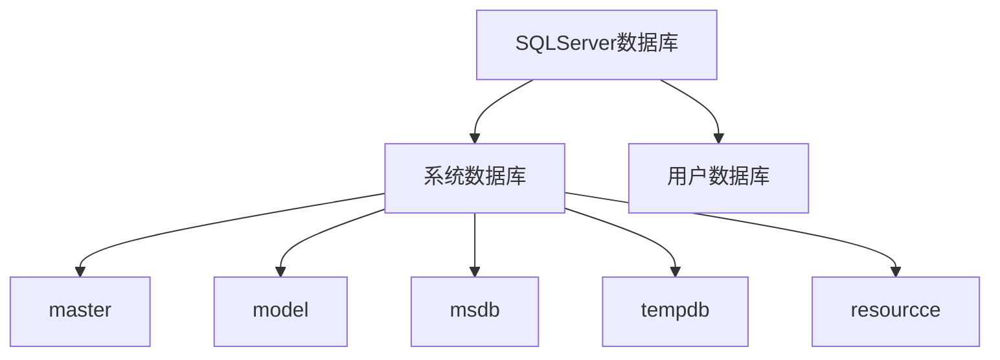

# 01x00 概论

数据管理：对数据的收集组织存储检索维护等操作，是数据处理的中心环节

## 01x01 数据管理技术的发展

#### 人工管理阶段

批处理， 计算机科学计算， 20世纪50年代中期以前， 磁盘卡片纸袋， 无操作系统

#### 文件系统阶段

联机实时处理, 大量数据管理, 磁盘, 操作系统中文件系统专门管理数据

按文件名访问, 按记录存储

#### 数据库管理阶段

二十世纪60年代中期以后, 分布式处理, 信息管理, 大容量磁盘, 软件编制和维护成本增加

1. **数据高共享性 冗余少**(最大特点)
2. **数据结构化**(与文件系统之间的根本区别)
3. 数据独立性高
4. 完整的数据管理与控制功能

## 01x02 数据库基本概念

### 数据和信息

数据: 数据库存储基本对象

信息: 经过加工处理的数据

### 数据库DB

长期存储在计算机内有组织可共享的数据集合

### 数据库管理系统DBMS

用户和操作系统之间的一层数据管理软件, **为用户或应用程序提供访问数据库的方法**, 包括数据库的建立查询更新以及各种数据控制, 是数据库系统的核心软件.

有效地实现数据库三级间的转换

### 数据库系统DBS

硬件 数据库 操作系统 数据库管理系统 数据库应用系统 用户 开发人员

### 数据库管理员DBA

保证数据库正常运行

## 01x03 数据模型

### 概念模型

独立于计算机系统的数据模型

#### E - R模型

实体-联系 - 属性

现实世界由一组成为实体的基本对象以及这些对象间的联系构成

##### 实体

实体 : 客观存在可以相互区分的事物 [矩形表示]

实体集 : 性质相同的同类实体的集合称为实体集

##### 属性

属性 : 实体的某一特性称为属性[椭圆形表示]

实体标识符：能唯一标识实体的属性或属性集

##### 联系

联系 : 实体内部的联系与实体之间的联系 [菱形]

1. 一对一
2. 一对多
3. 多对多

一对一联系是一对多联系的特例; 一对多联系又是多对多联系的特例

### 逻辑模型 

直接与DBMS有关

严格的形式化定义

逻辑模型是对应于数据世界的模型，是数据库中实体及其联系的抽象描述。

根本区别在于数据结构不同

#### 层次模型

数据库中最早出现的数据模型 , 用有向树表示

1. 有且只有一个结点没有双亲结点，这个结点称为根结点
2. 根以外的其他结点有且只有一个双亲结点。


##### 优点

1. 层次模型的数据结构比较简单清析
2. 层次数据库的查询效率高
3. 层次数据模型提供了良好的完整性支持。

##### 缺点

不能表示两个以上实体型间的多对多联系

#### 网状模型

有向图来表示各个实体之间的联系

1. 允许一个以上的结点无双亲
2. 一个结点可以有多于一个的双亲。

##### 非关系模型特点

实体间的联系本质上是通过**存取路径**表示的

##### 优点

1. 能够更为直接地描述客观世界，可表示实体间的多种复杂联系
2.  具有良好的性能和存取效率。

##### 缺点

1. 结构复杂
2. 数据独立性差

#### 关系模型

用“二维表”来表示各实体以及实体间的联系

表: 关系, 行 : 元组, 列 : 属性 分量 : 元素

##### 优点

1. 与非关系模型不同，它有较强的数学理论根据
2. 数据结构简单、清晰，无论实体还是实体之间的联系都用关系来表示
3. 存取路径对用户透明，从而具有更高的数据独立性、更好的安全保密性，也简化了程序员的工作和数据库开发建立的工作。

由于存取路径对用户透明，查询效率往往不如非关系数据模型。

### 物理模型

## 01x04 数据库系统结构

### 数据库三级模式的体系

1. 外模式[用户角度] :用户能够看到的局部数据逻辑结构和特征的描述
   1. 外部级
   2. 局部数据
   3. 最接近用户
   4. 可以有多个
2. 模式[程序员角度]
   1. 数据库中全体数据的逻辑结构和特征的描述
   2. 全局性数据视图
   3. 模式只有一个
3. 内模式[机器角度] :  也称存储模式, 独立于具体存储设备
   1. 内部级
   2. 只有一个
   3. 物理存储结构和存储方式的描述

###  三级模式结构的优点

1. 保证数据的独立性 : 应用程序和数据库的数据结构之间相互独立，不受影响

   映像 : 将模式和内模式分开，保证了数据的物理独立性；将外模式和模式分开，保证了数据的逻辑独立性。

2. 简化了用户接口

3. 利于数据共享

4. 利于数据的安全保密

# 02x00 关系数据库的基本理论

## 02x01 关系数据模型

关系数据库是支持关系模型的数据库系统 

#### 关系的数据结构

二维表

#### 关系的性质

关系是一种规范化的二维表

### 关系模式

关系模式由一个关系名和和它的所有属性名构成

#### 元数

属性的个数

#### 基数

元组(记录)的个数

#### 属性的域

属性的取值范围, 属性A的域用DOM(A)表示

### 关系

元组的集合称为关系, 关系是一种规范的二维表

- 属性值是原子的，不可分解(**关系数据库必须满足的条件**)
- 没有重复元组
- 行列的顺序无关紧要
- 列是同质的. 即每一列中的分量来自同一域，是同一类型的数据
- 不同的列可来自同一个域，但每列必须有不同的属性名。

#### 关系模式与关系

关系是关系模式在某一时刻的状态与内容。

| VS       |                      |      |
| -------- | -------------------- | ---- |
| 关系模式 | 静态的, 稳定的       | 型   |
| 关系     | 动态的, 随时间变化的 | 值   |

### 键

#### 超键

在一个关系中，能唯一标识元组的属性或属性组(可以包含多余的属性)

#### 候选键

如果一个属性组能唯一标识元组，且又**不含有多余的属性**，那么这个属性组称为关系的候选键。

一个关系的候选键可以有多个

#### 主属性

候选键中的诸属性称为诸属性

#### 非主属性

不包含在任何键中的属性

#### 主键

如果一个关系中有多个候选键, 选其中一个为主键, 主键可包含多个属性

#### 外键

设F是基本关系R的一个或一组属性, 但不是关系R的主键, 如果F与基本关系S的主键Ks相对应, 则F称是基本关系R的外键


## 02x02 关系的三类完整性约束

为了维护数据控中数据与现实世界的一致性, 对关系数据库的插入, 删除和修改操作必须有一定的约束条件

每个数据库必须有完整和参照完整性, 称为两个不变性

### 实体完整性约束

若属性(一个或一组属性)A是基本关系的主属性, 则A主属性不能取空值.

### 参照完整性约束

关系模型中实体与实体之间的联系都是用关系来描述的, 存在这关系与关系间的引用

### 用户自定义完整性约束

针对某一具体关系数据库的约束条件, 反应某一应用涉及的数据必须满足的语义要求

### 域完整性约束

关系中属性A的值应该是域DOM(A)中的值，并由语义决定其能否取空值(NULL)。


## 02x03 关系操作

集合操作方式，即操作的对象和结果都是集合。

### 传统的集合运算

传统的集合运算  是 二目运算（两个运算对象）

将关系看成元组的集合，其运算是从关系的“水平”方向，即行的角度来进行的。 

并、交、差运算，参与运算的关系必须具有相同的属性相应的属性取自同一个域。

#### 并

$\cup$ 在一个关系中插入另一个关系, 去除重复元素

#### 交

$\cap$ 从两个关系中取出相同的元组

#### 差

$-$ 从一个关系中删除另一个关系

#### 广义笛卡尔积

用于两个关系的连接操作

### 专门的关系运算

#### 选择 $\sigma$

$\sigma _{F}(R)\ =\ \{t\ \mid \ t\ \in\ R\ \and \ F(t) \ = \ true \}$

单目运算（只有一个运算对象）

根据一定的条件在给定的关系R中选取若干元组，组成一个新的关系。

从“行”的角度进行运算

= 后的常量若为字符型要用 ‘ ’

属性名也可用属性序号表示

#### 投影$\Pi$

$\Pi _A (R) \ = \ \{ t[A] \ \mid \ t \in \ R\}$

列操作, 从中选择出若干列属性, 组成新的关系, 删去重复元素, 属性名也可以用属性序号代替

#### 连接$\theta$

两个表之间的横向拼接

$R \bowtie_{A \theta B} S\ = \ \sigma_{R.A \theta R.B} (R×S)$

连接是从两个关系的笛卡尔积中选择属性间满足一定条件的元组 

$\theta$是比较运算符，又称条件连接

#### 自然连接

选取笛卡尔积中相同属性列中相等的记录, 去除重复列

当R与S无相同属性时，$R \bowtie S \ = \ R × S$

#### 等值连接与自然连接

自然连接中相等的分量必须是相同的属性组

并且要在结果中去掉重复的属性

等值连接则不必

# 03x00 SQL

### SQL语言特点

1. 高度非过程化
2. 面相集合的操作方式
3. 语法简单
4. 关系型数据库标准语言
5. 可嵌入


# 04x00 数据库与表的管理

## 04x01 数据库的分类



## 04x02 数据库的管理

### 数据库的创建

创建数据库就是为数据库确定名称, 大小, 存放位置, 文件名和所在文件组的过程

主数据文件名*.mdf与数据库名一致

```sql
CREATE DATABASE YourDatabaseName
ON [PRIMARY]
(
    NAME = 'YourDatabaseName',
    FILENAME = @DataFilePath, -- 物理文件名(路径)
    SIZE = 100MB, -- 设置初始大小（可以根据需要调整）
    MAXSIZE = UNLIMITED,
    FILEGROWTH = 10MB -- 设置文件增长大小
)
LOG ON
(
    NAME = 'YourDatabaseName_Log',
    FILENAME = @LogFilePath, -- 物理文件名(路径)
    SIZE = 50MB, -- 设置初始大小（可以根据需要调整）
    MAXSIZE = 2GB,
    FILEGROWTH = 10MB -- 设置文件增长大小
);

```

### 数据库的管理

#### 系统视图

- `sys.databases`: 查看有关数据库的基本信息
- `sys.database_files`: 查看有关数据库文件的信息
- `sys.filegroup`: 查看有关数据库文件组的信息

系统视图通过查询使用

```sql
select *
from 系统视图
where ...
```

#### 系统存储

- `sp_helpdb`: 显示指定数据库的信息
- `sp_spaceused`: 显示整个数据库保留和使用的磁盘空间

系统存储通过`exec'`执行

```sql
exec 系统存储名 数据库名
```

#### 数据库结构修改

```sql
ALTER DATABASE DATABASENAME
ADD FILE(数据文件参数) -- 添加数据文件
| REMOVE FILE 数据文件名称 -- 删除数据文件
| MODIFY FILE(数据文件参数) -- 修改数据文件
| ADD LOG FILE(日志文件参数) -- 添加日志文件
| MODIFY NAMA = 数据库名称 -- 修改数据库名称
```

#### 数据库重命名

```SQL
ALTER DATABASE DATABASENAME
MODIFY NAME = NEWNAME
```

#### 数据库删除

```SQL
DROP DATABASE DATABASENAME
```

## 04x03 表的管理

### 约束

#### 主键约束

唯一, 非空, PRIMARY KEY, 一张表最多一个主键, 可以唯一标识一列或一组列为主键, 实体完整性

#### 唯一性约束

唯一, 可空, UNIQUE

当列中数据不唯一时, 该列不可以设置唯一性约束

#### 检查约束

CHECK, 可用逻辑表达式作为约束条件, 限制一列或多列的取值范围实现域完整性

#### 默认约束

DEFAULT约束用于一列或多列设置默认值

#### 外键约束

FOREIGN KEY, 实现参照完整性, 

#### 空值/非空值约束

默认NULL / NOT NULL

### 表的创建

```sql
CREATE TABLE <表名>
(
    <列名> <数据类型> <列级约束>,
    <表级约束>
)
```

#### 列级约束的使用

```sql
CREATE TABLE <表名>
(
    <列名> <数据类型> PRIMARY KEY,
    <列名> <数据类型> UNIQUE,
    <列名> <数据类型> CHECK(逻辑表达式),
    <列名> <数据类型> DEFAULT 值,
    <列名> <数据类型> NOT NULL,
    <列名> <数据类型> REFERENCES 被参照表名(被参照主键列),
)
```

#### 表级约束的使用

必须用表级约束的情况:

1. 多个列组合构成主键约束

   ```sql
   CONSTRAINT PK_* PRIMARY KEY(列名1, 列名2, ...)
   ```

2. 多个列组合构成外键约束

   ```sql
   CONSTRAINT FK_* FOREIGN KEY(列名1, 列名2, ...) REFERENCES 被参照表(列名1, 列名2, ...)
   ```

3. 多个列组合构成唯一性约束

   ```sql
   CONSTRAINT U_* UNIQUE(列名1, 列名2, ...)
   ```

4. 当主键是多个列组合而成, 并且每个主键都有外键, 需要先声明表级主键约束, 再依次声明表级外键约束

   ```sql
   CONSTRAINT PK_* PRIMARY KEY(列名1, 列名2),
   CONSTRAINT FK_1 FOREIGN KEY(列名1) REFERENCES 被参照表(列名1),
   CONSTRAINT FK_2 FOREIGN KEY(列名2) REFERENCES 被参照表(列名2)
   ```

CONSTRAINT关键字是给约束定义一个约束名, 在表级约束定义中是可选的.

### 表的修改

```sql
 -- 修改列的数据类型
ALTER TABLE <表名>
ALTER COLUMN <列名> <数据类型> [列级约束]
 -- 添加新列
ALTER TABLE <表名>
ADD <列名> <数据类型> [列级约束]
 -- 删除列
ALTER TABLE <表名>
DROP COLUMN <列名>
 -- 应该是添加表级约束
ALTER TABLE <表名>
ADD CONSTRAINT <约束名> <约束>
 -- 删除约束
ALTER TABLE <表名>
DROP CONSTRAINT <约束名>
 -- 表重命名
EXEC sp_rename '旧表名', '新表名'
 -- 删除表
DROP table <表名>
```

# 05x00 数据管理

## 05x01 INSERT

```sql
INSERT INTO <TableName> [(c1, c2, ...)]
values (v1, v2, ...)
```

## 05x02 DELETE

```sql
DELETE
FROM <TableName>
[WHERE 逻辑表达式] 
```

## 05x 03 UPDATE

```sql
UPDATE <TableName>
SET 列名 = 值[,列名 = 值]...
[WHERE 逻辑表达式]
```

## 05x04 SELECT
