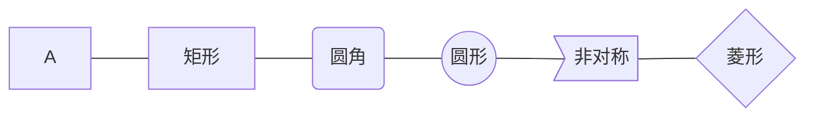
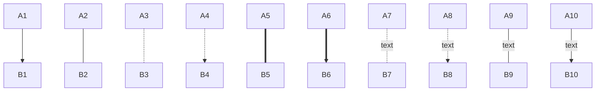

## 流程图

### Mermaid

#### 语法结构

```
graph 方向
结点以及结点连线
样式调整
```

#### 显示方向

- TB/TD从上到下
- BT从下到上
- RL从右到左
- LR从左到右

#### 节点类型

- 默认矩形：结点内容
- 矩形结点：代号B[结点内容]
- 圆角矩形：代号C(结点内容)
- 圆形节点：代号D((结点内容))
- 菱形结点：代号E{节点内容}
- 非对称结点：代号F>结点内容]



#### 结点连线

- 箭头连接：A1- ->B1
- 开放连接：A2- - -B2
- 虚线箭头连接：A3.->B3 或者 A3-.->B3
- 虚线连接：A4.-B4 或者 A4-.-B4
- 粗线箭头连接：A5==>B5
- 粗线开放连接：A6===B6
- 标签虚线连接：A7-.text.->B7
- 标签虚线箭头连接：A8 -.text.->B8
- 标签开放连接：A9- -text- - -B9
- 标签箭头连接：A10 --text-->B10



#### 结点样式

结点样式语法与矢量图**SVG**中**CSS**d额写法一致

```
style 结点 样式
```

### Flowchart

