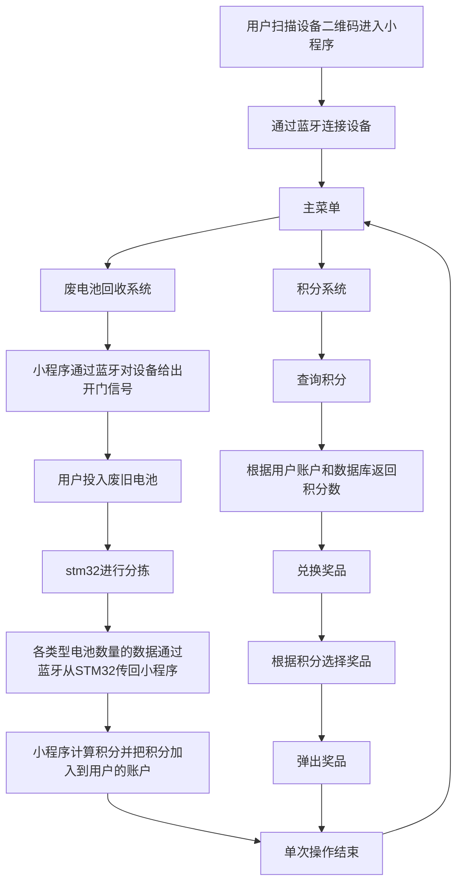

```mermaid
graph TB
用户扫描设备二维码进入小程序 --> 通过蓝牙连接设备  -->主菜单

主菜单 --> 废电池回收系统
主菜单 --> 积分系统

废电池回收系统 --> 小程序通过蓝牙对设备给出开门信号  --> 用户投入废旧电池  -->stm32进行分拣  --> 各类型电池数量的数据通过蓝牙从STM32传回小程序 -->小程序计算积分并把积分加入到用户的账户  --> 单次操作结束

积分系统 --> 查询积分 --> 根据用户账户和数据库返回积分数 --> 兑换奖品 --> 根据积分选择奖品 --> 弹出奖品   --> 单次操作结束  -->主菜单
```

