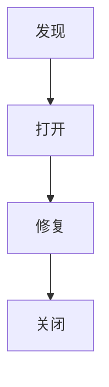
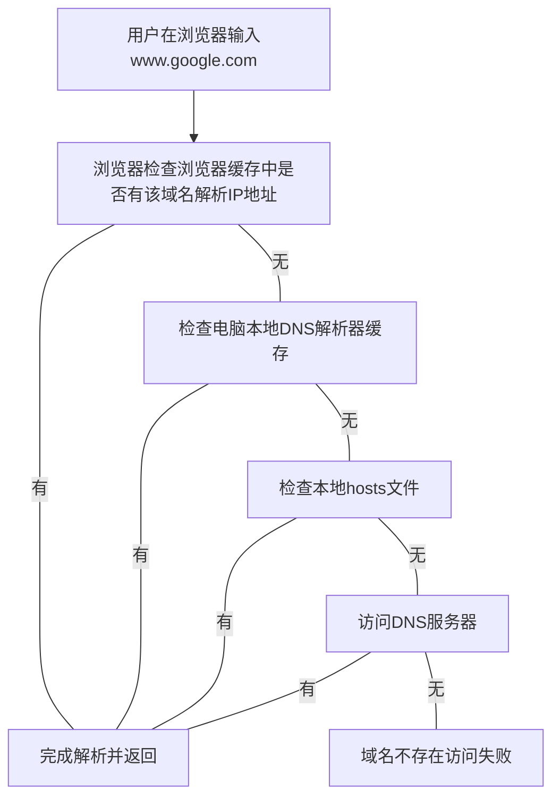
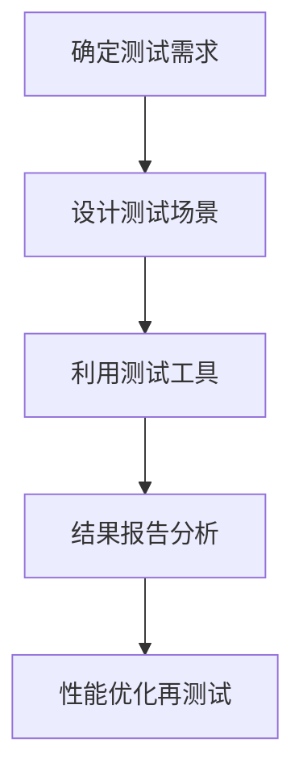

# 软件测试

> 作业：30 分
>
> 上机：30 分
>
> 考试：20 分
>
> 学习报告：20 分（笔记）
>

# 1 测试理论

## 1.1 测试角度

- 功能测试
- 界面测试
- 易用性测试
- 性能测试
- 安全性测试

## 1.2 测试用例

- 测试用例是可以独立进行测试执行的最小单元；
- 软件测试是将软件测试活动转换为标准文档；

### 测试用例基本内容

- 前置条件
- 测试数据
- 测试环境
- 测试步骤
- 期望结果

### 重要性

- 软件测试是有组织性、步骤性和计划性的；
- 测试用例是测试工作的指导，

### 测试用例质量

- 有效性
- 可复用性
- 易组织性
- 客观性
- 可评估和可管理性
- 知识传递

## 1.3 用例设计方法

### 等价类划分法

#### 定义

- 等价类是某个输入域的子集，在该**子集中每个输入数据的作用是等效的**；
- 将输入数据分成若干个等价类，从每个等价类选取一个代表性的数据作为测试用例；
- 等价类分为有效等价类和无效等价类。

#### 划分

- MECE：相互独立，完全穷尽；
- 识别全集。

### 边界类分析法

- 如果输入条件规定了值的范围，则应取港大道这个范围的边界的值，以及刚刚超过这个范围边界的值作为测试输入数据；
- 如果规定了值的个数，租用最大个数、最小个数、比最小个数少一、比最大个数多以的数作为测试数据。

## 1.4 软件缺陷

> Bug

严重性：衡量缺陷对客户满意度的影响程度

优先级：指缺陷被修复的紧急程度

### 生命周期



## 1.5 软件测试

软件测试是伴随开发过程的全过程的，开发人员开发的同时还要书写测试代码。

- 动态测试：动态测试是在程序运行时执行的测试方法，它通过实际运行软件并输入测试数据来评估软件的行为；
- 静态分析：静态分析是在软件代码的静态状态下进行的一种测试方法，它不需要实际执行程序。

### 软件测试的层次

- 单元测试
- 集成测试
- 系统测试：系统测试分为功能测试和非功能测试。
- 验收测试：在实际客户环境中与客户同时测试。

### 白盒测试

- 语句覆盖：测试用例要覆盖所有代码；
- 判定覆盖：每个判定的分支至少被执行一次；
- 条件覆盖：每个判定的每个可能结果至少被执行一次。

### 非功能测试

- 性能
- 安全性
- 稳定性
- 兼容性

## 1.6 需求定义

### 业务需求

业务需求是对组织或企业在特定项目或业务活动中要达成的目标和满足的需求，通常由高层管理人员或业务分析师定义，并着重于解决问题、实现目标以及适应市场需求的方向。

如：快递公司通过快递柜引导用户自助揽件

### 用户需求

用户需求则是从最终用户的角度出发，描述了用户对软件系统的期望和要求，包括对系统功能、性能、易用性等方面的期望。

如：用户通过快递柜自助发件

### 功能需求

功能需求是用户需求的具体化，它们描述了系统需要具备的功能和特性，以及用户希望系统如何响应和行为，是开发团队基于用户需求而定义的，用于指导软件开发、测试和交付的具体规范

如：快递柜能自助发件

# 2 用例跟踪

自动化测试平台通常提供了用例创建和用例评审的功能，让团队可以更有效地管理测试用例并确保其质量。

## 2.1 用例创建

1. **新建用例：** 在自动化测试平台上，通常有一个界面或者功能可以创建新的测试用例。用户可以点击相应的按钮或链接，进入到创建用例的界面。
2. **填写用例信息：** 在创建用例的界面，用户需要填写一些基本信息，例如用例标题、描述、前置条件、步骤、预期结果等。
3. **添加步骤：** 用户需要逐步描述测试用例的执行步骤。每个步骤通常包括一个操作（例如点击按钮、输入文本等）和一个预期结果。
4. **保存用例：** 完成用例信息和步骤的填写后，用户可以保存用例并返回到用例列表界面。
5. **管理用例：** 在用例列表界面，用户可以对已创建的用例进行管理，包括编辑、复制、删除等操作。

## 2.2 用例评审

1. **选择用例进行评审：** 通常由项目经理或者质量保障团队负责发起用例评审。他们会选择一些待评审的用例，并将其分配给相关的团队成员。
2. **评审用例内容：** 团队成员会在自动化测试平台上查看待评审的用例，并针对其中的描述、步骤、预期结果等内容进行评审。他们可能会提出修改建议、指出遗漏或错误的地方。
3. **讨论和修改：** 在评审过程中，团队成员之间可能会进行讨论，讨论用例的实现细节、覆盖范围等。根据讨论结果，可能需要对用例进行修改或者补充。
4. **确认评审结果：** 一旦评审完成，项目经理或质量保障团队会确认评审结果，并将修改后的用例状态更新为已评审或者待执行。

# 3 UI 测试

> 2024年4月11日 上机

UI 测试是验证用户界面的外观和行为是否符合设计要求，以及是否易于使用和导航；

UI 测试是自动化测试平台对一个功能或一组操作进行模拟人工执行的过程，能自动检测并记录每个步骤执行情况。

流程主要包括：创建场景、添加步骤、设定步骤、添加元素、设定参数等。

核心内容体现在两个方面：添加元素与为元素分配操作。

## 3.1 添加元素步骤

1. 浏览器访问元素所在页面；
2. 右键单击目标元素，在弹出的菜单中左键单击**检查**；
3. 鼠标光标在弹出的开发者工具栏中移动，直到目标元素显示被框起来，表示所指代码块为目标元素的代码块；
4. 右键单击代码块，复制该元素的 XPath；
5. 返回 MeterSphere 平台按照 XPath 添加元素到元素库。

> XPath: 在Web开发中，XPath通常用于定位和操作HTML文档中的元素，特别是在自动化测试和网络爬虫等场景下，XPath被广泛用于定位和操作Web页面中的元素。通过XPath，开发人员可以准确地定位页面中的元素，从而实现对页面的自动化操作和数据提取。

## 3.2 UI 测试步骤

1. 创建一个场景；
2. 根据场景操作流程添加不同的步骤；
3. 为每个步骤配置操作元素；
4. 最后保存并执行；
5. 在 “测试报告” 检查执行情况。

## 3.3 Web 元素动态 ID

在进行 ”发布文章“ 的 UI 测试时，其中一个步骤是在弹窗中的标题输入框中输入标题，几次执行测试，均卡在此处报 Error

```
xpected condition failed: waiting for presence of element located by: By.xpath: //*[@id="input_109"] (tried for 15 second(s) with 500 milliseconds interval)
```

经过手动 Debug 发现此输入框的 ID 是动态的，所以 `XPath` 失效，导致报以上信息。

```html
<input class="formkit-input bg-white resize-none w-full text-black block transition-all h-full px-3 text-sm" type="text" name="title" id="input_38">

<input class="formkit-input bg-white resize-none w-full text-black block transition-all h-full px-3 text-sm" type="text" name="title" id="input_48">
```

知道了问题所在，找到输入框元素源代码如下：

```html
<input class="formkit-input bg-white resize-none w-full text-black block transition-all h-full px-3 text-sm" type="text" name="title" id="input_48">
```

解决方法是修改元素库中标题输入框信息，将匹配模式从 `XPath ` 改为 `className ` ，匹配值为 `formkit-input` 。

# 4 接口测试

> 在界面未开发之前，可以通过接口测试来验证功能。
>
> swagger
>

## 4.1 概念介绍

### 接口

接口是指外部系统与系统之间以及内部各子系统之间的交互点。

包括外部接口、内部接口，内部接口又包括：上层服务与下层服务接口、同级接口。


### JSON

JSON（JavaScript Object Notation）是一种轻量级的数据交换格式，它基于 JavaScript 的语法，但已成为独立于编程语言的通用数据格式。JSON 易于阅读和编写，也易于机器解析和生成。它主要由两种结构构成：

1. **键值对（Key-Value Pairs）**：JSON 的基本元素是键值对，其中键是字符串，值可以是任意有效的 JSON 数据类型，如字符串、数字、布尔值、数组、对象等。键值对使用冒号（:）分隔键和值，多个键值对之间使用逗号（,）分隔。

2. **数据类型**：JSON 支持多种数据类型，包括字符串、数字、布尔值、数组、对象、null。这些数据类型可以嵌套组合，形成复杂的数据结构。

JSON 的优点包括易于阅读、易于编写、易于解析、与多种编程语言兼容等。它在 Web 开发、API 设计、配置文件等领域广泛应用。例如，在 Web 开发中，常用 JSON 作为前后端数据交换的格式；在 API 设计中，常用 JSON 作为 API 接口的数据传输格式。

### HTTP

HTTP（Hypertext Transfer Protocol）是一种用于传输超文本数据的协议，它是Web上数据传输的基础。HTTP通过客户端和服务器之间的请求-响应模型来传输数据，通常使用TCP协议作为传输层协议。HTTP是无状态的，即服务器不会保存客户端的状态信息，每个请求都是独立的，这样可以简化服务器的设计和实现。

### HTTPS

HTTPS（Hypertext Transfer Protocol Secure）是HTTP的安全版本，它通过在HTTP和TCP之间加入SSL/TLS协议来提供数据传输的安全性和加密性。HTTPS在HTTP的基础上添加了SSL/TLS的加密和身份验证机制，从而确保数据在传输过程中的机密性、完整性和可信度。HTTPS常用于安全敏感的网站，如电子商务网站、银行网站等。

### HTTP 请求方法

1. **GET** - 请求指定的资源。GET请求应该只用于获取数据，不应有副作用，即它们是安全且幂等的。
2. **POST** - 用于提交数据给服务器。例如，提交表单或上传文件。POST请求不是幂等的，意味着多次执行相同的POST请求可能会有不同的结果。
3. **PUT** - 从客户端向服务器传送的数据取代指定的文档的内容。PUT方法是幂等的，意味着无论进行多少次同样的请求，结果都是一样的。
4. **DELETE** - 请求服务器删除指定的页面。如果成功，可能返回200 (OK) 或 204 (No Content)。DELETE方法也是幂等的。
5. **HEAD** - 类似于GET方法，但没有响应体，用于获取报头。
6. **OPTIONS** - 用于描述目标资源的通信选项。
7. **PATCH** - 用于对资源应用部分修改。与PUT不同，PATCH通常不是幂等的，意味着多次相同的PATCH请求可能产生不同的结果。
8. **TRACE** - 回显服务器收到的请求，主要用于测试或诊断。
9. **CONNECT** - 将连接转换到透明的TCP/IP隧道，通常用于SSL加密服务器的链接（通过代理服务器）。

### HTTP 状态码

1. **1xx（信息性状态码）** - 代表请求已被接受，继续处理。
2. **2xx（成功状态码）** - 代表请求已成功被服务器接收、理解、并接受。
3. **3xx（重定向状态码）** - 代表需要后续操作以完成请求。
4. **4xx（客户端错误状态码）** - 代表请求包含语法错误或无法被执行。
5. **5xx（服务器错误状态码）** - 代表服务器在处理请求的过程中发生了错误。

#### 常见的HTTP状态码：

- **200 OK** - 请求成功。
- **301 Moved Permanently** - 请求的网页已永久移动到新位置。
- **302 Found** - 临时重定向。
- **400 Bad Request** - 服务器不理解请求的语法。
- **401 Unauthorized** - 请求要求身份验证。
- **403 Forbidden** - 服务器拒绝请求。
- **404 Not Found** - 服务器找不到请求的网页。
- **500 Internal Server Error** - 服务器内部错误，无法完成请求。
- **503 Service Unavailable** - 服务器目前无法使用（由于超载或停机维护）。

### SSL

SSL（Secure Sockets Layer）是一种安全传输层协议，它位于TCP/IP协议之上，为数据通信提供了安全和加密保障。SSL最初由网景公司开发，后来被TLS（Transport Layer Security）所取代。TLS是SSL的升级版本，目前广泛应用于互联网上的安全通信。SSL/TLS通过使用公钥加密技术、证书验证和对称加密等手段来确保通信的安全性。

### 域名

域名是 IP 地址的别名，由于 IP 地址是四段 0 - 255 的数字，不容易被人们记忆，所以出现了域名帮助记忆。

### DNS

DNS (Domain Name System) 域名系统，DNS 服务器用于解析域名对应的 IP 地址。它是域名和 IP 地址相互映射的分布式数据库，这些 DNS 服务器分布在全球各地，为互联网用户提供域名解析服务。

为什么需要 DNS 呢？因为本地电脑并不知道你输入的一个域名指向哪个 IP 地址，需要向 DNS 服务器发起询问，得到对应的 IP 地址。

互联网服务提供者购买完域名之后，需要先将域名和自己服务的 IP 地址的映射信息交给 DNS 机构，这样别人才可以得到解析。

#### DNS 域名空间

根域、顶级域名、二级域名、三级域名 ...

- 根域：用 `.` 表示，位于域命名空间层次结构的最高层，全球分布着 13 台根域名服务器。保存其下层的顶级域的 DNS 服务器名称和 IP 地址的对应关系；
- 顶级域名：可分为组织域 (.com, .net, org, .gov, .edu ...) 和国家域 (.cn, .jp, .me, .in)
- 二级域名：二级域位于顶级域下层，是指为了在 Internet 上使用而注册到个人或企事业单位的域名，如 google.com;
- 子域：子域是根据具体情况从二级域中按部门或地理位置创建。

#### DNS 解析过程



### CND

CDN（Content Delivery Network）内容分发网络是指一种透过互联网互相连接的电脑网络系统，利用最靠近每位用户的服务器，更快、更可靠地将音乐、图片、影片、应用程序及其他文件发送给用户，来提供高性能、可扩展性及低成本的网络内容传递给用户。

简而言之，通过分布式的多地部署服务器，提高服务覆盖率，使全世界用户都能接入更近的服务器，从而提高访问速度。


## 4.2 接口定义

- **接口定义**：接口定义是对API的详细描述,包括请求 URL 、请求方法、请求头、请求参数、响应结构等信息；
- **接口用例**： 接口测试用例是基于接口定义而创建的,用于对 API 进行自动化测试。每个测试用例实际上就是针对特定场景设置不同的请求数据,并验证API的响应是否符合预期。一个接口定义可对应多个接口测试用例。

### 接口定义与接口测试用例关系

- 接口定义是测试用例的基础，为测试用例提供被测API的详细信息；
- 接口测试用例依赖于接口定义，但测试用例需要额外指定测试数据、断言条件等具体内容；
- 一个接口定义可以对应多个测试用例，用于覆盖不同的测试场景；
- 当接口定义发生变更时，相应的测试用例也需要更新。

### 单接口测试

单接口测试不仅测试正常数据情况，也会测试反例。

### 请求参数

#### 后置操作

后置操作是执行完当前测试用例对用例数据进行操作，常见的是提取此次执行结果的部分参数。提取方法有：

1. `JSONPath`：可以便捷的从响应结果中提取参数；
2. 脚本：包括`beanshell`, `Python`, `groovy`, `JavaScript ` 等。

#### 断言

断言的作用是检查响应数据是否满足特定的条件或规则，如果不满足，则认为该测试用例失败。

常见的断言包括：

1. **响应断言**：验证 HTTP 响应、响应头部分数据、响应体返回结果等是否正确；
2. **数据断言**：判断响应体某个字段与特定值之间的关系；
3. **逻辑断言**：组合使用多个断言条件，通过与或非等逻辑运算符构建复杂断言；
4. **脚本断言**：使用 JavaScript 或其他脚本语言编写更复杂的断言逻辑。

### 运行环境

#### 域名

域名指定被测试的服务所在的主机地址。

#### 全局认证

全局认证是对整个测试运行环境中的所有接口请求的统一认证方式。

## 4.3 接口自动化

接口自动化是将一系列多个接口组合到一起，执行一个功能的全过程测试。

### 场景

场景与应用的特定功能相对应，场景是接口用例的集合，用于模拟特定的业务流程或功能。比如：删除文章、发布文章... 这些功能或场景都需要多个接口用例结合执行测试。

### 接口添加形式

接口自动化中，对接口有复制和引用两种添加形式。

- **接口测试用例复制**：在接口自动化中是独立出来的用例，两个互相隔离，在接口自动化中的修改不影响接口定义和其他地方；
- **接口测试用例引用**：引用的用例不是独立的，在接口自动化中不能修改参数，测试用例的修改，会导致接口自动化中也改变。

### 为什么部分接口单接口调试失败？

因为删除文章和发布文章的参数是一个变量，单个调试无法得到这个变量的值，需要依赖前面编写文章测试用例的提取这个参数。比如，删除文章和发布文章参数都有 `${name}` 都依靠文章的 `name` , 需要在编写文章的后置操作中提取 `name` 参数，以便后续接口使用。 

由此可知，前面接口提取的参数可以被后续接口使用。

# 5 性能测试

## 5.1 概念

### 不同视角的性能

#### 终端用户

- 响应时间

#### 开发人员

- 算法设计
- 结构设计
- 性能最佳实践
- 数据库相关
- 可测试性

#### 运维人员

- 单个用户响应时间
- 大量用户并发访问负载
- 系统容量
- 系统瓶颈
- 数据库
- 稳定性

#### 测试人员

- 系统级别的性能需求（外部）
- 准确定位根源（内部）
- 提出解决方案

### 什么是性能测试？

真实环境下，用工具模拟软件运行操作，监控系统性能指标，分析结果。

### 为什么进行性能测试？

发现并解决问题，获取性能相关指标。

### 性能测试流程



### 明确性能测试需求

- 需求 + 经验

  - 用户体验

  - 商业需求

  - 技术需求

  - 标准要求

- 指标清楚量化

- 80/20 原则：二八原则，也称为帕累托法则，是指在许多情况下，大约80%的结果来自于大约20%的原因。这个原则最初由意大利经济学家维尔弗雷多·帕累托在19世纪提出，并被广泛应用于不同领域。

> 2-5-10原则"是一个项目管理中的概念，它指的是在项目的不同阶段，问题的成本和解决难度会呈指数级增长。
>
> 具体来说，这个原则表明：
>
> 1. **在项目规划阶段（阶段一），解决一个问题的成本最低，通常是2倍的成本。** 这是因为在项目的早期阶段，问题通常较小且容易被发现和解决。此时，花费少量的资源来解决问题可以防止它们在后续阶段成为更大的障碍。
> 2. **在项目设计阶段（阶段二），解决一个问题的成本会显著增加，通常是5倍的成本。** 当项目进入设计阶段时，修改项目的方向或设计可能需要更多的工作，因为它们可能会涉及到重新设计系统或重新考虑项目的整体结构。
> 3. **在项目实施阶段（阶段三），解决一个问题的成本将急剧上升，通常是10倍的成本。** 一旦项目开始实施，修改项目的内容或结构可能需要大量的资源和时间，因为它可能会影响到已经开始实施的部分，甚至可能需要停止和重启一些工作。

### 性能指标

#### 并发用户数

- 系统潜在用户数（系统现有 5000 个用户账号）
- 业务并发用户数（某高峰时段有 2500 人使用）
- 峰值并发用户数 （2500 人中有 1000 人请求服务）

#### 响应时间

- 前端展现时间
- 系统响应时间

#### 系统吞吐量

- 每秒请求数
- 每秒页面数
- 每秒字节数
- 单位时间业务处理数量


> 随着资源使用率升高，到性能瓶颈时，系统吞吐量变低，响应时间变长。

## 5.2 平台概念

### JMeter

Apache JMeter 是一款开源的，Java 开发设计的压力和性能测试工具。它最初被用于 Web 测试，但后来扩展到其它测试领域。

- JMeter是一个功能强大的开源性能测试工具，用于模拟用户行为、测试应用程序的性能和负载情况。
- 它提供了丰富的功能和灵活的配置选项，可以支持多种协议和场景的测试。
- JMeter主要通过脚本编写来定义测试场景和行为，然后通过JMeter的引擎执行这些脚本来模拟用户行为。
- JMX 是 JMeter 软件的测试脚本文件类型。

### 与 MeterSphere 区别

- MeterSphere 是一个开源的全生命周期的 DevOps 平台，提供了包括性能测试在内的多种功能，用于支持软件开发和交付过程中的自动化和持续集成。
- MeterSphere 集成了JMeter作为其性能测试的核心引擎，用户可以在 MeterSphere 平台上通过图形化界面配置和运行 JMeter 测试，并且可以结合其他功能，如监控、报告等，实现全面的性能测试管理和分析。
