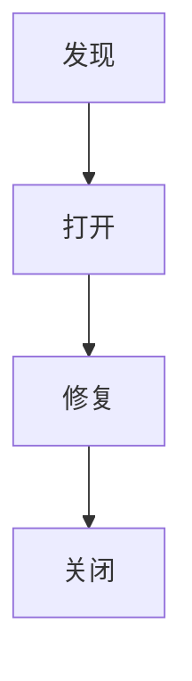

# 软件测试

> 作业：30 分
>
> 上机：30 分
>
> 考试：20 分
>
> 学习报告：20 分（笔记）
>

# 1 测试理论

## 1.0 前置知识

在本节课的学习过程中我学习到了以下几个测试技术方面的专业术语：

1. 功能用例：功能用例相当于我们日常使用一个网站的步骤或操作；
2. 评审计划：评审计划是评审创建的功能用例是否合理，功能用例被评审通过就可以执行测试计划；
3. 关联缺陷：关联缺陷是一个功能用例测试过程中可能出现的异常情况，比如登录失败等；
4. 测试计划：测试计划是对一个或多个功能用例进行相应的测试，查看执行结果是否与执行结果一致；
5. 接口测试：验证软件系统的不同模块之间的接口是否正常工作，确保它们之间的通信和数据传输正确；
6. UI测试：验证用户界面的外观和行为是否符合设计要求，以及是否易于使用和导航；
7. 性能测试：评估软件系统在各种条件下的性能和稳定性，包括响应时间、吞吐量、并发用户数等指标；
8. 单元测试：测试软件系统中的最小可测试单元（通常是函数或方法），以确保其功能的正确性；
9. 开源：开源是指对一个软件或项目的源代码开放给公众，公众可以对项目代码进行修改、使用；
10. 开源平台：开源平台是负责托管开源项目的平台，用户可以从平台上检索开源项目；
11. 个人博客：个人博客是一个网站，用于对外发布个人文章，所有人都可以访问和阅读；
12. halo博客框架：halo博客框架是一个简单强大的博客建站工具，它是国人开源的；类似的博客建站工具还有WordPress、Hexo等都是方便用户一键搭建个人博客网站的好工具；

## 1.1 测试角度

- 功能测试
- 界面测试
- 易用性测试
- 性能测试
- 安全性测试

## 1.2 测试用例

- 测试用例是可以独立进行测试执行的最小单元；
- 软件测试是将软件测试活动转换为标准文档；

### 测试用例基本内容

- 前置条件
- 测试数据
- 测试环境
- 测试步骤
- 期望结果

### 重要性

- 软件测试是有组织性、步骤性和计划性的；
- 测试用例是测试工作的指导，

### 测试用例质量

- 有效性
- 可复用性
- 易组织性
- 客观性
- 可评估和可管理性
- 知识传递

## 1.3 用例设计方法

### 等价类划分法

#### 定义

- 等价类是某个输入域的子集，在该**子集中每个输入数据的作用是等效的**；
- 将输入数据分成若干个等价类，从每个等价类选取一个代表性的数据作为测试用例；
- 等价类分为有效等价类和无效等价类。

#### 划分

- MECE：相互独立，完全穷尽；
- 识别全集。

### 边界类分析法

- 如果输入条件规定了值的范围，则应取港大道这个范围的边界的值，以及刚刚超过这个范围边界的值作为测试输入数据；
- 如果规定了值的个数，租用最大个数、最小个数、比最小个数少一、比最大个数多以的数作为测试数据。

## 1.4 软件缺陷

> Bug

严重性：衡量缺陷对客户满意度的影响程度

优先级：指缺陷被修复的紧急程度

### 生命周期

## 1.5 软件测试

软件测试是伴随开发过程的全过程的，开发人员开发的同时还要书写测试代码。

- 动态测试：动态测试是在程序运行时执行的测试方法，它通过实际运行软件并输入测试数据来评估软件的行为；
- 静态分析：静态分析是在软件代码的静态状态下进行的一种测试方法，它不需要实际执行程序。

### 软件测试的层次

- 单元测试
- 集成测试
- 系统测试：系统测试分为功能测试和非功能测试。
- 验收测试：在实际客户环境中与客户同时测试。

### 白盒测试

- 语句覆盖：测试用例要覆盖所有代码；
- 判定覆盖：每个判定的分支至少被执行一次；
- 条件覆盖：每个判定的每个可能结果至少被执行一次。

### 非功能测试

- 性能
- 安全性
- 稳定性
- 兼容性

# 2 系统测试

业务需求：快递公司通过快递柜引导用户自助揽件

用户需求：用户通过快递柜自助发件

功能需求：快递柜能自助发件
