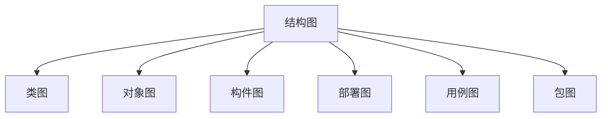
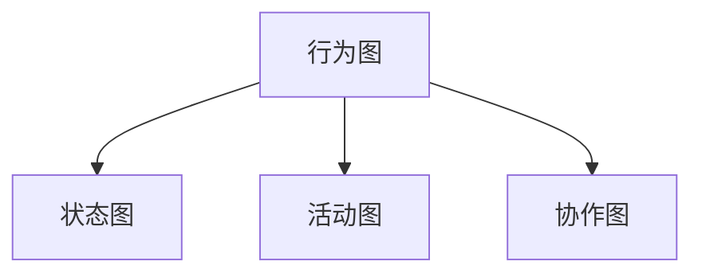

# 软件系统分析与设计

> 上机 3 - 10 周
>
> 周五 A111
>
> 作业：15%
>
> 上机：15%
>
> 期末：70%

# 0 面向过程和面向对象

### 面向过程方法

数据的正确性和完备性十分重要

### 面向对象方法

- 封装
- 聚合
- 继承
- 接口：每个对象都有多个外貌
- 多态：多个对象可能张相同的脸

#### 模型

模型是对一个对象或物体的简化表示

#### 建模

建立模型的过程

#### 软件建模

编码前对软件应用的设计

# 1 建模

> 建模是对现实的简化

人、事、物、规则

用例驱动

#### 控制类

表述原始需求中的动态信息，转化为计算程序或控制程序

#### 实体类

静态，可以转化为数据库表

#### 边界类

静态，可以转化话为操作界面或者系统接口

#### 概念模型到设计模型转化规则

- 软件的架构和框架

### 公式

$$
问题领域 = \sum_1^n\ 抽象角度\\
抽象角度=问题领域边界之外的参与者的业务目标=业务用例\\
业务用例= \sum_1^n\ 特定场景\\
特定场景 = 静态的事物 + 特定的条件 + 特定的动作\\
特定的事 = 特定的事物 + 特定的规则 + 特定的人的行为\\
$$

# 2 UML

## 2.1 软件建模

软件是产品而非程序，与其他工业产品一样，生产者与制造者分离；

模型是现实世界的简化；

## 2.2 UML

UML（Unified Modeling Language）统一建模语言是可视化的**建模语言**。（You Mast Learn）

> 语言：是人类进行沟通和交流的表达方式；
>
> 统一目标：形成标准；
>
> 统一语言：实现最大程度的沟通、提升可读性；
>
> 可视化：UML 采用可视化的图形方式定义语言；

UML 定义了一些元素称为**原模型**，相当于语言中的基本词汇。

UML 定义了原模型互相之间关系的规则，以及如何用这些元素和规则绘制图形以建立模型来映射现实世界，相当于语法。

UML 是独立于过程的，不是程序设计语言，但是描述的模型可以与各种编程语言相联系。

UML 不是一种系统设计的方法，是系统建模的标准。

## 2.3 UML 工具

- 纸笔
- Visio 等专业绘图软件

## 2.4 UML 图

### 结构图

描述系统组成元素之间的静态结构；

### 行为图

描述系统元素的动态行为；

## 2.5 UML 特点

- 统一标准
- 面向对象
- 可视化
-  

# 4 用例图

用例图可以形象的表述系统的所有需求

表示用例与参与者之间的关系的图

用例图从用户角度来描述系统功能

用例驱动的软件开发

## 4.2 用例图的构成

1. 参与者
2. 用例
3. 关系

### 参与者

特征：作为外部用户与系统发生交互

是系统外部与系统直接交互的用户或事物

参与者是从现实世界中抽象出来的一种形式

参与者是角色的抽象

一个参与者可以参与一个或多个用例

1. 人
2. 设备
3. 外部系统
4. 时间

#### 识别参与者

1. 为系统提供输入的人或事物
2. 接收系统输出的人或者事物
3. 需要接入的第三方系统或设备
4. 时间是否会触发某些事件
5. 负责支持或维护系统信息中的人

### 用例

#### 概念

表示系统执行的一组动作，他会给系统或者参与者产生一组可观察的结果，用例用来描述系统的一个功能；

一个用例可以隶属一个或多个参与者；

#### 表示

椭圆

#### 特点

1. 用例是动宾短语形式出现的；
2. 用例是相对独立的：用例在功能上是完备的，可以独自完成参与者的某个目的，无需与其他用例交互；
3. 用例是参与者启动的：用例是参与者请求或触发的；
4. 用例的执行结果对参与者来说是可观测的和有意义的；
5. 一个用例是一个单元；

#### 用例粒度

- 用例粒度是用例组织信息的方式和细化程度；
- 无论粒度大小如何，都需要符合用例特征；

### 关系

1. 参与者之间的关系
2. 参与者与用例之间的关系
3. 用例之间的关系

#### 参与者间泛化关系

描述多个参与者之间的公共关系。

#### 关联关系

参与者与用例之间存在关联关系

#### 用例间的泛化关系

给用例抽象出一个父用例

#### 用例间的包含关系

一个基用例可以包含其他用例（被包含用例），体现复用 。

被包含的用例也可以直接执行。

#### 用例间的扩展关系

新的行为加入到已有的用例中，获得的新用例叫扩展用例。原有的用例叫做基础用例，从扩展用例到基础用例的关系就是扩展关系；

一个基础用例可以拥有一个或多个扩展用例，这些扩展用例可

扩展用例执行需要触发扩展点

一个用例可以有多个扩展点

## 4.3 用例描述

用来描述用例的一段格式文字说明，也称为用例说明；

- 用例编号：用例的唯一标识
- 用例名：用例名称，动宾短语
- 参与者：与用例关联的参与者
- 前置条件：执行本用例前系统状态
- 后置条件：执行用例之后系统状态
- 事件流程：用例执行的流程
