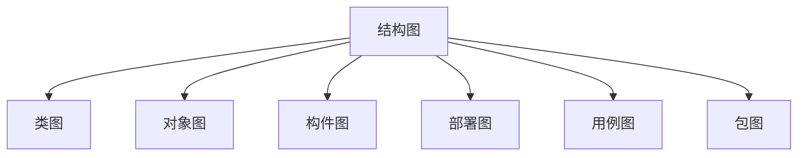
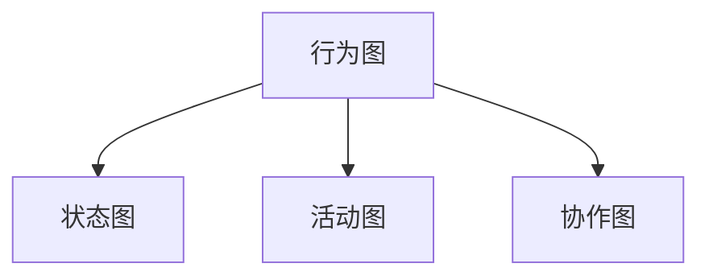

# 软件系统分析与设计

> 上机 3 - 10 周
>
> 周五 A111
>
> 作业：15%
>
> 上机：15%
>
> 期末：70%

# 0 面向过程和面向对象

### 面向过程方法

数据的正确性和完备性十分重要

### 面向对象方法

- 封装
- 聚合
- 继承
- 接口：每个对象都有多个外貌
- 多态：多个对象可能张相同的脸

#### 模型

模型是对一个对象或物体的简化表示

#### 建模

建立模型的过程

#### 软件建模

编码前对软件应用的设计

# 1 建模

> 建模是对现实的简化

人、事、物、规则

用例驱动

#### 控制类

表述原始需求中的动态信息，转化为计算程序或控制程序

#### 实体类

静态，可以转化为数据库表

#### 边界类

静态，可以转化话为操作界面或者系统接口

#### 概念模型到设计模型转化规则

- 软件的架构和框架

### 公式

$$
问题领域 = \sum_1^n\ 抽象角度\\
抽象角度=问题领域边界之外的参与者的业务目标=业务用例\\
业务用例= \sum_1^n\ 特定场景\\
特定场景 = 静态的事物 + 特定的条件 + 特定的动作\\
特定的事 = 特定的事物 + 特定的规则 + 特定的人的行为\\
$$

# 2 UML

## 2.1 软件建模

软件是产品而非程序，与其他工业产品一样，生产者与制造者分离；

模型是现实世界的简化；

## 2.2 UML

UML（Unified Modeling Language）统一建模语言是可视化的**建模语言**。（You Mast Learn）

> 语言：是人类进行沟通和交流的表达方式；
>
> 统一目标：形成标准；
>
> 统一语言：实现最大程度的沟通、提升可读性；
>
> 可视化：UML 采用可视化的图形方式定义语言；

UML 定义了一些元素称为**原模型**，相当于语言中的基本词汇。

UML 定义了原模型互相之间关系的规则，以及如何用这些元素和规则绘制图形以建立模型来映射现实世界，相当于语法。

UML 是独立于过程的，不是程序设计语言，但是描述的模型可以与各种编程语言相联系。

UML 不是一种系统设计的方法，是系统建模的标准。

## 2.3 UML 工具

- 纸笔
- Visio 等专业绘图软件

## 2.4 UML 图

### 结构图

描述系统组成元素之间的静态结构；

### 行为图

描述系统元素的动态行为；

## 2.5 UML 特点

- 统一标准
- 面向对象
- 可视化
-  
