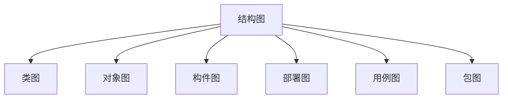
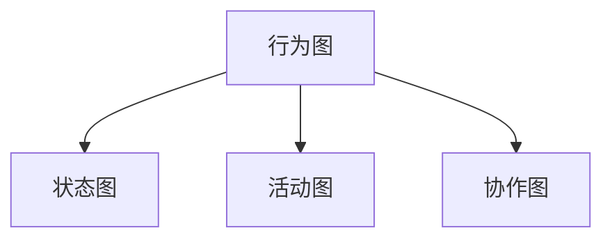

# 软件系统分析与设计

> 上机 3 - 10 周
>
> 周五 A111
>
> 作业：15%
>
> 上机：15%
>
> 期末：70%

# 0 面向过程和面向对象

### 面向过程方法

数据的正确性和完备性十分重要

### 面向对象方法

- 封装
- 聚合
- 继承
- 接口：每个对象都有多个外貌
- 多态：多个对象可能张相同的脸

#### 模型

模型是对一个对象或物体的简化表示

#### 建模

建立模型的过程

#### 软件建模

编码前对软件应用的设计

# 1 建模

> 建模是对现实的简化

人、事、物、规则

用例驱动

#### 控制类

表述原始需求中的动态信息，转化为计算程序或控制程序

#### 实体类

静态，可以转化为数据库表

#### 边界类

静态，可以转化话为操作界面或者系统接口

#### 概念模型到设计模型转化规则

- 软件的架构和框架

### 公式

$$
问题领域 = \sum_1^n\ 抽象角度\\
抽象角度=问题领域边界之外的参与者的业务目标=业务用例\\
业务用例= \sum_1^n\ 特定场景\\
特定场景 = 静态的事物 + 特定的条件 + 特定的动作\\
特定的事 = 特定的事物 + 特定的规则 + 特定的人的行为\\
$$

# 2 UML

## 2.1 软件建模

软件是产品而非程序，与其他工业产品一样，生产者与制造者分离；

模型是现实世界的简化；

## 2.2 UML

UML（Unified Modeling Language）统一建模语言是可视化的**建模语言**。（You Mast Learn）

> 语言：是人类进行沟通和交流的表达方式；
>
> 统一目标：形成标准；
>
> 统一语言：实现最大程度的沟通、提升可读性；
>
> 可视化：UML 采用可视化的图形方式定义语言；

UML 定义了一些元素称为**原模型**，相当于语言中的基本词汇。

UML 定义了原模型互相之间关系的规则，以及如何用这些元素和规则绘制图形以建立模型来映射现实世界，相当于语法。

UML 是独立于过程的，不是程序设计语言，但是描述的模型可以与各种编程语言相联系。

UML 不是一种系统设计的方法，是系统建模的标准。

## 2.3 UML 工具

- 纸笔
- Visio 等专业绘图软件

## 2.4 UML 图

### 结构图

描述系统组成元素之间的静态结构；

### 行为图

描述系统元素的动态行为；

## 2.5 UML 特点

- 统一标准
- 面向对象
- 可视化
- 

# 4 用例图

用例图可以形象的表述系统的所有需求

表示用例与参与者之间的关系的图

用例图从用户角度来描述系统功能

用例驱动的软件开发

为了降低图的复杂度，可以按照参与者的不同，分别列出相关的用例。

## 4.2 用例图的构成

1. 参与者
2. 用例
3. 关系

### 参与者

参与者：**系统之外**与系统交互的人或事物。

- 主动发起动作的才是参与者，也叫主角；
- 参与者可以不是人；
- 作为外部用户与系统发生交互
- 是系统外部与系统直接交互的用户或事物
- 参与者是从现实世界中抽象出来的一种形式
- 参与者是角色的抽象
- 一个参与者可以参与一个或多个用例

1. 人
2. 设备
3. 外部系统
4. 时间

#### 业务工人

在系统边界之内被动参与业务，不是参与者。是配角，工作是为了完成主角的业务目标。

#### 识别参与者

1. 为系统提供输入的人或事物
2. 接收系统输出的人或者事物
3. 需要接入的第三方系统或设备
4. 时间是否会触发某些事件
5. 负责支持或维护系统信息中的人

### 用例

#### 概念

表示系统执行的一组动作，他会给系统或者参与者产生一组可观察的结果，用例用来描述系统的一个功能；

一个用例可以隶属一个或多个参与者；

一个用例是参与者如何使用系统，获得什么结果的一个集合；

#### 表示

椭圆

#### 特点

1. 用例是动宾短语形式出现的；
2. 用例是相对独立的：用例在功能上是完备的，可以独自完成参与者的某个目的，无需与其他用例交互；
3. 用例是参与者启动的：用例是参与者请求或触发的；
4. 用例的执行结果对参与者来说是可观测的和有意义的；
5. 一个用例是一个单元；

#### 用例粒度

- 用例粒度是用例组织信息的方式和细化程度；
- 无论粒度大小如何，都需要符合用例特征；

#### 用例的识别

- 用例是为参与者服务的
- 不是步骤和系统的规则
- 用例对参与者来说是**有价值的**

### 关系

1. 参与者之间的关系
2. 参与者与用例之间的关系
3. 用例之间的关系

#### 参与者间泛化关系

描述多个参与者之间的公共关系。

#### 关联关系

参与者与用例之间存在关联关系

#### 用例间的泛化关系

给用例抽象出一个父用例

#### 用例间的包含关系

一个基用例可以包含其他用例（被包含用例），体现复用 。

被包含的用例也可以直接执行。

#### 用例间的扩展关系

新的行为加入到已有的用例中，获得的新用例叫扩展用例。原有的用例叫做基础用例，从扩展用例到基础用例的关系就是扩展关系；

一个基础用例可以拥有一个或多个扩展用例，这些扩展用例可

扩展用例执行需要触发扩展点

一个用例可以有多个扩展点

## 4.3 用例描述

用来描述用例的一段格式文字说明，也称为用例说明；

- 用例编号：用例的唯一标识
- 用例名：用例名称，动宾短语
- 参与者：与用例关联的参与者
- 前置条件：执行本用例前系统状态
- 后置条件：执行用例之后系统状态
- 事件流程：用例执行的流程

# 5 类图

类图显示一组类、接口以及它们的关系；

类图中不一定列出全部的内容；

## 5.2 类的种类

### 类

类是一组相同属性、操作、方法、关系和行为的对象描述符。

类名：字符、数字、下划线，大驼峰原则；

属性：描述类的静态特征

属性名小驼峰；

- 公有：+
- 私有：-
- 受保护：#

职责：指类承担的责任和义务；

### 抽象类

抽象类：把相同的方法或属性从这些具体类中抽取出来，封装到一个抽象类中；

抽象类不能直接实例化类；

抽象类和抽象方法用斜体表示；

> 父类不需要实现方法，可以把这些方法抽象出来，形成抽象类，每个子类只需重写这些抽象方法；

### 接口

接口是一个被命名的操作集合用于描述类或组件的一个服务；

接口类似抽象类，接口的方法都是抽象方法，不属于任何类或类型；

一个类可以实现多个接口；

接口没有私有特性；

**接口是一种标准，一种规范**

接口是特殊的抽象类，只有方法没有属性；

$------△$

接口还有棒棒糖表示法，圆圈 ○ 旁为接口名称，接口方法在实体类中出现。

## 5.3 类的关系

### 关联

类之间的实例间的连接关系，表名一个类的对象与另一个类的对象有关联；

#### 关联名

关联名描述关联的作用，简洁的说明对象间关系；

关联名不是必须的，如果模型无歧义，关联名可以不写，但模型有多重角色时，要写明关联名；

#### 导航性

关联具有方向性，由源类指向目标类；

- 单向关联
- 双向关联

#### 角色

角色写在关联的两端，也叫关联端名。角色是关联中一个类对另一个类表现出来的职责。

当模型之中有多重关系，必须用关联名或角色来消除歧义；

#### 符号

- . 代表多个
- 1.. 代表一个或多个
- , 代表或

#### 自反关联

类与自己关联。

#### 限定关联

在目标对象之间进行选择，将多降为一。限定符常用于一对多或多对多关联。

#### 派生关联

派生关联的名字前有一个斜杠 / 

#### 关联类

### 泛化

相反继承

空心三角实线

### 聚合

表示整体与部分之间的关系，体现了复杂事务可以由简单实物组成的面向对象的思想；

- 传递性
- 反对称性

空心菱形

### 组合

强聚合，部分类完全隶属于整体类，部分类不能独立于整体类。比如人和脑袋。

实心菱形

### 实现

一个元素完成另一个元素的操作功能。

### 依赖

一个事物（独立事物）的改变将影响另一个事物（依赖事务）。

A ------> B | A 依赖于 B

## 5.5 分析类

- 边界类: << boundary >>
- 实体类:  << control >>
- 控制类: << entity >>

> 【三种类的符号】

### 边界类

描述外部参与者与系统之间的交互，如对话框、报表、外部设备或系统。

边界类通过用例确定

每一个参与者与用例的**交互**都有一个边界类

#### 分类

- 用户界面类：参与者与用例之间建立边界类
- 系统接口类：帮助与其他系统进行通信的类
- 设备接口类：外部设备

### 实体类

保存永久信息，最终映射到数据库中的表和字段。

实体类和数据库中的表不一定是一一对应的关系。

实体类对象可以出现在多个用例中，实体类与控制类直接交互，不能与边界类进行直接交互。

### 控制类

对一个或几个用例所特有的控制行为进行建模。

一般每个**用例**有一个控制类，控制用例中的和事件顺序，控制类也可以在多个用例间共用。 

控制类会向其他类发送消息。

## 5.6 绘制类图

### 类图的抽象层次

- 概念类：只有类名，不考虑细节；
- 分析类：包含一些类的细节特征，不针对具体语言；
- 设计类：针对具体的语言，考虑类的实现细节。

1. 分析问题域，确定需求
2. 寻找类，确定类的含义和职责定义类的属性和操作
3. 确定类之间的关系
4. 简化类与类间的关系

### 寻找类

## 5.7 设计原则 *

### 设计目标

- 高可用
- 高可靠
- 高性能
- 高可支持性

### 设计原则

#### LSP

替换原则：子类不能添加任何父类没有的附加约束。子类对象必须可以替换基类对象。

尽量不要从具体类继承，行为集中的方向是向上的，数据集中的的方向是向下的。

#### OCP

开放 - 闭合原则：软件实体应该是可扩展的，但是不能修改。

- 对扩展开放
- 对修改封闭

关键在于抽象，抽象预见了所有可能得扩展，由抽象可以随时导出新的类。

子类的可替换性保证父类无需修改，就能扩展新的类。

#### SRP

#### ISP

#### DIP

# 8 顺序图

## 8.1 概念

顺序图是按时间顺序显示对象交互的图，表名那些对象通过消息相互协作实现。

### 作用

- 细化用例的表达
- 有效描述类职责的分配方式

## 8.2 组成元素

- 对象：系统内类的实例，三种命名方法；
- 生命线：每个对象的底部中心位置都有一条垂直的虚线；
- 激活（控制焦点）：生命线上的一个矩形，表示对象处于激活状态；
- 消息：从一个对象向另一个对象发送信号或调用操作。
  - 调用：实现箭头
  - 返回：虚线箭头
  - 创建对象：对象创建，生命线开始
  - 销毁对象：对象销毁，生命线终止，用叉号表示
  - 同步消息：发送者把控制传递给消息接受者，可以显示返回，也可隐式返回
  - 异步消息：发送消息之后，继续自己的活动，不等待接受者返回信息或控制（使用半箭头）

调用是同步的机制，信号是一种异步的机制。

## 8.3 结构化控制

### alt

表示分支的操作符，支持多条件。

如果表示多个条件分支，需要使用【区域分割线】分解出多个区域。

### loop

循环执行，指导判断条件为假，表示循环的操作符。

### break

跳出

### critical

在临界区域中，生命线上的事件序列不能和其他区域中的任何其他事件交错。

### par

表示并行的操作符。

### ref

用来在一个交互图引用另一个交互图。

####  opt

条件为真才执行，类似单分支。

| 类图     | 用例图       | 顺序图                     |
| -------- | ------------ | -------------------------- |
| 静态结构 | 动态         | 动态                       |
| 类       | 参与者、用例 | 对象                       |
|          |              | BCE 模式：边界、控制、实体 |

- 实体对象不能发送消息给边界对象和控制对象；
- 参与者对象只能和边界对象互动；
- 针对一个用例，可以对应生成一个控制对象；
- 顺序图从左到右依次为：参与者对象、边界对象、控制对象、实体对象。
