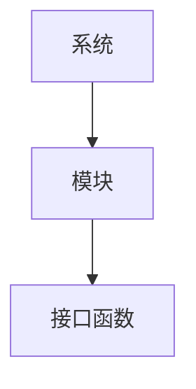
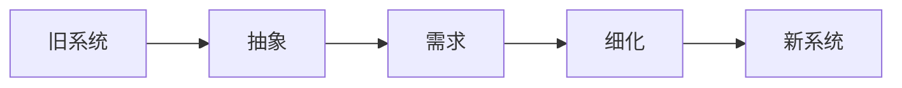

# 软件详细设计

> 《软件工程 第10版》
>
> 24课时理论
>
> 24课时实践（项目、需求、设计、测试）
>
> 平时：10
>
> 测验：30
>
> 期末：30
>
> 文档：30

## 01x00 项目管理

### 概念

项目：为了得到某种交付物，付出的**临时**的一次性努力

临时性：有开始和结束时间

独特性：可借鉴不可直接复用

项目管理：利用知识、标准、规定和手段（方法论）从制定计划P、执行D、监控CA，**PDAC**基本流程

管理内容（十大管理）：整体、范围、**沟通、进度、成本**

### 沟通管理

沟通是解决问题的最好方法之一

#### 沟通方法

- 主动
- 实时
- 了解对方的沟通风格
- 解决沟通的障碍
  - 语义障碍：多干系人
  - 认知障碍：同源信息的不同理解

#### 沟通成本

沟通和沟通渠道有关

渠道数 =$ N * (N - 1) / 2$

### 成本管理

项目管理者不对利润负责，遵守基线

#### 成本核算（挣值管理EVT）

项目总预算BAC

计划值PV：到某一时间节点，计划完成要完成的工作量。

实际成本AC

挣值EV：实际创造的价值

成本偏差CV = EV - AC

成本绩效CPI = EV / AC

进度偏差SV = EV - PV

进度绩效SPI = EV / PV

完工尚需成本ETC = (BAC - EV) / CPI 

完工尚需时间EVT = 剩余月数 / SPI

#### 纠偏

分析原因、消除原因，不可消除改变计划采取纠偏措施 

### 变更管理

> 软件是虚拟抽象的，不具体不能明确衡量，需求变更是常见的行为。软件开发过程中，一成不变的是变更。

#### 需求变更流程

1. 客户或开发人员将变更申请提交至项目经理
2. 项目经理组织资源评估影响
3. 提交至变更控制委员会（CCB）【双方高层】进行评审
4. 更新计划，按新计划实施
5. 验证变更的有效性

### 软件工程

#### 软件失效

1. 不断正增长的系统复杂性
2. 未采用有效的软件工程方法（合适）

#### 软件组成

代码、文档（四级制度，文档级别和面对的客户有关与复杂程度无关）、数据

#### 软件开发成本

- 开发60%
- 测试40%

#### 软件类型

- 自主研发：专用系统、直接成本高、完全定制、间接成本低
- 外购：通用系统、直接成本低、不可定制、间接成本最高；
- 外包：直接成本低、部分定制、间接成本低

#### 软件过程

复杂软件项目，优先安排过程计划（制定 - 评审），然后制定管理计划（PDCA）

- 软件规格说明：定义需求（功能、非功能、设计约束），**需求规格说明书**，生成之后具有法律效力。
- 软件开发：对软件进行设计、编程实现和测试（测试软硬件、需求文档）（设计约好，实现起来越简单）文档被评审
- 软件确认：不是软件测试，检查需求的满足性
- 软件维护：适应性、纠错性、改善型

异构性：同层同协议、中间件

扩展性：规模（云、Docker）、性能（优先提高单点性能）

web socket 存储 知识产权

##  02x00 团队管理

### 制定人力资源计划（P）

明确角色、职责和汇报关系

人才与人手搭配，团队不需要全是人才，3 - 5 人一组。

### 组建团队（D）

- 事先分派（初期）
- 谈判（内部行为，自顶向下谈判）
- 招募（外部行为）

### 监控（CA）

#### 建设团队

提高成员的能力

- 激励：内部评分

#### 管理团队

提高绩效

解决冲突问题：观察和对话

虚拟团队：充分利用了事假和空间的互补，强化沟通

# 2. 软件过程

#### 瀑布模型

瀑布模型每个阶段的结果是一个或多个审批通过的文档，阶段评审是结束当前阶段并开启下一阶段的依据。

- 速度快
- 回溯困难，变更影响大
- 适合于需求比较确定和明确的小型项目（大型项目对质量要求高、需求不明确）

适用于：

- 嵌入式
- 关键性
- 大型软件系统的一部分

#### 增量式开发

- 修改工作量少
- 容易得到客户的反馈
- 可以早期向用户交付和部署
- 管理成本高
- 新的增量添加会导致系统结构退化
- 过程不可见

变形：原型模式（抛弃型、演化型）、喷泉、迭代、螺旋（风险）

#### 集成与配置

客户用的软件构建库以及一个用于**构建组装**的集成框架，质量高（构建经常被使用，质量得到提升）。

库是松耦合产物 ，框架紧耦合。

追求开发进度采用框架，但是后期技术迭代导致维护困难；追求长期维护采用库组件；

### 2.4 过程改进

过程改进分为两种形式：自上而下的审计、自下而上的过程分析；

成熟度模型：CMMI软件管理成熟度模型、PMMI项目管理成熟度模型、AMMI智能制造成熟度模型

五过程成熟度模型；

### 2.5 版本控制

保留所有的历史版本 CVS

版本号：标识主要的里程碑 

X.Y.Z

1. X: 主版本，架构改变
2. Y: 次版本，功能改变
3. Z: 修改状态

# 4 需求

> 需求要与设计和代码实现相匹配

## 需求层次

- 用户需求：使用自然语言和图形对需求的大概陈述（高层抽象），在招标文件中使用；
- 产品需求：主要功能描述，出现在工作说明书或合同中；
- 系统需求：精确定义无歧义的需求，形成《需求规格说明书》，与合同同等地位；

## 需求工程

- 获取：和用户沟通获取需求（功能【具体的】、非功能），对应层次获取（战略需求 - 高层决策、流程 - 中层管理、具体操作 - 基层），形成《用户需求说明书》；
  - 非功能需求：抽象、不易衡量、可能影响系统的整个架构，而不是单个构件，应采用弹性保用扩展；
  - 有量化指标的性能是功能需求；
- 分析：需求建模，解决需求冲突（以结果为导向，优先满足后置流程方的需求）；
- 定义：达到精确无歧义的定义，多方签字确认；
  - 自然语言说明；
  - 结构化规格说明：通常是结构化表单（类似需求跟踪矩阵），能保证统一性；（功能、描述、输入、输出、动作、来源、目地）
  - 图形化表示法：UML、图示、伪码、数学规格说明（结合语言描述、枚举、状态机、正则表达式）；
- 确认：检查需求是否定义了客户真正想要的系统的过程，产品和需求规格一致。软件测试是检验产品是否符合标准，在需求确认前完成，交付用户通常进行确认，使用跟踪矩阵记录。

#### 需求规格说明

- 背景：定义文档所期望的读者人群、描述版本历史
- 术语表
- 用户需求定义
- 系统需求规格说明：功能需求、非功能需求（将影响系统体系结构）

## 需求管理

求得对需求的理解

取得对需求的承诺

**维护需求的双向跟踪特性**

管理需求变更

## 系统流程图

系统流程图概括描述物理系统的传统工具，表达数据在系统各部件之间的流动情况。面向过程。

### 符号

- 矩形：处理
- 平行四边形：输入输出
- 圆形：连接
- 箭头：数据流
- 矩形三角：换页连接

CRT 终端，句柄，文件 IO ，标准输入0 、输出 1、错误 2

事务：一个完整的操作，不能拆分，确保数据的 ACID 特性。

AOP：面向切面编程。

## 数据流图

- 数据输入输出
- 数据处理
- 数据存储
- 流

## 数据字典

关于数据信息的集合，也是对数据流图中包含的所有元素的说明。

顺序、选择、重复 => 正则表达式

## 分析

结构化分析、面向对象分析可以应用到需求工程中

### 结构化分析

可面向用户、开发人员

结构化设计：自上而下的分解过程

# 5 系统建模

系统建模可以服务于任何阶段，取决于细化程度。

## 面向对象分析

系统建模是建立多视角的抽象模型，可以在需求、设计、运维方面反复迭代。

从多个视角看待系统，但是**不追求完备性**。

### 视角

- 外部视角：环境视角 context, 用于确定边界；
- 交互视角：偏动态 - 时序图
- 结构视角：偏静态：各个组件结构合理化
- 行为视角：事件回调，异常转换 - 通信图

## 5.1 上下文模型

定义系统的边界或系统内部主模块之间的边界。

FS 关系：结束开始关系

并行关系：可以同时进行

活动图可以显示系统所处的业务过程，PDM 前导图。

## 5.2 交互视角

表现为：

- 用例图：角色和功能交互接口的描述，4 + 1 视图核心（描绘场景）；
- 时序图：模块设计层面，调用 - 返回模式

## 5.3 结构视角

- 类图
- 部署图
- 包图

### 类关系

- 依赖：use, 方法的形参或局部变量使用了其他类对象；
- 关联：has - a, 持有对方对象为成员属性；
- 聚合：collection, 持有对方对象的集合，可以独立存在；
- 组合：part - of, 不可以独立存在；
- 实现：is - a, 继承只有纯虚函数的接口；
- 继承：is - a, 继承具有成员属性的类，复用属性；

## 5.4 行为视角

事件驱动的视角，预安排策略，当某特定事件发生产采取策略处理。是异步编程的表现。ECF 编程

基于 MDA 设计（全流程自动化）

# 6 系统架构

## 6.1 概念

体系结构关注软件的基本结构，也称为架构。体系结构设计贯穿项目始终。需求和设计之间的桥梁，高层抽象描述。

体系结构的成果物是一个以 ADL 去描述的体系结构模型。

不存在万能通用的架构模式，根据实际需求选择合适的架构，通常受**非功能**性需求影响。

#### 软件体系

- 大体系结构：关注复合体 ERP ESB 企业服务总线
- 小体系结构：关注子程序的分解过程 MVC

软件体系结构受非功能需求影响较大。

- 可靠性：$\frac{MTBF}{MTBF+MTTR}$ 提供冗余，并联模式
- 可用性：提高质量属性
- 安全性：多层包装

#### 复用的层次

1. 代码复用：函数
2. 算法复用：常规算法、框架集合（List，STL）
3. 设计复用：面向对象关系、设计原则、设计模式
4. 框架复用：库、框架

#### 常见架构风格

1. 数据流风格：依次处理来自系统 shell 
   - 批量处理：每个环节都是数据的整体；
2. 管道过滤器：sed, awk, | grep
3. 分层风格，多层次调用，下层为上层提供服务：OSI, TCP/IP, CSD, C2, 3*C/S

## 6.2 体系结构视图

4 + 1 软件体系结构视图模型

- 逻辑视图：实现：exe / dll
- 进程视图：并发、健壮性
- 部署视图：软硬件结合问题
- 物理视图：任务的分解
- 用例视图：场景的分析和处理

## 6.3 体系结构模式

### 调用 / 返回体系结构

- 结构性的函数调用
- 面向对象的属性和方法

### 分层体系结构

下层为上层提供服务，上层使用下层提供的接口 (SAP)

- 2层 C/S 架构：分布式，C 具备处理能力，维护困难，移植困难
- 3层 C/S 架构：扩充了后端的数据持久层，
- 通用 C 的 B/S 架构：应用广泛，浏览器
- C2 架构：构建之间通过连接件通讯
- MVC：属于设计模式，适用于 Web GUI
- ORM：对象关系模型，程序和数据库的映射

### 共享体系结构

> 类似总线 BUS

- 知识库体系结构：静态共享，适用于 IDE 开发
- 黑板体系结构：动态共享

### 作业处理风格

- 批处理：每个环节都要求完整数据（整体数据加载到内存）
- 管道过滤器风格：流的方式进行处理（每次加载数据的一部分）

### 虚拟机风格

解释，透明不同平台的差距，VM，Docker

## 6.4 应用体系结构

> 具体领域

- 事务处理TPS：通常不考虑用户介入，批处理
- 信息系统MIS：提供简易界面接口操作数据库
- 办公系统OAS：程序流转（知识库、管道过滤器）
- 语言处理系统（专家系统）：知识库 + 批处理 + 虚拟机风格
