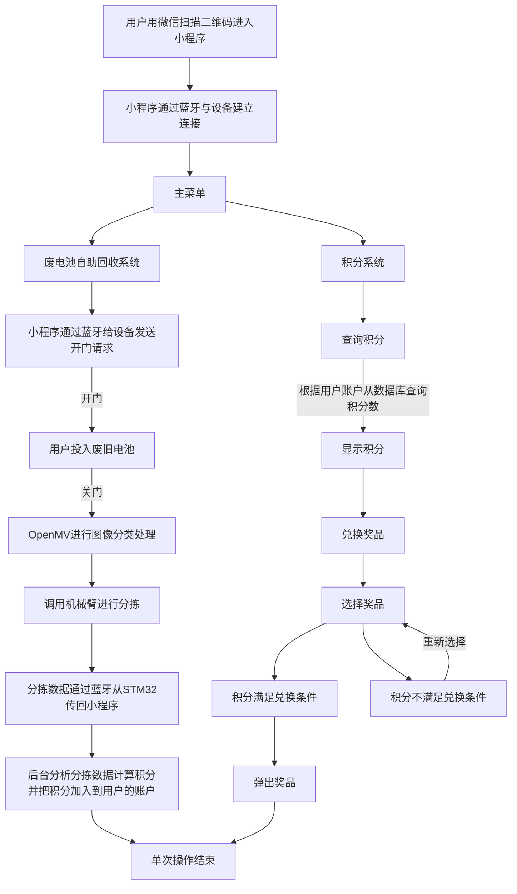

```mermaid
graph TB
用户用微信扫描二维码进入小程序 --> 小程序通过蓝牙与设备建立连接  -->主菜单

主菜单 --> 废电池自助回收系统
主菜单 --> 积分系统

废电池自助回收系统 --> 小程序通过蓝牙给设备发送开门请求  --开门--> 用户投入废旧电池  --关门--> OpenMV进行图像分类处理  --> 调用机械臂进行分拣 --> 分拣数据通过蓝牙从STM32传回小程序 -->后台分析分拣数据计算积分并把积分加入到用户的账户  --> 单次操作结束

积分系统 --> 查询积分 --根据用户账户从数据库查询积分数 --> 显示积分--> 兑换奖品 --> 选择奖品 --> 积分满足兑换条件-->弹出奖品   --> 单次操作结束

选择奖品 --> 积分不满足兑换条件--重新选择-->选择奖品
```

