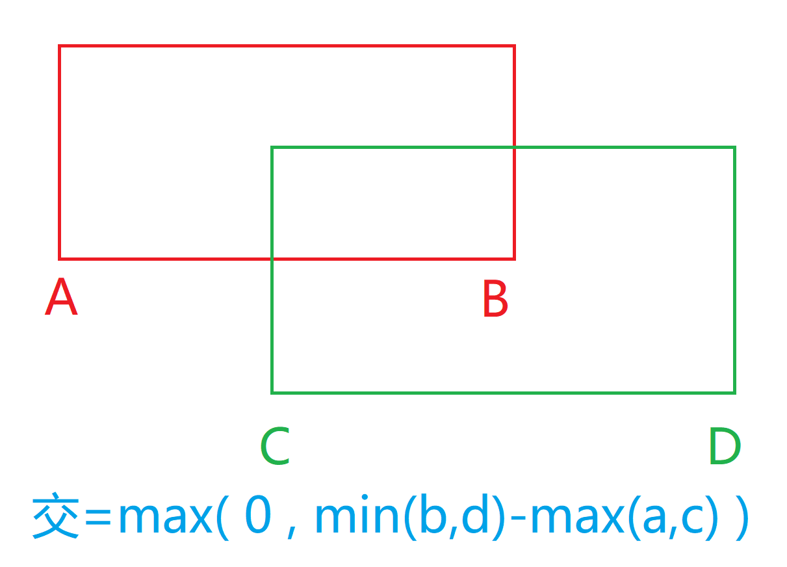
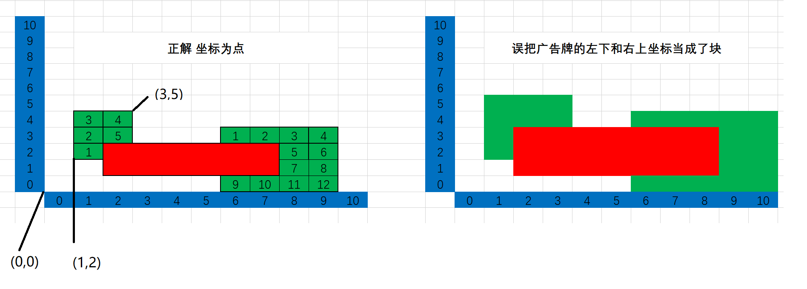
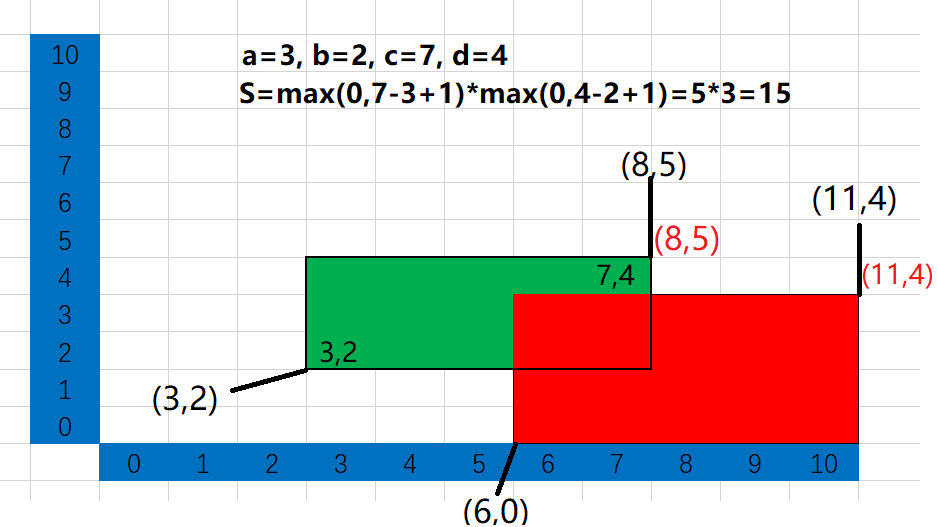

# 区间求交

## 广告牌的面积

给定两个广告牌的位置和卡车的位置，请计算两个广告牌的仍然可见的总面积。

卡车可能挡到两个广告牌或只挡到其中一个，或都挡不到。

#### 输入格式

第一行包含四个整数$ x1,y1,x2,y2，其中 (x1,y1) 和 (x2,y2) $表示在贝茜的二维视野中，第一个广告牌的左下角和右上角坐标。

第二行按照如上形式，包含四个整数，表示第二个广告牌的左下角和右上角坐标。

第三行按照如上形式，包含四个整数，表示卡车侧面的左下角和右上角坐标。

#### 输出格式

输出两个广告牌的仍然可见的总面积。

#### 数据范围

$−1000≤x1,y1,x2,y2≤1000$
保证两个广告牌之间重叠面积为 $0$。

#### 输入样例：

```
1 2 3 5
6 0 10 4
2 1 8 3
```

#### 输出样例：

```
17
```

#### 样例解释

第一块广告牌的可见面积为 $5$，第二块广告牌的可见面积为 $12$。

### 给定两个二维平面的两个矩形的左下角和右上角的坐标，如何求这两个矩形的重叠面积？

1. 求两个矩形在 $x$ 轴方向上的公共长度
2. 求两个矩形在 $y$ 轴方向上的公共长度
3. 两个轴的公共长度相乘f

注：图中的公式只适用于本题，还需要具体问题具体分析是否需要+1。



### 在本题的求长度为什么两个参数相减不用+1呢？

因为，给定的是广告牌的左下和右上的坐标（是点，不是块），这样我们直接相减后不用＋1得到的正好是广告牌实际的长度。具体可参考我拿Excel做的样例的图。

我最开始看完y总的代码没咋绕过来边界的问题，经过手动模拟后，豁然开朗。



#### AC代码

```c++
#include<bits/stdc++.h>
using namespace std;
int a[3][4];  //存储下标

int get(int a,int b,int c,int d)  //返回公共区间长度
{
    return max(0,min(b,d)-max(a,c));  //对0取max 未交为负数
}

int sum(int x)  //返回广告牌的面积
{
    return (a[x][2]-a[x][0])*(a[x][3]-a[x][1]);
}

int main()
{
    for(int i=0;i<3;i++)
        for(int j=0;j<4;j++)
            cin>>a[i][j];
    
    int ss=0;  //卡车与两个广告牌重叠的面积之和
    for(int i=0;i<2;i++)
    ss+=get(a[i][0],a[i][2],a[2][0],a[2][2])*get(a[i][1],a[i][3],a[2][1],a[2][3]);
    
    cout<<sum(0)+sum(1)-ss;
    return 0;
}
```


## 广告牌的面积II

牛饲料广告牌位于割草机广告牌的前面，有可能将其遮挡住。贝茜希望割草机广告牌能够完全从自己的视线中消失。

她计划用矩形防水布覆盖割草机广告牌的其余部分，使得她能完全看不到割草机广告牌。

给定两个广告牌的位置，请帮助贝茜计算她所需要的防水布的最小面积。

由于谷仓中只有矩形的防水布，因此贝茜发现为了将割草机广告牌完全遮盖，所需的防水布面积可能会大于割草机广告牌的裸露面积。

防水布在放置时，其边必须与广告牌的边平行，即不能倾斜放置。

#### 输入格式

第一行包含四个整数 $x1,y1,x2,y2$，其中 $(x1,y1)和 (x2,y2)$ 表示割草机广告牌的左下角和右上角坐标。

第二行按照如上形式，包含四个整数，表示牛饲料广告牌的左下角和右上角坐标。

牛饲料广告牌可能完全遮盖了割草机广告牌，或部分遮盖了割草机广告牌，也可能完全没有遮盖割草机广告牌。

#### 输出格式

输出用来遮盖割草机广告牌的防水布的最小面积。

#### 数据范围

$−1000≤x1,y1,x2,y2≤1000$

#### 输入样例：

```
3 2 8 5
6 0 11 4
```

#### 输出样例：

```
15
```

#### 样例解释

虽然牛饲料广告牌遮盖住了割草机广告牌的右下角的一部分，但这并没有起到作用。

想要完全遮盖割草机广告牌，仍然需要一块和它尺寸相同的防水布。



#### AC代码

```c++
#include<bits/stdc++.h>
using namespace std;
const int N=2010,k=1010;
bool st[N][N];

int main()
{
    int a,b,c,d;
    //以下为什么不是i<=c呢？
    //根据样例和手动画图可知 需要去掉边界 详细手动解释可看上一题的题解
    cin>>a>>b>>c>>d;
    for(int i=a;i<c;i++)
        for(int j=b;j<d;j++)
            st[i][j]=true;
    
    cin>>a>>b>>c>>d;
    for(int i=a;i<c;i++)
        for(int j=b;j<d;j++)
            st[i][j]=false;
    
    a=b=N,c=d=-1;
    for(int i=a;i<c;i++)
        for(int j=b;j<d;j++)
            if(st[i][j])
            {
                a=min(a,i),c=max(c,j);
                b=min(b,i),d=max(d,j);
            }
    //根据画图可知 此时需要+1
    int w=max(0,c-a+1),h=max(0,d-b+1);
    cout<<h*w;
    return 0;
}
```

