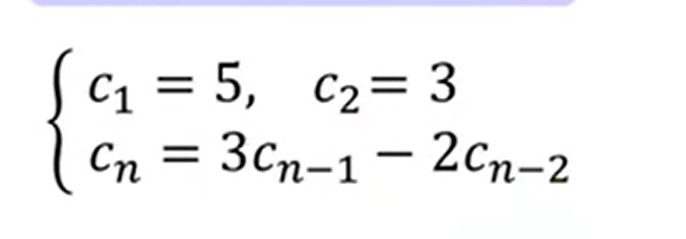
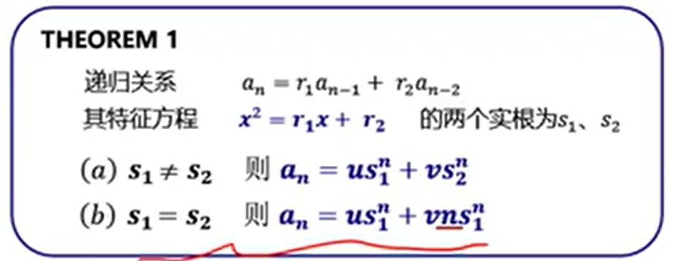
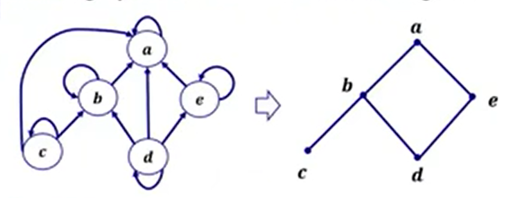
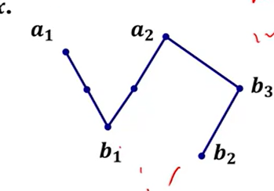
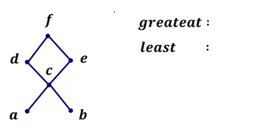
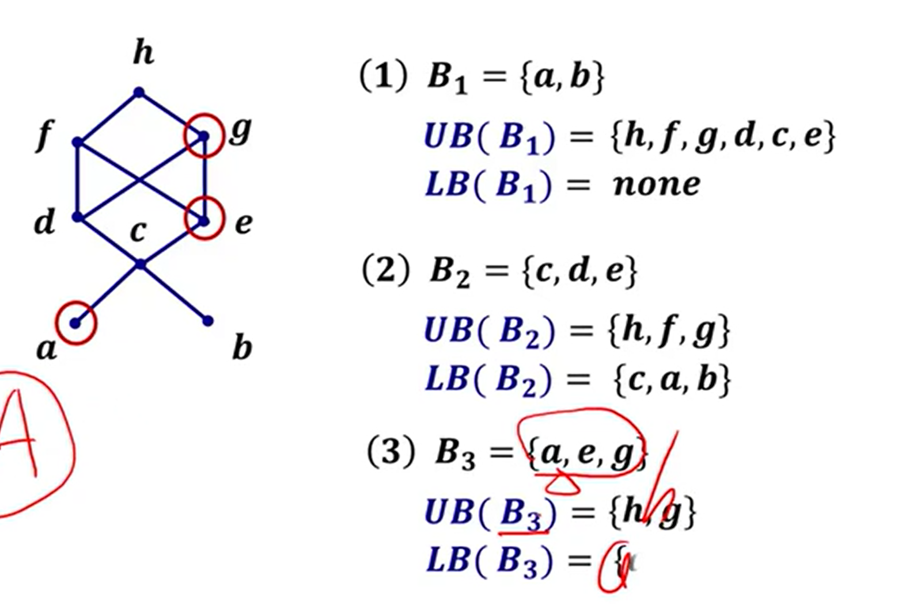

# 基本

奇数 $odd$ 
偶数 $even$

# 1基础知识

# 2逻辑

## Proposition 命题

1. 确定对象
2. 陈述句
3. 做出判断

## Propositional variables 命题变量

具有真假性的，考试用 $T和F$。

## Logical connectives 逻辑联结词

优先级从上到下

1. 非：~  否定 negation
2. 与：∧ 合取 Conjunction
3. 或：∨ 析取 Disjunction

## Combound statements 复合命题

### 真值表

当复合命题有$n$个变量，$k$个联结词。真值表有$2^n$行，$n+k$列。

例：$(p∧q) ∨ (~r )$

|  p   |  q   |  r   | p∧q  |  ~r  | (p∧q) ∨ (~r ) |
| :--: | :--: | :--: | :--: | :--: | :-----------: |
| $T$  | $T$  | $T$  | $T$  | $F$  |      $T$      |
| $T$  | $T$  | $F$  | $T$  | $T$  |      $T$      |
| $T$  | $F$  | $T$  | $F$  | $F$  |      $F$      |
| $T$  | $F$  | $F$  | $F$  | $T$  |      $T$      |
| $F$  | $T$  | $T$  | $F$  | $F$  |      $F$      |
| $F$  | $T$  | $F$  | $F$  | $T$  |      $T$      |
| $F$  | $F$  | $T$  | $F$  | $F$  |      $F$      |
| $F$  | $F$  | $F$  | $F$  | $T$  |      $T$      |

## Quantifiers 量词

### Universal Quantification 全称量词

$\forall$ 任意

### Existential Quantification 存在量词

$\exists$ 存在

## Statement 命题

### 1Conditional Statement 条件命题

$if P\ then\ Q$ : $P\Rightarrow Q$ 蕴含

**只有左真右假时为假**

| $P$  | $Q$  | $P\Rightarrow Q$ |
| ---- | ---- | ---------------- |
| $T$  | $T$  | $T$              |
| $T$  | $F$  | $F$              |
| $F$  | $T$  | $T$              |
| $F$  | $F$  | $T$              |

### 2Equivalence 等价命题

$P\ if\ and\ only\ if\ Q$ : $P\Leftrightarrow Q$ 

$biconditional$ 双条件 双向蕴含

**同真同假时为真**

### 优先级

非 与 或 蕴含 双向蕴含

### 3Logical equivalent 逻辑相等

$if\ P\Leftrightarrow Q\ is\ tautology\ then\ P\equiv Q$

**命题的两边只是统一命题的两种不同的表达**

### Properties 性质 

略

## Methods of Proof 证明方法

### Mathematical Induction数学归纳法

1. $let\ P(n)\ is\ that\ ...$
2. $when\ n\ =\ 1$
   $left=... ,\ right=...$
   $∵\ left<right$
   $∴\ P(1)\ is\ T$
3. $suppose\ that\ P(k)\ is\ T\ that\ ...\ for\ k>=1$
   $when\ n=k+1,left=...,right=...$
   (通过代换使左边推出右边)
   $∵\ left=right\ ∴P(k+1)\ is\ T\ then\ P(k)\ \rightarrow \ P(k+1)$
4. $\forall\ n＞1,...,is T$

# 3计数

### Permutations 排列

$n$个元素，取$r$个组成序列，序列数？

1. 允许元素重复
   $n*n*n...*n\  =\ n^r$
2. 元素不重复
   $n*(n-1)*(n-2)...*(n-r+1)\ =\ nPr$ 即**对$n$个对象每次取$r$个的排列数**。

$nPr$

1. $when\ r=n$
   $nPr=\ n!$
2. $when\ r\ !=\ n$
   $nPr\ =\ \frac {n!}{(n-r)!}$

### 鸽巢原理

$num=\frac{N-1}{M}+1$向下取整

### 递推关系

特征方程$x^2=3x-2$

$s_1=1,s_2=2$

$a_n=u+v*2^n$

带入$a_1,a_2$

# 4关系

### 笛卡尔积

A={a,b}，B={1,2,3}。A×B = {{a,1}, {a,2}, {a,3}, {b,1}, {b,2}, {b,3}}。B×A = {{1,a}, {1,b}, {2,a}, {2,b}, {3,a}, {3,b}}

|A|=m,|B|=n,那么|A×B|=m*n

### 运算性质

1. 不满足交换律
2. 不满足结合律
3. 对并和交满足分配率
   A×(B∪C) = (AxB)∪(AxC)
   A×(B∩C) = (AxB)∩(AxC)

若|A|=n，那么|A×A|= $n^2$，A×A的子集有$2^{n^2}$个，每一个子集代表一个A上的二元关系，A×A的关系有$2^{n^2}$个。

# 5函数

特性：可以一对一、多对一，不可以一对多

### 复合函数Composition functions

$f:A→B\ g:B→C\ f(a)=a+1,f(b)=2b$

$g\ o\ f(a)=g(f(a))=g(a+1)=2a+2$

### 特殊类函数 special types of functions

函数$f:A→B$

1. everywhere defined 处处有定义
   $Dom(f)=A$
2. onto 满射
   $Ran(f)=B$
3. one to one 单射/一对一映射
   $if\ f(a)=f(a')\ then\ a=a'$
4. bijection 双射
   既是单射又是满射

### 可逆函数 invertible Functions

函数$f:A→B$

$R\subseteq A×B$

$R^{-1}\subseteq B×A$

若逆运算$f^{-1}$也是函数，则称$f$为可逆函数。

### 特征函数

$Let\ A\ \subseteq\ U={u1,u2,u3,u4}$

$f_A(ui) =
  \begin{cases}
    1  & \quad \text{if}\ ui\ \text{属于 A}\\
    0  & \quad \text{if}\ ui\ \text{不属 A}
  \end{cases}$

$S={1,4}\subseteq U={1,2,3,4}\ Find\ f_A$

$f_A={(1,1),(2,0),(3,0),(4,1)}$

1. 向下取整 floor function
2. 向上取整 ceilling function
3. 指数函数exponental
4. 幂函数 power function
5. 布尔函数 boolean function

### 等价类order

$\theta(r)<\theta(lgn)<\theta(n)<\theta(nlgn)<\theta(n^2)<\theta(n^p)<\theta(n^{q})<\theta(a^n)<\theta(b^n)$

$(2<p<q)(a<b)$

### 置换函数Permutation

$P=$1,2,3 定义域
         2,3,1 值域

#### 逆

$P^{-1}=$1 2 3
            3 1 2

#### 置换复合

从后往前

### 置换 转 轮换 disjoint cycle 

$P=$ 1 2 3 4 5
         2 5 4 3 1
cycle=(1,2,5)o(3,4)

#### 轮换的复合

(1,4,2)o(2,5,3)= 1 2 3 4 5 o 1 2 3 4 5  = 1 2 3 4 5 = (1,4,2,5,3)
                           4 1 3 2 5     1 5 2 4 3     4 5 1 2 3

### 轮换 转 对换 transpositions

$(1,4,2)o(2,5,3)=(1,2)o(1,4)o(2,3)o(2,5)\ and\ is\ even\ permutation$

# 6序关系与序结构

### 偏序 partially ordered set

满足：自反、反对称、传递

常用偏序

1. 包含
2. $(Z^+,≤)$
3. $(Z^+,divisibility)$

### 线序

任意两个元素都可以比较的偏序关系，叫线序。

### 哈斯图

只有偏序关系才有哈斯图

画法：

1. 去掉换
2. 去掉满足传递性的结论边
3. 所有箭头朝上
4. 去掉箭头，吧结点变成点

#### 简便算法

每层都是能整除别人，但别人不能整除自己的那个元素
找完一层从总元素中剔除上一层找到的元素
寻找下一层时 剔除的不算

#### maximal极大元、minimal极小元

$maximal：a1,a2\\
minimal：b1,b2$

#### 最大元greateat、最小元least

$greateat：f\\
least：none$

### UB(B):B的上界（a>=b)，LB(B)：B的下界(a<=b)

### 上确界、下确界

上界中的最小者：LUB(B)

下界中的最大者：GUB(B)

# 7树

# 8图论

