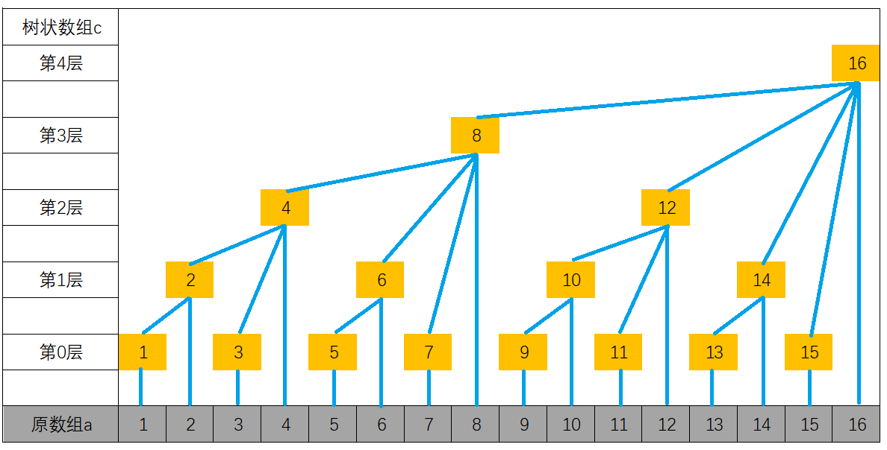
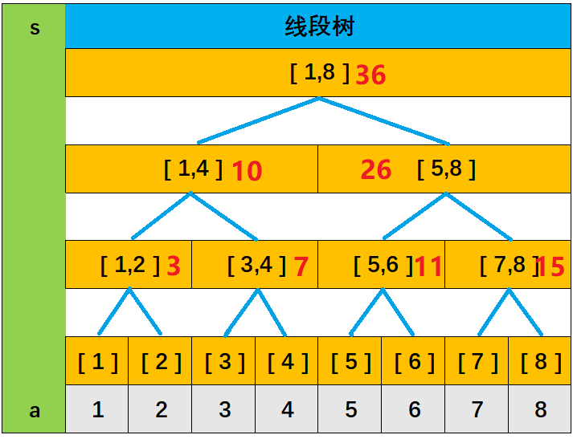
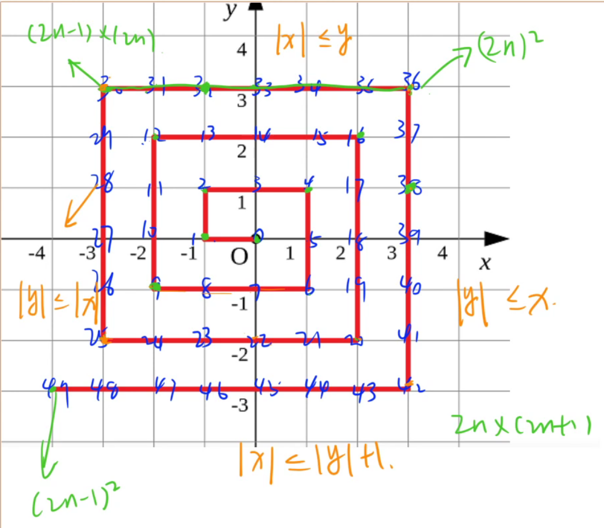

# 树状数组

### 时间复杂度

 $O(log_2^n)$ 

### 操作

1. 单点加值：给数组的某个位置上的数加上一个数
2. 区间查询：在 $O(log_2^n)$ 的时间复杂内快速地求前缀和
3. 单点修改：先把 $x+(-x)$ 再加上需要修改成的 $t$

### 与前缀和的区别

前缀和优势是查询，一旦数据有修改就要用树状数组。 前缀和是静态的，树状数组是动态的。

### 定义

1. `a[i]`为原数组，`c[i]`为树状数组。

2. 下标一定从 `1` 开始。
3. `c[奇数]=a[奇数]`。
4. 最大能整除 $2^n$ 的树状数组在第 $n$ 层。比如 $2$ 最大能被 $2^1$ 整除，所以 $2$ 在第 $1$ 层。$8$最大能被 $2^3$ 整除所以 $8$ 在第 $3$ 层。
5. $c[x]=(x-lowbit(x),x]$ ,（$lowbit(x)=x$ &$ -x$）
6. $c[x]$的父节点是$c[x+lowbit(x)]$，子节点是$c[x-lowbit(x)]$。
7. 加值后更新前缀和：`for(int i=x;i<=n;i+=lowbit(i)) c[i]+=v;`
8. 求前缀和：`for(int i=x;i>=1;i-=lowbit(i)) res+=c[i];`



### 核心代码

```c++
int lowbit(int x)
{
    return x&-x;
}
void add(int x,int v)//插入数值、更新树状数组
{
    for(int i=x;i<=n;i+=lowbit(i)) c[i]+=v;
}
int query(int x)//查询前缀和
{
    int res=0;
    for(int i=x;i>=1;i-=lowbit(i)) res+=c[i];
    return res;
}
```


## 数星星

天空中有一些星星，这些星星都在不同的位置，每个星星有个坐标。

如果一个星星的左下方（包含正左和正下）有 $k$ 颗星星，就说这颗星星是 $k$ 级的。


例如，上图中星星 $5$ 是 $3$ 级的（$1,2,4$ 在它左下），星星 $2,4$ 是 $1$ 级的。

例图中有 $1$ 个 $0$ 级，$2$ 个 $1$ 级，$1$ 个 $2$ 级，$1$个 $3$ 级的星星。

给定星星的位置，输出各级星星的数目。

换句话说，给定 $N$ 个点，定义每个点的等级是在该点左下方（含正左、正下）的点的数目，试统计每个等级有多少个点。

#### 输入格式

第一行一个整数 $N$，表示星星的数目；

接下来 NN 行给出每颗星星的坐标，坐标用两个整数 $x,y$ 表示；

不会有星星重叠。星星按 $y$ 坐标增序给出，$y$ 坐标相同的按 $x$ 坐标增序给出。

#### 输出格式

$N$ 行，每行一个整数，分别是 $0$ 级，$1$ 级，$2$ 级，……，$N−1$ 级的星星的数目。

#### 数据范围

$1≤N≤15000$,
$0≤x,y≤32000$

#### 解题思路

因为题目数据是按照从下到上、从左到右顺序读入的，所以当边输入边判断的时候，已经输入的数据全是当前点左下的，右上的还没读入进来。所以当前结点的坐标 $(x_i,y_i)$ 的 $y_i$ 是当前最大的纵坐标，我们只需要判断有多少个结点的横坐标小于等于 $x_i$ 。 也就是在横坐标$[1,x_i]$中有多少个星星。

```c++
#include<bits/stdc++.h>
using namespace std;
const int N=32010;
int c[N];
int cnt[N];//cnt[i]=第i级的个数
int lowbit(int x)
{
	return x&-x;
}
void add(int x)
{
	for(int i=x;i<=N;i+=lowbit(i)) c[i]++;
} 
int query(int x)
{
	int res=0;
	for(int i=x;i>=1;i-=lowbit(i)) res+=c[i];
	return res;
}
int main()
{
	int n;
	cin>>n; 
	for(int i=0;i<n;i++)
	{
		int x,y;
		cin>>x>>y;
		x++;
		cnt[query(x)]++;//是不包含当前点的 所以先查询后插入 
		add(x);
	}
	
	for(int i=0;i<n;i++) cout<<cnt[i]<<endl;
	return 0;
}
```


# 线段树




### 用途

1. 单点修改
2. 区间查询
3. 也可以进行区间修改和区间查询，但是操作比较麻烦，需要新增一个懒标记。（蓝桥杯不考）

### 操作

1. `pushup`：用两个子结点信息更新当前结点信息。
2. `build`：在一段区间上初始化线段树
3. `molify`：单点修改
4. `query`：区间查询
4. 左儿子编号`u<<1`，右儿子编号`u<<1|1`。

## 动态求连续区间和

给定 $n$ 个数组成的一个数列，规定有两种操作，一是修改某个元素，二是求子数列 $[a,b]$ 的连续和。

#### 输入格式

第一行包含两个整数 $n$ 和 $m$，分别表示数的个数和操作次数。

第二行包含 $n$ 个整数，表示完整数列。

接下来 $m$ 行，每行包含三个整数 $k,a,b$ （$k=0$，表示求子数列$[a,b]$的和；$k=1$，表示第 $a$ 个数加 $b$）。

数列从 $1$ 开始计数。

#### 输出格式

输出若干行数字，表示 $k=0$ 时，对应的子数列 $[a,b]$ 的连续和。

#### 数据范围

$1≤n≤100000$
$1≤m≤100000$
$1≤a≤b≤n,$
数据保证在任何时候，数列中所有元素之和均在 $int$ 范围内。

### 代码

```c++
#include<bits/stdc++.h>
using namespace std;
const int N=1e5+10;
int n,m;
int w[N];
struct Node
{
    int l,r,sum;
}tr[4*N];

void pushup(int u)//当前结点的sum为两个子结点的数值之和
{
    tr[u].sum=tr[u<<1].sum+tr[u<<1|1].sum;
}
//在一段区间上初始化为线段树
void build(int u,int l,int r)//u为当前结点的编号，l为左边界，r为右边界
{
    if(l==r) tr[u]={l,r,w[r]};//当前是叶结点了直接赋值
    else//否则，当前区间长度至少为2，需要把当前区间分为左右两个区间
    {
        tr[u]={l,r};//父结点先记录一下广域左右边界点
        int mid=l+r>>1;//分界点
        build(u<<1,l,mid),build(u<<1|1,mid+1,r);//递归线段树的建立
        pushup(u);//递归的同时把数值传上去
    }
}
//区间查询：从根节点开始查找对应的区间
int query(int u,int l,int r)
{
    if(l<=tr[u].l && tr[u].r<=r) return tr[u].sum;//完全包含
    int mid=tr[u].l+tr[u].r>>1;//当前区间的中点值
    int res=0;//表示区间总和
    //如果和左边或右边有交集 分别递归处理
    if(l<=mid) res+=query(u<<1,l,r);
    if(r>=mid+1) res+=query(u<<1|1,l,r);
    return res;
}
//单点修改
void modify(int u,int x,int v)//u表示当前结点的编号，x表示要修改的位置，v表示要增加的值
{
    if(tr[u].l==tr[u].r) tr[u].sum+=v;//当前是叶结点了 加上v
    else
    {
        int mid=tr[u].l+tr[u].r>>1;
        if(x<=mid) modify(u<<1,x,v);
        else modify(u<<1|1,x,v);
        pushup(u);//修改后需要从下到上更新信息
    }
}
int main()
{
    scanf("%d%d",&n,&m);
    for(int i=1;i<=n;i++) scanf("%d",&w[i]);
    //建立线段树
    build(1,1,n);
    
    while(m--)
    {
        int k,a,b;
        scanf("%d%d%d",&k,&a,&b);
        if(k) modify(1,a,b);
        else printf("%d\n",query(1,a,b));
    }
    return 0;
}
```


## 螺旋折线

如下图所示的螺旋折线经过平面上所有整点恰好一次。


对于整点 $(X,Y)$，我们定义它到原点的距离 $dis(X,Y)$ 是从原点到$(X,Y)$ 的螺旋折线段的长度。

例如 $dis(0,1)=3,dis(−2,−1)=9$

给出整点坐标 $(X,Y)$，你能计算出 $dis(X,Y)$ 吗？

#### 输入格式

包含两个整数 $X,Y$。

#### 输出格式

输出一个整数，表示 $dis(X,Y)$。

#### 数据范围

$−10^9≤X,Y≤10^9$

#### 输入样例：

```
0 1
```

#### 输出样例：

```
3
```

### 解题思路

找规律图



1. 判断给出的点在哪个方向的边上
2. 找出该边上的特殊点（起点）
3. 算距离

长度总和有可能爆 $int$

### AC代码

```c++
#include<bits/stdc++.h>
using namespace std;
typedef long long LL;

int main()
{
    int x,y;
    cin>>x>>y;
    
    if(abs(x) <= y){  //在上方
        LL t=(LL) 2*y*(2*y-1)+(x-(-y));
        cout<<t;
    }else if(abs(x) <= abs(y)+1 && y < 0){  //在下方
        LL t=(LL) 2*(-y)*(2*(-y)+1) + ((-y)-x);
        cout<<t;
    }else if(abs(y) <= abs(x) && x< 0){  //在左方
    	LL t=(LL) (2*(-x)-1)*(2*(-x)-1) + y-(x+1);
        cout<<t;
    }else{  //在右边
        LL t=(LL) 4*x*x + (x-y);
        cout<<t;
    }
    return 0;
}
```

